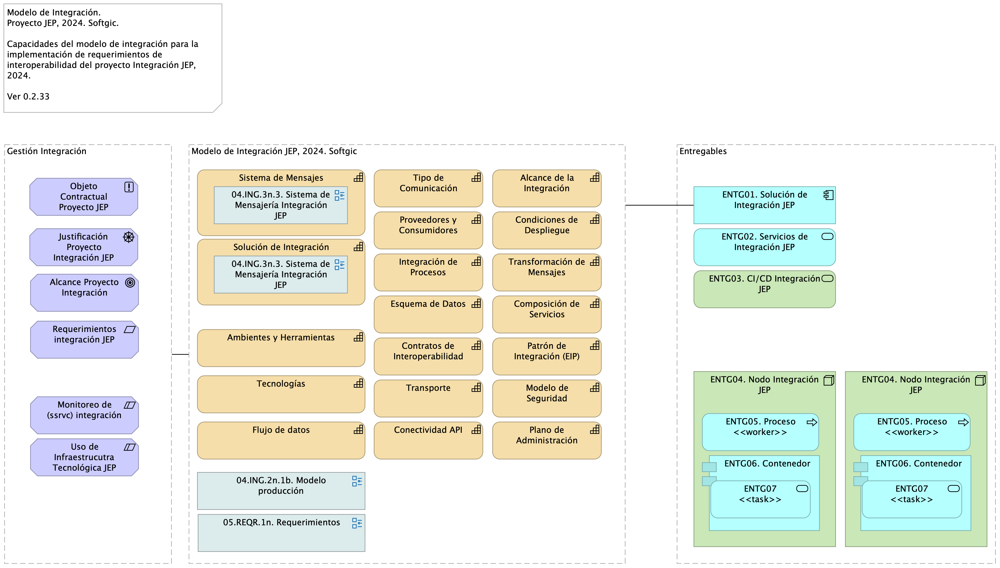

# Modelo de Interoperabilidad JEP

* [Introducción](#Introducción)
* [Entregables (Grouping)](#entregables-grouping)
  * [ENTG01. Solución de Integración JEP (Application Component)](#entg01.-solución-de-integración-jep-application-component)
  * [ENTG02. Servicios de Integración JEP (Application Service)](#entg02.-servicios-de-integración-jep-application-service)
  * [ENTG04. Nodo Integración JEP (Node)](#entg04.-nodo-integración-jep-node)
    * [ENTG06. Contenedor (Application Component)](#entg06.-contenedor-application-component)
      * [ENTG07 &lt;&lt;task&gt;&gt; (Application Service)](#entg07-<<task>>-application-service)
    * [ENTG05. Proceso &lt;&lt;worker&gt;&gt; (Application Process)](#entg05.-proceso-<<worker>>-application-process)
  * [ENTG03. CI/CD Integración JEP (Technology Service)](#entg03.-cicd-integración-jep-technology-service)
  * [ENTG04. Nodo Integración JEP (Node) 2](#entg04.-nodo-integración-jep-node-2)
    * [ENTG06. Contenedor (Application Component) 2](#entg06.-contenedor-application-component-2)
      * [ENTG07 &lt;&lt;task&gt;&gt; (Application Service) 2](#entg07-<<task>>-application-service-2)
    * [ENTG05. Proceso &lt;&lt;worker&gt;&gt; (Application Process) 2](#entg05.-proceso-<<worker>>-application-process-2)
* [Gestión Integración (Grouping)](#gestión-integración-grouping)
  * [Monitoreo de (ssrvc) integración (Constraint)](#monitoreo-de-ssrvc-integración-constraint)
  * [Requerimientos integración JEP (Requirement)](#requerimientos-integración-jep-requirement)
  * [Alcance Proyecto Integración (Goal)](#alcance-proyecto-integración-goal)
  * [Justificación Proyecto Integración JEP (Driver)](#justificación-proyecto-integración-jep-driver)
  * [Objeto Contractual Proyecto JEP (Principle)](#objeto-contractual-proyecto-jep-principle)
  * [Uso de Infraestrucutra Tecnológica JEP (Constraint)](#uso-de-infraestrucutra-tecnológica-jep-constraint)
* [Modelo de Integración JEP, 2024. Softgic (Grouping)](#modelo-de-integración-jep,-2024.-softgic-grouping)
  * [Transporte (Capability)](#transporte-capability)
  * [Plano de Administración (Capability)](#plano-de-administración-capability)
  * [Esquema de Datos (Capability)](#esquema-de-datos-capability)
  * [Transformación de Mensajes (Capability)](#transformación-de-mensajes-capability)
  * [Modelo de Seguridad (Capability)](#modelo-de-seguridad-capability)
  * [Condiciones de Despliegue (Capability)](#condiciones-de-despliegue-capability)
  * [Composición de Servicios (Capability)](#composición-de-servicios-capability)
  * [Proveedores y Consumidores (Capability)](#proveedores-y-consumidores-capability)
  * [Alcance de la Integración (Capability)](#alcance-de-la-integración-capability)
  * [Tecnologías (Capability)](#tecnologías-capability)
  * [Conectividad API (Capability)](#conectividad-api-capability)
  * [Contratos de Interoperabilidad (Capability)](#contratos-de-interoperabilidad-capability)
  * [Tipo de Comunicación (Capability)](#tipo-de-comunicación-capability)
  * [Sistema de Mensajes (Capability)](#sistema-de-mensajes-capability)
  * [Patrón de Integración (EIP) (Capability)](#patrón-de-integración-eip-capability)
  * [Integración de Procesos (Capability)](#integración-de-procesos-capability)
  * [Flujo de datos (Capability)](#flujo-de-datos-capability)
  * [Solución de Integración (Capability)](#solución-de-integración-capability)
  * [Ambientes y Herramientas (Capability)](#ambientes-y-herramientas-capability)

## Introducción

{height=500px}

El presente modelo de solución de interoperabilidad JEP, 2024, en desarrollo por Softgic, expone para aprobación y referencia las decisiones de la solución de integración y las restricciones que la rigen. Una vez revisado y aprobado por parte de JEP el modelo de interoperabilidad será referencia para la gestión del proyecto y de los entregables de esta solución.

## Características Principales del Modelo de Integración JEP
* API de integración
* Patrones de integración empresarial (EIP)
* Sistema de Mensajería entre servicios de integración y aplicaciones JEP
* Flujos de datos para integración 
* Arquitectura de clusters y contenedores para integración
* Uso de infraestructura tecnológica JEP

## Entregables

### ENTG01. Solución de Integración JEP

Documentación técnica del diseño de solución de la integración JEP, 2024.

### ENTG02. Servicios de Integración JEP

Servicios ejecutables desplegados en los entornos de software JEP.

### ENTG04. Nodo Integración JEP

Cluster de ejecución de los nodos y procesos de (servicios) de integración del proyecto.

#### ENTG06. Contenedor

Contenedores de los servicios de integración del proyecto desplegados en la infraestructura tecnológica JEP.

##### ENTG07 <<task>>

Servicios de integración del proyecto desplegados en la infraestructura tecnológica JEP.

#### ENTG05. Proceso <<worker>>

Configuración de servicios de integración del proyecto dentro de la infraestructura tecnológica JEP.

### ENTG03. CI/CD Integración JEP

Cadenas de integración y despliegue continuo de los servicios de integración del proyecto de integración JEP, 2024.

### ENTG04. Nodo Integración JEP

Cluster de ejecución de los nodos y procesos de (servicios) de integración del proyecto.

#### ENTG06. Contenedor

Contenedores de los servicios de integración del proyecto desplegados en la infraestructura tecnológica JEP.

##### ENTG07 <<task>>

Servicios de integración del proyecto desplegados en la infraestructura tecnológica JEP.

#### ENTG05. Proceso <<worker>>

Configuración de servicios de integración del proyecto dentro de la infraestructura tecnológica JEP.

## Gestión Integración

### Monitoreo de (ssrvc) integración

* Herramientas de monitoreo y logging con las que cuenta la solución actual de orquestación de contenedores de OpenShift.
 
 * Monitoreo de uso de los recursos de procesamiento, red y memoria de los componentes claves de la solución haciendo uso de ServiceMesh.

*  La solución soporta la habilitación de reglas de alertas sobre los registros de actividad y monitoreo.

* Soluciones de EFK (Elasticsearch, FluentD, Kibana - ELKstack), a través de operadores para centralizar el proceso de logs que se generan en difrerentes espacios de trabajo.

### Requerimientos integración JEP

Del alcance del proyecto
1. Implementación de 20 o más servicios de integración al 31 de diciembre del 2024.
1. Soporte solución de integración a julio 2025.

En donde el componente no. 1 del alcance es

* Desarrollar úncamente nuevos servicios de integración con el patrón de integración empresarial (ESB, Camel)
* Implementar las condiciones tecnológicas JEP, entendido como requerimientos no funcionales de arquitectura, a la solución de integración del Anexo Nro. 1.1 – Anexo técnico evolución plataforma de interoperabilidad – Ficha Técnica

No es del alcance de este proyecto los requerimientos de migrar los servicios existentes de modelo integración directa (EIA) esta solución de integración empresarial.

### Alcance Proyecto Integración

* Implementación de 20 o más servicios de integración al 31 de diciembre del 2024.
* Soporte solución de integración a julio 2025.

### Justificación Proyecto Integración JEP

Justificación Proyecto Integración JEP | Driver | Justification: Evolución de la Plataforma de Interoperabilidad para el ano 2024  

1. Evolución de la plataforma tecnología de su interoperabilidad y el cumplimiento de los lineamientos del MinTIC, a traves del “Manual Interactivo de Gobierno Digital, herramienta dirigida a las entidades publicas nacionales y territoriales (...) Política de Gobierno Digital, Decreto 767 de 2022”
1. Interoperabilidad con las entidades externas que demandan información de la JEP
1. Evolución del modelo de interoperabilidad interna y gobierno de data maestra entre sistemas internos

### Objeto Contractual Proyecto JEP

Prestar los servicios de administración y monitoreo de la solución de interoperabilidad de los sistemas de información de la JEP; así como la implementación de nuevos desarrollos o parametrizaciones que esta solución requiera.

### Uso de Infraestrucutra Tecnológica JEP

Servivios de infraestrucgtura, almacenamiento y ceomputo de la JEP:  Openshift Platform, bus empresarial, seguridad de la empresa, tecnoglogía de clusters y contenedores.

## Modelo de Integración JEP, 2024. Softgic

### Plano de Administración

Monitoreo de rendimiento de ssvc de integración.

### Transformación de Mensajes

Mapeos, homologaciones y correspondencias.

### Modelo de Seguridad

Autenticación mixta: JWS y tradicional (usuario, contraseña).

### Composición de Servicios

Combina colección de servicios para formar un servicio completo. Mediante la integración basada en patrones de Camel, define funciones mediante la recopilación de datos de múltiples conexiones (endpoint). Las composiciones suelen resolver integraciones no triviales o complejas.

### Alcance de la Integración

Aplicaciones que tienen integraciones existentes: necesitamos listados de ssvc pasar al bus.

### Tecnologías

* Red Hat Integration: suite de runtimes, frameworks, y servicios para aplicaciones nativas de Red Hat OpenShift.
* Camel Integration Tool
* Quarkus development framework
* Java OpenJDK 17
* EFK (Elasticsearch, FluentD, Kibana - ELKstack)

### Conectividad API

Esta solución de interoperabilidad usa conectividad API REST provista por la infraestructura de conectividad de la JEP (Apache Camel).

### Tipo de Comunicación

Pasar llamadas síncronas a asincrónicas: analizar apps que deben cambiar comunicación

### Sistema de Mensajes

Esta solución de interoperabilidad usa un sistema de mensajes (comandos). Los mensajes son de tipo petición, respuesta o excepción.

La mensajería puede ser asíncrona o síncrona entre aplicaciones o servicios desacoplados. La conexión y la sesión es manejada por un agente intermediario, que puede ser una cola o un bus empresarial (para este contexto, OpenShift, Cliente Red Had Interoperabity o Apache Camel). 

La comunicación del sistema de mensajería ocurre cuando la aplicación o servicio productor emite un comando (mensaje ) de 'envío', en el cual transmite datos o peticiones de negocio en un formato predefinido, y lo envía a una cola de mensajes.

### Patrón de Integración (EIP)

Pasar de modelo integración EIA (intgración directa ente consumidores y proveedores) a modelo de integración EIP (integración empresarial/bus) sobre Red Hat Integration Platform.

### Flujo de datos

Esta solución de interoperabilidad usa esquemas de datos predefinidos entre las integraciones.

### Solución de Integración

Estilos de Integración: Communications backbone [^*]. Patrón principal: Messaging — Cada aplicación (app) conectada a un mismo sistema de mensajería, intercambio de datos y operación entre aplicaciones mediante mensajes.

 [^*]: Red troncal de comunicaciones: a medida que más y más aplicaciones de una empresa se conectan al sistema de mensajería y hacen que su funcionalidad esté disponible a través de la mensajería, el sistema de mensajería se convierte en un punto centralizado de ventanilla única para la funcionalidad en la empresa. Una nueva aplicación simplemente necesita saber qué canales usar para solicitar funcionalidad y cuáles otros escuchar para obtener los resultados. El propio sistema de mensajería se convierte esencialmente en un bus de mensajes, una columna vertebral que proporciona acceso a todas las diversas y cambiantes aplicaciones y funcionalidades de la empresa. Puedes lograr este nirvana de integración más rápida y fácilmente si diseñas específicamente para ello desde el principio.

### Ambientes y Herramientas

Esta solución de interoperabilidad usa las herramientas, librerías, ambientes, infraestructura productivo y no productivos (nodos, redes, almacenamientos, y otros) indicados por la JEP.

[^1]: Generated: Wed Nov 06 2024 20:54:48 GMT-0500 (COT)

