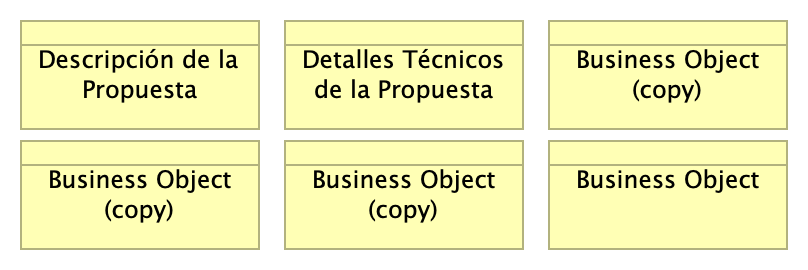

# Contenido
* [Información del Documento](#información-del-documento)
* [Sección 1](#sección-1)
* [Anexos](#anexos)

\newpage

# Información del Documento

## Versión del Documento

> 

 

---
title: Propuesta de Certificación Operativa Plataforma de Software Trii.co (borrador)
subtitle: Borrador
subject: Implementación Proyecto
author: 
date: 2025-01-15
keywords: [Rendimiento, Métodos pruebas, Pruebas software, QA]
header-right: 
geometry:
  - top=1.3in
  - bottom=1in
fignos-cleveref: True
fignos-plus-name: Fig.
fignos-caption-name: Imagen
tablenos-caption-name: Tabla
...

## Control de Cambios
Historia de cambios de la propuesta.

Versión actual: 
1.ce6519f - tex - Wed, 15 Jan 2025 14:51:28 -0500

Versiones Anteriores

1.4e65936 - Compilación para entrega - Wed, 15 Jan 2025 16:55:23 +0000

1.1e93a16 - trii - Wed, 15 Jan 2025 11:52:42 -0500

1.8797340 - Compilación para entrega - Wed, 15 Jan 2025 16:35:20 +0000

1.f31a573 - Compilación para entrega - Wed, 15 Jan 2025 16:27:57 +0000

### Realizado Por
H. Wong, ing.

### Revisado Por
(revisor), Trii.co

{#fig:id-1827a4b5e59448428adfb93b3ee5f4b4 width= height=500px}

### Elementos del Modelo

| Nombre  | Tipo | Documentación |
|---------|------|---------------|

Table: Elementos de la vista. {#tbl:tblelement-01.Trii.co-id}

 

---
lang: en
titlepage: true
titlepage-rule-color: 360049
...

\newpage

# Sección 1

## 02.propuesta

> 

 

---
title: Propuesta de Certificación Operativa Plataforma de Software Trii.co (borrador)
subtitle: Borrador
subject: Implementación Proyecto
author: 
date: 2025-01-15
keywords: [Rendimiento, Métodos pruebas, Pruebas software, QA]
header-right: 
geometry:
  - top=1.3in
  - bottom=1in
fignos-cleveref: True
fignos-plus-name: Fig.
fignos-caption-name: Imagen
tablenos-caption-name: Tabla
...

{#fig:id-dd2f1c1c1816447380fe900b66faa8bc width= height=500px}

### Elementos del Modelo

| Nombre  | Tipo | Documentación |
|---------|------|---------------|
| Business Object (copy) | Business Object | ## Control de Cambios
Historia de cambios de la propuesta.

 |
| Business Object (copy) | Business Object | ## Control de Cambios
Historia de cambios de la propuesta.

## Control de Cambios
Historia de cambios de la propuesta.

 |
| Business Object (copy) | Business Object | ## Control de Cambios
Historia de cambios de la propuesta.

 |
| Business Object (copy) | Business Object | ## Control de Cambios
Historia de cambios de la propuesta.

 |
| Business Object (copy) | Business Object | ## Control de Cambios
Historia de cambios de la propuesta.

 |
| Business Object | Business Object | ## Control de Cambios
Historia de cambios de la propuesta.

 |

Table: Elementos de la vista. {#tbl:tblelement-02.propuesta-id}

 

---
lang: en
titlepage: true
titlepage-rule-color: 360049
...

\newpage

# Anexos

