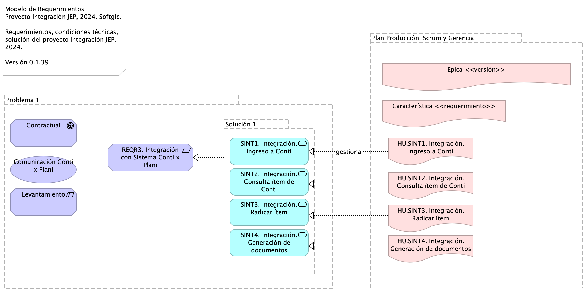
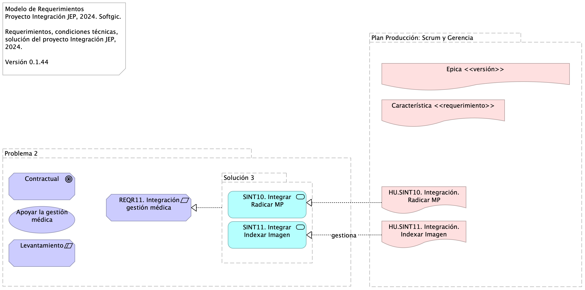

# Requerimientos de Integración JEP

* [Introducción](#Introducción)
* [Problema 1 (Grouping)](#problema-1-grouping)
  * [Levantamiento (Constraint)](#levantamiento-constraint)
  * [Contractual (Goal)](#contractual-goal)
  * [REQR3. Integración con Sistema Conti x Plani (Requirement)](#reqr3.-integración-con-sistema-conti-x-plani-requirement)
  * [Solución 1 (Grouping)](#solución-1-grouping)
    * [SINT1. Integración. Ingreso a Conti (Application Service)](#sint1.-integración.-ingreso-a-conti-application-service)
    * [SINT2. Integración. Consulta ítem de Conti (Application Service)](#sint2.-integración.-consulta-ítem-de-conti-application-service)
    * [SINT3. Integración. Radicar ítem (Application Service)](#sint3.-integración.-radicar-ítem-application-service)
    * [SINT4. Integración. Generación de documentos (Application Service)](#sint4.-integración.-generación-de-documentos-application-service)
  * [Comunicación Conti x Plani (Value)](#comunicación-conti-x-plani-value)
* [HU.SINT1. Integración. Ingreso a Conti (Deliverable)](#hu.sint1.-integración.-ingreso-a-conti-deliverable)
* [HU.SINT2. Integración. Consulta ítem de Conti (Deliverable)](#hu.sint2.-integración.-consulta-ítem-de-conti-deliverable)
* [HU.SINT3. Integración. Radicar ítem (Deliverable)](#hu.sint3.-integración.-radicar-ítem-deliverable)
* [HU.SINT4. Integración. Generación de documentos (Deliverable)](#hu.sint4.-integración.-generación-de-documentos-deliverable)

## Introducción

{height=500px}

---
title: Gestión de Requerimientos JEP
subtitle: Implementación Proyecto Evolución de Interoperabilidad JEP, Softgic
subject: Implementación Proyecto JEP
author: "Versión actual: 1.cc57a63 - Compilación para entrega - Fri, 8 Nov 2024 16:13:58 +0000"
date: 2024-11-8
keywords: [Integración, Interoperabilidad, JEP, Softgic, Caso de uso]
header-left: include/jeplogo.jpg
lang: en
titlepage: true
titlepage-rule-color: 360049
geometry:
  - top=1in
  - bottom=1in
fignos-cleveref: True
fignos-plus-name: Fig.
fignos-caption-name: Imagen
tablenos-caption-name: Tabla
...

Del alcance del proyecto, 

1. Implementación de 20 o más servicios de integración al 31 de diciembre del 2024.
1. Soporte solución de integración a julio 2025.

Establecemos las bases para el modelo de requerimientos de esta solución, el cual limita la demanda a:

* Desarrollar únicamente nuevos servicios de integración con el patrón de integración empresarial (ESB, Camel K de Apache) propuesto en el modelo de interoperabilidad de esta solución.
* Implementar en esta solución de integración las condiciones tecnológicas JEP, entendidas como requerimientos no funcionales de arquitectura,  presentes en el Anexo Nro. 1.1 – Anexo técnico evolución plataforma de interoperabilidad – Ficha Técnica.
* No son requerimientos de este proyecto el implementar otro tipos de requerimientos no expresados aquí, como por ejemplo, migrar los servicios existentes de modelo integración directa (EIA) esta solución de integración empresarial, o implementar soluciones en las aplicaciones de software de la JEP.

Para la implementación de los ítems relacionados en el Anexo Nro. 1.1 – Anexo técnico evolución plataforma de interoperabilidad – Ficha Técnica la hoja “Categorías de Cotización” contiene las necesidades a contratar en el ámbito de la evolución tecnológica del modelo de interoperabilidad y los desarrollos de interoperabilidad tanto con sistemas internos, como con entidades externas. En la hoja “Estándares Desarrollo y Producto” del archivo mencionado se indican los estándares recomendados por el fabricante, para tener en cuenta en la entrega de los servicios que se cotizan.

El Anexo Nro. 1.2 – Acuerdos de Niveles de Servicio, explica el procedimiento con el que se dará atención a consultas o solución de incidencias, tanto en los sistemas operativos, como en los servicios de interoperabilidad existentes en la actualidad y aquellos que se contratarán en este proceso, en el sistema Bus de Interoperabilidad implementado en la Jurisdicción Especial para la Paz.

Fuente: Justificativo de la Contratación Invitación Pública.

## Problema 1

### Levantamiento

Restricción: el requerimiento está condicionado por la completitud del levantamiento.

### Contractual

Objetivo: el requerimiento tiene carácter contractual.

### REQR3. Integración con Sistema Conti x Plani

Atendiendo la necesidad de la Subdirección de Contratación de implementar el flujo de gestión precontractual en el sistema de Gestión Documental - Conti se requiere contar con la información de los ítems del Plan Anual de Adquisiciones – PAA para iniciar el proceso, la cual se encuentra gestionada en el Sistema de Gestión y Planeación Institucional PLANi.

### Índice de la documentación (casos de uso)

1. Integración. Ingreso a Conti
1. Integración. Consulta ítem de Conti
1. Integración. Radicar ítem
1.Integración. Generación de documentos

### Solución 1

#### SINT1. Integración. Ingreso a Conti

Tareas de desarrollo

* Interoperabilidad IOP1. Transporte / Entrega Consulta Negocio
* Modelo de datos (XML, RBDMS, …)
* Esquema de datos (XSD, DTD, JSON-E…)
* Contratos de interoperabilidad (WSDL, API…)
* Mensajes petición IN (API, XML…)
* Mensajes respuesta OUT (API, XML…)
* Mensajes excepción (API, XML…)
* Transporte (REST, SOAP)
* Función lógica (JEE, …)
* Registro y envío de actividad

#### SINT2. Integración. Consulta ítem de Conti

Tareas de desarrollo

* Interoperabilidad IOP1. Transporte / Entrega Consulta Negocio
* Modelo de datos (XML, RBDMS, …)
* Esquema de datos (XSD, DTD, JSON-E…)
* Contratos de interoperabilidad (WSDL, API…)
* Mensajes petición IN (API, XML…)
* Mensajes respuesta OUT (API, XML…)
* Mensajes excepción (API, XML…)
* Transporte (REST, SOAP)
* Función lógica (JEE, …)
* Registro y envío de actividad

#### SINT3. Integración. Radicar ítem

Tareas de desarrollo

* Interoperabilidad IOP1. Transporte / Entrega Consulta Negocio
* Modelo de datos (XML, RBDMS, …)
* Esquema de datos (XSD, DTD, JSON-E…)
* Contratos de interoperabilidad (WSDL, API…)
* Mensajes petición IN (API, XML…)
* Mensajes respuesta OUT (API, XML…)
* Mensajes excepción (API, XML…)
* Transporte (REST, SOAP)
* Función lógica (JEE, …)
* Registro y envío de actividad

#### SINT4. Integración. Generación de documentos

Tareas de desarrollo

* Interoperabilidad IOP1. Transporte / Entrega Consulta Negocio
* Modelo de datos (XML, RBDMS, …)
* Esquema de datos (XSD, DTD, JSON-E…)
* Contratos de interoperabilidad (WSDL, API…)
* Mensajes petición IN (API, XML…)
* Mensajes respuesta OUT (API, XML…)
* Mensajes excepción (API, XML…)
* Transporte (REST, SOAP)
* Función lógica (JEE, …)
* Registro y envío de actividad

### Comunicación Conti x Plani

Valor: el requerimientos genera entregables de valor para la integración de aplicaciones de JEP.

[^1]: Generated: Fri Nov 08 2024 12:16:03 GMT-0500 (COT)

# Requerimientos de Integración JEP

* [Introducción](#Introducción)
* [Problema 2 (Grouping)](#problema-2-grouping)
  * [Contractual (Goal)](#contractual-goal)
  * [Apoyar la gestión médica (Value)](#apoyar-la-gestión-médica-value)
  * [Levantamiento (Constraint)](#levantamiento-constraint)
  * [ REQR11. Integración gestión médica (Requirement)](#-reqr11.-integración-gestión-médica-requirement)
  * [Solución 3 (Grouping)](#solución-3-grouping)
    * [SINT10. Integrar Radicar MP (Application Service)](#sint10.-integrar-radicar-mp-application-service)
    * [SINT11. Integrar Indexar Imagen (Application Service)](#sint11.-integrar-indexar-imagen-application-service)

## Introducción

{height=500px}

---
title: Gestión de Requerimientos JEP
subtitle: Implementación Proyecto Evolución de Interoperabilidad JEP, Softgic
subject: Implementación Proyecto JEP
author: "Versión actual: 1.cc57a63 - Compilación para entrega - Fri, 8 Nov 2024 16:13:58 +0000"
date: 2024-11-8
keywords: [Integración, Interoperabilidad, JEP, Softgic, Caso de uso]
header-left: include/jeplogo.jpg
lang: en
titlepage: true
titlepage-rule-color: 360049
geometry:
  - top=1in
  - bottom=1in
fignos-cleveref: True
fignos-plus-name: Fig.
fignos-caption-name: Imagen
tablenos-caption-name: Tabla
...

Del alcance del proyecto, 

1. Implementación de 20 o más servicios de integración al 31 de diciembre del 2024.
1. Soporte solución de integración a julio 2025.

Establecemos las bases para el modelo de requerimientos de esta solución, el cual limita la demanda a:

* Desarrollar únicamente nuevos servicios de integración con el patrón de integración empresarial (ESB, Camel K de Apache) propuesto en el modelo de interoperabilidad de esta solución.
* Implementar en esta solución de integración las condiciones tecnológicas JEP, entendidas como requerimientos no funcionales de arquitectura,  presentes en el Anexo Nro. 1.1 – Anexo técnico evolución plataforma de interoperabilidad – Ficha Técnica.
* No son requerimientos de este proyecto el implementar otro tipos de requerimientos no expresados aquí, como por ejemplo, migrar los servicios existentes de modelo integración directa (EIA) esta solución de integración empresarial, o implementar soluciones en las aplicaciones de software de la JEP.

Para la implementación de los ítems relacionados en el Anexo Nro. 1.1 – Anexo técnico evolución plataforma de interoperabilidad – Ficha Técnica la hoja “Categorías de Cotización” contiene las necesidades a contratar en el ámbito de la evolución tecnológica del modelo de interoperabilidad y los desarrollos de interoperabilidad tanto con sistemas internos, como con entidades externas. En la hoja “Estándares Desarrollo y Producto” del archivo mencionado se indican los estándares recomendados por el fabricante, para tener en cuenta en la entrega de los servicios que se cotizan.

El Anexo Nro. 1.2 – Acuerdos de Niveles de Servicio, explica el procedimiento con el que se dará atención a consultas o solución de incidencias, tanto en los sistemas operativos, como en los servicios de interoperabilidad existentes en la actualidad y aquellos que se contratarán en este proceso, en el sistema Bus de Interoperabilidad implementado en la Jurisdicción Especial para la Paz.

Fuente: Justificativo de la Contratación Invitación Pública.

## Problema 2

### Contractual

Objetivo: el requerimiento tiene carácter contractual.

### Apoyar la gestión médica

Valor: el requerimientos genera entregables de valor para la gestión médica de JEP.

### Levantamiento

Restricción: el requerimiento está condicionado por la completitud del levantamiento.

###  REQR11. Integración gestión médica

Documentación del requerimiento de integración de la gestión médica JEP. Exposición de las capacidades Radicar MP y Indexar Imagen.

Fuente: gestionMedidaProteccion (pdf). 

### Índice de la documentación (casos de uso)

1. Caso de Uso 1. Integrar Radicar MP
1. Caso de Uso 2. Integrar Indexar Imagen

### Solución 3

#### SINT10. Integrar Radicar MP

Tareas de desarrollo

* Interoperabilidad IOP1. Transporte / Entrega Consulta Negocio
* Modelo de datos (XML, RBDMS, …)
* Esquema de datos (XSD, DTD, JSON-E…)
* Contratos de interoperabilidad (WSDL, API…)
* Mensajes petición IN (API, XML…)
* Mensajes respuesta OUT (API, XML…)
* Mensajes excepción (API, XML…)
* Transporte (REST, SOAP)
* Función lógica (JEE, …)
* Registro y envío de actividad

#### SINT11. Integrar Indexar Imagen

Tareas de desarrollo

* Interoperabilidad IOP1. Transporte / Entrega Consulta Negocio
* Modelo de datos (XML, RBDMS, …)
* Esquema de datos (XSD, DTD, JSON-E…)
* Contratos de interoperabilidad (WSDL, API…)
* Mensajes petición IN (API, XML…)
* Mensajes respuesta OUT (API, XML…)
* Mensajes excepción (API, XML…)
* Transporte (REST, SOAP)
* Función lógica (JEE, …)
* Registro y envío de actividad

[^1]: Generated: Fri Nov 08 2024 12:17:09 GMT-0500 (COT)

