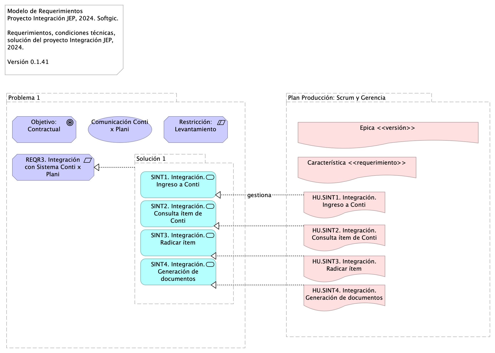
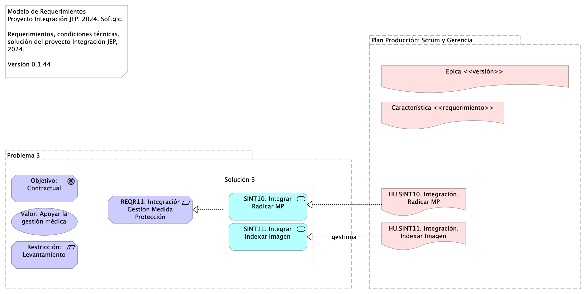
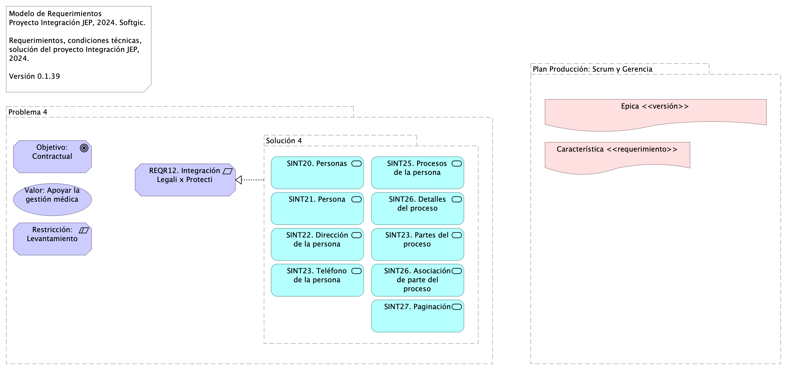

# Documentación Técnica del Proyecto Integración JEP
* [Información del Documento](#información-del-documento)
* [Roles y Equipo de Trabajo](#roles-y-equipo-de-trabajo)
* [Gestión de Trabajo del Proyecto](#gestión-de-trabajo-del-proyecto)
* [Modelo de Producción e Implementación](#modelo-de-producción-e-implementación)
* [Modelo de Solución de Interoperabilidad](#modelo-de-solución-de-interoperabilidad)
* [Modelo de Requerimientos de Interoperabilidad Proyecto JEP](#modelo-de-requerimientos-de-interoperabilidad-proyecto-jep)
* [Modelo de Entrega y Despliegue de Requerimientos](#modelo-de-entrega-y-despliegue-de-requerimientos)

\newpage

# Información del Documento

## Versión del Documento

> 

 

---
title: Proyecto de Interoperabilidad JEP, 2024
subtitle: Implementación Proyecto Evolución de Interoperabilidad JEP, Softgic
subject: Implementación Proyecto
author: 
date: 2024-09-16
keywords: [Integración, Interoperabilidad, JEP, Softgic]
header-left: include/jeplogo.jpg
geometry:
  - top=1in
  - bottom=1in
fignos-cleveref: True
fignos-plus-name: Fig.
fignos-caption-name: Imagen
tablenos-caption-name: Tabla
...

Versión actual: 
1.d811f41 - action - Tue, 19 Nov 2024 14:49:11 -0500

Versiones Anteriores

1.544d74d - Compilación para entrega - Fri, 8 Nov 2024 17:44:18 +0000

1.7234525 - Compilación para entrega - Fri, 8 Nov 2024 17:36:22 +0000

1.cc57a63 - Compilación para entrega - Fri, 8 Nov 2024 16:13:58 +0000

1.12af1e5 - Compilación para entrega - Fri, 8 Nov 2024 16:06:05 +0000

### Realizado Por
Sofgic.co

### Revisado Por
Sofgic.co

---
lang: en
titlepage: true
titlepage-rule-color: 360049
...

\newpage

# Roles y Equipo de Trabajo

## Roles y Division de Trabajo del Proyecto

> Modelo de Implementación Proyecto JEP, 2024. Softgic.  Propuesta roles de trabajo del proyecto de servicios de integración JEP.  Ver 0.1.3  

 

Las división de trabajo conveniente según las condiciones contractuales y del proyecto de integración JEP es la siguiente

### Consultor de Integración (responsabilidades)
* Arquitectura de contenedores
* Definir y documentar soluciones
* Especificar interfaces
* Soporte paso producción

### Arquitecto de Integración
* arquitectura bus servicios
* soporte desarrollo
* soporte cliente
* mitigar riesgos arquitectura

### Consultor de Infraestructura
* definir y documentar soluciones (de infr.)
* documentar componentes e interfaces (de infr.)
* soporte post producción

{#fig:id-3bef3ca04f6d4d1ba6b837b822a51801 width= height=500px}

### Catálogo de Elementos

| Nombre  | Tipo | Documentación |
|---------|------|---------------|
| Soporte | Driver | Obligación TDR, contrato, proyecto JEP. |
| Documentación | Driver | Problemática objeto de la propuesta de refuerzo de arquitectura. |
| Entregas | Driver | Problemática objeto de la propuesta de refuerzo de arquitectura. |
| Infraestructura operacional | Driver | Obligación TDR, contrato, proyecto JEP. |
| Implementación | Driver | Problemática objeto de la propuesta de refuerzo de arquitectura. |
| Definiciones | Driver | Problemática objeto de la propuesta de refuerzo de arquitectura. |
| Contenedores (orquestación) | Outcome | Responsabilidades objeto del contrato del rol, proyecto JEP. |
| Bus empresarial | Outcome | Responsabilidades objeto del contrato del rol, proyecto JEP. |
| Malla de servicios | Goal | Enlace de los servicios de integración implementados por el proyecto con las herramientas de monitoreo y salud de los sistemas JEP.
 |
| Cluster, nodos, redes, etc. | Outcome | Responsabilidades objeto del contrato del rol, proyecto JEP. |
| CI/CD | Outcome | Responsabilidades objeto del contrato del rol, proyecto JEP. |
| Post producción | Goal | Evidencia representativa de problemática objeto de la propuesta de refuerzo de arquitectura. |
| Transición (producción) | Outcome | Responsabilidades objeto del contrato del rol, proyecto JEP. |
| Riesgos técnicos | Outcome | Responsabilidades objeto del contrato del rol, proyecto JEP. |
| Desarrollo y control versión | Goal | Evidencia representativa de problemática objeto de la propuesta de refuerzo de arquitectura. |
| Arquitecto | Capability | Capacidad del proyecto involucrada en el objeto del contrato, proyecto JEP. |
| Integración | Capability | Capacidad del proyecto involucrada en el objeto del contrato, proyecto JEP. |
| Infraestructura | Capability | Capacidad del proyecto involucrada en el objeto del contrato, proyecto JEP. |

Table: Elementos de la vista. {#tbl:tblelement-04.ING.1n.Rolesydivisióndetrabajo-id}

 

---
lang: en
titlepage: true
titlepage-rule-color: 360049
...

\newpage

# Gestión de Trabajo del Proyecto

## Modelo de Gestión de Requerimientos de Integración

> Modelo de Implementación Proyecto JEP, 2024. Softgic.  Propuesta modelo de gestión y atención requerimientos de integración del proyecto de servicios de integración JEP. 
 Ver 0.1.37   

 

El ciclo de entrega de requerimientos inicia con la planeación macro de los objetivos entregables del proyecto de integración organizados en el tiempo (de septiembre a diciembre del 2024).

Los roles técnicos convierten estos objetivos macro en requerimientos comprendidos por épicas, características e historias (o casos de uso) de integración.

Los ingenieros convierten a su vez las historias en tareas entregables, individuales y autónomas, de tipo tarea (UT), diseño (DIS), pruebas de calidad (QA), análisis (AN), entrega continua (CI/CD), etc. Una vez los ingenieros tengan esta división de trabajo en tareas pueden pasar a la implementación mediante iteraciones (ver Modelo de Implementación del Proyecto JEP).

Los requerimientos del proyecto JEP son procesados mediante el modelo de producción descrito más adelante.

{#fig:id-7c3abdaa8d9b46eebfd8f8e3e8d912ce width= height=500px}

### Catálogo de Elementos
- **ACC01. Planeación de Producción, Oct-Dic 2024**. Objetivos y entregas en el tiempo, versiones de entrega del proyecto de integración.

- **Procesos de Ingeniería Software**. 
- **ANLS.Analisis integración**. ### 2. ANSS (análisis).
* Scrum, Funcional, Dueño producto cliente (requiere conocimiento del negocio).
* Resultado: Refinamiento HU, modelo de negocio, es decir, diagrama de HU relacionadas unas con otras y con los conceptos de negocio en el repositorio de ARQ. Actualmente: no hay resultados de este proceso.
Ejemplo del modelo de negocio

### Salidas
* Modelo de negocio en el repo
* Estimación --puede en devops
* Análisis de dependencia en el repo

### KPI
- Tasa de aprobación de HU por cliente
Fuente: (Cantidad de HU refinadas y aprobadas por cliente [Repo Sharepoint] / Total de cantidad de HU [Azure DevOps])
Dato 26/10/2023: (30/44) = 0,68

- Tasa de error en Bug por PR entregados
Fuente: (Cantidad de solicitude de cambio en rama (Pull Reqst) de Correcciones (fix) o Regresión (reverts) [Bitbucket] / Cantidad total de PR desplegados [Bitbucket])
Dato 26/10/2023: (8/111)*100 = 7,2%

- **MET.APRB**. Cod.	APRB
Nombre indicador	Tasa de aprobación de HU por cliente
Uso	Estabildad de requerimientos. Contensión del flujo de trabajo inicio de desarrolo
Proceso	ANLS
Calculo de medición	Cantidad de HU refinadas y aprobadas por cliente / Total de cantidad de HU
Fuente	[Repo Sharepoint], [Azure DevOps])

- **DIS.Arquitectura / diseño**. ### KPI
- Nivel de HU sin detalle técnico
Fuente: (Cantidad de HU refinadas y aprobadas sin diseño de implementacion [Repo Sharepoint] / Total de cantidad de HU [Azure DevOps])
Dato 26/10/2023: 0/44=0

- **MET.DEC**. Cod.: DEC
Nombre indicador: Decisiones de diseño, justificaciones, validaciones
Uso: Estabildad de requerimientos. Control de alineación desarrollo-demanda
Proceso:	DIS
Calculo de medición: Cantidad de HU refinadas y aprobadas por cliente / Total de cantidad de HU
Fuente: [Repo Sharepoint], [Azure DevOps])

- **DEV.Implementación**. ### KPI
- Velocidad de construcción
Fuente: (Cantidad de puntos de HU ejecutadas [Azure DevOps] / Horas habiles del mes de trabajo [Calculo manual])
Dato 26/10/2023: 83 / 153 = 0,54 HU/horas 

- Tasa de cierre de defectos
Fuente: (Cantidad de Bug solucionados [Azure DevOps] / Total de Bugs a corte sin nuevos [Azure DevOps])
Dato 26/10/2023: 81 / 920 = 0,088

- Indice de dependecia de Lider Técnico
Fuente: (Cantidad de actividades retrazadas semanales segun las HU planeadas / Total de HU planeadas para ejecución)
Dato 26/10/2023: Pendiente proxima semana

- **MET.VEL**. Cod.	VEL
Nombre indicador	Velocidad de construcción
Uso	Capacidad interna de desarrollo
Proceso	DEV
Calculo de medición	Cantidad de puntos de HU ejecutadas / Horas habiles del mes de trabajo
Fuente	[Azure DevOps], [Calculo manual]

- **Plan Producción: Scrum y Gerencia**. 
- **Plan Producción: Ingeniería (Red Hat DevOps)**. 
- **UT (tarea)**. Unidad mínima de trabajo (tarea por desarrollador).

- **UT (tarea)**. Unidad mínima de trabajo (tarea por desarrollador).

- **UT (tarea)**. Unidad mínima de trabajo (tarea por desarrollador).

- **DEV**. Alcance de QA unitaria

- **CI/CD**. Actividades DevOps del ciclo o iteración de implementación.

---
lang: en
titlepage: true
titlepage-rule-color: 360049
...

\newpage

# Modelo de Producción e Implementación

## Modelo de Producción e Implementación de Integración JEP

> Modelo de Producción e Implementación Proyecto JEP, 2024. Softgic.  Modelo de gestión y atención requerimientos de integración del proyecto de integración JEP, 2024. Softgic. Relación con herramienta de gestión Az DevOps.  
 Ver 0.1.12   

 

El modelo de producción que procesa los requerimientos del proyecto JEP inicia con la creación de un tramo de la planeación de la solución de integración, esto es un ciclo de implementación o iteración del proyecto de integración JEP.

(ING) Procesos de ingeniería. Arrancan los procesos mínimos de ingeniería previos a la construcción de la integración.

(PRY) Planificación de historias de usuario. La porción de la planeación de producción aprobada para la construcción se planifica en historias o casos de uso, u cualquier otra forma de medición de avance.

(ING) Creación e inicio de iteraciones de implementación incremental. La planificación de HU (CU, u otra) es tareificada y asignada a desarrolladores disponibles. Además, las tareas asignadas son organizadas en ciclos de trabajo fijo (iteraciones). Esta ejecución es la línea de trabajo principal del proyecto JEP.

(PRY, ING) Coordinación de líneas de trabajo. Las entregas de la línea de trabajo del proyecto JEP debe ser compasada con otras líneas de trabajo de la JEP, con las que puede haber una relación de secuencia o dependencia externa.

Durante la ejecución de la iteraciones determinadas, inicia nuevamente el ciclo del  proyecto desde la creación de un nuevo tramo de la planeación de producción.

### Mapeo del Modelo con Herramienta de Registro del Trabajo (az devops)
* Épica = Versión de entrega de la solución como un todo
* Característica = Requerimiento de integración, del cual pueden desprenderse varias integraciones puntuales.
* HU = Una integración puntual proveniente de un requerimiento, ej.:  ingreso Conti, Consulta campos, Radicar ítem, Generación documentos...
* UT = Tarea de desarrollo.

{#fig:id-9938d5859d53450fa5c5c953d9ce33cb width= height=500px}

### Catálogo de Elementos

| Nombre  | Tipo | Documentación |
|---------|------|---------------|
| ACC01. Planeación de Producción, Oct-Dic 2024 | Course Of-Action | Objetivos y entregas en el tiempo, versiones de entrega del proyecto de integración.
 |
| DEV.Implementación | Business Process | ### KPI
- Velocidad de construcción
Fuente: (Cantidad de puntos de HU ejecutadas [Azure DevOps] / Horas habiles del mes de trabajo [Calculo manual])
Dato 26/10/2023: 83 / 153 = 0,54 HU/horas 

- Tasa de cierre de defectos
Fuente: (Cantidad de Bug solucionados [Azure DevOps] / Total de Bugs a corte sin nuevos [Azure DevOps])
Dato 26/10/2023: 81 / 920 = 0,088

- Indice de dependecia de Lider Técnico
Fuente: (Cantidad de actividades retrazadas semanales segun las HU planeadas / Total de HU planeadas para ejecución)
Dato 26/10/2023: Pendiente proxima semana
 |
| MET.VEL | Business Object | Cod.	VEL
Nombre indicador	Velocidad de construcción
Uso	Capacidad interna de desarrollo
Proceso	DEV
Calculo de medición	Cantidad de puntos de HU ejecutadas / Horas habiles del mes de trabajo
Fuente	[Azure DevOps], [Calculo manual]
 |
| ANLS.Analisis integración | Business Process | ### 2. ANSS (análisis).
* Scrum, Funcional, Dueño producto cliente (requiere conocimiento del negocio).
* Resultado: Refinamiento HU, modelo de negocio, es decir, diagrama de HU relacionadas unas con otras y con los conceptos de negocio en el repositorio de ARQ. Actualmente: no hay resultados de este proceso.
Ejemplo del modelo de negocio

### Salidas
* Modelo de negocio en el repo
* Estimación --puede en devops
* Análisis de dependencia en el repo

### KPI
- Tasa de aprobación de HU por cliente
Fuente: (Cantidad de HU refinadas y aprobadas por cliente [Repo Sharepoint] / Total de cantidad de HU [Azure DevOps])
Dato 26/10/2023: (30/44) = 0,68

- Tasa de error en Bug por PR entregados
Fuente: (Cantidad de solicitude de cambio en rama (Pull Reqst) de Correcciones (fix) o Regresión (reverts) [Bitbucket] / Cantidad total de PR desplegados [Bitbucket])
Dato 26/10/2023: (8/111)*100 = 7,2%
 |
| MET.APRB | Business Object | Cod.	APRB
Nombre indicador	Tasa de aprobación de HU por cliente
Uso	Estabildad de requerimientos. Contensión del flujo de trabajo inicio de desarrolo
Proceso	ANLS
Calculo de medición	Cantidad de HU refinadas y aprobadas por cliente / Total de cantidad de HU
Fuente	[Repo Sharepoint], [Azure DevOps])
 |
| DIS.Arquitectura / diseño | Business Process | ### KPI
- Nivel de HU sin detalle técnico
Fuente: (Cantidad de HU refinadas y aprobadas sin diseño de implementacion [Repo Sharepoint] / Total de cantidad de HU [Azure DevOps])
Dato 26/10/2023: 0/44=0
 |
| MET.DEC | Business Object | Cod.: DEC
Nombre indicador: Decisiones de diseño, justificaciones, validaciones
Uso: Estabildad de requerimientos. Control de alineación desarrollo-demanda
Proceso:	DIS
Calculo de medición: Cantidad de HU refinadas y aprobadas por cliente / Total de cantidad de HU
Fuente: [Repo Sharepoint], [Azure DevOps])

 |
| Plan Producción: Scrum y Gerencia | Grouping |  |
| Plan Producción: Ingeniería (Red Hat DevOps) | Grouping |  |
| UT (tarea) | Work Package | Unidad mínima de trabajo (tarea por desarrollador).
 |
| DEV | Work Package | Alcance de QA unitaria
 |
| CI/CD | Work Package | Actividades DevOps del ciclo o iteración de implementación. |
| Plan Producción: Ingeniería (Red Hat DevOps) (copy) | Grouping |  |
| UT (tarea) | Work Package | Unidad mínima de trabajo (tarea por desarrollador).
 |
| DEV | Work Package | Alcance de QA unitaria
 |
| CI/CD | Work Package | Actividades DevOps del ciclo o iteración de implementación. |

Table: Elementos de la vista. {#tbl:tblelement-04.ING.2n.1b.Modeloproducción-id}

 

---
lang: en
titlepage: true
titlepage-rule-color: 360049
...

\newpage

# Modelo de Solución de Interoperabilidad

## Modelo de Interoperabilidad JEP

> Modelo de Integración.  Proyecto JEP, 2024. Softgic.  Capacidades del modelo de integración para la implementación de requerimientos de interoperabilidad del proyecto Integración JEP, 2024. 
 Ver 0.2.44  

 

El presente modelo de solución de interoperabilidad JEP, 2024, en desarrollo por Softgic, expone para aprobación y referencia las decisiones de la solución de integración y las restricciones que la rigen. Una vez revisado y aprobado por parte de JEP el modelo de interoperabilidad será referencia para la gestión del proyecto y de los entregables de esta solución.

## Características Principales del Modelo de Integración JEP
* API de integración
* Patrones de integración empresarial (EIP)
* Sistema de Mensajería entre servicios de integración y aplicaciones JEP
* Flujos de datos para integración 
* Arquitectura de clusters y contenedores para integración
* Uso de infraestructura tecnológica JEP
* Articulación con el Service Mesh de JEP

{#fig:id-f863abde3ea94046a77bf84d5cb0a3a8 width= height=500px}

### Catálogo de Elementos
**Gestión Integración**

**Objeto Contractual Proyecto JEP**
Prestar los servicios de administración y monitoreo de la solución de interoperabilidad de los sistemas de información de la JEP; así como la implementación de nuevos desarrollos o parametrizaciones que esta solución requiera.
**Justificación Proyecto Integración JEP**
Justificación Proyecto Integración JEP | Driver | Justification: Evolución de la Plataforma de Interoperabilidad para el ano 2024  

1. Evolución de la plataforma tecnología de su interoperabilidad y el cumplimiento de los lineamientos del MinTIC, a traves del “Manual Interactivo de Gobierno Digital, herramienta dirigida a las entidades publicas nacionales y territoriales (...) Política de Gobierno Digital, Decreto 767 de 2022”
1. Interoperabilidad con las entidades externas que demandan información de la JEP
1. Evolución del modelo de interoperabilidad interna y gobierno de data maestra entre sistemas internos

**Alcance Proyecto Integración**
Es del alcance del proyecto

1. Implementación de 20 o más servicios de integración al 31 de diciembre del 2024.
1. Soporte solución de integración a julio 2025.

No es del alcance del proyecto el desarrollo a la medida de soluciones de las aplicaciones y sistemas de software de la JEP. 

No es del alcance de este proyecto los requerimientos de migración de los servicios de integración existentes de la JEP (hayan sido o no implementados bajo el modelo integración directa --EIA).

**Requerimientos integración JEP**
Del alcance del proyecto, 

1. Implementación de 20 o más servicios de integración al 31 de diciembre del 2024.
1. Soporte solución de integración a julio 2025.

Establecemos las bases para el modelo de requerimientos de esta solución, el cual limita la demanda a:

* Desarrollar únicamente nuevos servicios de integración con el patrón de integración empresarial (ESB, Camel K de Apache) propuesto en el modelo de interoperabilidad de esta solución.
* Implementar en esta solución de integración las condiciones tecnológicas JEP, entendidas como requerimientos no funcionales de arquitectura,  presentes en el Anexo Nro. 1.1 – Anexo técnico evolución plataforma de interoperabilidad – Ficha Técnica.
* No son requerimientos de este proyecto el implementar otro tipos de requerimientos no expresados aquí, como por ejemplo, migrar los servicios existentes de modelo integración directa (EIA) esta solución de integración empresarial, o implementar soluciones en las aplicaciones de software de la JEP.

**Condiciones generales del proyecto**
Son condiciones generales de la solución aquellas que inciden en la gestión del proyecto, entrega de productos contractuales y el desarrollo del software de integración, las siguientes:

1. Las integraciones provistas por esta solución son unidades ejecutables desplegables entendidas como servicios de integración directamente relacionados con las historias de usuario, y éstas se corresponden con los servicios indicados en el alcance contractual del proyecto: "Implementación de 20 o más servicios de integración al 31 de diciembre del 2024". Dicho de otra manera, los servicios de integración de esta solución son a la vez historias de usuario, y servicios de alcance del proyecto.
1. Un servicio de integración de esta solución es un entregable de software que involucra a aplicaciones consumidoras y proveedoras, y contiene mensaje de interacción, un intermediador de mensajes, ej. un bus de integración, y una o más operaciones de integración empresarial.
1. Los servicios de integración de esta solución (servicios del alcance según el numeral anterior) no se extiende al cambio de las reglas de negocio de la JEP, ni a sus aplicaciones que las ejecuten. Únicamente se limita a realizar operaciones de integración sobre las capacidades existentes de las aplicaciones.
1. Para efectos de mantener la continuidad de las entregas, sin perjudicar ni a la calidad, ni a la aceptación de esta solución de integración, aquellas  capacidades de las aplicaciones de software de la JEP que generen dependencias o que no estén disponibles al momento del desarrollo de los servicios de integración de esta solución serán provistas por Softgic y funcionarán como sustitutas equivalentes.

Estas condiciones generales deben ser observadas e informadas a todas las partes.

**Modelo de Integración JEP, 2024. Softgic**

**Sistema de Mensajes**
Esta solución de interoperabilidad usa un sistema de mensajes (comandos). Los mensajes son de tipo petición, respuesta o excepción.

La mensajería puede ser asíncrona o síncrona entre aplicaciones o servicios desacoplados. La conexión y la sesión es manejada por un agente intermediario, que puede ser una cola o un bus empresarial (para este contexto, OpenShift, Cliente Red Had Interoperabity o Apache Camel). 

La comunicación del sistema de mensajería ocurre cuando la aplicación o servicio productor emite un comando (mensaje ) de 'envío', en el cual transmite datos o peticiones de negocio en un formato predefinido, y lo envía a una cola de mensajes.

**04.ING.3n.3. Sistema de Mensajería Integración JEP**
Comunicación entre aplicaciones o servicios desacolplados mediante mensajes de tipo solicitud, respuesta o excepción (request, response, exception).

El patrón principal de integración es el de Red Troncal de Comunicaciones (Nodo Intermediador en el diagrama): a medida que más y más aplicaciones de la empresa se conectan al sistema de mensajería y hacen que su funcionalidad esté disponible a través de la mensajería, el sistema de mensajería se convierte en un punto centralizado, ventanilla única, para la funcionalidad en la empresa. Una nueva aplicación simplemente necesita saber qué canales usar para solicitar funcionalidad y cuáles otros escuchar para obtener los resultados. El propio sistema de mensajería se convierte esencialmente en un bus de mensajes, una columna vertebral que proporciona acceso a todas las diversas y cambiantes aplicaciones y funcionalidades de la empresa. Puedes lograr este nirvana de integración más rápida y fácilmente si diseñas específicamente para ello desde el principio.

**Tipo de Comunicación**
Pasar llamadas síncronas a asincrónicas: analizar apps que deben cambiar comunicación
**Condiciones técnicas de la Integración**

* Uso de infraestructura, almacenamiento y cómputo de la JEP:  Openshift Platform, bus empresarial, seguridad de la empresa, tecnología de clusters y contenedores, y Prometheus como la herramienta de monitoreo de servicios.
 
* Monitoreo de uso de los recursos de procesamiento, red y memoria de los componentes claves de la solución haciendo uso de ServiceMesh.

*  La solución soporta la habilitación de reglas de alertas sobre los registros de actividad y monitoreo.

* Soluciones de EFK (Elasticsearch, FluentD, Kibana - ELKstack), a través de operadores para centralizar el proceso de logs que se generan en diferentes espacios de trabajo.

Estas condiciones técnicas y tecnológicas deben ser observadas e informadas a todas las partes.

**Solución de Integración**
Estilos de Integración: Communications backbone [^*]. Patrón principal: Messaging — Cada aplicación (app) conectada a un mismo sistema de mensajería, intercambio de datos y operación entre aplicaciones mediante mensajes.

 [^*]: Red troncal de comunicaciones: a medida que más y más aplicaciones de una empresa se conectan al sistema de mensajería y hacen que su funcionalidad esté disponible a través de la mensajería, el sistema de mensajería se convierte en un punto centralizado de ventanilla única para la funcionalidad en la empresa. Una nueva aplicación simplemente necesita saber qué canales usar para solicitar funcionalidad y cuáles otros escuchar para obtener los resultados. El propio sistema de mensajería se convierte esencialmente en un bus de mensajes, una columna vertebral que proporciona acceso a todas las diversas y cambiantes aplicaciones y funcionalidades de la empresa. Puedes lograr este nirvana de integración más rápida y fácilmente si diseñas específicamente para ello desde el principio.

**04.ING.3n.3. Sistema de Mensajería Integración JEP**
Comunicación entre aplicaciones o servicios desacolplados mediante mensajes de tipo solicitud, respuesta o excepción (request, response, exception).

El patrón principal de integración es el de Red Troncal de Comunicaciones (Nodo Intermediador en el diagrama): a medida que más y más aplicaciones de la empresa se conectan al sistema de mensajería y hacen que su funcionalidad esté disponible a través de la mensajería, el sistema de mensajería se convierte en un punto centralizado, ventanilla única, para la funcionalidad en la empresa. Una nueva aplicación simplemente necesita saber qué canales usar para solicitar funcionalidad y cuáles otros escuchar para obtener los resultados. El propio sistema de mensajería se convierte esencialmente en un bus de mensajes, una columna vertebral que proporciona acceso a todas las diversas y cambiantes aplicaciones y funcionalidades de la empresa. Puedes lograr este nirvana de integración más rápida y fácilmente si diseñas específicamente para ello desde el principio.

**Transformación de Mensajes**
Mapeos, homologaciones y correspondencias.

**Composición de Servicios**
Combina colección de servicios para formar un servicio completo. Mediante la integración basada en patrones de Camel, define funciones mediante la recopilación de datos de múltiples conexiones (endpoint). Las composiciones suelen resolver integraciones no triviales o complejas.

**Ambientes y Herramientas**
Esta solución de interoperabilidad usa las herramientas, librerías, ambientes, infraestructura productivo y no productivos (nodos, redes, almacenamientos, y otros) indicados por la JEP.

**Patrón de Integración (EIP)**
Pasar de modelo integración EIA (intgración directa ente consumidores y proveedores) a modelo de integración EIP (integración empresarial/bus) sobre Red Hat Integration Platform.

**Tecnologías**

* Red Hat Integration: suite de runtimes, frameworks, y servicios para aplicaciones nativas de Red Hat OpenShift.
* Camel Integration Tool
* Quarkus development framework
* Java OpenJDK 17
* EFK (Elasticsearch, FluentD, Kibana - ELKstack)

**Modelo de Seguridad**
Autenticación mixta: JWS y tradicional (usuario, contraseña).

**Flujo de datos**
Esta solución de interoperabilidad usa esquemas de datos predefinidos entre las integraciones.

**Conectividad API**
Esta solución de interoperabilidad usa conectividad API REST provista por la infraestructura de conectividad de la JEP (Apache Camel).

**Plano de Administración**
Monitoreo de rendimiento de ssvc de integración.

**04.ING.2n.1b. Modelo producción**
El modelo de producción que procesa los requerimientos del proyecto JEP inicia con la creación de un tramo de la planeación de la solución de integración, esto es un ciclo de implementación o iteración del proyecto de integración JEP.

(ING) Procesos de ingeniería. Arrancan los procesos mínimos de ingeniería previos a la construcción de la integración.

(PRY) Planificación de historias de usuario. La porción de la planeación de producción aprobada para la construcción se planifica en historias o casos de uso, u cualquier otra forma de medición de avance.

(ING) Creación e inicio de iteraciones de implementación incremental. La planificación de HU (CU, u otra) es tareificada y asignada a desarrolladores disponibles. Además, las tareas asignadas son organizadas en ciclos de trabajo fijo (iteraciones). Esta ejecución es la línea de trabajo principal del proyecto JEP.

(PRY, ING) Coordinación de líneas de trabajo. Las entregas de la línea de trabajo del proyecto JEP debe ser compasada con otras líneas de trabajo de la JEP, con las que puede haber una relación de secuencia o dependencia externa.

Durante la ejecución de la iteraciones determinadas, inicia nuevamente el ciclo del  proyecto desde la creación de un nuevo tramo de la planeación de producción.

### Mapeo del Modelo con Herramienta de Registro del Trabajo (az devops)
* Épica = Versión de entrega de la solución como un todo
* Característica = Requerimiento de integración, del cual pueden desprenderse varias integraciones puntuales.
* HU = Una integración puntual proveniente de un requerimiento, ej.:  ingreso Conti, Consulta campos, Radicar ítem, Generación documentos...
* UT = Tarea de desarrollo.

**05.REQR.1n. Requerimientos Servicios de Integración**
Documentación de requerimientos del proyecto de integración JEP, 2024. Implementados mediante el modelo de producción del proyecto.

Para la implementación de los ítems relacionados en el Anexo Nro. 1.1 – Anexo técnico evolución plataforma de interoperabilidad – Ficha Técnica la hoja “Categorías de Cotización” contiene las necesidades a contratar en el ámbito de la evolución tecnológica del modelo de interoperabilidad y los desarrollos de interoperabilidad tanto con sistemas internos, como con entidades externas. En la hoja “Estándares Desarrollo y Producto” del archivo mencionado se indican los estándares recomendados por el fabricante, para tener en cuenta en la entrega de los servicios que se cotizan.

El Anexo Nro. 1.2 – Acuerdos de Niveles de Servicio, explica el procedimiento con el que se dará atención a consultas o solución de incidencias, tanto en los sistemas operativos, como en los servicios de interoperabilidad existentes en la actualidad y aquellos que se contratarán en este proceso, en el sistema Bus de Interoperabilidad implementado en la Jurisdicción Especial para la Paz.

Fuente: Justificativo de la Contratación Invitación Pública (pdf).

**Entregables**

**ENTG01. Solución de Integración JEP**
Documentación técnica del diseño de solución de la integración JEP, 2024.

**ENTG02. Servicios de Integración JEP**
Servicios ejecutables desplegados en los entornos de software JEP.

**ENTG03. CI/CD Integración JEP**
Cadenas de integración y despliegue continuo de los servicios de integración del proyecto de integración JEP, 2024.

**ENTG04. Nodo Integración JEP**
Cluster de ejecución de los nodos y procesos de (servicios) de integración del proyecto.
**ENTG05. Proceso (worker)**
Configuración de servicios de integración del proyecto dentro de la infraestructura tecnológica JEP.
**ENTG06. Contenedor**
Contenedores de los servicios de integración del proyecto desplegados en la infraestructura tecnológica JEP.

**ENTG07 (task)**
Servicios de integración del proyecto desplegados en la infraestructura tecnológica JEP.

**ENTG04. Nodo Integración JEP**
Cluster de ejecución de los nodos y procesos de (servicios) de integración del proyecto.
**ENTG05. Proceso (worker)**
Configuración de servicios de integración del proyecto dentro de la infraestructura tecnológica JEP.
**ENTG06. Contenedor**
Contenedores de los servicios de integración del proyecto desplegados en la infraestructura tecnológica JEP.

**ENTG07 (task)**
Servicios de integración del proyecto desplegados en la infraestructura tecnológica JEP.

---
lang: en
titlepage: true
titlepage-rule-color: 360049
...

## Ambientes y Herramientas. Organización de Referencia JEP 
Ambientes y Herramientas de Referencia JEP

> Integraciones JEP, 2024  Integración JEP. Softgic. Ambientes y Herramientas. Organización de referencia.   versión 0.1.44  

 

Organización de referencia de los ambientes de trabajo JEP.

{#fig:id-53af0cb1d4e145a6b82764f7ce8f9237 width= height=500px}

### Catálogo de Elementos

| Nombre  | Tipo | Documentación |
|---------|------|---------------|
| Cluster | Application Collaboration | Orquestador de nodos y servicios (contendores) de la JEP.  |
| Nodo Integración JEP (worker) | Application Collaboration | Nodo lógico en donde corren los contenedores.  |
| VM Node | Node | Nodo físico donde corren los procesos del sistema operativo.  |
| Proceso de integración (kb service) | Application Interface | Definición de un proceso de trabajo de integración desplegable.   |
| Proceso de integración (kb service) | Application Interface | Definición de un proceso de trabajo de integración desplegable.   |
| ENTG06. Contenedor | Application Component | Contenedores de los servicios de integración del proyecto desplegados en la infraestructura tecnológica JEP.  |
| ENTG07 (task) | Application Service | Servicios de integración del proyecto desplegados en la infraestructura tecnológica JEP.  |
| ENTG06. Contenedor | Application Component | Contenedores de los servicios de integración del proyecto desplegados en la infraestructura tecnológica JEP.  |
| ENTG07 (task) | Application Service | Servicios de integración del proyecto desplegados en la infraestructura tecnológica JEP.  |
| Cluster | Application Collaboration | Orquestador de nodos y servicios (contendores) de la JEP.  |
| Nodo Integración JEP (worker) | Application Collaboration | Nodo lógico en donde corren los contenedores.  |
| VM Node | Node | Nodo físico donde corren los procesos del sistema operativo.  |
| Nodo Integración JEP (worker) | Application Collaboration | Nodo lógico en donde corren los contenedores.  |
| VM Node | Node | Nodo físico donde corren los procesos del sistema operativo.  |
| Proceso de integración (kb service) | Application Interface | Definición de un proceso de trabajo de integración desplegable.   |
| Proceso de integración (kb service) | Application Interface | Definición de un proceso de trabajo de integración desplegable.   |
| ENTG06. Contenedor | Application Component | Contenedores de los servicios de integración del proyecto desplegados en la infraestructura tecnológica JEP.  |
| ENTG07 (task) | Application Service | Servicios de integración del proyecto desplegados en la infraestructura tecnológica JEP.  |
| ENTG06. Contenedor | Application Component | Contenedores de los servicios de integración del proyecto desplegados en la infraestructura tecnológica JEP.  |
| ENTG06. Contenedor | Application Component | Contenedores de los servicios de integración del proyecto desplegados en la infraestructura tecnológica JEP.  |
| ENTG07 (task) | Application Service | Servicios de integración del proyecto desplegados en la infraestructura tecnológica JEP.  |
| ENTG06. Contenedor | Application Component | Contenedores de los servicios de integración del proyecto desplegados en la infraestructura tecnológica JEP.  |
| ENTG06. Contenedor | Application Component | Contenedores de los servicios de integración del proyecto desplegados en la infraestructura tecnológica JEP.  |
| ENTG07 (task) | Application Service | Servicios de integración del proyecto desplegados en la infraestructura tecnológica JEP.  |

Table: Elementos de la vista. {#tbl:tblelement-04.ING.3n.2.AmbientesyHerramientasJEP-id}

 

---
lang: en
titlepage: true
titlepage-rule-color: 360049
...

## Sistema de Mensajes Integración JEP

> Integraciones JEP, 2024  Integración JEP. Softgic. Sistema de Mensajería Integración JEP. Elementos del sistema de mensajería.  versión 0.1.27   

 

Comunicación entre aplicaciones o servicios desacolplados mediante mensajes de tipo solicitud, respuesta o excepción (request, response, exception).

El patrón principal de integración es el de Red Troncal de Comunicaciones (Nodo Intermediador en el diagrama): a medida que más y más aplicaciones de la empresa se conectan al sistema de mensajería y hacen que su funcionalidad esté disponible a través de la mensajería, el sistema de mensajería se convierte en un punto centralizado, ventanilla única, para la funcionalidad en la empresa. Una nueva aplicación simplemente necesita saber qué canales usar para solicitar funcionalidad y cuáles otros escuchar para obtener los resultados. El propio sistema de mensajería se convierte esencialmente en un bus de mensajes, una columna vertebral que proporciona acceso a todas las diversas y cambiantes aplicaciones y funcionalidades de la empresa. Puedes lograr este nirvana de integración más rápida y fácilmente si diseñas específicamente para ello desde el principio.

{#fig:id-402ea0d886a14c76a3459332f1f2953c width= height=500px}

### Catálogo de Elementos

| Nombre  | Tipo | Documentación |
|---------|------|---------------|
| Cluster | Application Collaboration | Orquestador de nodos y servicios (contendores) de la JEP.  |
| Nodo Intermediador | Application Interface | Nodo lógico en donde corren los contenedores.  |
| Nodo Integración JEP (worker) | Application Collaboration | Nodo lógico en donde corren los contenedores.  |
| VM Node | Node | Nodo físico donde corren los procesos del sistema operativo.  |
| Consumidor | Application Component | Aplicación o servicio consumidor. Emite mensajes de petición al proveedor de datos o comandos.  |
| Intermediador (cola o bus) | Application Component | Bus de Red Hat, aplicación cliente Quarkus, o intermediador de integración Apache Camel. |
| Mensaje solicitud | Data Object | Formato predefinido de intercambio de datos. |
| Mensaje respuesta o excepción | Data Object | Formato predefinido de intercambio de datos. |
| Proceso de integración (kb service) | Application Interface | Definición de un proceso de trabajo de integración desplegable.   |
| Interfaz intermediación | Application Interface | API de transporte de mensajjes. Protocolo JMS, XMQ, MSMQ, etc.  |
| ENTG06. Contenedor | Application Component | Contenedores de los servicios de integración del proyecto desplegados en la infraestructura tecnológica JEP.  |
| ENTG07 (task) | Application Service | Servicios de integración del proyecto desplegados en la infraestructura tecnológica JEP.  |
| ENTG06. Contenedor | Application Component | Contenedores de los servicios de integración del proyecto desplegados en la infraestructura tecnológica JEP.  |
| Interfaz intermediación | Application Interface | API de transporte de mensajjes. Protocolo JMS, XMQ, MSMQ, etc.  |
| Proveedor | Application Component | Aplicación o servicio proveedor. Emite mensajes de respuesta al consumidor de datos o comandos.  |

Table: Elementos de la vista. {#tbl:tblelement-04.ING.3n.3.SistemadeMensajeríaIntegraciónJEP-id}

 

---
lang: en
titlepage: true
titlepage-rule-color: 360049
...

\newpage

# Modelo de Requerimientos de Interoperabilidad Proyecto JEP

## Requerimientos de Integración JEP

> Modelo de Requerimientos Proyecto Integración JEP, 2024. Softgic.  Requerimientos, condiciones técnicas, solución del proyecto Integración JEP, 2024.  Versión 0.1.41  

 

---
title: Gestión de Requerimientos JEP
subtitle: Implementación Proyecto Evolución de Interoperabilidad JEP, Softgic
subject: Implementación Proyecto JEP
author: "Versión actual: 1.d811f41 - action - Tue, 19 Nov 2024 14:49:11 -0500"
date: 2024-11-8
keywords: [Integración, Interoperabilidad, JEP, Softgic, Caso de uso]
header-left: include/jeplogo.jpg
lang: en
titlepage: true
titlepage-rule-color: 360049
geometry:
  - top=1in
  - bottom=1in
fignos-cleveref: True
fignos-plus-name: Fig.
fignos-caption-name: Imagen
tablenos-caption-name: Tabla
...

Del alcance del proyecto, 

1. Implementación de 20 o más servicios de integración al 31 de diciembre del 2024.
1. Soporte solución de integración a julio 2025.

Establecemos las bases para el modelo de requerimientos de esta solución, el cual limita la demanda a:

* Desarrollar únicamente nuevos servicios de integración con el patrón de integración empresarial (ESB, Camel K de Apache) propuesto en el modelo de interoperabilidad de esta solución.
* Implementar en esta solución de integración las condiciones tecnológicas JEP, entendidas como requerimientos no funcionales de arquitectura,  presentes en el Anexo Nro. 1.1 – Anexo técnico evolución plataforma de interoperabilidad – Ficha Técnica.
* No son requerimientos de este proyecto el implementar otro tipos de requerimientos no expresados aquí, como por ejemplo, migrar los servicios existentes de modelo integración directa (EIA) esta solución de integración empresarial, o implementar soluciones en las aplicaciones de software de la JEP.

Para la implementación de los ítems relacionados en el Anexo Nro. 1.1 – Anexo técnico evolución plataforma de interoperabilidad – Ficha Técnica la hoja “Categorías de Cotización” contiene las necesidades a contratar en el ámbito de la evolución tecnológica del modelo de interoperabilidad y los desarrollos de interoperabilidad tanto con sistemas internos, como con entidades externas. En la hoja “Estándares Desarrollo y Producto” del archivo mencionado se indican los estándares recomendados por el fabricante, para tener en cuenta en la entrega de los servicios que se cotizan.

El Anexo Nro. 1.2 – Acuerdos de Niveles de Servicio, explica el procedimiento con el que se dará atención a consultas o solución de incidencias, tanto en los sistemas operativos, como en los servicios de interoperabilidad existentes en la actualidad y aquellos que se contratarán en este proceso, en el sistema Bus de Interoperabilidad implementado en la Jurisdicción Especial para la Paz.

Fuente: Justificativo de la Contratación Invitación Pública.

{#fig:id-01ff385d2e284d618086769dfc871d38 width= height=500px}

### Problema 1

### Objetivo: Contractual
El requerimiento tiene carácter contractual.

### Comunicación Conti x Plani
Valor: el requerimientos genera entregables de valor para la integración de aplicaciones de JEP.

### Restricción: Levantamiento
El requerimiento está condicionado por la completitud del levantamiento.

### REQR3. Integración con Sistema Conti x Plani
Atendiendo la necesidad de la Subdirección de Contratación de implementar el flujo de gestión precontractual en el sistema de Gestión Documental - Conti se requiere integrar con la información de los ítems del Plan Anual de Adquisiciones – PAA para iniciar el proceso, la cual se encuentra gestionada en el Sistema de Gestión y Planeación Institucional PLANi.

Fuente: Acta de requerimientos Integración Plani - Proceso Precontractual_V4 (pdf). 
 

#### Índice de la documentación (casos de uso)

1. Integración. Ingreso a Conti
1. Integración. Consulta ítem de Conti
1. Integración. Radicar ítem
1. Integración. Generación de documentos

### Solución 1

### SINT1. Integración. Ingreso a Conti
Tareas de desarrollo

* Interoperabilidad IOP1. Transporte / Entrega Consulta Negocio
* Modelo de datos (XML, RBDMS, …)
* Esquema de datos (XSD, DTD, JSON-E…)
* Contratos de interoperabilidad (WSDL, API…)
* Mensajes petición IN (API, XML…)
* Mensajes respuesta OUT (API, XML…)
* Mensajes excepción (API, XML…)
* Transporte (REST, SOAP)
* Función lógica (JEE, …)
* Registro y envío de actividad

### SINT2. Integración. Consulta ítem de Conti
Tareas de desarrollo

* Interoperabilidad IOP1. Transporte / Entrega Consulta Negocio
* Modelo de datos (XML, RBDMS, …)
* Esquema de datos (XSD, DTD, JSON-E…)
* Contratos de interoperabilidad (WSDL, API…)
* Mensajes petición IN (API, XML…)
* Mensajes respuesta OUT (API, XML…)
* Mensajes excepción (API, XML…)
* Transporte (REST, SOAP)
* Función lógica (JEE, …)
* Registro y envío de actividad

### SINT3. Integración. Radicar ítem
Tareas de desarrollo

* Interoperabilidad IOP1. Transporte / Entrega Consulta Negocio
* Modelo de datos (XML, RBDMS, …)
* Esquema de datos (XSD, DTD, JSON-E…)
* Contratos de interoperabilidad (WSDL, API…)
* Mensajes petición IN (API, XML…)
* Mensajes respuesta OUT (API, XML…)
* Mensajes excepción (API, XML…)
* Transporte (REST, SOAP)
* Función lógica (JEE, …)
* Registro y envío de actividad

### SINT4. Integración. Generación de documentos
Tareas de desarrollo

* Interoperabilidad IOP1. Transporte / Entrega Consulta Negocio
* Modelo de datos (XML, RBDMS, …)
* Esquema de datos (XSD, DTD, JSON-E…)
* Contratos de interoperabilidad (WSDL, API…)
* Mensajes petición IN (API, XML…)
* Mensajes respuesta OUT (API, XML…)
* Mensajes excepción (API, XML…)
* Transporte (REST, SOAP)
* Función lógica (JEE, …)
* Registro y envío de actividad

### Plan Producción: Scrum y Gerencia

---
lang: en
titlepage: true
titlepage-rule-color: 360049
...

## Requerimientos de Integración JEP

> Modelo de Requerimientos Proyecto Integración JEP, 2024. Softgic.  Requerimientos, condiciones técnicas, solución del proyecto Integración JEP, 2024.  Versión 0.1.44  

 

---
title: Gestión de Requerimientos JEP
subtitle: Implementación Proyecto Evolución de Interoperabilidad JEP, Softgic
subject: Implementación Proyecto JEP
author: "Versión actual: 1.d811f41 - action - Tue, 19 Nov 2024 14:49:11 -0500"
date: 2024-11-8
keywords: [Integración, Interoperabilidad, JEP, Softgic, Caso de uso]
header-left: include/jeplogo.jpg
lang: en
titlepage: true
titlepage-rule-color: 360049
geometry:
  - top=1in
  - bottom=1in
fignos-cleveref: True
fignos-plus-name: Fig.
fignos-caption-name: Imagen
tablenos-caption-name: Tabla
...

Del alcance del proyecto, 

1. Implementación de 20 o más servicios de integración al 31 de diciembre del 2024.
1. Soporte solución de integración a julio 2025.

Establecemos las bases para el modelo de requerimientos de esta solución, el cual limita la demanda a:

* Desarrollar únicamente nuevos servicios de integración con el patrón de integración empresarial (ESB, Camel K de Apache) propuesto en el modelo de interoperabilidad de esta solución.
* Implementar en esta solución de integración las condiciones tecnológicas JEP, entendidas como requerimientos no funcionales de arquitectura,  presentes en el Anexo Nro. 1.1 – Anexo técnico evolución plataforma de interoperabilidad – Ficha Técnica.
* No son requerimientos de este proyecto el implementar otro tipos de requerimientos no expresados aquí, como por ejemplo, migrar los servicios existentes de modelo integración directa (EIA) esta solución de integración empresarial, o implementar soluciones en las aplicaciones de software de la JEP.

Para la implementación de los ítems relacionados en el Anexo Nro. 1.1 – Anexo técnico evolución plataforma de interoperabilidad – Ficha Técnica la hoja “Categorías de Cotización” contiene las necesidades a contratar en el ámbito de la evolución tecnológica del modelo de interoperabilidad y los desarrollos de interoperabilidad tanto con sistemas internos, como con entidades externas. En la hoja “Estándares Desarrollo y Producto” del archivo mencionado se indican los estándares recomendados por el fabricante, para tener en cuenta en la entrega de los servicios que se cotizan.

El Anexo Nro. 1.2 – Acuerdos de Niveles de Servicio, explica el procedimiento con el que se dará atención a consultas o solución de incidencias, tanto en los sistemas operativos, como en los servicios de interoperabilidad existentes en la actualidad y aquellos que se contratarán en este proceso, en el sistema Bus de Interoperabilidad implementado en la Jurisdicción Especial para la Paz.

Fuente: Justificativo de la Contratación Invitación Pública.

{#fig:id-8b4c8be23da34d399e8127a08a5204b8 width= height=500px}

### Catálogo de Elementos
**Plan Producción: Scrum y Gerencia**

**Problema 3**

**Objetivo: Contractual**
El requerimiento tiene carácter contractual.

**Solución 3**

**SINT10. Integrar Radicar MP**
Tareas de desarrollo

* Interoperabilidad IOP1. Transporte / Entrega Consulta Negocio
* Modelo de datos (XML, RBDMS, …)
* Esquema de datos (XSD, DTD, JSON-E…)
* Contratos de interoperabilidad (WSDL, API…)
* Mensajes petición IN (API, XML…)
* Mensajes respuesta OUT (API, XML…)
* Mensajes excepción (API, XML…)
* Transporte (REST, SOAP)
* Función lógica (JEE, …)
* Registro y envío de actividad

**SINT11. Integrar Indexar Imagen**
Tareas de desarrollo

* Interoperabilidad IOP1. Transporte / Entrega Consulta Negocio
* Modelo de datos (XML, RBDMS, …)
* Esquema de datos (XSD, DTD, JSON-E…)
* Contratos de interoperabilidad (WSDL, API…)
* Mensajes petición IN (API, XML…)
* Mensajes respuesta OUT (API, XML…)
* Mensajes excepción (API, XML…)
* Transporte (REST, SOAP)
* Función lógica (JEE, …)
* Registro y envío de actividad

** REQR11. Integración Gestión Medida Protección**
Atendiendo la necesidad de (...) se requiere integrar la gestión médica JEP, como exposición de las capacidades Radicar MP y Indexar Imagen, las cuales se encuentran en (...).

Fuente: gestionMedidaProteccion (pdf). 

### Índice de la documentación (casos de uso)

1. Caso de Uso 1. Integrar Radicar MP
1. Caso de Uso 2. Integrar Indexar Imagen

**Valor: Apoyar la gestión médica**
Valor: el requerimientos genera entregables de valor para la gestión médica de JEP.

**Restricción: Levantamiento**
El requerimiento está condicionado por la completitud del levantamiento.

---
lang: en
titlepage: true
titlepage-rule-color: 360049
...

## Requerimientos de Integración JEP

> Modelo de Requerimientos Proyecto Integración JEP, 2024. Softgic.  Requerimientos, condiciones técnicas, solución del proyecto Integración JEP, 2024.  Versión 0.1.39  

 

---
title: Gestión de Requerimientos JEP
subtitle: Implementación Proyecto Evolución de Interoperabilidad JEP, Softgic
subject: Implementación Proyecto JEP
author: "Versión actual: 1.d811f41 - action - Tue, 19 Nov 2024 14:49:11 -0500"
date: 2024-11-8
keywords: [Integración, Interoperabilidad, JEP, Softgic, Caso de uso]
header-left: include/jeplogo.jpg
lang: en
titlepage: true
titlepage-rule-color: 360049
geometry:
  - top=1in
  - bottom=1in
fignos-cleveref: True
fignos-plus-name: Fig.
fignos-caption-name: Imagen
tablenos-caption-name: Tabla
...

Del alcance del proyecto, 

1. Implementación de 20 o más servicios de integración al 31 de diciembre del 2024.
1. Soporte solución de integración a julio 2025.

Establecemos las bases para el modelo de requerimientos de esta solución, el cual limita la demanda a:

* Desarrollar únicamente nuevos servicios de integración con el patrón de integración empresarial (ESB, Camel K de Apache) propuesto en el modelo de interoperabilidad de esta solución.
* Implementar en esta solución de integración las condiciones tecnológicas JEP, entendidas como requerimientos no funcionales de arquitectura,  presentes en el Anexo Nro. 1.1 – Anexo técnico evolución plataforma de interoperabilidad – Ficha Técnica.
* No son requerimientos de este proyecto el implementar otro tipos de requerimientos no expresados aquí, como por ejemplo, migrar los servicios existentes de modelo integración directa (EIA) esta solución de integración empresarial, o implementar soluciones en las aplicaciones de software de la JEP.

Para la implementación de los ítems relacionados en el Anexo Nro. 1.1 – Anexo técnico evolución plataforma de interoperabilidad – Ficha Técnica la hoja “Categorías de Cotización” contiene las necesidades a contratar en el ámbito de la evolución tecnológica del modelo de interoperabilidad y los desarrollos de interoperabilidad tanto con sistemas internos, como con entidades externas. En la hoja “Estándares Desarrollo y Producto” del archivo mencionado se indican los estándares recomendados por el fabricante, para tener en cuenta en la entrega de los servicios que se cotizan.

El Anexo Nro. 1.2 – Acuerdos de Niveles de Servicio, explica el procedimiento con el que se dará atención a consultas o solución de incidencias, tanto en los sistemas operativos, como en los servicios de interoperabilidad existentes en la actualidad y aquellos que se contratarán en este proceso, en el sistema Bus de Interoperabilidad implementado en la Jurisdicción Especial para la Paz.

Fuente: Justificativo de la Contratación Invitación Pública.

{#fig:id-66863a85ffda49fea776ab5314fffd5e width= height=500px}

### Catálogo de Elementos
**Plan Producción: Scrum y Gerencia**

**Problema 4**

**Solución 4**

**SINT20. Personas**
Tareas de desarrollo

* Interoperabilidad IOP1. Transporte / Entrega Consulta Negocio
* Modelo de datos (XML, RBDMS, …)
* Esquema de datos (XSD, DTD, JSON-E…)
* Contratos de interoperabilidad (WSDL, API…)
* Mensajes petición IN (API, XML…)
* Mensajes respuesta OUT (API, XML…)
* Mensajes excepción (API, XML…)
* Transporte (REST, SOAP)
* Función lógica (JEE, …)
* Registro y envío de actividad

**SINT25. Procesos de la persona**
Tareas de desarrollo

* Interoperabilidad IOP1. Transporte / Entrega Consulta Negocio
* Modelo de datos (XML, RBDMS, …)
* Esquema de datos (XSD, DTD, JSON-E…)
* Contratos de interoperabilidad (WSDL, API…)
* Mensajes petición IN (API, XML…)
* Mensajes respuesta OUT (API, XML…)
* Mensajes excepción (API, XML…)
* Transporte (REST, SOAP)
* Función lógica (JEE, …)
* Registro y envío de actividad

**SINT21. Persona**
Tareas de desarrollo

* Interoperabilidad IOP1. Transporte / Entrega Consulta Negocio
* Modelo de datos (XML, RBDMS, …)
* Esquema de datos (XSD, DTD, JSON-E…)
* Contratos de interoperabilidad (WSDL, API…)
* Mensajes petición IN (API, XML…)
* Mensajes respuesta OUT (API, XML…)
* Mensajes excepción (API, XML…)
* Transporte (REST, SOAP)
* Función lógica (JEE, …)
* Registro y envío de actividad

**SINT26. Detalles del proceso**
Tareas de desarrollo

* Interoperabilidad IOP1. Transporte / Entrega Consulta Negocio
* Modelo de datos (XML, RBDMS, …)
* Esquema de datos (XSD, DTD, JSON-E…)
* Contratos de interoperabilidad (WSDL, API…)
* Mensajes petición IN (API, XML…)
* Mensajes respuesta OUT (API, XML…)
* Mensajes excepción (API, XML…)
* Transporte (REST, SOAP)
* Función lógica (JEE, …)
* Registro y envío de actividad

**SINT22. Dirección de la persona**
Tareas de desarrollo

* Interoperabilidad IOP1. Transporte / Entrega Consulta Negocio
* Modelo de datos (XML, RBDMS, …)
* Esquema de datos (XSD, DTD, JSON-E…)
* Contratos de interoperabilidad (WSDL, API…)
* Mensajes petición IN (API, XML…)
* Mensajes respuesta OUT (API, XML…)
* Mensajes excepción (API, XML…)
* Transporte (REST, SOAP)
* Función lógica (JEE, …)
* Registro y envío de actividad

**SINT23. Partes del proceso**
Tareas de desarrollo

* Interoperabilidad IOP1. Transporte / Entrega Consulta Negocio
* Modelo de datos (XML, RBDMS, …)
* Esquema de datos (XSD, DTD, JSON-E…)
* Contratos de interoperabilidad (WSDL, API…)
* Mensajes petición IN (API, XML…)
* Mensajes respuesta OUT (API, XML…)
* Mensajes excepción (API, XML…)
* Transporte (REST, SOAP)
* Función lógica (JEE, …)
* Registro y envío de actividad

**SINT23. Teléfono de la persona**

Tareas de desarrollo

* Interoperabilidad IOP1. Transporte / Entrega Consulta Negocio
* Modelo de datos (XML, RBDMS, …)
* Esquema de datos (XSD, DTD, JSON-E…)
* Contratos de interoperabilidad (WSDL, API…)
* Mensajes petición IN (API, XML…)
* Mensajes respuesta OUT (API, XML…)
* Mensajes excepción (API, XML…)
* Transporte (REST, SOAP)
* Función lógica (JEE, …)
* Registro y envío de actividad

**SINT26. Asociación de parte del proceso**
Tareas de desarrollo

* Interoperabilidad IOP1. Transporte / Entrega Consulta Negocio
* Modelo de datos (XML, RBDMS, …)
* Esquema de datos (XSD, DTD, JSON-E…)
* Contratos de interoperabilidad (WSDL, API…)
* Mensajes petición IN (API, XML…)
* Mensajes respuesta OUT (API, XML…)
* Mensajes excepción (API, XML…)
* Transporte (REST, SOAP)
* Función lógica (JEE, …)
* Registro y envío de actividad

**SINT27. Paginación**
Tareas de desarrollo

* Interoperabilidad IOP1. Transporte / Entrega Consulta Negocio
* Modelo de datos (XML, RBDMS, …)
* Esquema de datos (XSD, DTD, JSON-E…)
* Contratos de interoperabilidad (WSDL, API…)
* Mensajes petición IN (API, XML…)
* Mensajes respuesta OUT (API, XML…)
* Mensajes excepción (API, XML…)
* Transporte (REST, SOAP)
* Función lógica (JEE, …)
* Registro y envío de actividad

**Objetivo: Contractual**
El requerimiento tiene carácter contractual.

**REQR12. Integración Legali x Protecti**
Documentación API de integración. Creación de documento técnico para el consumo de servicios web.

Fuente: Documentación técnica - API Integración - Consulta de personas (pdf). Pedro Escobar, ing.

### Índice de la documentación (casos de uso)

1. Personas
1. Persona
1. Dirección de la persona
1. Teléfono de la persona
1. Procesos de la persona
1. Detalles del proceso
1. Partes del proceso
1. Asociación de parte del proceso
1. Paginación

**Valor: Apoyar la gestión médica**
Valor: el requerimientos genera entregables de valor para la gestión médica de JEP.

**Restricción: Levantamiento**
El requerimiento está condicionado por la completitud del levantamiento.

---
lang: en
titlepage: true
titlepage-rule-color: 360049
...

\newpage

# Modelo de Entrega y Despliegue de Requerimientos

## Gestión de Entregas del Requerimiento

> Integraciones JEP, 2024  Integración JEP. Softgic. Plan de Entregas del proyecto de integración JEP, iteraciones y Entregables por versión.  versión 0.1.4   

 

Documento de requerimientos, primera versión de entregas del proyecto Integraciones JEP, 2024.

El requerimiento Integración con Sistema Conti x Plani (REQR3, en la imagen) será entregado con la primera versión que se libere de la solución de integración, actualmente en desarrollo por Softgic.

Este requerimiento REQR3 consta de dos iteraciones (Iteración 1 y 2, en la imagen), las cuales a su vez, realizarán dos historias de integración cada una (HU01, HU02, HU03, HU04, respectivamente). 

Una vez concluidas la ejecución de las dos iteraciones, y sus historias de integración contenidas, realizaremos la entrega de los 4 primeros servicios de integración desplegables en el namespace de Openshift de desarrollo de la JEP.

{#fig:id-c31668d4d5dd44309f42fdd5fb2a7a53 width= height=500px}

### Catálogo de Elementos
### Integrar operaciones Conti
Característica de integración de Conti contenido en la solución de integración JEP, 2024.

### Integración Conti
Épica de entrega de la solución de integración JEP, 2024, que contiene las iteraciones que realizarán la característica 'Integrar operaciones Conti'.

### REQR3. Integración con Sistema Conti x Plani
Atendiendo la necesidad de la Subdirección de Contratación de implementar el flujo de gestión precontractual en el sistema de Gestión Documental - Conti se requiere integrar con la información de los ítems del Plan Anual de Adquisiciones – PAA para iniciar el proceso, la cual se encuentra gestionada en el Sistema de Gestión y Planeación Institucional PLANi.

Fuente: Acta de requerimientos Integración Plani - Proceso Precontractual_V4 (pdf). 
 

#### Índice de la documentación (casos de uso)

1. Integración. Ingreso a Conti
1. Integración. Consulta ítem de Conti
1. Integración. Radicar ítem
1. Integración. Generación de documentos

### SINT1. Integración. Ingreso a Conti
Tareas de desarrollo

* Interoperabilidad IOP1. Transporte / Entrega Consulta Negocio
* Modelo de datos (XML, RBDMS, …)
* Esquema de datos (XSD, DTD, JSON-E…)
* Contratos de interoperabilidad (WSDL, API…)
* Mensajes petición IN (API, XML…)
* Mensajes respuesta OUT (API, XML…)
* Mensajes excepción (API, XML…)
* Transporte (REST, SOAP)
* Función lógica (JEE, …)
* Registro y envío de actividad

### SINT2. Integración. Consulta ítem de Conti
Tareas de desarrollo

* Interoperabilidad IOP1. Transporte / Entrega Consulta Negocio
* Modelo de datos (XML, RBDMS, …)
* Esquema de datos (XSD, DTD, JSON-E…)
* Contratos de interoperabilidad (WSDL, API…)
* Mensajes petición IN (API, XML…)
* Mensajes respuesta OUT (API, XML…)
* Mensajes excepción (API, XML…)
* Transporte (REST, SOAP)
* Función lógica (JEE, …)
* Registro y envío de actividad

### SINT3. Integración. Radicar ítem
Tareas de desarrollo

* Interoperabilidad IOP1. Transporte / Entrega Consulta Negocio
* Modelo de datos (XML, RBDMS, …)
* Esquema de datos (XSD, DTD, JSON-E…)
* Contratos de interoperabilidad (WSDL, API…)
* Mensajes petición IN (API, XML…)
* Mensajes respuesta OUT (API, XML…)
* Mensajes excepción (API, XML…)
* Transporte (REST, SOAP)
* Función lógica (JEE, …)
* Registro y envío de actividad

### SINT4. Integración. Generación de documentos
Tareas de desarrollo

* Interoperabilidad IOP1. Transporte / Entrega Consulta Negocio
* Modelo de datos (XML, RBDMS, …)
* Esquema de datos (XSD, DTD, JSON-E…)
* Contratos de interoperabilidad (WSDL, API…)
* Mensajes petición IN (API, XML…)
* Mensajes respuesta OUT (API, XML…)
* Mensajes excepción (API, XML…)
* Transporte (REST, SOAP)
* Función lógica (JEE, …)
* Registro y envío de actividad

### Plan Producción: Scrum y Gerencia

---
lang: en
titlepage: true
titlepage-rule-color: 360049
...

## Despliegue de Entregas de Requerimientos

> Integraciones JEP, 2024  Integración JEP. Softgic. Plan de Entregas del proyecto de integración y despliegue JEP, iteraciones y Entregables por versión.  versión 0.1.14   

 

Los servicios implementados contenidos en los requerimientos se pueden desplegar sobre la red de unidades de despliegue (pods) dispuesta por la JEP y acordada con el contratista.

En esta organización propuesta, los servicios de integración implementados pueden ser desplegados en uno, o varios contenedores, y en unidades de despliegue (pods) distintas.

{#fig:id-203e737545e449e59334b47d3034d956 width= height=500px}

### Catálogo de Elementos

| Nombre  | Tipo | Documentación |
|---------|------|---------------|
| Integrar operaciones Conti | Driver | Característica de integración de Conti contenido en la solución de integración JEP, 2024.
 |
| Integración Conti | Deliverable | Épica de entrega de la solución de integración JEP, 2024, que contiene las iteraciones que realizarán la característica 'Integrar operaciones Conti'.

 |
| REQR3. Integración con Sistema Conti x Plani | Requirement | Atendiendo la necesidad de la Subdirección de Contratación de implementar el flujo de gestión precontractual en el sistema de Gestión Documental - Conti se requiere integrar con la información de los ítems del Plan Anual de Adquisiciones – PAA para iniciar el proceso, la cual se encuentra gestionada en el Sistema de Gestión y Planeación Institucional PLANi.

Fuente: Acta de requerimientos Integración Plani - Proceso Precontractual_V4 (pdf). 
 

#### Índice de la documentación (casos de uso)

1. Integración. Ingreso a Conti
1. Integración. Consulta ítem de Conti
1. Integración. Radicar ítem
1. Integración. Generación de documentos

 |
| SINT1. Integración. Ingreso a Conti | Application Service | Tareas de desarrollo

* Interoperabilidad IOP1. Transporte / Entrega Consulta Negocio
* Modelo de datos (XML, RBDMS, …)
* Esquema de datos (XSD, DTD, JSON-E…)
* Contratos de interoperabilidad (WSDL, API…)
* Mensajes petición IN (API, XML…)
* Mensajes respuesta OUT (API, XML…)
* Mensajes excepción (API, XML…)
* Transporte (REST, SOAP)
* Función lógica (JEE, …)
* Registro y envío de actividad
 |
| SINT2. Integración. Consulta ítem de Conti | Application Service | Tareas de desarrollo

* Interoperabilidad IOP1. Transporte / Entrega Consulta Negocio
* Modelo de datos (XML, RBDMS, …)
* Esquema de datos (XSD, DTD, JSON-E…)
* Contratos de interoperabilidad (WSDL, API…)
* Mensajes petición IN (API, XML…)
* Mensajes respuesta OUT (API, XML…)
* Mensajes excepción (API, XML…)
* Transporte (REST, SOAP)
* Función lógica (JEE, …)
* Registro y envío de actividad
 |
| SINT3. Integración. Radicar ítem | Application Service | Tareas de desarrollo

* Interoperabilidad IOP1. Transporte / Entrega Consulta Negocio
* Modelo de datos (XML, RBDMS, …)
* Esquema de datos (XSD, DTD, JSON-E…)
* Contratos de interoperabilidad (WSDL, API…)
* Mensajes petición IN (API, XML…)
* Mensajes respuesta OUT (API, XML…)
* Mensajes excepción (API, XML…)
* Transporte (REST, SOAP)
* Función lógica (JEE, …)
* Registro y envío de actividad
 |
| SINT4. Integración. Generación de documentos | Application Service | Tareas de desarrollo

* Interoperabilidad IOP1. Transporte / Entrega Consulta Negocio
* Modelo de datos (XML, RBDMS, …)
* Esquema de datos (XSD, DTD, JSON-E…)
* Contratos de interoperabilidad (WSDL, API…)
* Mensajes petición IN (API, XML…)
* Mensajes respuesta OUT (API, XML…)
* Mensajes excepción (API, XML…)
* Transporte (REST, SOAP)
* Función lógica (JEE, …)
* Registro y envío de actividad
 |
| ENTG06. Contenedor | Application Component | Contenedores de los servicios de integración del proyecto desplegados en la infraestructura tecnológica JEP.
 |
| ENTG06. Contenedor | Application Component | Contenedores de los servicios de integración del proyecto desplegados en la infraestructura tecnológica JEP.
 |
| Intermediador (cola o bus) | Application Component | Bus de Red Hat, aplicación cliente Quarkus, o intermediador de integración Apache Camel. |
| Mensaje solicitud | Data Object | Formato predefinido de intercambio de datos. |
| Mensaje respuesta o excepción | Data Object | Formato predefinido de intercambio de datos. |
| Nodo Intermediador | Application Interface | Nodo lógico en donde corren los contenedores.
 |
| Nodo Integración JEP (worker) | Application Collaboration | Nodo lógico en donde corren los contenedores.
 |
| Cluster | Application Collaboration | Orquestador de nodos y servicios (contendores) de la JEP.
 |

Table: Elementos de la vista. {#tbl:tblelement-06.ENTRG.1n.1a.1.DespliegueEntregasdeRequerimiento-id}

 

---
lang: en
titlepage: true
titlepage-rule-color: 360049
...

