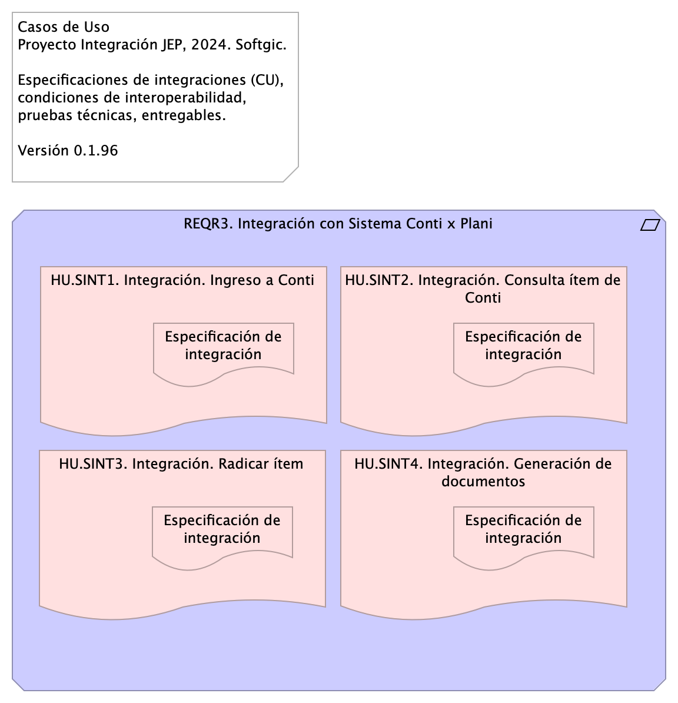

# Contenido
* [Información del Documento](#información-del-documento)
* [Especificaciones de Casos de Uso de Integración](#especificaciones-de-casos-de-uso-de-integración)
* [Anexos](#anexos)

\newpage

# Información del Documento

## Versión del Documento

> 

 

---
title: Especificación Caso de Uso de Integración
subtitle: Implementación Proyecto Evolución de Interoperabilidad JEP, Softgic
subject: Implementación Proyecto
author: 
date: 2024-09-16
keywords: [Integración, Interoperabilidad, JEP, Softgic]
header-left: include/jeplogo.jpg
geometry:
  - top=1in
  - bottom=1in
fignos-cleveref: True
fignos-plus-name: Fig.
fignos-caption-name: Imagen
tablenos-caption-name: Tabla
...

Versión Actual

1.6a9b356 - Compilación para entrega - Fri, 8 Nov 2024 22:48:03 +0000

Versiones Anteriores

1.12af1e5 - Compilación para entrega - Fri, 8 Nov 2024 16:06:05 +0000

1.8eb7837 - Compilación para entrega - Fri, 8 Nov 2024 15:39:21 +0000

1.318d6ef - gitlog.ref.ok - Fri, 8 Nov 2024 10:33:23 -0500

1.7c4940f - Compilación para entrega - Fri, 8 Nov 2024 15:30:58 +0000

## Realizado Por
Sofgic.co

## Revisado Por
Sofgic.co

---
lang: en
titlepage: true
titlepage-rule-color: 360049
...

\newpage

# Especificaciones de Casos de Uso de Integración

## Casos de Uso del Proyecto JEP

> Casos de Uso Proyecto Integración JEP, 2024. Softgic.  Especificaciones de integraciones (CU), condiciones de interoperabilidad, pruebas técnicas, entregables.  Versión 0.1.96  

 

---
title: Especificación de Integraciones (caso de uso)
subtitle: Implementación Proyecto Evolución de Interoperabilidad JEP, Softgic
subject: Implementación Proyecto JEP
author: "Versión actual: 1.6a9b356 - Compilación para entrega - Fri, 8 Nov 2024 22:48:03 +0000"
date: 2024-11-8
keywords: [Integración, Interoperabilidad, JEP, Softgic, Caso de uso]
header-left: include/jeplogo.jpg
lang: en
titlepage: true
titlepage-rule-color: 360049
geometry:
  - top=1in
  - bottom=1in
fignos-cleveref: True
fignos-plus-name: Fig.
fignos-caption-name: Imagen
tablenos-caption-name: Tabla
...

Documentación de los casos de uso de integración del proyecto JEP relacionados con los requerimientos. COndiciones de interoperabilidad, pruebas técnicas y entregables.

Fuente: Acta de requerimientos Integración Plani - Proceso Precontractual_V4.pdf

{#fig:id-eb0cac3ffa954ca0aa6a48e757b4d309 width= height=500px}

### Catálogo de Elementos
#### Especificación de integración
Solicitar autenticación a la aplicación Conti y devolver resultado de la solicitud de ingreso a la aplicación Plani.

#### Elementos
Elegir y describir los elementos de la actual integración.

* [x] App consumidora (A)
* [x] Mensaje
* [ ] Canal
* [ ] Ruteo
* [ ] Traducción
* [x] App proveedora (B)
* [ ] Monitoreo

Aplicación consumidora A: Plani. Aplicación proveedora B: Conti

Mensaje solicitud: (ver estándar de nombramiento) Ingreso a Conti

* Tipo: TXT | SOAP | XML | JSN | YML | BASE64
* Contenido: Usuario o identidad Conti

Mensaje respuesta: Rpta. Ingreso a Conti

* Tipo: TXT | SOAP | XML | JSN | YML | BASE64
* Contenido: Estado de solicitud de ingreso a Conti

Mensaje excepción: Rpta. Ingreso a Conti

* Tipo: TXT | SOAP | XML | JSN | YML | BASE64
* Contenido: Código de respuesta: HTTP 500 | TXT | Numeración (entero)

#### Diseño
Message Construct | Message Routing | Message Transformation | Messaging Endpoints | Messaging Channels | …

La aplicación consumidora y proveedora compartirán capacidades mediante un mensaje de autenticación (Message Construct).

#### Matriz de interoperabilidad
Detalle del intercambio entre sistemas de información o aplicaciones. 

App Plani requiere compartir Información [I], Funcionalidad [F], Seguridad o Servicios [S] con la App Plani.

|                | Conti | Plani          | Legali | Otros |
|----------------|-------|----------------|--------|-------|
| Conti  (B)      | X     | Seguridad |        |       |
| Plani  (A)      |       | X              |        |       |
| Legali         |       |                | X      |       |
| Otros Sistemas |       |                |        | X     |

Table: Matriz de interoperabilidad del CU Ingreso a Conti.

#### Pruebas Realizables
Por cada caso de prueba de integración describir el resultado del intercambio entre sistemas de información o aplicaciones según la Matriz de interoperabilidad.

* PRUB1. Consumo: la aplicación consumidora Plani no recibe una respuesta a tiempo.
* PRUB2. Ingreso: la aplicación proveedora Conti no provee un ingreso autorizado.

#### Especificación de integración
Solicitar consulta de ítem a la aplicación Plani y obtener resultado de la consulta. La solicitud de consulta podrá realizarla con mínimo un parámetro, o la combinación de todos. Los parámetros son los siguientes:

1. Número de ítem
1. Fecha estimada de inicio de proceso de selección
1. Vigencia de ejecución
1. Fuente de los recursos
1. Modalidad de selección Interna (manual de contratación)

Esta integración permitirá que el sistema Conti consulte al sistema Plani la información de acuerdo con los campos solicitados. Cuando la aplicación Plani ejecute la consulta enviará, esta integración enviarea de regreso a Conti la lista de ítems relacionados que ya se encuentren en estado aprobado y que correspondan a la dependencia del usuario parametrizado en Conti.

#### Elementos
Elegir y describir los elementos de la actual integración.

* [x] App consumidora (A)
* [x] Mensaje
* [x] Canal
* [ ] Ruteo
* [x] Traducción
* [x] App proveedora (B)
* [ ] Monitoreo

Aplicación consumidora A: Conti. Aplicación proveedora B: Plani

Mensaje solicitud: (ver estándar de nombramiento) Consulta ítem

* Tipo: TXT | SOAP | XML | JSN | YML | BASE64
* Contenido: Estructura de datos consulta ítem

1. Número de ítem
1. Fecha estimada de inicio de proceso de selección
1. Vigencia de ejecución
1. Fuente de los recursos
1. Modalidad de selección Interna (manual de contratación)

Mensaje respuesta: Rpta. Ingreso a Conti

* Tipo: TXT | SOAP | XML | JSN | YML | BASE64
* Contenido: Estructura de datos ítem aprobado

1. Vigencia de ejecución
1. ítem PAA
1. Fuente de los recursos
1. Valor Total Estimado del Contrato 5. Código UNSPSC
1. Objeto
1. Fecha estimada de inicio de proceso de selección(mes
1. Fecha estimada de presentación de ofertas (mes)
1. Duración estimada del contrato
1. Duración estimada del contrato (intervalo: días, meses, años)
1. Modalidad de selección Interna
1. Modalidad SECOPII
1. Departamento
1. Municipio
1. Dependencia
1. Responsable
1. Ordenador del gasto
1. Correo electrónico responsable

Mensaje excepción: Rpta. Ingreso a Conti

* Tipo: TXT | SOAP | XML | JSN | YML | BASE64
* Contenido: Código de respuesta: ej. HTTP 500 | TXT | Numeración (entero)

#### Diseño
Message Construct | Message Routing | Message Transformation | Messaging Endpoints | Messaging Channels | …

La aplicación consumidora y proveedora compartirán capacidades mediante un canal centralizado, y mensajes de intercambio de información transformada de extremo a extremo. (Message Construct, Message Routing, Message Transformation, Messaging Endpoints).

#### Matriz de interoperabilidad
Detalle del intercambio entre sistemas de información o aplicaciones. 

App Plani requiere compartir Información [I], Funcionalidad [F], Seguridad o Servicios [S] con la App Plani.

|                | Conti (A) | Plani (B)         | Legali | Otros |
|----------------|-------|----------------|--------|-------|
| Conti  (A)     | X     | Información    |        |       |
| Plani  (B)     |       | X              |        |       |
| Legali         |       |                | X      |       |
| Otros Sistemas |       |                |        | X     |

Table: Matriz de interoperabilidad del CU Consulta ítem.

#### Pruebas Realizables
Por cada caso de prueba de integración describir el resultado del intercambio entre sistemas de información o aplicaciones según la Matriz de interoperabilidad.

* PRUB1.0 Consumo: la aplicación consumidora Conti no recibe la respuesta de la consulta  a tiempo.
* PRUB11. Consulta sin resultado: la aplicación proveedora Plani  entrega una respuesta vacía.
* PRUB12. Consulta incorrecta: la aplicación proveedora Plani no provee el  formato de respuesta esperado.

#### Especificación de integración
Esta integracieon inicia en Conti el proceso de gestión dentro de la ruta precontractual (Revisar documento “1. Acta de requerimientos Proceso Precontractual_V2”), y pedirá un radicado asociado al ítem seleccionado.

Una vez generado el número del radicado, Conti envía a Plani la llamada posterior (callback) con esta información para que pueda ser almacenada y relacionada al ítem en el sistema Plani. A su vez, Plani envía un mensaje de confirmación a Conti.

#### Elementos
Elegir y describir los elementos de la actual integración.

* [x] App consumidora (A)
* [x] Mensaje
* [x] Canal
* [x] Ruteo
* [x] Traducción
* [x] App proveedora (B)
* [ ] Monitoreo

Aplicación consumidora A: Conti. Aplicación proveedora B: Plani, C: Otro

Mensaje solicitud: (ver estándar de nombramiento) Consulta ítem

* Tipo: TXT | SOAP | XML | JSN | YML | BASE64
* Contenido: Estructura de datos consulta ítem

Mensaje respuesta: Rpta. Ingreso a Conti

* Tipo: TXT | SOAP | XML | JSN | YML | BASE64
* Contenido: Estructura de datos ítem aprobado

Mensaje excepción: Rpta. Ingreso a Conti

* Tipo: TXT | SOAP | XML | JSN | YML | BASE64
* Contenido: Código de respuesta: ej. HTTP 500 | TXT | Numeración (entero)

#### Diseño
Message Construct | Message Routing | Message Transformation | Messaging Endpoints | Messaging Channels | …

La aplicación consumidora y proveedora compartirán capacidades mediante un canal centralizado, y mensajes de intercambio de funcionalidad y datos transformados de extremo a extremo. (Message Construct, Message Routing, Message Transformation, Messaging Endpoints).

#### Matriz de interoperabilidad
Detalle del intercambio entre sistemas de información o aplicaciones. 

App Plani requiere compartir Información [I], Funcionalidad [F], Seguridad o Servicios [S] con la App Plani.

|                | Conti (A) | Plani (B)   | Legali | Otros (C)     |
|----------------|-----------|-------------|--------|---------------|
| Conti  (A)     | X         | Información |        | Funcionalidad |
| Plani  (B)     |           | X           |        |               |
| Legali         |           |             | X      |               |
| Otros Sistemas |           |             |        | X             |

Table: Matriz de interoperabilidad del CU Radicar ítem.

#### Pruebas Realizables
Por cada caso de prueba de integración describir el resultado del intercambio entre sistemas de información o aplicaciones según la Matriz de interoperabilidad.

* PRUB20 Consumo: la aplicación consumidora Conti no recibe la respuesta del radicado a tiempo.
* PRUB21. Radicado: la aplicación proveedora del radicado falla en proveer el radicado
* PRUB22. Consulta incorrecta: la aplicación proveedora Plani no provee el  formato de respuesta esperado.

#### Especificación de integración
Una vez se tenga seleccionado el ítem a gestionar el usuario debe identificar el tipo de documento que esté relacionado al mismo, sea documento justificativo, Reglas de invitación y/o anexos.

Esta integración debe enviar el documento a... 

#### Elementos
Elegir y describir los elementos de la actual integración.

* [ ] App consumidora (A)
* [ ] Mensaje
* [ ] Canal
* [ ] Ruteo
* [ ] Traducción
* [ ] App proveedora (B)
* [ ] Monitoreo

Aplicación consumidora A: Conti. Aplicación proveedora B: 

Mensaje: Ingreso a Conti
* Tipo: TXT | SOAP | XML | JSN | YML | BASE64
* Contenido: 

#### Diseño
Message Construct | Message Routing | Message Transformation | Messaging Endpoints | Messaging Channels | …

#### Matriz de interoperabilidad
Detalle del intercambio entre sistemas de información o aplicaciones. 

App Plani requiere compartir Información [I], Funcionalidad [F], Seguridad o Servicios [S] con la App Plani.

|                | Conti | Plani          | Legali | Otros |
|----------------|-------|----------------|--------|-------|
| Conti  (B)      | X     | Información |        |       |
| Plani  (A)      |       | X              |        |       |
| Legali         |       |                | X      |       |
| Otros Sistemas |       |                |        | X     |

Table: Matriz de interoperabilidad del CU Generación de documentos

#### Pruebas Realizables
Por cada caso de prueba de integración describir el resultado del intercambio entre sistemas de información o aplicaciones según la Matriz de interoperabilidad.

* PRUB1. 
* PRUB2.

#### HU.SINT1. Integración. Ingreso a Conti

#### HU.SINT2. Integración. Consulta ítem de Conti

#### HU.SINT3. Integración. Radicar ítem

#### HU.SINT4. Integración. Generación de documentos

#### REQR3. Integración con Sistema Conti x Plani
Atendiendo la necesidad de la Subdirección de Contratación de implementar el flujo de gestión precontractual en el sistema de Gestión Documental - Conti se requiere contar con la información de los ítems del Plan Anual de Adquisiciones – PAA para iniciar el proceso, la cual se encuentra gestionada en el Sistema de Gestión y Planeación Institucional PLANi.

### Índice de la documentación (casos de uso)

1. Integración. Ingreso a Conti
1. Integración. Consulta ítem de Conti
1. Integración. Radicar ítem
1.Integración. Generación de documentos

---
lang: en
titlepage: true
titlepage-rule-color: 360049
...

\newpage

# Anexos

---
lang: en
titlepage: true
titlepage-rule-color: 360049
...

## Plantilla de Casos de Uso del Proyecto JEP

{#fig:id-8115cb4314954a7cb873b534038c22aa width= height=500px}

---
title: Plantilla de Especificación de Integración (caso de uso)
subtitle: Implementación Proyecto Evolución de Interoperabilidad JEP, Softgic
subject: Implementación Proyecto
author: "Versión actual: 1.6a9b356 - Compilación para entrega - Fri, 8 Nov 2024 22:48:03 +0000"
date: 2024-11-8
keywords: [Integración, Interoperabilidad, JEP, Softgic]
header-left: include/jeplogo.jpg
geometry:
  - top=1in
  - bottom=1in
fignos-cleveref: True
fignos-plus-name: Fig.
fignos-caption-name: Imagen
tablenos-caption-name: Tabla
...

Documentación de los casos de uso de integración (CU en el diagrama) del proyecto JEP relacionados con las integraciones y requerimientos. 

Fuente: Justificativo de la Contratación Invitación Pública.

## Casos de Uso del Proyecto (integración)
App A requiere integrar Información [I] | Funcionalidad [F] | Servicios [S] con la App B, C, D…

### Elementos
Elegir y describir los elementos de la actual integración.

* [ ] App consumidora (A)
* [ ] Mensaje
* [ ] Canal
* [ ] Ruteo
* [ ] Traducción
* [ ] App proveedora (B)
* [ ] Monitoreo

### Diseño
Message Construct | Message Routing | Message Transformation | Messaging Endpoints | Messaging Channels | …

### Matriz de interoperabilidad
Detalle del intercambio entre sistemas de información o aplicaciones. 

Sistema A comparte información, funcionalidad o servicios con Sistema B.

|                | Conti | Plani          | Legali | Otros |
|----------------|-------|----------------|--------|-------|
| Conti          | X     | Inf, Seguridad |        |       |
| Plani          |       | X              |        |       |
| Legali         |       |                | X      |       |
| Otros Sistemas |       |                |        | X     |

### Pruebas Realizables
Describir por cada caso de prueba de integración el resultado del intercambio entre sistemas de información o aplicaciones según la Matriz de interoperabilidad.

