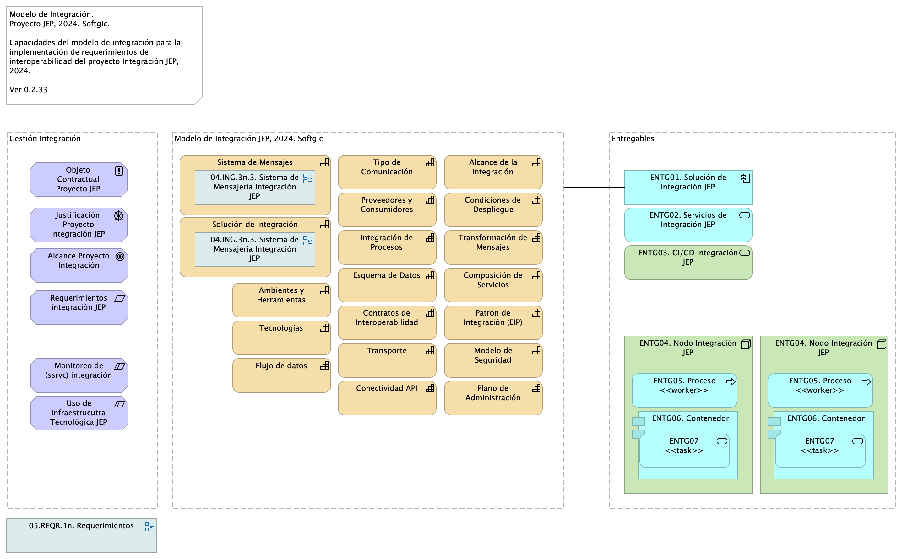

# Documentación Técnica del Proyecto Integración JEP
* [Información del Documento](#información-del-documento)
* [Roles y Equipo de Trabajo](#roles-y-equipo-de-trabajo)
* [Gestión de Trabajo y Requerimientos](#gestión-de-trabajo-y-requerimientos)
* [Modelo de Producción e Implementación](#modelo-de-producción-e-implementación)
* [Modelo de Solución de Interoperabilidad](#modelo-de-solución-de-interoperabilidad)

\newpage

# Información del Documento
<!--
Tx-exportToMarkdown-CLI-md-drivingview Export

Created with Archi (https://www.archimatetool.com) and the following jArchi script:
https://github.com/archi-contribs/jarchi-single-page-html-export

Copyright (c) 2020 Phillip Beauvoir & Jean-Baptiste Sarrodie - MIT License
-->
## Versión Actual

> 

 

---
title: Documento de Arquitectura , , 
subtitle: .  - 
geometry:
  - top=1in
  - bottom=1in
fignos-cleveref: True
fignos-plus-name: Fig.
fignos-caption-name: Imagen
tablenos-caption-name: Tabla
...

Versión 1.4acac1d - action - Sun, 20 Oct 2024 12:59:48 -0500

\newpage

# Roles y Equipo de Trabajo
<!--
Tx-exportToMarkdown-CLI-md-drivingview Export

Created with Archi (https://www.archimatetool.com) and the following jArchi script:
https://github.com/archi-contribs/jarchi-single-page-html-export

Copyright (c) 2020 Phillip Beauvoir & Jean-Baptiste Sarrodie - MIT License
-->
## Roles y Division de Trabajo del Proyecto

> Modelo de Implementación Proyecto JEP, 2024. Softgic.  Propuesta roles de trabajo del proyecto de servicios de integración JEP.  Ver 0.1  

 

Las división de trabajo conveniente dadas las condiciones del proyecto de integración JEP es la siguiente.

### Consultor de Integración (responsabilidades)
* Arquitectura de contenedores
* Definir y documentar soluciones
* Rspecificar interfaces
* Soporte paso producción

### Arquitecto de Integración
* arquitectura bus servicios
* soporte desarrollo
* soporte cliente
* mitigar riesgos arquitectura

### Consultor de Infraestructura
* definir y documentar soluciones (de infr.)
* documentar componentes e interfaces (de infr.)
* soporte post producción

{#fig:id-3bef3ca04f6d4d1ba6b837b822a51801 width=}

### Catálogo de Elementos

| Nombre  | Tipo | Documentación |
|---------|------|---------------|
| Arquitecto | Capability | Capacidad del proyecto involucrada en el objeto del contrato, proyecto JEP. |
| Bus empresarial | Outcome | Responsabilidades objeto del contrato del rol, proyecto JEP. |
| CI/CD | Outcome | Responsabilidades objeto del contrato del rol, proyecto JEP. |
| Cluster, nodos, redes, etc. | Outcome | Responsabilidades objeto del contrato del rol, proyecto JEP. |
| Contenedores (orquestación) | Outcome | Responsabilidades objeto del contrato del rol, proyecto JEP. |
| Definiciones | Driver | Problemática objeto de la propuesta de refuerzo de arquitectura. |
| Desarrollo y control versión | Goal | Evidencia representativa de problemática objeto de la propuesta de refuerzo de arquitectura. |
| Documentación | Driver | Problemática objeto de la propuesta de refuerzo de arquitectura. |
| Entregas | Driver | Problemática objeto de la propuesta de refuerzo de arquitectura. |
| Implementación | Driver | Problemática objeto de la propuesta de refuerzo de arquitectura. |
| Infraestructura | Capability | Capacidad del proyecto involucrada en el objeto del contrato, proyecto JEP. |
| Infraestructura operacional | Driver | Obligación TDR, contrato, proyecto JEP. |
| Integración | Capability | Capacidad del proyecto involucrada en el objeto del contrato, proyecto JEP. |
| Malla de servicios | Goal | Enlace de los servicios de integración implementados por el proyecto con las herramientas de monitoreo y salud de los sistemas JEP.  |
| Post producción | Goal | Evidencia representativa de problemática objeto de la propuesta de refuerzo de arquitectura. |
| Propuesta de Entregables, mensual | Work Package |  |
| Riesgos técnicos | Outcome | Responsabilidades objeto del contrato del rol, proyecto JEP. |
| Soporte | Driver | Obligación TDR, contrato, proyecto JEP. |
| Transición (producción) | Outcome | Responsabilidades objeto del contrato del rol, proyecto JEP. |

Table: Elementos de la vista. {#tbl:tblelement-04.ING.1n.Rolesydivisióndetrabajo-id}

 

\newpage

# Gestión de Trabajo y Requerimientos
<!--
Tx-exportToMarkdown-CLI-md-drivingview Export

Created with Archi (https://www.archimatetool.com) and the following jArchi script:
https://github.com/archi-contribs/jarchi-single-page-html-export

Copyright (c) 2020 Phillip Beauvoir & Jean-Baptiste Sarrodie - MIT License
-->
## Modelo de Gestión de Requerimientos de Integración

> Modelo de Implementación Proyecto JEP, 2024. Softgic.  Propuesta modelo de gestión y atención requerimientos de integración del proyecto de servicios de integración JEP. 
 Ver 0.1.3   

 

El ciclo de entrega de requerimientos inicia con la planeación macro de los objetivos entregables del proyecto de integración organizados en el tiempo (de septiembre a diciembre del 2024).

Los roles técnicos convierten estos objetivos macro en requerimientos comprendidos por épicas, características e historias (o casos de uso) de integración.

Los ingenieros convierten a su vez las historias en tareas entregables, individuales y autónomas, de tipo UT, DIS, QA, AN, CI/CD, etc. Una vez los ingenieros tengan esta división de trabajo en tareas pueden pasar a la implementación mediante iteraciones (ver Modelo de Implementación del Proyecto JEP).

{#fig:id-7c3abdaa8d9b46eebfd8f8e3e8d912ce width=}

### Catálogo de Elementos
- **ACC01. Planeación de Producción, Oct-Dic 2024**. Objetivos y entregas en el tiempo, versiones de entrega del proyecto de integración. 
- **AN**. 
- **ANLS.Analisis integración**. ### 2. ANSS (análisis). * Scrum, Funcional, Dueño producto cliente (requiere conocimiento del negocio). * Resultado: Refinamiento HU, modelo de negocio, es decir, diagrama de HU relacionadas unas con otras y con los conceptos de negocio en el repositorio de ARQ. Actualmente: no hay resultados de este proceso. Ejemplo del modelo de negocio  ### Salidas * Modelo de negocio en el repo * Estimación --puede en devops * Análisis de dependencia en el repo  ### KPI
 - Tasa de aprobación de HU por cliente
 Fuente: (Cantidad de HU refinadas y aprobadas por cliente [Repo Sharepoint] / Total de cantidad de HU [Azure DevOps])
 Dato 26/10/2023: (30/44) = 0,68
 
 - Tasa de error en Bug por PR entregados
 Fuente: (Cantidad de solicitude de cambio en rama (Pull Reqst) de Correcciones (fix) o Regresión (reverts) [Bitbucket] / Cantidad total de PR desplegados [Bitbucket])
 Dato 26/10/2023: (8/111)*100 = 7,2%
 
- **CI/CD**. Actividades DevOps del ciclo o iteración de implementación.
- **Característica 1**. 
- **Característica 2**. 
- **DEV**. Alcance de QA unitaria 
- **DEV.Implementación**. ### KPI
 - Velocidad de construcción
 Fuente: (Cantidad de puntos de HU ejecutadas [Azure DevOps] / Horas habiles del mes de trabajo [Calculo manual])
 Dato 26/10/2023: 83 / 153 = 0,54 HU/horas 
 
 - Tasa de cierre de defectos
 Fuente: (Cantidad de Bug solucionados [Azure DevOps] / Total de Bugs a corte sin nuevos [Azure DevOps])
 Dato 26/10/2023: 81 / 920 = 0,088
 
 - Indice de dependecia de Lider Técnico
 Fuente: (Cantidad de actividades retrazadas semanales segun las HU planeadas / Total de HU planeadas para ejecución)
 Dato 26/10/2023: Pendiente proxima semana
 
- **DIS**. 
- **DIS.Arquitectura / diseño**. ### KPI
 - Nivel de HU sin detalle técnico
 Fuente: (Cantidad de HU refinadas y aprobadas sin diseño de implementacion [Repo Sharepoint] / Total de cantidad de HU [Azure DevOps])
 Dato 26/10/2023: 0/44=0 
- **Epica**. 
- **HU**. 
- **HU... n**. 
- **HU2**. 
- **MET.APRB**. Cod.	APRB Nombre indicador	Tasa de aprobación de HU por cliente Uso	Estabildad de requerimientos. Contensión del flujo de trabajo inicio de desarrolo Proceso	ANLS Calculo de medición	Cantidad de HU refinadas y aprobadas por cliente / Total de cantidad de HU Fuente	[Repo Sharepoint], [Azure DevOps]) 
- **MET.DEC**. Cod.: DEC Nombre indicador: Decisiones de diseño, justificaciones, validaciones Uso: Estabildad de requerimientos. Control de alineación desarrollo-demanda Proceso:	DIS Calculo de medición: Cantidad de HU refinadas y aprobadas por cliente / Total de cantidad de HU Fuente: [Repo Sharepoint], [Azure DevOps])  
- **MET.VEL**. Cod.	VEL Nombre indicador	Velocidad de construcción Uso	Capacidad interna de desarrollo Proceso	DEV Calculo de medición	Cantidad de puntos de HU ejecutadas / Horas habiles del mes de trabajo Fuente	[Azure DevOps], [Calculo manual] 
- **Plan Producción: Ingeniería <<Red Hat DevOps>>**. 
- **Plan Producción: Scrum y Gerencia**. 
- **QA**. 
- **UT (tarea)**. Unidad mínima de trabajo (tarea por desarrollador). 

\newpage

# Modelo de Producción e Implementación
<!--
Tx-exportToMarkdown-CLI-md-drivingview Export

Created with Archi (https://www.archimatetool.com) and the following jArchi script:
https://github.com/archi-contribs/jarchi-single-page-html-export

Copyright (c) 2020 Phillip Beauvoir & Jean-Baptiste Sarrodie - MIT License
-->
## Modelo de Producción e Implementación de Integración JEP

> Modelo de Producción e Implementación Proyecto JEP, 2024. Softgic.  Propuesta modelo de gestión y atención requerimientos de integración del proyecto de servicios de integración JEP. 
 Ver 0.1.5   

 

El proyecto inicia con la creación de un tramo de la planeación de producción, esto es, un ciclo de implementación o iteración del proyecto de integración JEP.

(ING) Procesos de ingeniería. Arrancan los procesos mínimos de ingeniería previos a la construcción de la integración.

(PRY) Planificación de historias de usuario. La porción de la planeación de producción aprobada para la construcción se planifica en historias o casos de uso, u cualquier otra forma de medición de avance.

(ING) Creación e inicio de iteraciones de implementción incremental. La planificación de HU (CU, u otra) es tareificada y asignada a desarrolladores disponibles. Además, las tareas asignadas son organizadas en ciclos de trabajo fijo (iteraciones). Esta ejecución es la línea de trabajo principal del proyecto JEP.

(PRY, ING) Coordinación de líneas de trabajo. Las entregas de la línea de trabajo del proyecto JEP debe ser compasada con otras líneas de trabajo de la JEP, con las que puede haber una relación de secuencia o dependencia externa.

Durante la ejecución de la iteraciones determinadas, inicia nuevamente el ciclo del  proyecto desde la creación de un nuevo tramo de la planeación de producción.

{#fig:id-9938d5859d53450fa5c5c953d9ce33cb width=}

### Catálogo de Elementos

| Nombre  | Tipo | Documentación |
|---------|------|---------------|
| ACC01. Planeación de Producción, Oct-Dic 2024 | Course Of-Action | Objetivos y entregas en el tiempo, versiones de entrega del proyecto de integración.  |
| AN | Work Package |  |
| AN | Work Package |  |
| ANLS.Analisis integración | Business Process | ### 2. ANSS (análisis). * Scrum, Funcional, Dueño producto cliente (requiere conocimiento del negocio). * Resultado: Refinamiento HU, modelo de negocio, es decir, diagrama de HU relacionadas unas con otras y con los conceptos de negocio en el repositorio de ARQ. Actualmente: no hay resultados de este proceso. Ejemplo del modelo de negocio  ### Salidas * Modelo de negocio en el repo * Estimación --puede en devops * Análisis de dependencia en el repo  ### KPI
 - Tasa de aprobación de HU por cliente
 Fuente: (Cantidad de HU refinadas y aprobadas por cliente [Repo Sharepoint] / Total de cantidad de HU [Azure DevOps])
 Dato 26/10/2023: (30/44) = 0,68
 
 - Tasa de error en Bug por PR entregados
 Fuente: (Cantidad de solicitude de cambio en rama (Pull Reqst) de Correcciones (fix) o Regresión (reverts) [Bitbucket] / Cantidad total de PR desplegados [Bitbucket])
 Dato 26/10/2023: (8/111)*100 = 7,2%
  |
| CI/CD | Work Package | Actividades DevOps del ciclo o iteración de implementación. |
| Característica 1 | Deliverable |  |
| Característica 2 | Deliverable |  |
| Condición: Construir en paralelo (tiempo) | Constraint |  |
| Condición: depender de otros servicios | Constraint |  |
| DEV | Work Package | Alcance de QA unitaria  |
| DEV | Work Package | Alcance de QA unitaria  |
| DEV.Implementación | Business Process | ### KPI
 - Velocidad de construcción
 Fuente: (Cantidad de puntos de HU ejecutadas [Azure DevOps] / Horas habiles del mes de trabajo [Calculo manual])
 Dato 26/10/2023: 83 / 153 = 0,54 HU/horas 
 
 - Tasa de cierre de defectos
 Fuente: (Cantidad de Bug solucionados [Azure DevOps] / Total de Bugs a corte sin nuevos [Azure DevOps])
 Dato 26/10/2023: 81 / 920 = 0,088
 
 - Indice de dependecia de Lider Técnico
 Fuente: (Cantidad de actividades retrazadas semanales segun las HU planeadas / Total de HU planeadas para ejecución)
 Dato 26/10/2023: Pendiente proxima semana
  |
| DIS | Work Package |  |
| DIS | Work Package |  |
| DIS.Arquitectura / diseño | Business Process | ### KPI
 - Nivel de HU sin detalle técnico
 Fuente: (Cantidad de HU refinadas y aprobadas sin diseño de implementacion [Repo Sharepoint] / Total de cantidad de HU [Azure DevOps])
 Dato 26/10/2023: 0/44=0  |
| Epica | Deliverable |  |
| HU | Deliverable |  |
| HU... n | Deliverable |  |
| HU2 | Deliverable |  |
| ITR (itera) | Plateau |  |
| Línea Producción Proyecto Integración JEP | Value Stream |  |
| MET.APRB | Business Object | Cod.	APRB Nombre indicador	Tasa de aprobación de HU por cliente Uso	Estabildad de requerimientos. Contensión del flujo de trabajo inicio de desarrolo Proceso	ANLS Calculo de medición	Cantidad de HU refinadas y aprobadas por cliente / Total de cantidad de HU Fuente	[Repo Sharepoint], [Azure DevOps])  |
| MET.DEC | Business Object | Cod.: DEC Nombre indicador: Decisiones de diseño, justificaciones, validaciones Uso: Estabildad de requerimientos. Control de alineación desarrollo-demanda Proceso:	DIS Calculo de medición: Cantidad de HU refinadas y aprobadas por cliente / Total de cantidad de HU Fuente: [Repo Sharepoint], [Azure DevOps])   |
| MET.VEL | Business Object | Cod.	VEL Nombre indicador	Velocidad de construcción Uso	Capacidad interna de desarrollo Proceso	DEV Calculo de medición	Cantidad de puntos de HU ejecutadas / Horas habiles del mes de trabajo Fuente	[Azure DevOps], [Calculo manual]  |
| Meta: 20+ servicios de integración | Goal |  |
| Otra Línea Producción JEP | Value Stream |  |
| Plan Producción: Ingeniería <<Red Hat DevOps>> | Grouping |  |
| Plan Producción: Ingeniería <<Red Hat DevOps>> (copy) | Grouping |  |
| Plan Producción: Scrum y Gerencia | Grouping |  |
| QA | Work Package |  |
| UT (tarea) | Work Package | Unidad mínima de trabajo (tarea por desarrollador).  |

Table: Elementos de la vista. {#tbl:tblelement-04.ING.2n.1b.Modeloproducción-id}

 

\newpage

# Modelo de Solución de Interoperabilidad
<!--
Tx-exportToMarkdown-CLI-md-drivingview Export

Created with Archi (https://www.archimatetool.com) and the following jArchi script:
https://github.com/archi-contribs/jarchi-single-page-html-export

Copyright (c) 2020 Phillip Beauvoir & Jean-Baptiste Sarrodie - MIT License
-->
## Modelo de Interoperabilidad JEP

> Modelo de Integración.  Proyecto JEP, 2024. Softgic.  Capacidades del modelo de integración para la impleentación de requerimientos de interoperabilidad del proyecto Integración JEP, 2024. 
 04.ing.3n.Ver 0.2.31  

 

El presente modelo de solución de interoperabilidad JEP, 2024, en desarrollo por Softgic, expone para aprobación y referencia las decisiones de la solución de integración y las restricciones que la rigen. Una vez revisado y aprobado por parte de JEP el modelo de interoperabilidad será referencia para la gestión del proyecto y de los entregables de esta solución.

## Características Principales del Modelo de Integración JEP
* API de integración
* Patrones de integración empresarial (EIP)
* Sistema de Mensajería entre servicios de integración y aplicaciones JEP
* Flujos de datos para integración 
* Arquitectura de clusters y contenedores para integración
* Uso de infraestructura tecnológica JEP

{#fig:id-f863abde3ea94046a77bf84d5cb0a3a8 width=}

### Catálogo de Elementos

| Nombre  | Tipo | Documentación |
|---------|------|---------------|
| Alcance Proyecto Integración | Goal | Implementación de 20 o más servicios de integración al 31 de diciembre del 2024.  |
| Alcance de la Integración | Capability | Aplicaciones que tienen integraciones existentes: necesitamos listados de ssvc pasar al bus.  |
| Ambientes y Herramientas | Capability | Esta solución de interoperabilidad usa las herramientas, librerías, ambientes, infraestructura productivo y no productivos (nodos, redes, almacenamientos, y otros) indicados por la JEP.  |
| Composición de Servicios | Capability | Combina colección de servicios para formar un servicio completo. Mediante la integración basada en patrones de Camel, define funciones mediante la recopilación de datos de múltiples conexiones (endpoint). Las composiciones suelen resolver integraciones no triviales o complejas.  |
| Condiciones de Despliegue | Capability |  |
| Conectividad API | Capability | Esta solución de interoperabilidad usa conectividad API REST provista por la infraestructura de conectividad de la JEP (Apache Camel).  |
| Contratos de Interoperabilidad | Capability |  |
| ENTG01. Solución de Integración JEP | Application Component | Documentación técnica del diseño de solución de la integración JEP, 2024.  |
| ENTG02. Servicios de Integración JEP | Application Service | Servicios ejecutables desplegados en los entornos de software JEP.  |
| ENTG03. CI/CD Integración JEP | Technology Service | Cadenas de integración y despliegue continuo de los servicios de integración del proyecto de integración JEP, 2024.  |
| ENTG04. Nodo Integración JEP | Node | Cluster de ejecución de los nodos y procesos de (servicios) de integración del proyecto. |
| ENTG05. Proceso <<worker>> | Application Process | Configuración de servicios de integración del proyecto dentro de la infraestructura tecnológica JEP. |
| ENTG06. Contenedor | Application Component | Contenedores de los servicios de integración del proyecto desplegados en la infraestructura tecnológica JEP.  |
| ENTG07. Réplica <<task>> | Application Service | Servicios de integración del proyecto desplegados en la infraestructura tecnológica JEP.  |
| Entregables | Grouping |  |
| Esquema de Datos | Capability |  |
| Flujo de datos | Capability | Esta solución de interoperabilidad usa esquemas de datos predefinidos entre las integraciones.  |
| Gestión Integración | Grouping |  |
| Integración de Procesos | Capability |  |
| Justificación Proyecto Integración JEP | Driver | Justificación: Evolución de la Plataforma de Interoperabilidad para el año 2024  1. Evolución de la plataforma tecnológica de su interoperabilidad y el cumplimiento de los lineamientos del MinTIC, a través del “Manual Interactivo de Gobierno Digital, herramienta dirigida a las entidades públicas nacionales y territoriales (...) Política de Gobierno Digital, Decreto 767 de 2022” 1. Interoperabilidad con las entidades externas que demandan información de la JEP 1. Evolución del modelo de interoperabilidad interna y gobierno de data maestra entre sistemas internos  |
| Modelo de Integración JEP, 2024. Softgic | Grouping |  |
| Modelo de Seguridad | Capability | Autenticación mixta: JWS y tradicional (usuario, contraseña).  |
| Monitoreo de (ssrvc) integración | Constraint | * Herramientas de monitoreo y logging con las que cuenta la solución actual de orquestación de contenedores de OpenShift.    * Monitoreo de uso de los recursos de procesamiento, red y memoria de los componentes claves de la solución haciendo uso de ServiceMesh.  *  La solución soporta la habilitación de reglas de alertas sobre los registros de actividad y monitoreo.  * Soluciones de EFK (Elasticsearch, FluentD, Kibana - ELKstack), a través de operadores para centralizar el proceso de logs que se generan en difrerentes espacios de trabajo.  |
| Objeto Contractual Proyecto JEP | Principle | Prestar los servicios de administración y monitoreo de la solución de interoperabilidad de los sistemas de información de la JEP; así como la implementación de nuevos desarrollos o parametrizaciones que esta solución requiera. |
| Patrón de Integración (EIP) | Capability | Pasar de modelo integrac. EIA (intgrc directa) a EIP (integrc empresarial/bus).   |
| Plano de Administración | Capability | Monitoreo de rendimiento de ssvc de integración.  |
| Proveedores y Consumidores | Capability |  |
| Requerimientos integración JEP | Requirement | Gestión de requerimientos del proyecto de integración JEP, 2024  * Implementación de 20 o más servicios de integración a 31 de diciembre del 2024. * Pasar de modelo integración directa (EIA) a integración empresarial/bus (EIP).   **Nota**: en el Anexo Nro. 1.1 – Anexo técnico evolución plataforma de interoperabilidad – Ficha Técnica la hoja “Categorías de Cotización” contiene las necesidades a contratar en el ámbito de la evolución tecnológica del modelo de interoperabilidad y los desarrollos de interoperabilidad tanto con sistemas internos, como con entidades externas.  |
| Sistema de Mensajes | Capability | Esta solución de interoperabilidad usa un sistema de mensajes (comandos). Los mensajes son de tipo petición, respuesta o excepción.  La mensajería puede ser asíncrona o síncrona entre aplicaciones o servicios desacoplados. La conexión y la sesión es manejada por un agente intermediario, que puede ser una cola o un bus empresarial (para este contexto, OpenShift, Cliente Red Had Interoperabity o Apache Camel).   La comunicación del sistema de mensajería ocurre cuando la aplicación o servicio productor emite un comando (mensaje ) de 'envío', en el cual transmite datos o peticiones de negocio en un formato predefinido, y lo envía a una cola de mensajes.  |
| Solución de Integración | Capability | Estilos de Integración: Communications backbone [^*]. Patrón principal: Messaging — Cada aplicación (app) conectada a un mismo sistema de mensajería, intercambio de datos y operación entre aplicaciones mediante mensajes.   [^*]: Red troncal de comunicaciones: a medida que más y más aplicaciones de una empresa se conectan al sistema de mensajería y hacen que su funcionalidad esté disponible a través de la mensajería, el sistema de mensajería se convierte en un punto centralizado de ventanilla única para la funcionalidad en la empresa. Una nueva aplicación simplemente necesita saber qué canales usar para solicitar funcionalidad y cuáles otros escuchar para obtener los resultados. El propio sistema de mensajería se convierte esencialmente en un bus de mensajes, una columna vertebral que proporciona acceso a todas las diversas y cambiantes aplicaciones y funcionalidades de la empresa. Puedes lograr este nirvana de integración más rápida y fácilmente si diseñas específicamente para ello desde el principio.  |
| Tecnologías | Capability | * Red Hat Integration: suite de runtimes, frameworks, y servicios para aplicaciones nativas de Red Hat OpenShift. * Camel Integration Tool * Quarkus development framework * Java OpenJDK 17  |
| Tipo de Comunicación | Capability | Pasar llamadas síncronas a asincrónicas: analizar apps que deben cambiar comunicación |
| Transformación de Mensajes | Capability | Mapeos, homologaciones y correspondencias.  |
| Transporte | Capability |  |
| Uso de Infraestrucutra Tecnológica JEP | Constraint | Servivios de infraestrucgtura, almacenamiento y ceomputo de la JEP:  Openshift Platform, bus empresarial, seguridad de la empresa, tecnoglogía de clusters y contenedores.  |

Table: Elementos de la vista. {#tbl:tblelement-04.ING.3n.1.ModelodeInteroperabilidadJEP,2024-id}

 

<!--
Tx-exportToMarkdown-CLI-md-drivingview Export

Created with Archi (https://www.archimatetool.com) and the following jArchi script:
https://github.com/archi-contribs/jarchi-single-page-html-export

Copyright (c) 2020 Phillip Beauvoir & Jean-Baptiste Sarrodie - MIT License
-->
## Ambientes y Herramientas. Organización de Referencia JEP 
Ambientes y Herramientas de Referencia JEP

> Integraciones JEP, 2024  Integración JEP. Softgic. Ambientes y Herramientas. Organización de referencia.   versión 0.1.31  

 

Organización de referencia de los ambientes de trabajo JEP.

{#fig:id-53af0cb1d4e145a6b82764f7ce8f9237 width=}

### Catálogo de Elementos

| Nombre  | Tipo | Documentación |
|---------|------|---------------|
| Application Service | Application Service |  |
| Cluster | Application Collaboration | Orquestador de nodos y servicios (contendores) de la JEP.  |
| Desarrollo <<namespace>> | Application Collaboration |  |
| ENTG06. Contenedor | Application Component | Contenedores de los servicios de integración del proyecto desplegados en la infraestructura tecnológica JEP.  |
| ENTG07. Réplica <<task>> | Application Service | Servicios de integración del proyecto desplegados en la infraestructura tecnológica JEP.  |
| Monitor <<worker>> | Application Component |  |
| Node | Node | Nodo físico donde corren los procesos del sistema operativo.  |
| Nodo | Application Interface | Nodo lógico en donde corren los contenedores.  |
| Pod | Application Collaboration |  |
| Producción <<namespace>> | Application Collaboration |  |
| Server <<worker>> | Application Component | Definición de un proceso de trabajo.  |

Table: Elementos de la vista. {#tbl:tblelement-04.ING.3n.2.AmbientesyHerramientasJEP-id}

 

<!--
Tx-exportToMarkdown-CLI-md-drivingview Export

Created with Archi (https://www.archimatetool.com) and the following jArchi script:
https://github.com/archi-contribs/jarchi-single-page-html-export

Copyright (c) 2020 Phillip Beauvoir & Jean-Baptiste Sarrodie - MIT License
-->
## Sistema de Mensajes Integración JEP

> Integraciones JEP, 2024  Integración JEP. Softgic. Sistema de Mensajería Integración JEP. Elementos del sistema de mensajería.  versión 0.1.4   

 

Comunicación entre aplicaciones o servicios desacolplados mediante mensajes de tipo solicitud, respuesta o excepción (request, response, exception).

{#fig:id-402ea0d886a14c76a3459332f1f2953c width=}

### Catálogo de Elementos

| Nombre  | Tipo | Documentación |
|---------|------|---------------|
| Consumidor | Application Component | Aplicación o servicio consumidor. Emite mensajes de petición al proveedor de datos o comandos.  |
| Interfaz intermediación | Application Interface | API de transporte de mensajjes. Protocolo JMS, XMQ, MSMQ, etc.  |
| Intermediador (cola o bus) | Application Component | Bus de Red Hat, aplicación cliente Quarkus, o intermediador de integración Apache Camel. |
| Mensaje respuesta o excepción | Data Object | Formato predefinido de intercambio de datos. |
| Mensaje solicitud | Data Object | Formato predefinido de intercambio de datos. |
| Proveedor | Application Component | Aplicación o servicio proveedor. Emite mensajes de respuesta al consumidor de datos o comandos.  |

Table: Elementos de la vista. {#tbl:tblelement-04.ING.3n.3.SistemadeMensajeríaIntegraciónJEP-id}

 

