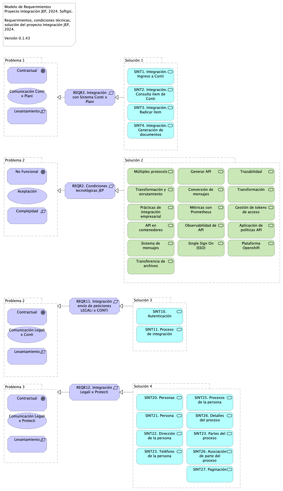
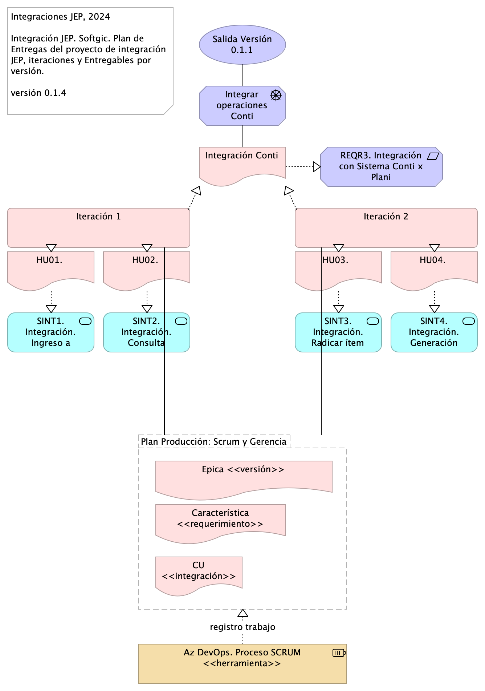
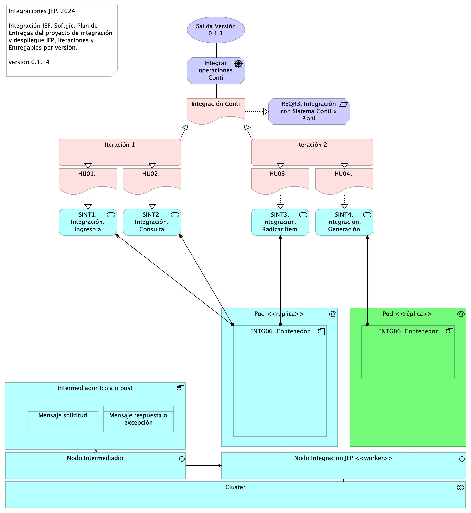

# Contenido
* [Información del Documento](#información-del-documento)
* [Gestión de Trabajo y Requerimientos de Interoperabilidad](#gestión-de-trabajo-y-requerimientos-de-interoperabilidad)
* [Modelo de Requerimientos de Interoperabilidad Proyecto JEP](#modelo-de-requerimientos-de-interoperabilidad-proyecto-jep)
* [Modelo de Despliegue de Requerimientos de Interoperabilidad Proyecto JEP](#modelo-de-despliegue-de-requerimientos-de-interoperabilidad-proyecto-jep)

\newpage

# Información del Documento

## Versión del Documento

> 

 

---
title: Documento de Especificación de Entregas
subtitle: Implementación Proyecto Evolución de Interoperabilidad JEP, Softgic
subject: Implementación Proyecto
author: 
date: 2024-09-16
keywords: [Integración, Interoperabilidad, JEP, Softgic]
titlepage-background: include/softgicbackgr.png
header-left: include/jeplogo.jpg
geometry:
  - top=1in
  - bottom=1in
fignos-cleveref: True
fignos-plus-name: Fig.
fignos-caption-name: Imagen
tablenos-caption-name: Tabla
...

Versión actual: 
1.23e180b - clean - Wed, 30 Oct 2024 21:45:40 -0500

Versiones Anteriores

1.23e180b - clean - Wed, 30 Oct 2024 21:45:40 -0500

### Realizado Por
Sofgic.co

### Revisado Por
Sofgic.co

---
lang: "en"
titlepage: true
titlepage-rule-color: "360049"
...

\newpage

# Gestión de Trabajo y Requerimientos de Interoperabilidad

## Modelo de Gestión de Requerimientos de Integración

> Modelo de Implementación Proyecto JEP, 2024. Softgic.  Propuesta modelo de gestión y atención requerimientos de integración del proyecto de servicios de integración JEP. 
 Ver 0.1.37   

 

El ciclo de entrega de requerimientos inicia con la planeación macro de los objetivos entregables del proyecto de integración organizados en el tiempo (de septiembre a diciembre del 2024).

Los roles técnicos convierten estos objetivos macro en requerimientos comprendidos por épicas, características e historias (o casos de uso) de integración.

Los ingenieros convierten a su vez las historias en tareas entregables, individuales y autónomas, de tipo tarea (UT), diseño (DIS), pruebas de calidad (QA), análisis (AN), entrega continua (CI/CD), etc. Una vez los ingenieros tengan esta división de trabajo en tareas pueden pasar a la implementación mediante iteraciones (ver Modelo de Implementación del Proyecto JEP).

Los requerimientos del proyecto JEP son procesados mediante el modelo de producción descrito más adelante.

{#fig:id-7c3abdaa8d9b46eebfd8f8e3e8d912ce width= height=500px}

### Catálogo de Elementos
- **ACC01. Planeación de Producción, Oct-Dic 2024**. Objetivos y entregas en el tiempo, versiones de entrega del proyecto de integración. 
- **ANLS.Analisis integración**. ### 2. ANSS (análisis). * Scrum, Funcional, Dueño producto cliente (requiere conocimiento del negocio). * Resultado: Refinamiento HU, modelo de negocio, es decir, diagrama de HU relacionadas unas con otras y con los conceptos de negocio en el repositorio de ARQ. Actualmente: no hay resultados de este proceso. Ejemplo del modelo de negocio  ### Salidas * Modelo de negocio en el repo * Estimación --puede en devops * Análisis de dependencia en el repo  ### KPI
 - Tasa de aprobación de HU por cliente
 Fuente: (Cantidad de HU refinadas y aprobadas por cliente [Repo Sharepoint] / Total de cantidad de HU [Azure DevOps])
 Dato 26/10/2023: (30/44) = 0,68
 
 - Tasa de error en Bug por PR entregados
 Fuente: (Cantidad de solicitude de cambio en rama (Pull Reqst) de Correcciones (fix) o Regresión (reverts) [Bitbucket] / Cantidad total de PR desplegados [Bitbucket])
 Dato 26/10/2023: (8/111)*100 = 7,2%
 
- **CI/CD**. Actividades DevOps del ciclo o iteración de implementación.
- **DEV**. Alcance de QA unitaria 
- **DEV.Implementación**. ### KPI
 - Velocidad de construcción
 Fuente: (Cantidad de puntos de HU ejecutadas [Azure DevOps] / Horas habiles del mes de trabajo [Calculo manual])
 Dato 26/10/2023: 83 / 153 = 0,54 HU/horas 
 
 - Tasa de cierre de defectos
 Fuente: (Cantidad de Bug solucionados [Azure DevOps] / Total de Bugs a corte sin nuevos [Azure DevOps])
 Dato 26/10/2023: 81 / 920 = 0,088
 
 - Indice de dependecia de Lider Técnico
 Fuente: (Cantidad de actividades retrazadas semanales segun las HU planeadas / Total de HU planeadas para ejecución)
 Dato 26/10/2023: Pendiente proxima semana
 
- **DIS.Arquitectura / diseño**. ### KPI
 - Nivel de HU sin detalle técnico
 Fuente: (Cantidad de HU refinadas y aprobadas sin diseño de implementacion [Repo Sharepoint] / Total de cantidad de HU [Azure DevOps])
 Dato 26/10/2023: 0/44=0 
- **MET.APRB**. Cod.	APRB Nombre indicador	Tasa de aprobación de HU por cliente Uso	Estabildad de requerimientos. Contensión del flujo de trabajo inicio de desarrolo Proceso	ANLS Calculo de medición	Cantidad de HU refinadas y aprobadas por cliente / Total de cantidad de HU Fuente	[Repo Sharepoint], [Azure DevOps]) 
- **MET.DEC**. Cod.: DEC Nombre indicador: Decisiones de diseño, justificaciones, validaciones Uso: Estabildad de requerimientos. Control de alineación desarrollo-demanda Proceso:	DIS Calculo de medición: Cantidad de HU refinadas y aprobadas por cliente / Total de cantidad de HU Fuente: [Repo Sharepoint], [Azure DevOps])  
- **MET.VEL**. Cod.	VEL Nombre indicador	Velocidad de construcción Uso	Capacidad interna de desarrollo Proceso	DEV Calculo de medición	Cantidad de puntos de HU ejecutadas / Horas habiles del mes de trabajo Fuente	[Azure DevOps], [Calculo manual] 
- **UT (tarea)**. Unidad mínima de trabajo (tarea por desarrollador). 

---
lang: "en"
titlepage: true
titlepage-rule-color: "360049"
...

## Modelo de Producción e Implementación de Integración JEP

> Modelo de Producción e Implementación Proyecto JEP, 2024. Softgic.  Modelo de gestión y atención requerimientos de integración del proyecto de integración JEP, 2024. Softgic. Relación con herramienta de gestión Az DevOps.  
 Ver 0.1.12   

 

El modelo de producción que procesa los requerimientos del proyecto JEP inicia con la creación de un tramo de la planeación de la solución de integración, esto es un ciclo de implementación o iteración del proyecto de integración JEP.

(ING) Procesos de ingeniería. Arrancan los procesos mínimos de ingeniería previos a la construcción de la integración.

(PRY) Planificación de historias de usuario. La porción de la planeación de producción aprobada para la construcción se planifica en historias o casos de uso, u cualquier otra forma de medición de avance.

(ING) Creación e inicio de iteraciones de implementción incremental. La planificación de HU (CU, u otra) es tareificada y asignada a desarrolladores disponibles. Además, las tareas asignadas son organizadas en ciclos de trabajo fijo (iteraciones). Esta ejecución es la línea de trabajo principal del proyecto JEP.

(PRY, ING) Coordinación de líneas de trabajo. Las entregas de la línea de trabajo del proyecto JEP debe ser compasada con otras líneas de trabajo de la JEP, con las que puede haber una relación de secuencia o dependencia externa.

Durante la ejecución de la iteraciones determinadas, inicia nuevamente el ciclo del  proyecto desde la creación de un nuevo tramo de la planeación de producción.

### Mapeo del Modelo con Herramienta de Registro del Trabajo (az devops)
* Épica = Versión de entrega de la solución como un todo
* Característica = Requerimiento de integración, del cual pueden desprenderse varias integraciones puntuales.
* HU = Una integración puntual proveniente de un requerimiento, ej.:  ingreso Conti, Consulta campos, Radicar ítem, Generación documentos...
* UT = Tarea de desarrollo.

{#fig:id-9938d5859d53450fa5c5c953d9ce33cb width= height=500px}

### Catálogo de Elementos

| Nombre  | Tipo | Documentación |
|---------|------|---------------|
| ACC01. Planeación de Producción, Oct-Dic 2024 | Course Of-Action | Objetivos y entregas en el tiempo, versiones de entrega del proyecto de integración.  |
| ANLS.Analisis integración | Business Process | ### 2. ANSS (análisis). * Scrum, Funcional, Dueño producto cliente (requiere conocimiento del negocio). * Resultado: Refinamiento HU, modelo de negocio, es decir, diagrama de HU relacionadas unas con otras y con los conceptos de negocio en el repositorio de ARQ. Actualmente: no hay resultados de este proceso. Ejemplo del modelo de negocio  ### Salidas * Modelo de negocio en el repo * Estimación --puede en devops * Análisis de dependencia en el repo  ### KPI
 - Tasa de aprobación de HU por cliente
 Fuente: (Cantidad de HU refinadas y aprobadas por cliente [Repo Sharepoint] / Total de cantidad de HU [Azure DevOps])
 Dato 26/10/2023: (30/44) = 0,68
 
 - Tasa de error en Bug por PR entregados
 Fuente: (Cantidad de solicitude de cambio en rama (Pull Reqst) de Correcciones (fix) o Regresión (reverts) [Bitbucket] / Cantidad total de PR desplegados [Bitbucket])
 Dato 26/10/2023: (8/111)*100 = 7,2%
  |
| CI/CD | Work Package | Actividades DevOps del ciclo o iteración de implementación. |
| DEV | Work Package | Alcance de QA unitaria  |
| DEV | Work Package | Alcance de QA unitaria  |
| DEV.Implementación | Business Process | ### KPI
 - Velocidad de construcción
 Fuente: (Cantidad de puntos de HU ejecutadas [Azure DevOps] / Horas habiles del mes de trabajo [Calculo manual])
 Dato 26/10/2023: 83 / 153 = 0,54 HU/horas 
 
 - Tasa de cierre de defectos
 Fuente: (Cantidad de Bug solucionados [Azure DevOps] / Total de Bugs a corte sin nuevos [Azure DevOps])
 Dato 26/10/2023: 81 / 920 = 0,088
 
 - Indice de dependecia de Lider Técnico
 Fuente: (Cantidad de actividades retrazadas semanales segun las HU planeadas / Total de HU planeadas para ejecución)
 Dato 26/10/2023: Pendiente proxima semana
  |
| DIS.Arquitectura / diseño | Business Process | ### KPI
 - Nivel de HU sin detalle técnico
 Fuente: (Cantidad de HU refinadas y aprobadas sin diseño de implementacion [Repo Sharepoint] / Total de cantidad de HU [Azure DevOps])
 Dato 26/10/2023: 0/44=0  |
| MET.APRB | Business Object | Cod.	APRB Nombre indicador	Tasa de aprobación de HU por cliente Uso	Estabildad de requerimientos. Contensión del flujo de trabajo inicio de desarrolo Proceso	ANLS Calculo de medición	Cantidad de HU refinadas y aprobadas por cliente / Total de cantidad de HU Fuente	[Repo Sharepoint], [Azure DevOps])  |
| MET.DEC | Business Object | Cod.: DEC Nombre indicador: Decisiones de diseño, justificaciones, validaciones Uso: Estabildad de requerimientos. Control de alineación desarrollo-demanda Proceso:	DIS Calculo de medición: Cantidad de HU refinadas y aprobadas por cliente / Total de cantidad de HU Fuente: [Repo Sharepoint], [Azure DevOps])   |
| MET.VEL | Business Object | Cod.	VEL Nombre indicador	Velocidad de construcción Uso	Capacidad interna de desarrollo Proceso	DEV Calculo de medición	Cantidad de puntos de HU ejecutadas / Horas habiles del mes de trabajo Fuente	[Azure DevOps], [Calculo manual]  |
| UT (tarea) | Work Package | Unidad mínima de trabajo (tarea por desarrollador).  |

Table: Elementos de la vista. {#tbl:tblelement-04.ING.2n.1b.Modeloproducción-id}

 

---
lang: "en"
titlepage: true
titlepage-rule-color: "360049"
...

\newpage

# Modelo de Requerimientos de Interoperabilidad Proyecto JEP

## Requerimientos de Integración JEP

> Modelo de Requerimientos Proyecto Integración JEP, 2024. Softgic.  Requerimientos, condiciones técnicas, solución del proyecto Integración JEP, 2024.  Versión 0.1.43  

 

Documentación de requerimientos del proyecto de integración JEP, 2024. Implementados mediante el modelo de producción del proyecto.

Para la implementación de los ítems relacionados en el Anexo Nro. 1.1 – Anexo técnico evolución plataforma de interoperabilidad – Ficha Técnica la hoja “Categorías de Cotización” contiene las necesidades a contratar en el ámbito de la evolución tecnológica del modelo de interoperabilidad y los desarrollos de interoperabilidad tanto con sistemas internos, como con entidades externas. En la hoja “Estándares Desarrollo y Producto” del archivo mencionado se indican los estándares recomendados por el fabricante, para tener en cuenta en la entrega de los servicios que se cotizan.

El Anexo Nro. 1.2 – Acuerdos de Niveles de Servicio, explica el procedimiento con el que se dará atención a consultas o solución de incidencias, tanto en los sistemas operativos, como en los servicios de interoperabilidad existentes en la actualidad y aquellos que se contratarán en este proceso, en el sistema Bus de Interoperabilidad implementado en la Jurisdicción Especial para la Paz.

-- Documento: Justificativo de la Contratación Invitación Pública

{#fig:id-062616daaa1d4d8990681b58bc54ce3d width= height=500px}

### Catálogo de Elementos

| Nombre  | Tipo | Documentación |
|---------|------|---------------|
| API en contenedores | Technology Service | 1. La solución de administración de API debe admitir la instalación de API Gateways  en contenedores tanto dentro de una plataforma Kubernetes o utilizando en motor de contenedor aprobado por la especificación OCI.  |
| Aplicación de políticas API | Technology Service | 1. La herramienta API Gateway debe controlar la ejecución de llamadas, recopilar métricas, aplicar políticas y límites de ejecución;  |
| Comunicación Conti x Plani | Value | Valor: el requerimientos genera entregables de valor para la integración de aplicaciones de JEP. |
| Comunicación Legali x Conti | Value | Valor: el requerimientos genera entregables de valor para la integración de aplicaciones de JEP. |
| Comunicación Legali x Protecti | Value | Valor: el requerimientos genera entregables de valor para la integración de aplicaciones de JEP. |
| Contractual | Goal | Objetivo: el requerimiento tiene carácter contractual.  |
| Conversión de mensajes | Technology Service | 1. Debe poder convertir mensajes a / desde: XML, objetos Java, JSON, REST, CSV. |
| Generar API | Technology Service | 1. La solución debe implementar la publicación de microservicios que generen múltiples API para plataformas y clientes específicos con las funciones específicas y protocolos requeridos por cada plataforma. |
| Gestión de tokens de acceso | Technology Service | 1. Debe ser posible gestionar la creación de un token de acceso, eligiendo su alcance, permiso y otras cualidades a nivel de autenticación.  |
| Levantamiento | Constraint | Restricción: el requerimiento está condicionado por la completitud del levantamiento.  |
| Métricas con Prometheus | Technology Service | 1. La solución debería exponer métricas con integración nativa al software Prometheus. |
| Múltiples protocols | Technology Service | 1. La solución debe implementar el habilitar la traducción de múltiples protocolos del consumidor a un protocolo específico del microservicio ofrecido a través de un API Gateway.  |
| No Funcional | Goal | Condiciones técnicas que debe cumplir la solución de interoperabilidad JEP.  |
| Observabilidad de API | Technology Service | 1. Debe permitir ver las llamadas a la API y separar los códigos de retorno HTTP.  |
| Plataforma Openshift | Technology Service | 1. Los servicios se deberán implementar bajo la plataforma Openshift de RedHat. |
| Prácticas de integración empresarial | Technology Service | 1. La infraestructura debe distribuirse de modo que las integraciones, construidas a partir de EIP (patrones de integración empresarial) y conectores predefinidos, se implementen en la infraestructura nativa del contenedor para adaptarse y escalar rápidamente |
| REQR11. Integración envío de peticiones LEGALi x CONTi | Requirement | Documentación de Integración de Procesos. Documento técnico referente al registro de peticiones por integración.  Fuente: Servicio de integración LEGALi - Envío de peticiones - v5 (pdf). José Carlos Schröder Júnior.   ### Índice de la documentación (casos de uso)  1. Autenticación 1. Proceso de integración   |
| REQR12. Integración Legali x Protecti | Requirement | Documentación API de integración. Creación de documento técnico para el consumo de servicios web.  Fuente: Documentación técnica - API Integración - Consulta de personas (pdf). Pedro Escobar, ing.   ### Índice de la documentación (casos de uso)  1. Personas 1. Persona 1. Dirección de la persona 1. Teléfono de la persona 1. Procesos de la persona 1. Detalles del proceso 1. Partes del proceso 1. Asociación de parte del proceso 1. Paginación   |
| REQR2. Condiciones tecnológicas JEP | Requirement | 1. La solución debe implementar el habilitar la traducción de múltiples protocolos del consumidor a un protocolo específico del microservicio ofrecido a través de un API Gateway 1. La solución debe implementar la publicación de microservicios que generen múltiples API para plataformas y clientes específicos con las funciones específicas y protocolos requeridos por cada plataforma 1. La solución debe implementar un mecanismo de hacer la trazabilidad, uso y registro de actividades de los microservicios.  1. Debe permitir la integración con un servicio de directorio corporativo que puede servir como administrador de identidad corporativa. Por lo tanto, la solución debe poder actuar como Administrador de acceso (Identity Access Manager - IaM) mientras que el Servicio de directorio sirve como Administrador e Identidades (Identity Manager - IdM). 1. Debe admitir la transformación y el enrutamiento hacia / desde SOAP / HTTP a los servicios REST. 1. Debe poder convertir mensajes a / desde: XML, objetos Java, JSON, REST, CSV. 1. Debe proporcionar componentes para la transformación utilizando modelos predefinidos (plantillas). 1. La infraestructura debe distribuirse de modo que las integraciones, construidas a partir de EIP (patrones de integración empresarial) y conectores predefinidos, se implementen en la infraestructura nativa del contenedor para adaptarse y escalar rápidamente 1. La solución debería exponer métricas con integración nativa al software Prometheus 1. Debe ser posible gestionar la creación de  un token de acceso, eligiendo su alcance, permiso y otras cualidades a nivel de autenticación 1. La solución de administración de API debe admitir la instalación de API Gateways  en contenedores tanto dentro de una plataforma Kubernetes o utilizando en motor de contenedor aprobado por la especificación OCI 1. Debe permitir ver las llamadas a la API y separar los códigos de retorno HTTP. 1. La herramienta API Gateway debe controlar la ejecución de llamadas, recopilar métricas, aplicar políticas y límites de ejecución; 1. Para permitir interoperabilidad debe habilitar transporte de mensajes y conectarse entre ellos. Los mecanismos de transporte deben incluir Java Messaging Service (JMS), Active MQ y asi mismo protocolos de comunicación tal como HTTP/HTTPS,SMTP, entre otros 1. Se debe contar con la característica de Single Sign On (SSO) 1. Los servicios se deberán implementar bajo la plataforma Openshift de RedHat 1. Se debe contemplar dentro de estos desarrollos la Transferencia de archivos utilizando el esquema de almacenamiento de Openshift ODF asociado a un esquema NFS, Administración de Personas, Consulta y transferencia de expedientes o partes de expedientes y anexos, etc   Fuente: Anexo Técnico 1.1 Pliego del Proyecto  |
| REQR3. Integración con Sistema Conti x Plani | Requirement | Atendiendo la necesidad de la Subdirección de Contratación de implementar el flujo de gestión precontractual en el sistema de Gestión Documental - Conti se requiere contar con la información de los ítems del Plan Anual de Adquisiciones – PAA para iniciar el proceso, la cual se encuentra gestionada en el Sistema de Gestión y Planeación Institucional PLANi.  |
| SINT1. Integración. Ingreso a Conti | Application Service | Tareas de desarrollo  * Interoperabilidad IOP1. Transporte / Entrega Consulta Negocio 	 * Modelo de datos (XML, RBDMS, …) * Esquema de datos (XSD, DTD, JSON-E…) * Contratos de interoperabilidad (WSDL, API…) * Mensajes petición IN (API, XML…) * Mensajes respuesta OUT (API, XML…) * Mensajes excepción (API, XML…) * Transporte (REST, SOAP) * Función lógica (JEE, …) * Registro y envío de actividad  |
| SINT10. Autenticación | Application Service | Tareas de desarrollo  * Interoperabilidad IOP1. Transporte / Entrega Consulta Negocio 	 * Modelo de datos (XML, RBDMS, …) * Esquema de datos (XSD, DTD, JSON-E…) * Contratos de interoperabilidad (WSDL, API…) * Mensajes petición IN (API, XML…) * Mensajes respuesta OUT (API, XML…) * Mensajes excepción (API, XML…) * Transporte (REST, SOAP) * Función lógica (JEE, …) * Registro y envío de actividad  |
| SINT11. Proceso de integración | Application Service | Tareas de desarrollo  * Interoperabilidad IOP1. Transporte / Entrega Consulta Negocio 	 * Modelo de datos (XML, RBDMS, …) * Esquema de datos (XSD, DTD, JSON-E…) * Contratos de interoperabilidad (WSDL, API…) * Mensajes petición IN (API, XML…) * Mensajes respuesta OUT (API, XML…) * Mensajes excepción (API, XML…) * Transporte (REST, SOAP) * Función lógica (JEE, …) * Registro y envío de actividad  |
| SINT2. Integración. Consulta ítem de Conti | Application Service | Tareas de desarrollo  * Interoperabilidad IOP1. Transporte / Entrega Consulta Negocio 	 * Modelo de datos (XML, RBDMS, …) * Esquema de datos (XSD, DTD, JSON-E…) * Contratos de interoperabilidad (WSDL, API…) * Mensajes petición IN (API, XML…) * Mensajes respuesta OUT (API, XML…) * Mensajes excepción (API, XML…) * Transporte (REST, SOAP) * Función lógica (JEE, …) * Registro y envío de actividad  |
| SINT20. Personas | Application Service | Tareas de desarrollo  * Interoperabilidad IOP1. Transporte / Entrega Consulta Negocio 	 * Modelo de datos (XML, RBDMS, …) * Esquema de datos (XSD, DTD, JSON-E…) * Contratos de interoperabilidad (WSDL, API…) * Mensajes petición IN (API, XML…) * Mensajes respuesta OUT (API, XML…) * Mensajes excepción (API, XML…) * Transporte (REST, SOAP) * Función lógica (JEE, …) * Registro y envío de actividad  |
| SINT21. Persona | Application Service | Tareas de desarrollo  * Interoperabilidad IOP1. Transporte / Entrega Consulta Negocio 	 * Modelo de datos (XML, RBDMS, …) * Esquema de datos (XSD, DTD, JSON-E…) * Contratos de interoperabilidad (WSDL, API…) * Mensajes petición IN (API, XML…) * Mensajes respuesta OUT (API, XML…) * Mensajes excepción (API, XML…) * Transporte (REST, SOAP) * Función lógica (JEE, …) * Registro y envío de actividad  |
| SINT22. Dirección de la persona | Application Service | Tareas de desarrollo  * Interoperabilidad IOP1. Transporte / Entrega Consulta Negocio 	 * Modelo de datos (XML, RBDMS, …) * Esquema de datos (XSD, DTD, JSON-E…) * Contratos de interoperabilidad (WSDL, API…) * Mensajes petición IN (API, XML…) * Mensajes respuesta OUT (API, XML…) * Mensajes excepción (API, XML…) * Transporte (REST, SOAP) * Función lógica (JEE, …) * Registro y envío de actividad  |
| SINT23. Partes del proceso | Application Service | Tareas de desarrollo  * Interoperabilidad IOP1. Transporte / Entrega Consulta Negocio 	 * Modelo de datos (XML, RBDMS, …) * Esquema de datos (XSD, DTD, JSON-E…) * Contratos de interoperabilidad (WSDL, API…) * Mensajes petición IN (API, XML…) * Mensajes respuesta OUT (API, XML…) * Mensajes excepción (API, XML…) * Transporte (REST, SOAP) * Función lógica (JEE, …) * Registro y envío de actividad  |
| SINT23. Teléfono de la persona | Application Service |  Tareas de desarrollo  * Interoperabilidad IOP1. Transporte / Entrega Consulta Negocio 	 * Modelo de datos (XML, RBDMS, …) * Esquema de datos (XSD, DTD, JSON-E…) * Contratos de interoperabilidad (WSDL, API…) * Mensajes petición IN (API, XML…) * Mensajes respuesta OUT (API, XML…) * Mensajes excepción (API, XML…) * Transporte (REST, SOAP) * Función lógica (JEE, …) * Registro y envío de actividad  |
| SINT25. Procesos de la persona | Application Service | Tareas de desarrollo  * Interoperabilidad IOP1. Transporte / Entrega Consulta Negocio 	 * Modelo de datos (XML, RBDMS, …) * Esquema de datos (XSD, DTD, JSON-E…) * Contratos de interoperabilidad (WSDL, API…) * Mensajes petición IN (API, XML…) * Mensajes respuesta OUT (API, XML…) * Mensajes excepción (API, XML…) * Transporte (REST, SOAP) * Función lógica (JEE, …) * Registro y envío de actividad  |
| SINT26. Asociación de parte del proceso | Application Service | Tareas de desarrollo  * Interoperabilidad IOP1. Transporte / Entrega Consulta Negocio 	 * Modelo de datos (XML, RBDMS, …) * Esquema de datos (XSD, DTD, JSON-E…) * Contratos de interoperabilidad (WSDL, API…) * Mensajes petición IN (API, XML…) * Mensajes respuesta OUT (API, XML…) * Mensajes excepción (API, XML…) * Transporte (REST, SOAP) * Función lógica (JEE, …) * Registro y envío de actividad  |
| SINT26. Detalles del proceso | Application Service | Tareas de desarrollo  * Interoperabilidad IOP1. Transporte / Entrega Consulta Negocio 	 * Modelo de datos (XML, RBDMS, …) * Esquema de datos (XSD, DTD, JSON-E…) * Contratos de interoperabilidad (WSDL, API…) * Mensajes petición IN (API, XML…) * Mensajes respuesta OUT (API, XML…) * Mensajes excepción (API, XML…) * Transporte (REST, SOAP) * Función lógica (JEE, …) * Registro y envío de actividad  |
| SINT27. Paginación | Application Service | Tareas de desarrollo  * Interoperabilidad IOP1. Transporte / Entrega Consulta Negocio 	 * Modelo de datos (XML, RBDMS, …) * Esquema de datos (XSD, DTD, JSON-E…) * Contratos de interoperabilidad (WSDL, API…) * Mensajes petición IN (API, XML…) * Mensajes respuesta OUT (API, XML…) * Mensajes excepción (API, XML…) * Transporte (REST, SOAP) * Función lógica (JEE, …) * Registro y envío de actividad  |
| SINT3. Integración. Radicar ítem | Application Service | Tareas de desarrollo  * Interoperabilidad IOP1. Transporte / Entrega Consulta Negocio 	 * Modelo de datos (XML, RBDMS, …) * Esquema de datos (XSD, DTD, JSON-E…) * Contratos de interoperabilidad (WSDL, API…) * Mensajes petición IN (API, XML…) * Mensajes respuesta OUT (API, XML…) * Mensajes excepción (API, XML…) * Transporte (REST, SOAP) * Función lógica (JEE, …) * Registro y envío de actividad  |
| SINT4. Integración. Generación de documentos | Application Service | Tareas de desarrollo  * Interoperabilidad IOP1. Transporte / Entrega Consulta Negocio 	 * Modelo de datos (XML, RBDMS, …) * Esquema de datos (XSD, DTD, JSON-E…) * Contratos de interoperabilidad (WSDL, API…) * Mensajes petición IN (API, XML…) * Mensajes respuesta OUT (API, XML…) * Mensajes excepción (API, XML…) * Transporte (REST, SOAP) * Función lógica (JEE, …) * Registro y envío de actividad  |
| Single Sign On (SSO) | Technology Service | 1. Se debe contar con la característica de Single Sign On (SSO).  |
| Sistema de mensajes | Technology Service | 1. Para permitir interoperabilidad debe habilitar transporte de mensajes y conectarse entre ellos. Los mecanismos de transporte deben incluir Java Messaging Service (JMS), Active MQ y asi mismo protocolos de comunicación tal como HTTP/HTTPS,  SMTP, entre otros.  |
| Transferencia de archivos | Technology Service | 1. Se debe contemplar dentro de estos desarrollos la transferencia de archivos utilizando el esquema de almacenamiento de Openshift ODF asociado a un esquema NFS, Administración de Personas, Consulta y transferencia de expedientes o partes de expedientes y anexos, etc .  |
| Transformación | Technology Service | 1. Debe proporcionar componentes para la transformación utilizando modelos predefinidos (plantillas). |
| Transformación y enrutamiento | Technology Service | 1. Debe admitir la transformación y el enrutamiento hacia / desde SOAP / HTTP a los servicios REST. |
| Trazabilidad | Technology Service | 1. La solución debe implementar un mecanismo de hacer la trazabilidad, uso y registro de actividades de los microservicios.   |

Table: Elementos de la vista. {#tbl:tblelement-05.REQR.1n.Requerimientos-id}

 

---
lang: "en"
titlepage: true
titlepage-rule-color: "360049"
...

## Plan de Entregas del Requerimiento

> Integraciones JEP, 2024  Integración JEP. Softgic. Plan de Entregas del proyecto de integración JEP, iteraciones y Entregables por versión.  versión 0.1.4   

 

Documento de requerimientos, primera versión de entregas del proyecto Integraciones JEP, 2024.

El requerimiento Integración con Sistema Conti x Plani (REQR3, en la imagen) será entregado con la primera versión que se libere de la solución de integración, actualmente en desarrollo por Softgic.

Este requerimiento REQR3 consta de dos iteraciones (Iteración 1 y 2, en la imagen), las cuales a su vez, realizarán dos historias de integración cada una (HU01, HU02, HU03, HU04, respectivamente). 

Una vez concluidas la ejecución de las dos iteraciones, y sus historias de integración contenidas, realizaremos la entrega de los 4 primeros servicios de integración desplegables en el namespace de Openshift de desarrollo de la JEP.

{#fig:id-c31668d4d5dd44309f42fdd5fb2a7a53 width= height=500px}

### Catálogo de Elementos

| Nombre  | Tipo | Documentación |
|---------|------|---------------|
| Integración Conti | Deliverable | Épica de entrega de la solución de integración JEP, 2024, que contiene las iteraciones que realizarán la característica 'Integrar operaciones Conti'.   |
| Integrar operaciones Conti | Driver | Característica de integración de Conti contenido en la solución de integración JEP, 2024.  |
| REQR3. Integración con Sistema Conti x Plani | Requirement | Atendiendo la necesidad de la Subdirección de Contratación de implementar el flujo de gestión precontractual en el sistema de Gestión Documental - Conti se requiere contar con la información de los ítems del Plan Anual de Adquisiciones – PAA para iniciar el proceso, la cual se encuentra gestionada en el Sistema de Gestión y Planeación Institucional PLANi.  |
| SINT1. Integración. Ingreso a Conti | Application Service | Tareas de desarrollo  * Interoperabilidad IOP1. Transporte / Entrega Consulta Negocio 	 * Modelo de datos (XML, RBDMS, …) * Esquema de datos (XSD, DTD, JSON-E…) * Contratos de interoperabilidad (WSDL, API…) * Mensajes petición IN (API, XML…) * Mensajes respuesta OUT (API, XML…) * Mensajes excepción (API, XML…) * Transporte (REST, SOAP) * Función lógica (JEE, …) * Registro y envío de actividad  |
| SINT2. Integración. Consulta ítem de Conti | Application Service | Tareas de desarrollo  * Interoperabilidad IOP1. Transporte / Entrega Consulta Negocio 	 * Modelo de datos (XML, RBDMS, …) * Esquema de datos (XSD, DTD, JSON-E…) * Contratos de interoperabilidad (WSDL, API…) * Mensajes petición IN (API, XML…) * Mensajes respuesta OUT (API, XML…) * Mensajes excepción (API, XML…) * Transporte (REST, SOAP) * Función lógica (JEE, …) * Registro y envío de actividad  |
| SINT3. Integración. Radicar ítem | Application Service | Tareas de desarrollo  * Interoperabilidad IOP1. Transporte / Entrega Consulta Negocio 	 * Modelo de datos (XML, RBDMS, …) * Esquema de datos (XSD, DTD, JSON-E…) * Contratos de interoperabilidad (WSDL, API…) * Mensajes petición IN (API, XML…) * Mensajes respuesta OUT (API, XML…) * Mensajes excepción (API, XML…) * Transporte (REST, SOAP) * Función lógica (JEE, …) * Registro y envío de actividad  |
| SINT4. Integración. Generación de documentos | Application Service | Tareas de desarrollo  * Interoperabilidad IOP1. Transporte / Entrega Consulta Negocio 	 * Modelo de datos (XML, RBDMS, …) * Esquema de datos (XSD, DTD, JSON-E…) * Contratos de interoperabilidad (WSDL, API…) * Mensajes petición IN (API, XML…) * Mensajes respuesta OUT (API, XML…) * Mensajes excepción (API, XML…) * Transporte (REST, SOAP) * Función lógica (JEE, …) * Registro y envío de actividad  |

Table: Elementos de la vista. {#tbl:tblelement-06.ENTRG.1n.1a.IntegraroperacionesConti-id}

 

---
lang: "en"
titlepage: true
titlepage-rule-color: "360049"
...

\newpage

# Modelo de Despliegue de Requerimientos de Interoperabilidad Proyecto JEP

## Despliegue de Entregas de Requerimientos

> Integraciones JEP, 2024  Integración JEP. Softgic. Plan de Entregas del proyecto de integración y despliegue JEP, iteraciones y Entregables por versión.  versión 0.1.14   

 

Los servicios implementados contenidos en los requerimientos se pueden desplegar sobre la red de unidades de despliegue (pods) dispuesta por la JEP y acordada con el contratista.

En esta organización propuesta, los servicios de integración implementados pueden ser desplegados en uno, o varios contenedores, y en unidades de despliegue (pods) distintas.

{#fig:id-203e737545e449e59334b47d3034d956 width= height=500px}

### Catálogo de Elementos

| Nombre  | Tipo | Documentación |
|---------|------|---------------|
| Cluster | Application Collaboration | Orquestador de nodos y servicios (contendores) de la JEP.  |
| ENTG06. Contenedor | Application Component | Contenedores de los servicios de integración del proyecto desplegados en la infraestructura tecnológica JEP.  |
| Integración Conti | Deliverable | Épica de entrega de la solución de integración JEP, 2024, que contiene las iteraciones que realizarán la característica 'Integrar operaciones Conti'.   |
| Integrar operaciones Conti | Driver | Característica de integración de Conti contenido en la solución de integración JEP, 2024.  |
| Intermediador (cola o bus) | Application Component | Bus de Red Hat, aplicación cliente Quarkus, o intermediador de integración Apache Camel. |
| Mensaje respuesta o excepción | Data Object | Formato predefinido de intercambio de datos. |
| Mensaje solicitud | Data Object | Formato predefinido de intercambio de datos. |
| Nodo Integración JEP (worker) | Application Interface | Nodo lógico en donde corren los contenedores.  |
| Nodo Intermediador | Application Interface | Nodo lógico en donde corren los contenedores.  |
| REQR3. Integración con Sistema Conti x Plani | Requirement | Atendiendo la necesidad de la Subdirección de Contratación de implementar el flujo de gestión precontractual en el sistema de Gestión Documental - Conti se requiere contar con la información de los ítems del Plan Anual de Adquisiciones – PAA para iniciar el proceso, la cual se encuentra gestionada en el Sistema de Gestión y Planeación Institucional PLANi.  |
| SINT1. Integración. Ingreso a Conti | Application Service | Tareas de desarrollo  * Interoperabilidad IOP1. Transporte / Entrega Consulta Negocio 	 * Modelo de datos (XML, RBDMS, …) * Esquema de datos (XSD, DTD, JSON-E…) * Contratos de interoperabilidad (WSDL, API…) * Mensajes petición IN (API, XML…) * Mensajes respuesta OUT (API, XML…) * Mensajes excepción (API, XML…) * Transporte (REST, SOAP) * Función lógica (JEE, …) * Registro y envío de actividad  |
| SINT2. Integración. Consulta ítem de Conti | Application Service | Tareas de desarrollo  * Interoperabilidad IOP1. Transporte / Entrega Consulta Negocio 	 * Modelo de datos (XML, RBDMS, …) * Esquema de datos (XSD, DTD, JSON-E…) * Contratos de interoperabilidad (WSDL, API…) * Mensajes petición IN (API, XML…) * Mensajes respuesta OUT (API, XML…) * Mensajes excepción (API, XML…) * Transporte (REST, SOAP) * Función lógica (JEE, …) * Registro y envío de actividad  |
| SINT3. Integración. Radicar ítem | Application Service | Tareas de desarrollo  * Interoperabilidad IOP1. Transporte / Entrega Consulta Negocio 	 * Modelo de datos (XML, RBDMS, …) * Esquema de datos (XSD, DTD, JSON-E…) * Contratos de interoperabilidad (WSDL, API…) * Mensajes petición IN (API, XML…) * Mensajes respuesta OUT (API, XML…) * Mensajes excepción (API, XML…) * Transporte (REST, SOAP) * Función lógica (JEE, …) * Registro y envío de actividad  |
| SINT4. Integración. Generación de documentos | Application Service | Tareas de desarrollo  * Interoperabilidad IOP1. Transporte / Entrega Consulta Negocio 	 * Modelo de datos (XML, RBDMS, …) * Esquema de datos (XSD, DTD, JSON-E…) * Contratos de interoperabilidad (WSDL, API…) * Mensajes petición IN (API, XML…) * Mensajes respuesta OUT (API, XML…) * Mensajes excepción (API, XML…) * Transporte (REST, SOAP) * Función lógica (JEE, …) * Registro y envío de actividad  |

Table: Elementos de la vista. {#tbl:tblelement-06.ENTRG.1n.1a.1.Despliegue-id}

 

---
lang: "en"
titlepage: true
titlepage-rule-color: "360049"
...

