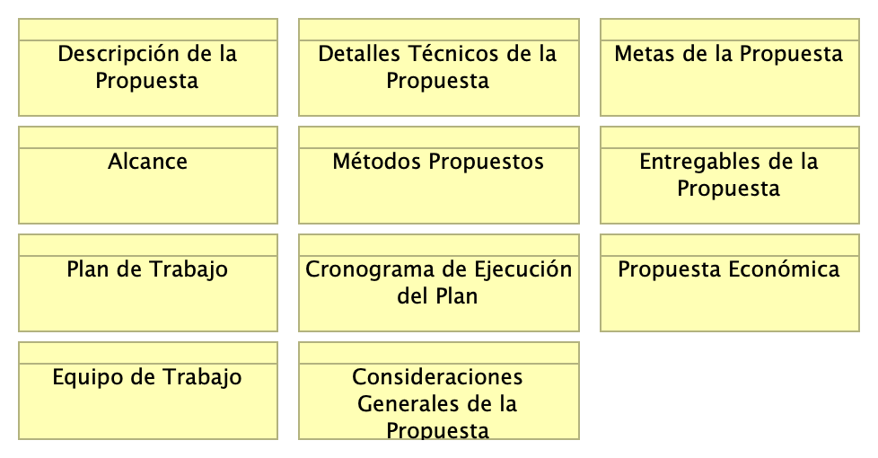
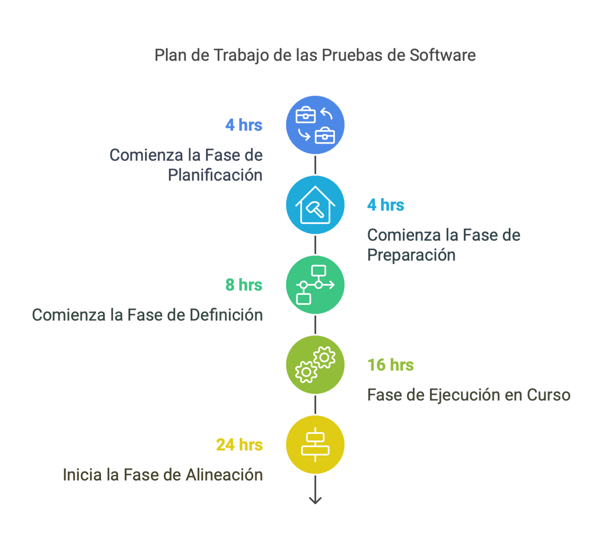
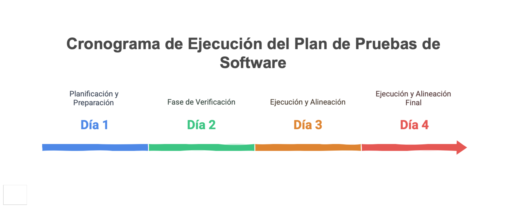

# Contenido
* [Información del Documento](#información-del-documento)
* [(borrador) Propuesta de Certificación Operativa Plataforma de Software Trii.co (borrador)](#borrador-propuesta-de-certificación-operativa-plataforma-de-software-trii.co-borrador)
* [Anexos](#anexos)
* [Lista de Imágenes](#lista-de-imágenes)

\newpage

# Información del Documento

## Versión del Documento

> 

 

---
title: Propuesta de Certificación Operativa Plataforma de Software Trii.co (borrador)
subtitle: Borrador
subject: Implementación Proyecto
author: 
date: 2025-01-15
keywords: [Rendimiento, Métodos pruebas, Pruebas software, QA]
header-right: 
geometry:
  - top=1.3in
  - bottom=1in
fignos-cleveref: True
fignos-plus-name: Fig.
fignos-caption-name: Imagen
tablenos-caption-name: Tabla
...

## Control de Cambios
Historia de cambios de la propuesta.

Versión actual: 
1.198992c - Compilación para entrega - Fri, 17 Jan 2025 18:27:42 +0000

Versiones Anteriores

1.a6aa09b - action - Fri, 17 Jan 2025 12:35:23 -0500

1.c1007c9 - Compilación para entrega - Fri, 17 Jan 2025 17:30:09 +0000

1.dbdb1a3 - carpeta - Fri, 17 Jan 2025 17:28:39 +0000

1.96dde2a - carpeta - Fri, 17 Jan 2025 17:23:51 +0000

### Realizado Por
H. Wong, ing.

### Revisado Por
(revisor), Trii.co

---
lang: en
titlepage: true
titlepage-rule-color: 360049
...

\newpage

# (borrador) Propuesta de Certificación Operativa Plataforma de Software Trii.co (borrador)

## Componentes de la Propuesta

> 

 

{#fig:id-dd2f1c1c1816447380fe900b66faa8bc width= height=500px}

### Descripción de la Propuesta
Informe de refrendo operativo de la plataforma Trii.co mediante plan de pruebas de rendimiento de software consignados en la actual propuesta.

### Detalles Técnicos de la Propuesta
Esta propuesta contienen los siguientes componentes técnicos.

- Metas del proyecto e interesados
- Alcance
- Métodos
- Entregables
- Plan de Trabajo y cronograma propuesto
- Consideraciones, costos y restricciones

### Metas de la Propuesta

1. En cuanto al método de la propuesta: presentar un plan de pruebas de rendimiento suficiente y acotado a la corroboración operativa en términos de rendimiento exigida a la plataforma Trii.co
1. En cuanto a la necesidad: alinear el plan de pruebas de rendimiento con los condiciones requeridas de tiempo y entregables resultantes con las exigencias de los interesados de la propuesta

### Alcance

1. Planificación. Período inicial de definición y acuerdos de los objetivos puntuales de las pruebas de rendimiento de la plataforma Trii.co.
1. Preparación. Lista de chequeo de estado de los entornos de trabajo disponibles de la plataforma Trii.co: hardware, software, redes, accesos, y permisos/equipo de trabajo.
1. Alistamiento. Chequeo del estado y disponibilidad del plano de datos de entrada y de los recursos disponibles de las pruebas.
1. Definición. Confirmación del diseño de los escenarios del tipo de pruebas consignadas en la propuesta. Identificación de otras dependencias.
1. Verificación. Establecer los criterios y umbrales de aceptación del tipo de pruebas consignadas en la propuesta.
1. Ejecución. Aseguramiento y ejecución del plan de pruebas consignado en esta propuesta.
1. Alineación. Contrastar el resultado de las pruebas consignadas en esta propuesta con las metas también aquí definidas.

### Exclusiones del Alcance
La presenta propuesta no incluye: 

1. Por restricciones de tiempo, la actual propuesta no incluye análisis ni recomendaciones de diseño/arquitectura
1. No incluye plan de capacidad / proyección de uso infraestructura futura

### Métodos Propuestos

Lista de métodos aplicables a la propuesta seleccionados en función de los objetivos trazados.

1. Marco de Trabajo Proceso de Pruebas Ágiles Testfully
1. Método de Pruebas en V (v-model): Verificación y Validación
1. Técnicas de Pruebas Dinámicas
1. Tipo de Pruebas: no funcionales
1. Alineación Comprobable de Criterios de Interesados
1. Aplicación del Principio de Observabilidad
1. Resultados de Prueba de Una-Página

### Entregables de la Propuesta

1. Informe de línea base del rendimiento de la plataforma Trii.co/
1. Informe ejecutivo de refrendo de la plataforma Trii.co.
1. Informe técnico de las pruebas de rendimiento de la plataforma Trii.co.

### Plan de Trabajo

1. Planificación, 4 hrs
1. Preparación, 4 hrs
1. Alistamiento, 8 hrs o menos (*)
1. Definición, 8 hrs (*)
1. Verificación, 4 hrs 
1. Ejecución, 16 hrs
1. Alineación, 8 hrs

{#fig:plan width=500}

### Cronograma de Ejecución del Plan

1er día, actividades en paralelo
- Planificación, 4 hrs
- Preparación. 4 hrs
- Alistamiento. 8 hrs o menos (*)

2do día, actividades en paralelo
- Definición. 8 hrs (*)
- Verificación. 4 hrs 

3er día, actividades en paralelo
- Ejecución. 8 hrs
- Alineación. 4 hrs

4to día, actividades en paralelo
- Ejecución. 8 hrs
- Alineación. 4 hrs

{#fig:cronograma width=300}

### Propuesta Económica

La presente propuesta, en los términos consignados aquí, presenta el costo de

| Ítem                                                | Costo      | Impuestos |
|:----------------------------------------------------|:-----------|:----------|
| Definición, ejecución y entregables plan de pruebas | $/.4'945.000,oo COP | Sí        |

Nota: los valores del costo de la propuesta se mantienen durante los siguientes 3 días laborales luego de su presentación a los interesados.

### Forma de Pago de la Propuesta

| Pagos        | Fracción | Hito del Plan              |
|:-------------|:---------|:---------------------------|
| Primer pago  | 50%      | Planificación, Preparación |
| Segundo pago | 50%      | Ejecución                  |

### Equipo de Trabajo

| Recurso                                | Cant. | Participación | Observaciones   |
|:---------------------------------------|:------|:--------------|:----------------|
| Especialista encargado plan de pruebas | 1     | 100%          |                 |
| Ingeniero apoyo a las pruebas          | 1     | 2 días        | Interno cliente |

Nota: por las restricciones de ejecución conocidas al momento de la realización de esta propuesta es requerido un apoyo interno de la empresa cliente Trii.co con la participación indicada en la tabla.

### Consideraciones Generales de la Propuesta

1. Forma de pago de la propuesta: 50% al inicio, 50% al final, contraentrega.
1. Por las restricciones propias de proyecto, requiere apoyo de un ingeniero interno de la empresa, dedicado el 50% de la duración del plan.
1. Las estimaciones de costo, esfuerzo, tiempo, y planeación son aproximadas, y representan la intención de la propuesta con la información conocida por las partes al momento de su realización.
1. Las extensiones en los entregables, o cambios a la propuesta se acordarán en definición y extensión por separado.
1. La tarifa de los controles de cambio de la propuesta es de $/. 120.000 COP la hora. Incluye impuestos.

---
lang: en
titlepage: true
titlepage-rule-color: 360049
...

\newpage

# Anexos

\newpage

# Lista de Imágenes

## Cronograma de Trabajo

> undefined  

 

{#fig:id-c25995aaf9a249059f91f586acdbec41 width= height=500px}

---
lang: en
titlepage: true
titlepage-rule-color: 360049
...

## Plan de Trabajo

> undefined  

 

{#fig:id-49930878d254405eba38b006b1b9f180 width= height=500px}

---
lang: en
titlepage: true
titlepage-rule-color: 360049
...

