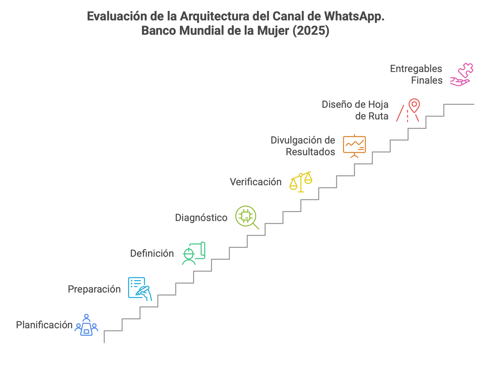
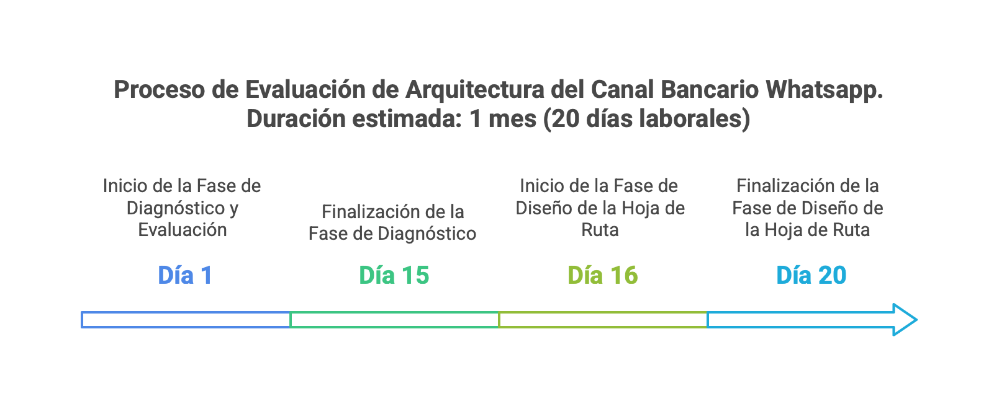

\newpage

# Información del Documento

Esta es la doc del grupo.

## Versión del Documento

> 

 

---
title: Propuesta de Servicios Banco Mundo Mujer
subtitle: Evaluación y Hoja de Ruta de la Arquitectura del Canal Bancario Whatsapp
subject: Proyecto de Evaluación y Hoja de Ruta Arquitectura
author: SoftProductiva.com
date: 2025-01-20
keywords: [Arquitectura, Evaluación, Diseño, Hoja de ruta, Transición]
geometry:
  - top=1.3in
  - bottom=1in
  - left=1in
  - right=1in
fignos-cleveref: True
fignos-plus-name: Fig.
fignos-caption-name: Imagen
tablenos-caption-name: Tabla
titlepage-background: include/background2.pdf
titlepage-logo: include/logo.png
logo-width: 60mm
listings-no-page-break: true
...

## Control de Cambios
Historia de cambios de la propuesta.

Versión actual: 
1.1ee976b - pdfyml - Mon, 17 Mar 2025 06:03:02 -0500 

Versiones Anteriores

1.1b82157 - pdfyml - Mon, 17 Mar 2025 05:58:14 -0500

1.54a0299 - accion - Mon, 17 Mar 2025 05:33:46 -0500

1.025ce99 - contd/ruta - Sat, 8 Mar 2025 00:22:40 -0500

1.3a8fbed - titulo - Fri, 14 Feb 2025 13:17:17 -0500

### Realizado Por
H. Wong, ing.

### Revisado Por
(revisor), Canal Bancario Whatsapp

El Miedo a la Política (Superar)
	A. Laje (2024). Globalismo. (Extracto. Pág. 551)

---
lang: en
titlepage: true
titlepage-rule-color: 360049
...

\newpage

# Servicios de Ingeniería Canal Bancario Whatsapp Banco Mundial de la Mujer

## Descripción de la Propuesta

> 

 

Consultoría de ingeniería y mejoramiento del canal bancario textual Whatsapp del Banco Mundo Mujer (BMM), con extensión a sistemas externos, legados y proveedores tecnológicos relacionados con la arquitectura del canal.

---
lang: en
titlepage: true
titlepage-rule-color: 360049
...

## Detalles Técnicos de la Propuesta

> 

 

Esta propuesta contienen los siguientes componentes técnicos.

- Metas del proyecto
- Alcance
- Métodos
- Entregables
- Plan de trabajo
- Propuesta económica
- Consideraciones y restricciones

---
lang: en
titlepage: true
titlepage-rule-color: 360049
...

## Metas de la Propuesta

> 

 

1. **Diagnóstico**. Hallazgos relevantes de la arquitectura del Canal Bancario Whatsapp. Presentar puntos de cambios relevantes resultado del análisis de la arquitectura de solución actual del canal de banca Whatsapp (chat) del Banco Mundial de la Mujer categorizados en varias perspectivas, como la funcional, técnica y operativa.
1. **Hoja de Ruta**. Lista de cambios y gestión de cambios de la de la arquitectura del Canal Bancario Whatsapp**. Desarrollar la hoja de ruta de los cambios derivados del objetivo no. 1, Hallazgos relevantes de la arquitectura, con una priorización planteada mediante criterio críticos de factibilidad e impacto a Banco Mundial de la Mujer.

---
lang: en
titlepage: true
titlepage-rule-color: 360049
...

## Alcance

> 

 

1. Diagnóstico. Evaluación de la arquitectura del Canal Bancario Whatsapp del Banco Mundial de la Mujer que resulta en puntos de cambios accionables de la arquitectura del Canal Bancario Whatsapp. 
1. Diseño de hoja de ruta de transformación. Planteamiento de transición de la arquitectura del Canal Bancario Whatsapp mediante lista de cambios priorizados sobre la arquitectura del canal.

### Exclusiones del Alcance
La presenta propuesta no incluye: 

1. Por restricciones de tiempo, la actual propuesta no incluye análisis ni recomendaciones de diseño a arquitectura distintas a las del Canal Bancario Whatsapp.
1. No incluye plan de capacidad ni proyección de uso infraestructura futura de la arquitectura del Canal Bancario Whatsapp.
1. No incluye la provisión de infraestructura para las soluciones derivadas de este proyecto.
1. No incluye soporte ni mantenimiento posterior a la realización de este proyecto.

---
lang: en
titlepage: true
titlepage-rule-color: 360049
...

## Método Propuesto

>   

 

1. Planificación. Período inicial de definición y acuerdos de los objetivos puntuales de las evaluación de la arquitectura del Canal Bancario Whatsapp.
1. Preparación y Alistamiento. Lista de chequeo de recursos, personas y procesos relacionadas con las vistas de arquitectura del Canal Bancario Whatsapp, como las vistas funcional, técnica, despliegues, y otras.
1. Definición. Confirmación del diseño de los escenarios de evaluación de la arquitectura del Canal Bancario Whatsapp. Identificación de otras dependencias entre escenarios.
1. Diagnóstico. Profundización del detalle de la información, ejecución de los métodos seleccionados para la evaluación de la arquitectura, y documentación reproducible de los resultados.
1. Verificación. Contrastar el resultado preliminar de los escenarios de evaluación de la arquitectura del Canal Bancario Whatsapp contra el método de evaluación.
1. Divulgación de Resultados y Entregables. (luego de la verificación) Explicar el resultado general de la evaluación de los escenarios de la arquitectura del Canal Bancario Whatsapp y discrepancias con umbrales de aceptación.
1. Diseño de Hoja de Ruta. Preparación, alistamiento y priorización de las transiciones de la arquitectura del Canal Bancario Whatsapp (hoja de ruta).
1. Divulgación de Resultados y Entregables Finales. Compilación de artefactos, documentación técnica y divulgación de conocimiento del resultado de diagnóstico y de la hoja de ruta priorizada de la arquitectura del Canal Bancario Whatsapp.

{#fig:id-ecb3efe1a4e14dd389ece75370f1861c width= height=}

---
lang: en
titlepage: true
titlepage-rule-color: 360049
...

## Entregables de la Propuesta

> 

 

1. Evaluación de la arquitectura del Canal Bancario Whatsapp del Banco Mundial de la Mujer. Listado de hallazgos relevantes y accionables de la arquitectura desde las perspectivas rendimiento, funcional-negocio, y operativa (esta perspectiva incluye a los métodos de construcción, pruebas y transición).
1. Hoja de ruta de las cambios requeridos y transformaciones para el mejoramiento de la arquitectura de Canal Bancario Whatsapp. Instrumento para la gestieon de cambios priorizados y planeación de la entrega de las transición de la arquitectura de Canal Bancario Whatsapp del Banco Mundial de la Mujer.

---
lang: en
titlepage: true
titlepage-rule-color: 360049
...

\newpage

# Aspectos Técnicos de la Propuesta

## Plan de Trabajo

>   

 

El plan de trabajo propuesto consta de dos fases consecutivas que inician a partir de la aceptación y formalización de la actual propuesta. La Fase I, llamada en esta propuesta el diagnóstico y evaluación de la arquitectura; y la Fase II, destinada al diseño de la hoja de ruta de transformación de la arquitectura del Canal Bancario Whatsapp. 

En detalle cada fase del proyecto:

1. Día 1 al 15. Diagnóstico y evaluación de la arquitectura del Canal Bancario Whatsapp, incluye planificación, preparación, diagnóstico, documentación técnica, y divulgación: estimada en 15 días de trabajo.

1. Día 16 al 20. Diseño de hoja de ruta de transformación de la arquitectura del Canal Bancario Whatsapp, incluye diseño de hoja de ruta, ejecución transiciones, gestión de cambios, documentación técnica, divulgación: estimada en 5 días de trabajo.

## Plazo de Ejecución
Por lo anterior, el total de la duración del proyecto es de un (1) mes laboral.

{#fig:id-650dca2ba0114dca99ad6302b8ed6dc7 width= height=}

---
lang: en
titlepage: true
titlepage-rule-color: 360049
...

## Propuesta Económica

> 

 

A la presente propuesta, en los términos consignados aquí, le corresponde la siguiente propuesta económica.

| Ítem                                           | Valor (COP $/.) | IVA (19%)    | Total        |
|------------------------------------------------|-----------------|--------------|--------------|
| Evaluación y hoja de ruta de arquitectura Canal Bancario Whatsapp | $ 62'000,000    | $ 11'400.000 | $ 71'400.000 |
| Descuento del 10% Cliente Primera Vez          | $ 6.000.000     | $ 1.140.000  | $ 7.140.000  |
| TOTAL                                          | $ 54.000.000    | $ 10.260.000 | $ 64.260.000 |

Nota: los valores del costo de la propuesta se mantienen durante los siguientes 10 días laborales luego de su presentación a los interesados.

### Forma de Pago de la Propuesta

| Pagos        | Fracción | Hito del Plan                 |
|:-------------|:---------|:------------------------------|
| Primer pago  | 50%      | Evaluación de la arquitectura |
| Segundo pago | 50%      | Hoja de Ruta Priorizada       |

---
lang: en
titlepage: true
titlepage-rule-color: 360049
...

## Equipo de Trabajo

> 

 

El equipo de trabajo requerido para el cumplimiento del alcance, metas y entregables de la actual propuesta será provisto por el proponente.

Por las restricciones de ejecución usuales en este tipo de proyectos es requerido apoyo interno de la empresa cliente del Canal Bancario Whatsapp. 

El nivel de participación en el proyecto y el rol del recurso interno se acuerdan a conveniencia de las partes, cliente y proponente.

---
lang: en
titlepage: true
titlepage-rule-color: 360049
...

## Consideraciones Importantes

> 

 

1. Forma de pago de la propuesta: 50% al final del primer entregables, 50% al final del segundo entregable.
1. Por las restricciones propias de proyecto la ejecución de este proyecto requiere apoyo de un ingeniero interno de la empresa, dedicado el tiempo convenido entre las partes.
1. Las estimaciones de costo, esfuerzo, tiempo, y planeación son aproximadas, y representan la intención de la propuesta basada en la información conocida por las partes al momento de su realización.
1. Las extensiones en los entregables, o cambios a la propuesta se acordarán en definiciones y extensiones por separado.

---
lang: en
titlepage: true
titlepage-rule-color: 360049
...

\newpage

# Resumen de la Propuesta

##  

> 

 

* El resultado del proyecto es el diagnóstico y la lista de cambios priorizados sobre la arquitectura del Canal Bancario Whatsapp, la divulgación de los cambios y la documentación técnica
* La duración del proyecto es de un (1) mes de trabajo (días laborales).
* El equipo de trabajo propuesto será provisto por el proponente.
* El valor económico de la propuesta es $64.260.000 COP, IVA incluido.
* Esta propuesta no incluye recomendaciones de diseño, intervenciones a  sistemas distintos de los consignados en el alcance, ni servicios de infraestructura, ni soporte posterior al presente proyecto.
* Requiere apoyo de ingenieros y personal interno de la empresa, nivel de participación acordado entre las partes.
* Una vez finalizada la ejecución de esta propuesta (no. 1), según acuerdo de continuidad, realizaremos una nueva para el desarrollo de la solución de los casos consignados en la hoja de ruta (propuesta no. 1).

---
lang: en
titlepage: true
titlepage-rule-color: 360049
...

