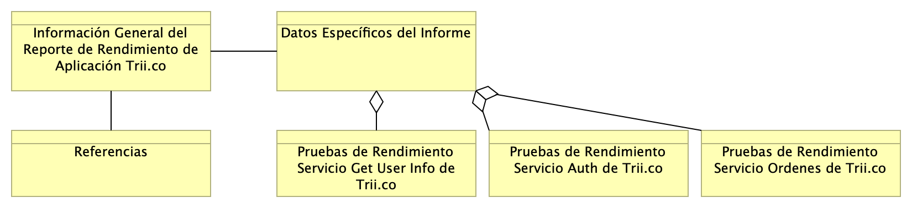

# Contenido
* [Información del Documento](#información-del-documento)
* [Informe Operativo Plataforma de Software Trii.co](#informe-operativo-plataforma-de-software-trii.co)
* [Evaluación del Rendimiento](#evaluación-del-rendimiento)
* [Resultados y Conclusiones del Informe de Rendimiento](#resultados-y-conclusiones-del-informe-de-rendimiento)
* [Anexos Técnicos](#anexos-técnicos)
* [Glosario](#glosario)

\newpage

# Información del Documento

## Versión del Documento

> 

 

---
title: Certificación Operativa Plataforma de Software Trii.co
subtitle: Informe Técnico
subject: Implementación Proyecto
author: SoftProductiva.com
date: 2025-01-20
keywords: [Rendimiento, Métodos pruebas, Pruebas software, QA]
geometry:
  - top=1.3in
  - bottom=1in
  - left=0.7in
  - right=0.7in
fignos-cleveref: True
fignos-plus-name: Fig.
fignos-caption-name: Imagen
tablenos-caption-name: Tabla
titlepage-background: include/background.pdf
titlepage-logo: include/logo.png
logo-width: 60mm
listings-no-page-break: true
...

## Control de Cambios
Historia de cambios del informe.

Versión actual: 
1.383ab1e - Compilación para entrega - Wed, 22 Jan 2025 22:02:31 +0000

Versiones Anteriores

1.d8b1b11 - docx - Wed, 22 Jan 2025 14:48:05 -0500

1.67b54b6 - Compilación para entrega - Tue, 21 Jan 2025 23:42:45 +0000

1.c672547 - Compilación para entrega - Tue, 21 Jan 2025 23:32:27 +0000

1.70c7b82 - Compilación para entrega - Tue, 21 Jan 2025 23:19:17 +0000

### Realizado Por
H. Wong, ing.

### Revisado Por
(revisor), Trii.co

---
lang: en
titlepage: true
titlepage-rule-color: 360049
...

\newpage

# Informe Operativo Plataforma de Software Trii.co

## Componentes del Informe de Rendimiento y Capacidad de la Plataforma Trii.co

> 

 

{#fig:id-04abc8f16f354757a52791da825e4049 width= height=}

### Información General del Reporte de Rendimiento de Aplicación Trii.co
* Nombre de la Aplicación/Sistema Probado: Servicios de Ordenes, Auth, y User Info de la Aplicación Trii.co
* Versión de la Aplicación/Sistema: Versión 2025
* Entorno de Pruebas: infraestructura en la nube, Google Cloud, 2nd generation machine series, General-purpose workloads E2 serie, CPU Intel. Tipo de equipo: highmem, 7-14 GB.
* Fecha/Periodo de Pruebas: 15 de enero del 2025.
* Objetivos de las Pruebas: 
    * Encontrar la capacidad de los servicios Servicios Ordenes, Auth, y User Info de la Aplicación por separado en número máximo de operaciones o transacciones de los servicios por unidad de tiempo.
    * Encontrar el nivel de estabilidad de los servicios Servicios Ordenes, Auth, y User Info (tensión) de la Aplicación.
    * Dar pautas alrededor del estrés o tensión de los servicios Servicios Ordenes, Auth, y User Info de la Aplicación por separado para determinar la holgura respecto a la demanda esperada.
* Métricas Clave: 
    * Capacidad (throughput) de los servicios Servicios Ordenes, Auth, y User Info 
    * Estrés (tensión) de los servicios Servicios Ordenes, Auth, y User Info
    * Estabilidad (Uso de CPU) de los servicios Servicios Ordenes, Auth, y User Info
Herramienta de Pruebas: K6, de Grafana Labs.

### Datos Específicos del Informe
Descripción detallada de los casos de uso o flujos de usuario simulados de los servicios de Trii probados.

### Pruebas de Rendimiento Servicio Get User Info de Trii.co
El servicio Get User Info (user info) obtiene datos de trabajo del cliente previo a la orden. Requiere como mínimo actividades de autenticación, y es responsable de alimentar al servicio Ordenes.

Carga de Usuarios: Cantidad de usuarios virtuales concurrentes simulados, máximo 60. 
Duración de las Pruebas: Tiempo durante el cual se ejecutaron las pruebas, mínimo 10 minutos.

#### Resultados Medidos
Ejecución del escenario de pruebas de rendimiento descrito a continuación del servicio Get User Info (user info) de la plataforma Trii.co.

> Escenarios: (100.00%) 1 scenario, 60 max VUs, 10m30s max duration (incl. graceful stop):
> 
> *default: Up to 60 looping VUs for 10m0s over 5 stages (gracefulRampDown: 30s, gracefulStop 30s)
> 
> logged_in_successfully
> 
> is_status_200

|                        |                |                    |                |                |              |
|------------------------|----------------|--------------------|----------------|----------------|--------------|
| checks                 | 100.00%        | 57632 out of 57632 |                |                |              |
| data_received          | 93 MB          | 155 kB/s           |                |                |              |
| data_sent              | 14 MB          | 23 kB/s            |                |                |              |
| http_req_blocked       | avg=146.22µs   | min=0s             | p(95)=0s       | p(90)=0s       | max=138.39ms |
| http_req_connecting    | avg=51.45µs    | min=0s             | p(95)=0s       | p(90)=0s       | max=2.39s    |
| http_req_duration      | avg=349.97ms   | min=184.86ms       | p(95)=849.58ms | p(90)=786.74ms | max=2.39s    |
| { expected_response:tr | avg=349.97ms   | min=184.86ms       | p(95)=849.58ms | p(90)=786.74ms | max=2.39s    |
| http_req_failed        | 0.00%          | 0/57632            |                |                |              |
| http_req_receiving     | avg=164.45µs   | min=0s             | p(95)=1.53ms   | p(90)=546.29µs | max=359.57ms |
| http_req_sending       | avg=66.37µs    | min=0s             | p(95)=513.59µs | p(90)=0s       | max=2.41ms   |
| http_req_tls_handshaki | avg=138.25µs   | min=0s             | p(95)=0s       | p(90)=0s       | max=2.39s    |
| http_req_waiting       | avg=349.74ms   | min=184.86ms       | p(95)=849.2ms  | p(90)=786.62ms | max=2.39s    |
| http_reqs              | 57632          | 960.294772/s       |                |                |              |
| iteration_duration     | avg=708.46ms   | min=293.83ms       | p(95)=1.15s    | p(90)=987.68ms | max=2.52s    |
| iterations             | 28816          | 479.944772/s       |                |                |              |
| login_response_times   | avg=136.021551 | min=104            | p(95)=177      | p(90)=163      | max=296      |
| login_success_rate     | 100.00%        | 28816 out of 28816 |                |                |              |
| requests_sent          | 57632          | 95.929047/s        |                |                |              |
| user_info_response_tim | avg=564.321835 | min=178            | p(95)=1027     | p(90)=849      | max=2399     |
| user_info_success_rate | 100.00%        | 28816 out of 28816 |                |                |              |
| vus                    | 59             | min=1              |                |                |              |
| vus_max                | 60             | min=60             |                |                |              |

> Running (10m00.8s), 00/60 VUs, 28816 completed and 0 interrupted iterations
> 
> default OK: 00/60 VUs 10m0s

#### Valores Numéricos

Promedio por transacción, tiempo máximo, mínimo, y percentiles de las métricas. Tomado del mayor entre http_req_duration e iteration_duration.
 
> Tiempo máximo de la transacción (iteración): max=2.52s
> 
> Tiempo promedio: avg=708.46ms
> 
> Tiempo mínimo: min=293.83ms 
> 
> Percentiles 90 y 95 duración iteración: p(90)=987.68ms; p(95)=1.15s
> 
> Cantidad de transacciones/segundo (capacidad o throughput): 57632 total; 95.929047/s
> 
> Estabilidad o Tasa de éxito de transacción (promedio entre dos servicios, login y user_info): 100.00%; 28816 de 28816 procesados

#### Desviaciones

Comportamiento inesperado o desviaciones significativas de los valores esperados.

Con base en los tiempos de latencia cercanos al tiempo de transacción y la alta la tasa de éxito de transacción, no hay evidencia de desviaciones.

> Latencia promedio: avg=349.74ms 
> 
> Latencia máxima: max=2.39s
> 
> Estabilidad o Tasa de éxito de transacción (promedio entre dos servicios, login y user_info): 100.00%; 28816 de 28816 procesados

#### Análisis de Cuellos de Botella

Identificación de componentes o procesos que limitaron el rendimiento.
 
Con base en los tiempos de rendimiento (capacidad o throughput) y la alta la tasa de éxito de la transacción, no es posible señalar un cuello de botella.
 
> Cantidad de transacciones/segundo (capacidad o throughput iteración): 57632 total; 95.929047/s
>
> Estabilidad o Tasa de éxito de transacción (promedio entre dos servicios, login y user_info): 100.00%; 28816 de 28816 procesados

#### Limitaciones

Con base en las 28816 iteraciones completadas y 0 interrumpidas, no hubo limitaciones o condiciones conocidas durante las pruebas que podrían afectar los resultados.
 
> Calidad de la prueba: 28816 iteraciones completadas; 0 interrumpidas

### Pruebas de Rendimiento Servicio Login Auth de Trii.co
El servicio Login (auth) es responsable de dar inicio a una sesión de trabajo de un cliente Trii. Realiza como mínimo la provisión de datos necesarios a otros servicios respecto de la verificación y creación de una sesión de trabajo válida.

Carga de Usuarios: Cantidad de usuarios virtuales concurrentes simulados, máximo 60.
Duración de las Pruebas: Tiempo durante el cual se ejecutaron las pruebas, mínimo 10 minutos.

#### Resultados Medidos
Ejecución del escenario de pruebas de rendimiento descrito a continuación del servicio Login (auth) de la plataforma Trii.co.

> Escenarios: (100.00%) 1 scenario, 60 max VUs, 10m30s max duration (incl. graceful stop):
>
> *default: Up to 60 looping VUs for 10m0s over 5 stages (gracefulRampDown: 30s, gracefulStop: 30s)
>
> logged_in_successfully

|                         |                 |                      |                |                |             |
|-------------------------|-----------------|----------------------|----------------|----------------|-------------|
| checks                  | 100.00%         | 113667 out of 113667 |                |                |             |
| data_received           | 57 MB           | 93 kB/s              |                |                |             |
| data_sent               | 21 MB           | 35 kB/s              |                |                |             |
| http_req_blocked        | avg=37.58µs     | min=9s               | p(95)=0s       | p(90)=0s       | max=92.67ms |
| http_req_connecting     | avg=1.35µs      | min=0s               | p(95)=0s       | p(90)=0s       | max=3.66ms  |
| http_req_duration       | avg=177.22ms    | min=105.54ms         | p(95)=315.41ms | p(90)=261.69ms | max=3.67s   |
| { expected_response: tr | avg=177.22ms    | min=105.54ms         | p(95)=315.41ms | p(90)=261.69ms | max=3.67s   |
| http_req_failed         | 0.00%           | 0 out of 113677      |                |                |             |
| http_req_receiving      | avg=82.42µs     | min=9s               | p(95)=150.5µs  | p(90)=55.2µs   | max=71.71ms |
| http_req_sending        | avg=82.9µs      | min=9s               | p(95)=569.37µs | p(90)=0s       | max=2.76ms  |
| http_req_tls_handshakin | avg=36.3µs      | min=0s               | p(95)=0s       | p(90)=0s       | max=87.34ms |
| http_req_waiting        | avg=176.98ms    | min=105.54ms         | p(95)=315.16ms | p(90)=261.41ms | max=3.67s   |
| http_reqs               | 113677          | 189.19272/s          |                |                |             |
| iteration_duration      | avg=177.38ms    | min=105.71ms         | p(95)=315.52ms | p(90)=261.84ms | max=3.67s   |
| iterations              | 113677          | 189.19272/s          |                |                |             |
| login_response_times    | avg=177.3086641 | min=105              | p(95)=316      | p(90)=262      | max=3675    |
| login_success_rate      | 100.00%         | 113677 out of 113677 |                |                |             |
| requests_sent           | 113677          | 189.19272/s          |                |                |             |
| vus                     | 59              | min=1                |                |                |             |
| vus_max                 | 60              | min=60               |                |                |             |

> Running (10m00.2s), 00/60 VUs, 1136777 completed and 0 interrupted iterations
>
> default OK: 00/60 VUs 10m0s

#### Valores Numéricos

Promedio por transacción, tiempo máximo, mínimo, y percentiles de las métricas. Tomado del mayor entre http_req_duration e iteration_duration.
 
> Tiempo máximo de la transacción (iteración): max=3.67s
>
> Tiempo promedio: avg=177.38ms
>
> Tiempo mínimo: min=105.71ms
>
> Percentiles 90 y 95 duración iteración: p(90)=261.84ms; p(95)=315.52ms
>
> Cantidad de transacciones/segundo (capacidad o throughput): 113677 total; 189.19272/s
>
> Estabilidad o Tasa de éxito de transacción: 100.00%; 113677 de 113677 procesados

Nota: el tiempo máximo de transacción, si bien es mayor a 3s, es aún eficiente debido al tipo de transacción, en este caso de autenticación, que no compromete al valor del negocio de Trii. Más aún, que el promedio en este caso no es representativo de la muestra, como sí lo es el valor del percentil 95: p(95)=315.52ms por transacción.

#### Desviaciones

Comportamiento inesperado o desviaciones significativas de los valores esperados.
 
Con base en los tiempos de latencia cercanos al tiempo de transacción y la alta la tasa de éxito de transacción, no hay evidencia de desviaciones.
 
> Latencia promedio: avg=176.98ms
>
> Latencia máxima: max=3.67s; p(95)=315.52ms
>
> Estabilidad o Tasa de éxito de transacción: 100.00%; 113677 de 113677 procesados

Nota: el tiempo máximo de latencia, si bien es mayor a 3s, es aún eficiente debido al tipo de transacción, en este caso de autenticación, que no compromete al negocio de Trii. Más aún, que el promedio en este caso no es representativo de la muestra, como sí lo es el valor del percentil 95: p(95)=315.52ms por transacción.

#### Análisis de Cuellos de Botella

Identificación de componentes o procesos que limitaron el rendimiento.
 
> Latencia máxima: max=3.67s
>
> Latencia promedio: avg=176.98ms

Nota: con base en la diferencia entre la latencia máxima y la promedio es posible señalar afectación de recursos de la transacción debido a la concurrencia de los VU (60, para este escenario).

Aún así, por los tiempos de rendimiento (capacidad o throughput) y la alta la tasa de éxito de la transacción, no es posible señalar que la posibilidad del cuello de botella en el servicio Auth sea incidente en el negocio de Trii. Dicho de otra manera, la transacción es resiliente a pesar de las afectaciones por concurrencia.

 > Cantidad de transacciones/segundo (capacidad o throughput): 113677 total; 189.19272/s
 >
 > Estabilidad o Tasa de éxito de transacción: 100.00%; 113677 de 113677 procesados

#### Limitaciones

> No hubo limitaciones o condiciones conocidas durante las pruebas que podrían afectar los resultados.

### Pruebas de Rendimiento Servicio Ordenes de Trii.co
El servicio Ordenes es el más relevante para el negocio de Trii. Realiza como mínimo actividades de creación de una orden de negocio, que es la entidad de información superlativa de la plataforma.

Carga de Usuarios: Cantidad de usuarios virtuales concurrentes simulados, máximo 60.
Duración de las Pruebas: Tiempo durante el cual se ejecutaron las pruebas, mínimo 10 minutos.

#### Resultados Medidos
Ejecución del escenario de pruebas de rendimiento descrito a continuación del servicio Ordenes de la plataforma Trii.co.

> Escenarios: (100.00%) 1 scenario, 60 max VUs, 10m30s max duration (incl. graceful stop):
>
> *default: Up to 60 looping VUs for 10m0s over 5 stages (gracefulRampDown: 30s, gracefulStop: 30s)
> 
> logged_in_successfully
>
> is_status_200
>
> 86%: OK 9881 / ERR 1506

|                        |                 |                    |                |              |             |
|------------------------|-----------------|--------------------|----------------|--------------|-------------|
| checks                 | 93.38%          | 21268 out of 22774 |                |              |             |
| data_received          | 11 MB           | 19 kB/s            |                |              |             |
| data_sent              | 7.5 MB          | 13 kB/s            |                |              |             |
| failed_transactions    | avg=1           | min=1              | p(95)=1        | p(90)=1      | max=1       |
| http_req_blocked       | avg=359.1µs     | min=0s             | p(95)=8s       | p(90)=8s     | max=98.53ms |
| http_req_connecting    | avg=216.56µs    | min=0s             | p(95)=0s       | p(90)=0s     | max=16.6s   |
| http_req_duration      | avg=888.53ms    | min=197.84ms       | p(95)=2.7s     | p(90)=2.21s  | max=16.6s   |
| { http_req_response:tr | avg=216.56µs    | min=0s             | p(95)=2.75s    | p(90)=2.26s  | max=16.6s   |
| http_req_failed        | 0.61%           | 1506 out of 22774  |                |              |             |
| http_req_receiving     | avg=130.7µs     | min=0s             | p(95)=573.02µs | p(90)=8s     | max=1.99ms  |
| http_req_sending       | avg=78.33µs     | min=0s             | p(95)=573.02µs | p(90)=8s     | max=1.99ms  |
| http_req_tls_handshaki | avg=284.26µs    | min=0s             | p(95)=0s       | p(90)=0s     | max=16.58s  |
| http_req_waiting       | avg=888.32ms    | min=197.84ms       | p(95)=2.7s     | p(90)=2.21s  | max=16.6s   |
| http_reqs              | 2052/s          | 22774              |                |              |             |
| iteration_duration     | avg=1.77s       | min=419.76ms       | p(95)=3.31s    | p(90)=2.83s  | max=16.74s  |
| iterations             | 11387           | 1025.73/s          |                |              |             |
| login_response_times   | avg=130.558435  | min=197            | p(95)=157      | p(90)=146    | max=333     |
| login_success_rate     | 188.889.111147  | 2.111147           |                |              |             |
| requests_sent          | 22774           | 77.71065/s         |                |              |             |
| successful_transaction | 9881            | 16.36504/s         |                |              |             |
| transaction_response_t | avg=1647.048309 | min=388            | p(95)=3178.7   | p(90)=2705.8 | max=16658   |
| vus                    | 60              | min=60             |                |              | max=60      |
| vus_max                | 60              | min=60             |                |              | max=60      |

 > Running (10m03.8s), 00/60 VUs, 11387 completed and 0 interrupted iterations
 >
 > default OK: 00/60 VUs 10m0s

Nota: el estado 200 (petición HTML exitosa) en las transacciones del servicio Ordenes representa además el estado de negocio; es decir, una transacción correctamente procesada por el sistema, y aceptada por las reglas de negocio, retorna el estado HTTP 200 en caso que no haya ocurrido una excepción de negocio. Esto es lo mismo decir que las transacciones con estado HTML distintas del 200 resultantes en este escenario de prueba, más precisamente fueron procesadas exitosamente por el sistema (procesadas sin fallos de sistema evidenciado en logs) aún cuando hubiesen caído en una regla o excepción de negocio.

#### Valores Numéricos

Promedio por transacción, tiempo máximo, mínimo, y percentiles de las métricas. Tomado del mayor entre http_req_duration e iteration_duration.
 
> Tiempo máximo de la transacción (iteración): max=16.74s; avg p(95/90)=4.49s
>
> Tiempo promedio: avg=1.77s; p(95)=3.31s
>
> Tiempo mínimo: min=419.76ms
>
> Percentiles 90 y 95 duración iteración: p(90)=2.83s; p(95)=3.31s
>
> Cantidad de transacciones/segundo (capacidad o throughput): 22774 total; 16.36504/s
>
> Estabilidad o Tasa de éxito de transacción (iteración): 100.00%; 11387 de 11387. De las cuales 86.00% Ordenes de Negocio (9881 de 11387) exitosas

Nota: el estado 200 (petición HTML exitosa) en las transacciones del servicio Ordenes representa además el estado de negocio; es decir, una transacción correctamente procesada por el sistema, y aceptada por las reglas de negocio, retorna el estado HTTP 200 en caso que no haya ocurrido una excepción de negocio. Esto es lo mismo decir que las transacciones con estado HTML distintas del 200 resultantes en este escenario de prueba, fueron procesadas exitosamente por el sistema (procesadas sin fallos de sistema evidenciado en logs) aún cuando hubiesen caído en una regla o excepción de negocio.

Nota: debido a la diferencia entre el tiempo promedio de la transacción y el percentil 95, el tiempo máximo de transacción no es representativo de la muestra. Tomaremos como valor máximo de la transacción de Ordenes al promedio de los percentiles 90 y 95, que es p(95/90)=4.49s.

Nota: el tiempo máximo de transacción (iteración) de Ordenes, si bien es mayor a 3s, es aún eficiente debido a la complejidad de la transacción y que no está comprometiendo al negocio de Trii evidenciado en la estabilidad del 100% de este servicio y en el percentil 95 de duración, que sí es representativo, y es de p(95)=3.31s por transacción.

#### Desviaciones

Comportamiento inesperado o desviaciones significativas de los valores esperados.

Con base en los tiempos de latencia cercanos al tiempo de transacción y la alta la tasa de éxito de transacción, no hay evidencia de desviaciones.

> Latencia promedio: avg=888.32ms; p(95)=2.7s
>
> Latencia máxima: max=16.6s; avg p(95/90)=3.8s
>
> Estabilidad o Tasa de éxito de transacción (iteración): 100.00%; 11387 de 11387. De las cuales 86.00% Ordenes de Negocio (9881 de 11387) exitosas

Nota: Debido a la diferencia entre la latencia promedio y su percentil 95, el tiempo máximo de latencia por transacción no es representativo de la muestra. Tomaremos como valor máximo de la latencia de Ordenes al promedio de los percentiles 90 y 95, que es p(95/90)=3.8s.

Nota: el tiempo máximo de latencia, si bien es mayor a 3s, es aún eficiente debido a la complejidad de la transacción Ordenes y no está comprometiendo al negocio de Trii evidenciado en la estabilidad del 100% de este servicio y en el percentil 95 de latencia, que sí es representativo, y es de p(95)=2.7s por transacción.

#### Análisis de Cuellos de Botella

Identificación de componentes o procesos que limitaron el rendimiento.

> Latencia máxima: max=16.6s; avg p(95/90)=3.8s
>
> Latencia promedio: avg=888.32ms; p(95)=2.7s

Nota: con base en la diferencia entre la latencia máxima y la promedio existe alta posibilidad de recursos de la transacción Ordenes afectados por la concurrencia de los VU (60, para este escenario).

Aún así, los tiempos de rendimiento (capacidad o throughput), 16.36504/s, y la tasa de éxito de la transacción, no es posible señalar que la posibilidad del cuello de botella esté afectando al negocio de Trii. Dicho de otra manera, la transacción Ordenes es resiliente a pesar de las afectaciones por concurrencia.

> Cantidad de transacciones/segundo (capacidad o throughput): 22774 total; 16.36504/s
> 
> Estabilidad o Tasa de éxito de transacción (iteración): 100.00%; 11387 de 11387. De las cuales 86.00% Ordenes de Negocio (9881 de 11387) exitosas

#### Limitaciones

En este escenario existieron limitaciones o condiciones conocidas del balance de Ordenes durante las pruebas que afectaron los resultados de las métricas de transacción exitosa.
 
> is_status_200
>
> 86%: OK 9881 / ERR 1506
>
> Estabilidad o Tasa de éxito de transacción (iteración): 100.00%; 11387 de 11387. De las cuales 86.00% Ordenes de Negocio (9881 de 11387) exitosas    

El estado 200 (petición HTML exitosa) en las transacciones del servicio Ordenes representa además el estado de negocio; es decir, una transacción correctamente procesada por el sistema, y aceptada por las reglas de negocio, retorna el estado HTTP 200 en caso que no haya ocurrido una excepción de negocio. Esto es lo mismo decir que las transacciones con estado HTML distintas del 200 resultantes en este escenario de prueba, fueron procesadas exitosamente por el sistema (procesadas sin fallos de sistema evidenciado en logs) aún cuando hubiesen caído en una regla o excepción de negocio.

### Referencias

1. Google (2025). Machine families resource and comparison guide.

    (Web) https://cloud.google.com/compute/docs/machine-resource

1. Grafana Labs (2025). Technical documentation. Grafana Cloud.

    (Web) https://grafana.com/docs/k6/latest/

1. Heusser M. (Sep 2019). How to achieve speedy application response times.

    (Web) https://www.techtarget.com/searchsoftwarequality/tip/Acceptable-application-response-times-vs-industry-standard

1. Nielsen, J. (1993). Usability Engineering. Response Times: The 3 Important Limits.

    (Web) https://www.nngroup.com/articles/response-times-3-important-limits/

---
lang: en
titlepage: true
titlepage-rule-color: 360049
...

\newpage

# Evaluación del Rendimiento

## Método de Evaluación del Rendimiento Actual de Trii.co

> 

 

### Criterios de Evaluación del Rendimiento Actual
| Prueba             | Svc     | Modalidad             | Criterio de Aceptación                                                                                                                     | Ambiente   |
|--------------------|---------|-----------------------|--------------------------------------------------------------------------------------------------------------------------------------------|------------|
| Login              | Auth    | Concurrente, Unitaria | Percentil petición exitosa 99.9. Tiempo de respuesta max 4 seg. Tasa procesamiento (throughput): Transacciones 2500 / hora y 40 / minuto   | Dev        |
| Get user info      | Auth    | Concurrente, Integral | Percentil petición exitosa 99.9. Tiempo de respuesta max 4 seg. Tasa procesamiento (throughput): Transacciones 2500 / hora y 40 / minuto   | Dev        |
| Fee                | Auth    | Concurrente, Integral | Percentil petición exitosa 99.9. Tiempo de respuesta max 4 seg. Tasa procesamiento (throughput): Transacciones 2500 / hora y 40 / minuto   | Dev        |
| Ingreso de órdenes | Órdenes | Concurrente, Integral | Percentil petición exitosa 99.9. Tiempo de respuesta max 4.5 seg. Tasa procesamiento (throughput): Transacciones 2500 / hora y 40 / minuto | Dev / Prod |

En donde:

* Transacciones diarias: 10000/d
* Transacciones / (10000 / 42500 / hora/h
* Transacciones / minuto: 40/m
* Transacciones / segundo: 4/s

---
lang: en
titlepage: true
titlepage-rule-color: 360049
...

\newpage

# Resultados y Conclusiones del Informe de Rendimiento

## Análisis de Resultados del Rendimiento y Capacidad

> 

 

### Resumen y Puntos Sobresalientes de los Resultados

1. Todos los servicios probados (auth, user_info, fee y  ordenes) pasaron los criterios de aceptación de estabilidad, tiempo de respuesta, y capacidad de cómputo (throughput). Pag. 14, Informe Técnico
1. El análisis de latencia del servicio de Ordenes indica una alta posibilidad de que exista un cuello botella, pero no afecta la estabilidad del servicio: cero (0) fallas en registro de actividad del sistema. Pág. 11, Informe Técnico; razón por la cual
1. El servicio de órdenes requirió del ajuste en el  criterio de aceptación _tiempo de respuesta_: quedó en 4.5s. Pág. 10, Informe Técnico
1. La conclusión general del rendimiento de Trii.co actual,  'como está’, sin inversión de capacidad, presenta holgura del 4x. Es decir, sin cambios en el plan de capacidad Trii puede crecer un 400% del rendimiento actual. Pág. 15, Informe Técnico

### Compilación de Resultado de las Pruebas de Rendimiento
| Prueba             | Criterio de Aceptación                                                       | Resultado                                                                                  |
|--------------------|------------------------------------------------------------------------------|--------------------------------------------------------------------------------------------|
| Login              | Percentil de peticiones exitosas 99.9                                        | Estabilidad  o Tasa de éxito de transacción: 100.00%; 113677 de 113677 procesados           |
| Login              | Tiempo de respuesta max 4 seg.                                               | Tiempo máximo de la transacción (iteración): max=3.67s                                     |
| Login              | Tasa procesamiento (throughput), 2500 transacciones por hora y 40 por minuto | Cantidad de transacciones/segundo (capacidad o throughput): 113677 total; 189.19272/s      |
| Get user info      | Percentil de peticiones exitosas 99.9                                        | Estabilidad o Tasa de éxito de transacción: 100.00%; 28816 de 28816 procesados             |
| Get user info      | Tiempo de respuesta max 4 seg.                                               | Tiempo máximo de la transacción (iteración): max=2.52s                                     |
| Get user info      | Tasa procesamiento (throughput): 2500 transacciones por hora y 40 por minuto | Cantidad de transacciones/segundo (capacidad o throughput): 57632 total; 95.929047/s       |
| Fee                | Percentil de peticiones exitosas 99.9                                        | Estabilidad o Tasa de éxito de transacción: 100.00%; 28816 de 28816 procesados             |
| Fee                | Tiempo de respuesta max 4 seg.                                               | Tiempo máximo de la transacción (iteración): max=2.52s                                     |
| Fee                | Tasa procesamiento (throughput): 2500 transacciones por hora y 40 por minuto | Cantidad de transacciones/segundo (capacidad o throughput): 57632 total; 95.929047/s       |
| Ingreso de órdenes | Percentil de peticiones exitosas 99.9                                        | Estabilidad o Tasa de éxito de transacción (iteración): 100.00%; 11387 de 11387 procesados |
| Ingreso de órdenes | Tiempo de respuesta max 4.5 seg.                                             | Tiempo máximo de la transacción (iteración): max=16.74s; avg p(95/90)=4.49s                |
| Ingreso de órdenes | Tasa procesamiento (throughput): 2500 transacciones por hora y 40 por minuto | Cantidad de transacciones/segundo (capacidad o throughput): 22774 total; 16.36504/s        |

El resultado de las pruebas de rendimiento ejecutadas para los servicios de la Aplicación Trii.co, Login, Get User Info, Fee, Ordenes, comprueba que la capacidad operativa, en términos de rendimientos, estabilidad y respuesta, está por encima de lo generalmente aceptado por los estándares en tiempo de respuesta de aplicaciones de software empresarial, en este caso particular, de tipo web para la industria de tecnología en inversión financiera, fintech.

> 10 seconds is about the limit for keeping the user's attention focused on the dialogue. For longer delays, users will want to perform other tasks while waiting for the computer to finish, so they should be given feedback indicating when the computer expects to be done. Feedback during the delay is especially important if the response time is likely to be highly variable, since users will then not know what to expect. -- Nielsen, J. (1993). Usability Engineering. Response Times: The 3 Important Limits (web).

### Conclusión General
Teniendo de base los resultados de la actual prueba de rendimiento consignados en el Informe Técnico de Certificación Operativa Plataforma de Software Trii.co, es factible indicar que el umbral de crecimiento de la Plataforma Trii, sin que alcance a comprometer la estabilidad de la Aplicación, en términos de nivel de ocupación de recursos y tasa de éxito, podría llegar a ser de entre 4x y 5x de la carga de procesamiento real actual. Es decir, con la capacidad operativa actual, sin requerir inversión en su plan de capacidad, podría aumentar sus niveles de procesamiento en un 400% (esto es, de ~5000[^1] transacciones diarias a 22774), como mínimo, sin comprometer la estabilidad del sistema completo.

[^1]: Cantidad de transacciones de registro de órdenes (servicio Ordenes en este informe) tope una jornada de trabajo usual, aproximadamente 4 horas. Fuente: personal TI de Trii.co, enero del 2025.

---
lang: en
titlepage: true
titlepage-rule-color: 360049
...

\newpage

# Anexos Técnicos

1. Archivos de registro de actividad
1. Evidencia de la ocupación de recursos
1. Referencias

\newpage

# Glosario

##  

> 

 

### Términos y Conceptos Clave de Capacidad y Rendimiento de Sistemas/Aplicaciones
Cuellos de botella
:   Un cuello de botella es una parte del proceso de planificación de la capacidad que no avanza sin problemas. Esto podría deberse a la falta de recursos, ya sea en cantidad o en calidad. La planificación de la capacidad ayuda a identificar y resolver estas situaciones antes de que afecten a las operaciones empresariales.

Utilización de recursos
:   Una de las principales métricas para el éxito de la planificación de la capacidad. Una alta utilización indica una alta eficiencia: para las máquinas, indica una producción maximizada, y para los empleados, horas facturables trabajadas (ver más: horas contratadas frente a horas reales).

Horas facturables
:   El número de horas trabajadas que se pueden cobrar a los clientes. El equilibrio entre las horas facturables y no facturables es clave para las agencias de cara al cliente.
Previsión de la demanda
:   Anticipar la demanda futura de los servicios de la organización. La previsión de la demanda respalda la capacidad de planificación y garantiza que haya suficientes recursos para satisfacer las necesidades del cliente y resolver conflictos de recursos.

Previsión de la carga de trabajo
:   De forma similar a la previsión de la demanda, la previsión de la carga de trabajo es otra forma de anticipar y resolver la demanda futura. Predice las cargas de trabajo de los empleados para garantizar que la organización tenga suficiente personal con las habilidades adecuadas para satisfacer las necesidades de los clientes.

Planificación de Recursos Humanos
:   Asegurar que la organización tenga suficiente personal y que éste se asigne de manera efectiva. Las estrategias de planificación de recursos humanos incluyen la gestión del talento, la retención y la adquisición, la gestión de la carga de trabajo y la programación.

Gestión de gastos generales
:   Incluye la gestión de varios gastos no facturables necesarios para el funcionamiento de sus negocios. La gestión de las horas no facturables y los gastos generales es esencial para mantener la rentabilidad, y requiere una planificación cuidadosa de la capacidad.

Continuidad del negocio
:   Garantizar que su organización pueda seguir operando y prestando servicios a los clientes incluso frente a interrupciones. 

Gestión de proyectos
:   Incluye la gestión de tareas e iniciativas generales del proyecto. La planificación de la capacidad es vital para asignar los recursos adecuados en el momento adecuado para garantizar el éxito de la planificación y la gestión de proyectos.

Ruta crítica
:   La ruta crítica es un término de gestión de proyectos que se refiere a la secuencia de tareas necesarias para completar un proyecto. La administración de la ruta crítica de una tarea puede garantizar que se puedan tener en cuenta los conflictos inesperados de recursos sin afectar a los plazos y la calidad generales.

Informe de capacidad
:   Un informe de capacidad es una herramienta estratégica que proporciona una imagen clara del ancho de banda y los recursos disponibles del equipo en un momento dado. Al detallar las asignaciones actuales de proyectos, los próximos compromisos y las disponibilidades individuales, permite la toma de decisiones informadas, plazos realistas de los proyectos y la gestión de las expectativas del cliente.

---
lang: en
titlepage: true
titlepage-rule-color: 360049
...

