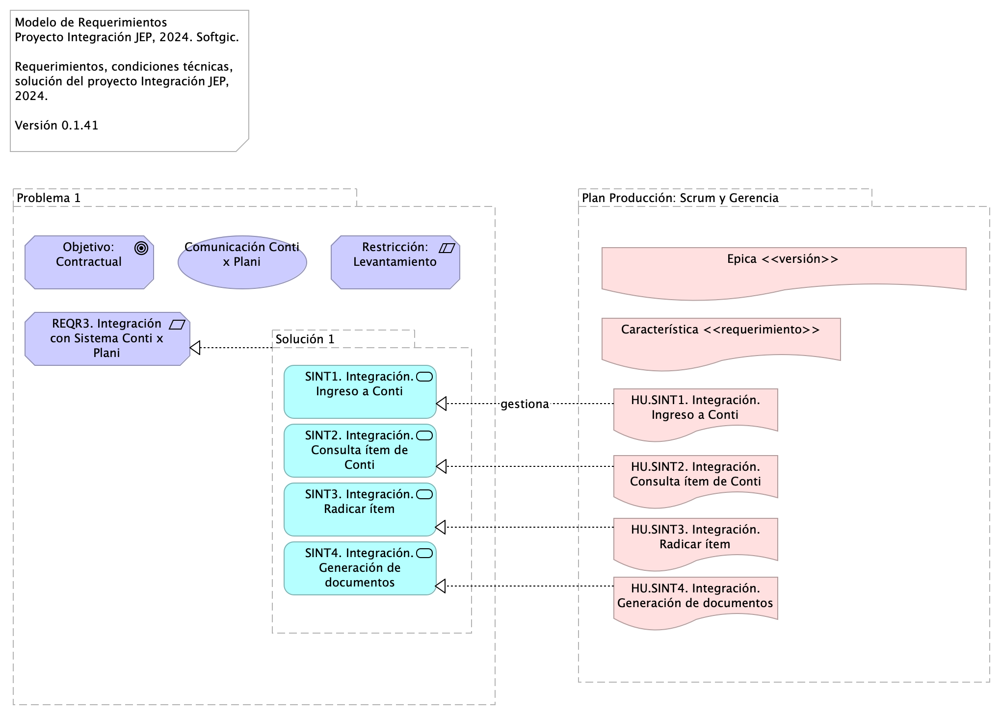
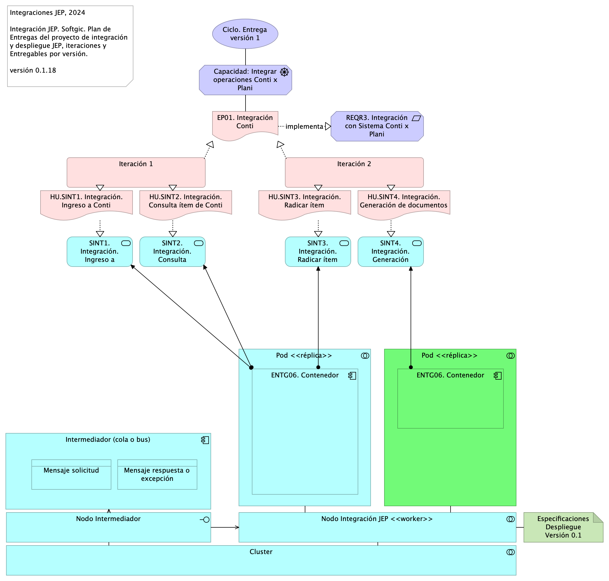
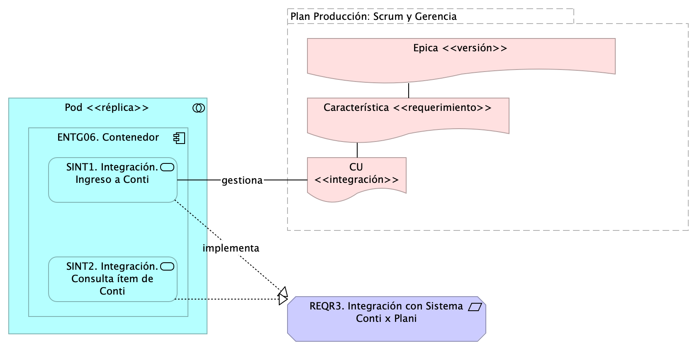

# Contenido
* [Información del Documento](#información-del-documento)
* [Gestión de Trabajo del Proyecto](#gestión-de-trabajo-del-proyecto)
* [Modelo de Requerimientos de Interoperabilidad Proyecto JEP](#modelo-de-requerimientos-de-interoperabilidad-proyecto-jep)
* [Modelo de Despliegue de Requerimientos de Interoperabilidad Proyecto JEP](#modelo-de-despliegue-de-requerimientos-de-interoperabilidad-proyecto-jep)


<div style="page-break-before: always;"></div>
\newpage

# Información del Documento

## Versión del Documento

> 

<br>

---
title: Requerimientos de Integración JEP
subtitle: Implementación Proyecto Evolución de Interoperabilidad JEP, Softgic
subject: Implementación Proyecto
author: 
date: 2024-09-16
keywords: [Integración, Interoperabilidad, JEP, Softgic]
header-right: include/jeplogo.jpg
geometry:
  - top=1.3in
  - bottom=1in
fignos-cleveref: True
fignos-plus-name: Fig.
fignos-caption-name: Imagen
tablenos-caption-name: Tabla
...

Versión Actual

1.915e39a - crrcn.config.4 - Mon, 9 Dec 2024 16:35:25 -0500

Versiones Anteriores

1.8fc6f24 - envvar - Mon, 9 Dec 2024 15:53:50 -0500

1.b7514ba - Compilación para entrega - Mon, 9 Dec 2024 17:32:27 +0000

1.f25d32d - Compilación para entrega - Mon, 9 Dec 2024 16:55:07 +0000

1.aa3922c - Compilación para entrega - Mon, 9 Dec 2024 16:51:49 +0000


## Realizado Por
Sofgic.co

## Revisado Por
Sofgic.co


---
lang: en
titlepage: true
titlepage-rule-color: 360049
...


<div style="page-break-before: always;"></div>
\newpage

# Gestión de Trabajo del Proyecto

## Modelo de Gestión de Requerimientos de Integración

> Modelo de Implementación Proyecto JEP, 2024. Softgic.  Propuesta modelo de gestión y atención requerimientos de integración del proyecto de servicios de integración JEP. 
 Ver 0.1.37   

<br>

El ciclo de entrega de requerimientos inicia con la planeación macro de los objetivos entregables del proyecto de integración organizados en el tiempo (de septiembre a diciembre del 2024).

Los roles técnicos convierten estos objetivos macro en requerimientos comprendidos por épicas, características e historias (o casos de uso) de integración.

Los ingenieros convierten a su vez las historias en tareas entregables, individuales y autónomas, de tipo tarea (UT), diseño (DIS), pruebas de calidad (QA), análisis (AN), entrega continua (CI/CD), etc. Una vez los ingenieros tengan esta división de trabajo en tareas pueden pasar a la implementación mediante iteraciones (ver Modelo de Implementación del Proyecto JEP).

Los requerimientos del proyecto JEP son procesados mediante el modelo de producción descrito más adelante.

{#fig:id-7c3abdaa8d9b46eebfd8f8e3e8d912ce width= height=500px}

### Elementos del Modelo
- **ACC01. Planeación de Producción, Oct-Dic 2024**. Objetivos y entregas en el tiempo, versiones de entrega del proyecto de integración.

- **Procesos de Ingeniería Software**. 
- **ANLS.Analisis integración**. *ANSS (análisis)*

* Scrum, Funcional, Dueño producto cliente (requiere conocimiento del negocio).
* Resultado: Refinamiento HU, modelo de negocio, es decir, diagrama de HU relacionadas unas con otras y con los conceptos de negocio en el repositorio de ARQ. Actualmente: no hay resultados de este proceso.
Ejemplo del modelo de negocio

*Salidas*

* Modelo de negocio en el repo
* Estimación --puede en devops
* Análisis de dependencia en el repo

*KPI*

- Tasa de aprobación de HU por cliente
Fuente: (Cantidad de HU refinadas y aprobadas por cliente [Repo Sharepoint] / Total de cantidad de HU [Azure DevOps])
Dato 26/10/2023: (30/44) = 0,68

- Tasa de error en Bug por PR entregados
Fuente: (Cantidad de solicitude de cambio en rama (Pull Reqst) de Correcciones (fix) o Regresión (reverts) [Bitbucket] / Cantidad total de PR desplegados [Bitbucket])
Dato 26/10/2023: (8/111)*100 = 7,2%

- **MET.APRB**. *Meta APRB*

Nombre indicador	Tasa de aprobación de HU por cliente
Uso	Estabildad de requerimientos. Contensión del flujo de trabajo inicio de desarrolo
Proceso	ANLS
Calculo de medición	Cantidad de HU refinadas y aprobadas por cliente / Total de cantidad de HU
Fuente	[Repo Sharepoint], [Azure DevOps])

- **DIS.Arquitectura / diseño**. *KPI*

- Nivel de HU sin detalle técnico
Fuente: (Cantidad de HU refinadas y aprobadas sin diseño de implementacion [Repo Sharepoint] / Total de cantidad de HU [Azure DevOps])
Dato 26/10/2023: 0/44=0

- **MET.DEC**. *Meta DEC*

Nombre indicador: Decisiones de diseño, justificaciones, validaciones
Uso: Estabildad de requerimientos. Control de alineación desarrollo-demanda
Proceso:	DIS
Calculo de medición: Cantidad de HU refinadas y aprobadas por cliente / Total de cantidad de HU
Fuente: [Repo Sharepoint], [Azure DevOps])


- **DEV.Implementación**. *KPI*

- Velocidad de construcción
Fuente: (Cantidad de puntos de HU ejecutadas [Azure DevOps] / Horas habiles del mes de trabajo [Calculo manual])
Dato 26/10/2023: 83 / 153 = 0,54 HU/horas 

- Tasa de cierre de defectos
Fuente: (Cantidad de Bug solucionados [Azure DevOps] / Total de Bugs a corte sin nuevos [Azure DevOps])
Dato 26/10/2023: 81 / 920 = 0,088

- Indice de dependecia de Lider Técnico
Fuente: (Cantidad de actividades retrazadas semanales segun las HU planeadas / Total de HU planeadas para ejecución)
Dato 26/10/2023: Pendiente proxima semana

- **MET.VEL**. *Meta VEL*

Nombre indicador	Velocidad de construcción
Uso	Capacidad interna de desarrollo
Proceso	DEV
Calculo de medición	Cantidad de puntos de HU ejecutadas / Horas habiles del mes de trabajo
Fuente	[Azure DevOps], [Calculo manual]

- **Plan Producción: Scrum y Gerencia**. 
- **Plan Producción: Ingeniería (Red Hat DevOps)**. 
- **UT (tarea)**. Unidad mínima de trabajo (tarea por desarrollador).

- **UT (tarea)**. Unidad mínima de trabajo (tarea por desarrollador).

- **UT (tarea)**. Unidad mínima de trabajo (tarea por desarrollador).

- **DEV**. Alcance de QA unitaria

- **CI/CD**. Actividades DevOps del ciclo o iteración de implementación.


---
lang: en
titlepage: true
titlepage-rule-color: 360049
...


## Modelo de Producción e Implementación de Integración JEP

> Modelo de Producción e Implementación Proyecto JEP, 2024. Softgic.  Modelo de gestión y atención requerimientos de integración del proyecto de integración JEP, 2024. Softgic. Relación con herramienta de gestión Az DevOps.  
 Ver 0.1.12   

<br>

El modelo de producción que procesa los requerimientos del proyecto JEP inicia con la creación de un tramo de la planeación de la solución de integración, esto es un ciclo de implementación o iteración del proyecto de integración JEP.

(ING) Procesos de ingeniería. Arrancan los procesos mínimos de ingeniería previos a la construcción de la integración.

(PRY) Planificación de historias de usuario. La porción de la planeación de producción aprobada para la construcción se planifica en historias o casos de uso, u cualquier otra forma de medición de avance.

(ING) Creación e inicio de iteraciones de implementación incremental. La planificación de HU (CU, u otra) es tareificada y asignada a desarrolladores disponibles. Además, las tareas asignadas son organizadas en ciclos de trabajo fijo (iteraciones). Esta ejecución es la línea de trabajo principal del proyecto JEP.

(PRY, ING) Coordinación de líneas de trabajo. Las entregas de la línea de trabajo del proyecto JEP debe ser compasada con otras líneas de trabajo de la JEP, con las que puede haber una relación de secuencia o dependencia externa.

Durante la ejecución de la iteraciones determinadas, inicia nuevamente el ciclo del  proyecto desde la creación de un nuevo tramo de la planeación de producción.


### Mapeo del Modelo con Herramienta de Registro del Trabajo (az devops)
* Épica = Versión de entrega de la solución como un todo
* Característica = Requerimiento de integración, del cual pueden desprenderse varias integraciones puntuales.
* HU = Una integración puntual proveniente de un requerimiento, ej.:  ingreso Conti, Consulta campos, Radicar ítem, Generación documentos...
* UT = Tarea de desarrollo.


{#fig:id-9938d5859d53450fa5c5c953d9ce33cb width= height=500px}

### Elementos del Modelo
- **ACC01. Planeación de Producción, Oct-Dic 2024**. Objetivos y entregas en el tiempo, versiones de entrega del proyecto de integración.

- **DEV.Implementación**. *KPI*

- Velocidad de construcción
Fuente: (Cantidad de puntos de HU ejecutadas [Azure DevOps] / Horas habiles del mes de trabajo [Calculo manual])
Dato 26/10/2023: 83 / 153 = 0,54 HU/horas 

- Tasa de cierre de defectos
Fuente: (Cantidad de Bug solucionados [Azure DevOps] / Total de Bugs a corte sin nuevos [Azure DevOps])
Dato 26/10/2023: 81 / 920 = 0,088

- Indice de dependecia de Lider Técnico
Fuente: (Cantidad de actividades retrazadas semanales segun las HU planeadas / Total de HU planeadas para ejecución)
Dato 26/10/2023: Pendiente proxima semana

- **MET.VEL**. *Meta VEL*

Nombre indicador	Velocidad de construcción
Uso	Capacidad interna de desarrollo
Proceso	DEV
Calculo de medición	Cantidad de puntos de HU ejecutadas / Horas habiles del mes de trabajo
Fuente	[Azure DevOps], [Calculo manual]

- **ANLS.Analisis integración**. *ANSS (análisis)*

* Scrum, Funcional, Dueño producto cliente (requiere conocimiento del negocio).
* Resultado: Refinamiento HU, modelo de negocio, es decir, diagrama de HU relacionadas unas con otras y con los conceptos de negocio en el repositorio de ARQ. Actualmente: no hay resultados de este proceso.
Ejemplo del modelo de negocio

*Salidas*

* Modelo de negocio en el repo
* Estimación --puede en devops
* Análisis de dependencia en el repo

*KPI*

- Tasa de aprobación de HU por cliente
Fuente: (Cantidad de HU refinadas y aprobadas por cliente [Repo Sharepoint] / Total de cantidad de HU [Azure DevOps])
Dato 26/10/2023: (30/44) = 0,68

- Tasa de error en Bug por PR entregados
Fuente: (Cantidad de solicitude de cambio en rama (Pull Reqst) de Correcciones (fix) o Regresión (reverts) [Bitbucket] / Cantidad total de PR desplegados [Bitbucket])
Dato 26/10/2023: (8/111)*100 = 7,2%

- **MET.APRB**. *Meta APRB*

Nombre indicador	Tasa de aprobación de HU por cliente
Uso	Estabildad de requerimientos. Contensión del flujo de trabajo inicio de desarrolo
Proceso	ANLS
Calculo de medición	Cantidad de HU refinadas y aprobadas por cliente / Total de cantidad de HU
Fuente	[Repo Sharepoint], [Azure DevOps])

- **DIS.Arquitectura / diseño**. *KPI*

- Nivel de HU sin detalle técnico
Fuente: (Cantidad de HU refinadas y aprobadas sin diseño de implementacion [Repo Sharepoint] / Total de cantidad de HU [Azure DevOps])
Dato 26/10/2023: 0/44=0

- **MET.DEC**. *Meta DEC*

Nombre indicador: Decisiones de diseño, justificaciones, validaciones
Uso: Estabildad de requerimientos. Control de alineación desarrollo-demanda
Proceso:	DIS
Calculo de medición: Cantidad de HU refinadas y aprobadas por cliente / Total de cantidad de HU
Fuente: [Repo Sharepoint], [Azure DevOps])


- **Plan Producción: Scrum y Gerencia**. 
- **Plan Producción: Ingeniería (Red Hat DevOps)**. 
- **UT (tarea)**. Unidad mínima de trabajo (tarea por desarrollador).

- **DEV**. Alcance de QA unitaria

- **CI/CD**. Actividades DevOps del ciclo o iteración de implementación.
- **Plan Producción: Ingeniería (Red Hat DevOps) (copy)**. 
- **UT (tarea)**. Unidad mínima de trabajo (tarea por desarrollador).

- **DEV**. Alcance de QA unitaria

- **CI/CD**. Actividades DevOps del ciclo o iteración de implementación.


---
lang: en
titlepage: true
titlepage-rule-color: 360049
...


<div style="page-break-before: always;"></div>
\newpage

# Modelo de Requerimientos de Interoperabilidad Proyecto JEP

## Requerimiento Integración con Sistema Conti x Plani (REQR3)

> Modelo de Requerimientos Proyecto Integración JEP, 2024. Softgic.  Requerimientos, condiciones técnicas, solución del proyecto Integración JEP, 2024.  Versión 0.1.41  

<br>

---
title: Gestión de Requerimientos JEP
subtitle: Implementación Proyecto Evolución de Interoperabilidad JEP, Softgic
subject: Implementación Proyecto JEP
author: "Versión actual: 1.915e39a - crrcn.config.4 - Mon, 9 Dec 2024 16:35:25 -0500"
date: 2024-11-8
keywords: [Integración, Interoperabilidad, JEP, Softgic, Caso de uso]
header-right: include/jeplogo.jpg
lang: en
titlepage: true
titlepage-rule-color: 360049
geometry:
  - top=1.3in
  - bottom=1in
fignos-cleveref: True
fignos-plus-name: Fig.
fignos-caption-name: Imagen
tablenos-caption-name: Tabla
...

Del alcance del proyecto, 

1. Implementación de 20 o más servicios de integración al 31 de diciembre del 2024.
1. Soporte solución de integración a julio 2025.

Establecemos las bases para el modelo de requerimientos de esta solución, el cual limita la demanda a:

* Desarrollar únicamente nuevos servicios de integración con el patrón de integración empresarial (ESB, Camel K de Apache) propuesto en el modelo de interoperabilidad de esta solución.
* Implementar en esta solución de integración las condiciones tecnológicas JEP, entendidas como requerimientos no funcionales de arquitectura,  presentes en el Anexo Nro. 1.1 – Anexo técnico evolución plataforma de interoperabilidad – Ficha Técnica.
* No son requerimientos de este proyecto el implementar otro tipos de requerimientos no expresados aquí, como por ejemplo, migrar los servicios existentes de modelo integración directa (EIA) esta solución de integración empresarial, o implementar soluciones en las aplicaciones de software de la JEP.

Para la implementación de los ítems relacionados en el Anexo Nro. 1.1 – Anexo técnico evolución plataforma de interoperabilidad – Ficha Técnica la hoja “Categorías de Cotización” contiene las necesidades a contratar en el ámbito de la evolución tecnológica del modelo de interoperabilidad y los desarrollos de interoperabilidad tanto con sistemas internos, como con entidades externas. En la hoja “Estándares Desarrollo y Producto” del archivo mencionado se indican los estándares recomendados por el fabricante, para tener en cuenta en la entrega de los servicios que se cotizan.

El Anexo Nro. 1.2 – Acuerdos de Niveles de Servicio, explica el procedimiento con el que se dará atención a consultas o solución de incidencias, tanto en los sistemas operativos, como en los servicios de interoperabilidad existentes en la actualidad y aquellos que se contratarán en este proceso, en el sistema Bus de Interoperabilidad implementado en la Jurisdicción Especial para la Paz.

Fuente: Justificativo de la Contratación Invitación Pública.

{#fig:id-01ff385d2e284d618086769dfc871d38 width= height=500px}

### Problema 1

### Objetivo: Contractual
El requerimiento tiene carácter contractual.

### Comunicación Conti x Plani
Valor: el requerimientos genera entregables de valor para la integración de aplicaciones de JEP.

### Restricción: Levantamiento
El requerimiento está condicionado por la completitud del levantamiento.

### REQR3. Integración con Sistema Conti x Plani
Atendiendo la necesidad de la Subdirección de Contratación de implementar el flujo de gestión precontractual en el sistema de Gestión Documental - Conti se requiere integrar con la información de los ítems del Plan Anual de Adquisiciones – PAA para iniciar el proceso, la cual se encuentra gestionada en el Sistema de Gestión y Planeación Institucional PLANi.

Fuente: Acta de requerimientos Integración Plani - Proceso Precontractual_V4 (pdf). 
 

#### Índice de la documentación (casos de uso)

1. Integración. Ingreso a Conti
1. Integración. Consulta ítem de Conti
1. Integración. Radicar ítem
1. Integración. Generación de documentos


### Solución 1

### SINT1. Integración. Ingreso a Conti
Tareas de desarrollo

* Interoperabilidad IOP1. Transporte / Entrega Consulta Negocio
* Modelo de datos (XML, RBDMS, …)
* Esquema de datos (XSD, DTD, JSON-E…)
* Contratos de interoperabilidad (WSDL, API…)
* Mensajes petición IN (API, XML…)
* Mensajes respuesta OUT (API, XML…)
* Mensajes excepción (API, XML…)
* Transporte (REST, SOAP)
* Función lógica (JEE, …)
* Registro y envío de actividad

### SINT2. Integración. Consulta ítem de Conti
Tareas de desarrollo

* Interoperabilidad IOP1. Transporte / Entrega Consulta Negocio
* Modelo de datos (XML, RBDMS, …)
* Esquema de datos (XSD, DTD, JSON-E…)
* Contratos de interoperabilidad (WSDL, API…)
* Mensajes petición IN (API, XML…)
* Mensajes respuesta OUT (API, XML…)
* Mensajes excepción (API, XML…)
* Transporte (REST, SOAP)
* Función lógica (JEE, …)
* Registro y envío de actividad

### SINT3. Integración. Radicar ítem
Tareas de desarrollo

* Interoperabilidad IOP1. Transporte / Entrega Consulta Negocio
* Modelo de datos (XML, RBDMS, …)
* Esquema de datos (XSD, DTD, JSON-E…)
* Contratos de interoperabilidad (WSDL, API…)
* Mensajes petición IN (API, XML…)
* Mensajes respuesta OUT (API, XML…)
* Mensajes excepción (API, XML…)
* Transporte (REST, SOAP)
* Función lógica (JEE, …)
* Registro y envío de actividad

### SINT4. Integración. Generación de documentos
Tareas de desarrollo

* Interoperabilidad IOP1. Transporte / Entrega Consulta Negocio
* Modelo de datos (XML, RBDMS, …)
* Esquema de datos (XSD, DTD, JSON-E…)
* Contratos de interoperabilidad (WSDL, API…)
* Mensajes petición IN (API, XML…)
* Mensajes respuesta OUT (API, XML…)
* Mensajes excepción (API, XML…)
* Transporte (REST, SOAP)
* Función lógica (JEE, …)
* Registro y envío de actividad

### Plan Producción: Scrum y Gerencia


---
lang: en
titlepage: true
titlepage-rule-color: 360049
...


## Especificación CU Requerimiento REQR3

> Casos de Uso Proyecto Integración JEP, 2024. Softgic.  Especificaciones de integraciones (CU), condiciones de interoperabilidad, pruebas técnicas, entregables.  Versión 0.1.96  

<br>

---
subtitle: Implementación Proyecto Evolución de Interoperabilidad JEP, Softgic
subject: Implementación Proyecto JEP
author: "Versión actual: 1.915e39a - crrcn.config.4 - Mon, 9 Dec 2024 16:35:25 -0500"
date: 2024-11-8
keywords: [Integración, Interoperabilidad, JEP, Softgic, Caso de uso]
header-right: include/jeplogo.jpg
lang: en
titlepage: true
titlepage-rule-color: 360049
geometry:
  - top=1.3in
  - bottom=1in
fignos-cleveref: True
fignos-plus-name: Fig.
fignos-caption-name: Imagen
tablenos-caption-name: Tabla
...

Documentación de los casos de uso de integración del proyecto JEP relacionados con los requerimientos. COndiciones de interoperabilidad, pruebas técnicas y entregables.

Fuente: Acta de requerimientos Integración Plani - Proceso Precontractual_V4.pdf

{#fig:id-eb0cac3ffa954ca0aa6a48e757b4d309 width= height=500px}

### REQR3. Integración con Sistema Conti x Plani
Atendiendo la necesidad de la Subdirección de Contratación de implementar el flujo de gestión precontractual en el sistema de Gestión Documental - Conti se requiere integrar con la información de los ítems del Plan Anual de Adquisiciones – PAA para iniciar el proceso, la cual se encuentra gestionada en el Sistema de Gestión y Planeación Institucional PLANi.

Fuente: Acta de requerimientos Integración Plani - Proceso Precontractual_V4 (pdf). 
 

#### Índice de la documentación (casos de uso)

1. Integración. Ingreso a Conti
1. Integración. Consulta ítem de Conti
1. Integración. Radicar ítem
1. Integración. Generación de documentos


### HU.SINT1. Integración. Ingreso a Conti

### Especificación de integración
Solicitar autenticación a la aplicación Conti y devolver resultado de la solicitud de ingreso a la aplicación Plani.

#### Elementos
Elegir y describir los elementos de la actual integración.

* [x] App consumidora (A)
* [x] Mensaje
* [ ] Canal
* [ ] Ruteo
* [ ] Traducción
* [x] App proveedora (B)
* [ ] Monitoreo

Aplicación consumidora A: Plani. Aplicación proveedora B: Conti

Mensaje solicitud: (ver estándar de nombramiento) Ingreso a Conti

* Tipo: TXT | SOAP | XML | JSN | YML | BASE64
* Contenido: Usuario o identidad Conti

Mensaje respuesta: Rpta. Ingreso a Conti

* Tipo: TXT | SOAP | XML | JSN | YML | BASE64
* Contenido: Estado de solicitud de ingreso a Conti

Mensaje excepción: Rpta. Ingreso a Conti

* Tipo: TXT | SOAP | XML | JSN | YML | BASE64
* Contenido: Código de respuesta: HTTP 500 | TXT | Numeración (entero)

#### Diseño
Message Construct | Message Routing | Message Transformation | Messaging Endpoints | Messaging Channels | …

La aplicación consumidora y proveedora compartirán capacidades mediante un mensaje de autenticación (Message Construct).

#### Matriz de interoperabilidad
Detalle del intercambio entre sistemas de información o aplicaciones. 


App Plani requiere compartir Información [I], Funcionalidad [F], Seguridad o Servicios [S] con la App Plani.

|                | Conti | Plani          | Legali | Otros |
|----------------|-------|----------------|--------|-------|
| Conti  (B)      | X     | Seguridad |        |       |
| Plani  (A)      |       | X              |        |       |
| Legali         |       |                | X      |       |
| Otros Sistemas |       |                |        | X     |

Table: Matriz de interoperabilidad del CU Ingreso a Conti.


#### Pruebas Realizables
Por cada caso de prueba de integración describir el resultado del intercambio entre sistemas de información o aplicaciones según la Matriz de interoperabilidad.

* PRUB1. Consumo: la aplicación consumidora Plani no recibe una respuesta a tiempo.
* PRUB2. Ingreso: la aplicación proveedora Conti no provee un ingreso autorizado.

### HU.SINT2. Integración. Consulta ítem de Conti

### Especificación de integración
Solicitar consulta de ítem a la aplicación Plani y obtener resultado de la consulta. La solicitud de consulta podrá realizarla con mínimo un parámetro, o la combinación de todos. Los parámetros son los siguientes:

1. Número de ítem
1. Fecha estimada de inicio de proceso de selección
1. Vigencia de ejecución
1. Fuente de los recursos
1. Modalidad de selección Interna (manual de contratación)

Esta integración permitirá que el sistema Conti consulte al sistema Plani la información de acuerdo con los campos solicitados. Cuando la aplicación Plani ejecute la consulta enviará, esta integración enviarea de regreso a Conti la lista de ítems relacionados que ya se encuentren en estado aprobado y que correspondan a la dependencia del usuario parametrizado en Conti.

#### Elementos
Elegir y describir los elementos de la actual integración.

* [x] App consumidora (A)
* [x] Mensaje
* [x] Canal
* [ ] Ruteo
* [x] Traducción
* [x] App proveedora (B)
* [ ] Monitoreo

Aplicación consumidora A: Conti. Aplicación proveedora B: Plani

Mensaje solicitud: (ver estándar de nombramiento) Consulta ítem

* Tipo: TXT | SOAP | XML | JSN | YML | BASE64
* Contenido: Estructura de datos consulta ítem

1. Número de ítem
1. Fecha estimada de inicio de proceso de selección
1. Vigencia de ejecución
1. Fuente de los recursos
1. Modalidad de selección Interna (manual de contratación)

Mensaje respuesta: Rpta. Ingreso a Conti

* Tipo: TXT | SOAP | XML | JSN | YML | BASE64
* Contenido: Estructura de datos ítem aprobado

1. Vigencia de ejecución
1. ítem PAA
1. Fuente de los recursos
1. Valor Total Estimado del Contrato 5. Código UNSPSC
1. Objeto
1. Fecha estimada de inicio de proceso de selección(mes
1. Fecha estimada de presentación de ofertas (mes)
1. Duración estimada del contrato
1. Duración estimada del contrato (intervalo: días, meses, años)
1. Modalidad de selección Interna
1. Modalidad SECOPII
1. Departamento
1. Municipio
1. Dependencia
1. Responsable
1. Ordenador del gasto
1. Correo electrónico responsable

Mensaje excepción: Rpta. Ingreso a Conti

* Tipo: TXT | SOAP | XML | JSN | YML | BASE64
* Contenido: Código de respuesta: ej. HTTP 500 | TXT | Numeración (entero)


#### Diseño
Message Construct | Message Routing | Message Transformation | Messaging Endpoints | Messaging Channels | …

La aplicación consumidora y proveedora compartirán capacidades mediante un canal centralizado, y mensajes de intercambio de información transformada de extremo a extremo. (Message Construct, Message Routing, Message Transformation, Messaging Endpoints).

#### Matriz de interoperabilidad
Detalle del intercambio entre sistemas de información o aplicaciones. 


App Plani requiere compartir Información [I], Funcionalidad [F], Seguridad o Servicios [S] con la App Plani.

|                | Conti (A) | Plani (B)         | Legali | Otros |
|----------------|-------|----------------|--------|-------|
| Conti  (A)     | X     | Información    |        |       |
| Plani  (B)     |       | X              |        |       |
| Legali         |       |                | X      |       |
| Otros Sistemas |       |                |        | X     |

Table: Matriz de interoperabilidad del CU Consulta ítem.


#### Pruebas Realizables
Por cada caso de prueba de integración describir el resultado del intercambio entre sistemas de información o aplicaciones según la Matriz de interoperabilidad.

* PRUB1.0 Consumo: la aplicación consumidora Conti no recibe la respuesta de la consulta  a tiempo.
* PRUB11. Consulta sin resultado: la aplicación proveedora Plani  entrega una respuesta vacía.
* PRUB12. Consulta incorrecta: la aplicación proveedora Plani no provee el  formato de respuesta esperado.

### HU.SINT3. Integración. Radicar ítem

### Especificación de integración
Esta integracieon inicia en Conti el proceso de gestión dentro de la ruta precontractual (Revisar documento “1. Acta de requerimientos Proceso Precontractual_V2”), y pedirá un radicado asociado al ítem seleccionado.

Una vez generado el número del radicado, Conti envía a Plani la llamada posterior (callback) con esta información para que pueda ser almacenada y relacionada al ítem en el sistema Plani. A su vez, Plani envía un mensaje de confirmación a Conti.

#### Elementos
Elegir y describir los elementos de la actual integración.

* [x] App consumidora (A)
* [x] Mensaje
* [x] Canal
* [x] Ruteo
* [x] Traducción
* [x] App proveedora (B)
* [ ] Monitoreo

Aplicación consumidora A: Conti. Aplicación proveedora B: Plani, C: Otro

Mensaje solicitud: (ver estándar de nombramiento) Consulta ítem

* Tipo: TXT | SOAP | XML | JSN | YML | BASE64
* Contenido: Estructura de datos consulta ítem

Mensaje respuesta: Rpta. Ingreso a Conti

* Tipo: TXT | SOAP | XML | JSN | YML | BASE64
* Contenido: Estructura de datos ítem aprobado

Mensaje excepción: Rpta. Ingreso a Conti

* Tipo: TXT | SOAP | XML | JSN | YML | BASE64
* Contenido: Código de respuesta: ej. HTTP 500 | TXT | Numeración (entero)


#### Diseño
Message Construct | Message Routing | Message Transformation | Messaging Endpoints | Messaging Channels | …

La aplicación consumidora y proveedora compartirán capacidades mediante un canal centralizado, y mensajes de intercambio de funcionalidad y datos transformados de extremo a extremo. (Message Construct, Message Routing, Message Transformation, Messaging Endpoints).

#### Matriz de interoperabilidad
Detalle del intercambio entre sistemas de información o aplicaciones. 


App Plani requiere compartir Información [I], Funcionalidad [F], Seguridad o Servicios [S] con la App Plani.

|                | Conti (A) | Plani (B)   | Legali | Otros (C)     |
|----------------|-----------|-------------|--------|---------------|
| Conti  (A)     | X         | Información |        | Funcionalidad |
| Plani  (B)     |           | X           |        |               |
| Legali         |           |             | X      |               |
| Otros Sistemas |           |             |        | X             |

Table: Matriz de interoperabilidad del CU Radicar ítem.


#### Pruebas Realizables
Por cada caso de prueba de integración describir el resultado del intercambio entre sistemas de información o aplicaciones según la Matriz de interoperabilidad.

* PRUB20 Consumo: la aplicación consumidora Conti no recibe la respuesta del radicado a tiempo.
* PRUB21. Radicado: la aplicación proveedora del radicado falla en proveer el radicado
* PRUB22. Consulta incorrecta: la aplicación proveedora Plani no provee el  formato de respuesta esperado.

### HU.SINT4. Integración. Generación de documentos

### Especificación de integración
Una vez se tenga seleccionado el ítem a gestionar el usuario debe identificar el tipo de documento que esté relacionado al mismo, sea documento justificativo, Reglas de invitación y/o anexos.

Esta integración debe enviar el documento a... 

#### Elementos
Elegir y describir los elementos de la actual integración.

* [ ] App consumidora (A)
* [ ] Mensaje
* [ ] Canal
* [ ] Ruteo
* [ ] Traducción
* [ ] App proveedora (B)
* [ ] Monitoreo

Aplicación consumidora A: Conti. Aplicación proveedora B: 

Mensaje: Ingreso a Conti
* Tipo: TXT | SOAP | XML | JSN | YML | BASE64
* Contenido: 


#### Diseño
Message Construct | Message Routing | Message Transformation | Messaging Endpoints | Messaging Channels | …

#### Matriz de interoperabilidad
Detalle del intercambio entre sistemas de información o aplicaciones. 


App Plani requiere compartir Información [I], Funcionalidad [F], Seguridad o Servicios [S] con la App Plani.

|                | Conti | Plani          | Legali | Otros |
|----------------|-------|----------------|--------|-------|
| Conti  (B)      | X     | Información |        |       |
| Plani  (A)      |       | X              |        |       |
| Legali         |       |                | X      |       |
| Otros Sistemas |       |                |        | X     |

Table: Matriz de interoperabilidad del CU Generación de documentos


#### Pruebas Realizables
Por cada caso de prueba de integración describir el resultado del intercambio entre sistemas de información o aplicaciones según la Matriz de interoperabilidad.

* PRUB1. 
* PRUB2.


---
lang: en
titlepage: true
titlepage-rule-color: 360049
...


<div style="page-break-before: always;"></div>
\newpage

# Modelo de Despliegue de Requerimientos de Interoperabilidad Proyecto JEP

## Despliegue de Entrega del Requerimiento

> Integraciones JEP, 2024  Integración JEP. Softgic. Plan de Entregas del proyecto de integración y despliegue JEP, iteraciones y Entregables por versión.  versión 0.1.18   

<br>

Los servicios implementados contenidos en los requerimientos se pueden desplegar sobre la red de unidades de despliegue (pods) dispuesta por la JEP y acordada con el contratista.

En esta organización propuesta, los servicios de integración implementados pueden ser desplegados en uno, o varios contenedores, y en unidades de despliegue (pods) distintas.

{#fig:id-203e737545e449e59334b47d3034d956 width= height=500px}

### Elementos del Modelo
- **Ciclo. Entrega versión 1**. Versión 1. Solución integración JEP.

- **Capacidad: Integrar operaciones Conti x Plani**. Característica de integración de Conti contenido en la solución de integración JEP, 2024.

- **EP01. Integración Conti**. Épica de entrega de la solución de integración JEP, 2024, que contiene las iteraciones que realizarán la característica 'Integrar operaciones Conti'.


- **REQR3. Integración con Sistema Conti x Plani**. Atendiendo la necesidad de la Subdirección de Contratación de implementar el flujo de gestión precontractual en el sistema de Gestión Documental - Conti se requiere integrar con la información de los ítems del Plan Anual de Adquisiciones – PAA para iniciar el proceso, la cual se encuentra gestionada en el Sistema de Gestión y Planeación Institucional PLANi.

Fuente: Acta de requerimientos Integración Plani - Proceso Precontractual_V4 (pdf). 
 

#### Índice de la documentación (casos de uso)

1. Integración. Ingreso a Conti
1. Integración. Consulta ítem de Conti
1. Integración. Radicar ítem
1. Integración. Generación de documentos


- **SINT1. Integración. Ingreso a Conti**. Tareas de desarrollo

* Interoperabilidad IOP1. Transporte / Entrega Consulta Negocio
* Modelo de datos (XML, RBDMS, …)
* Esquema de datos (XSD, DTD, JSON-E…)
* Contratos de interoperabilidad (WSDL, API…)
* Mensajes petición IN (API, XML…)
* Mensajes respuesta OUT (API, XML…)
* Mensajes excepción (API, XML…)
* Transporte (REST, SOAP)
* Función lógica (JEE, …)
* Registro y envío de actividad

- **SINT2. Integración. Consulta ítem de Conti**. Tareas de desarrollo

* Interoperabilidad IOP1. Transporte / Entrega Consulta Negocio
* Modelo de datos (XML, RBDMS, …)
* Esquema de datos (XSD, DTD, JSON-E…)
* Contratos de interoperabilidad (WSDL, API…)
* Mensajes petición IN (API, XML…)
* Mensajes respuesta OUT (API, XML…)
* Mensajes excepción (API, XML…)
* Transporte (REST, SOAP)
* Función lógica (JEE, …)
* Registro y envío de actividad

- **SINT3. Integración. Radicar ítem**. Tareas de desarrollo

* Interoperabilidad IOP1. Transporte / Entrega Consulta Negocio
* Modelo de datos (XML, RBDMS, …)
* Esquema de datos (XSD, DTD, JSON-E…)
* Contratos de interoperabilidad (WSDL, API…)
* Mensajes petición IN (API, XML…)
* Mensajes respuesta OUT (API, XML…)
* Mensajes excepción (API, XML…)
* Transporte (REST, SOAP)
* Función lógica (JEE, …)
* Registro y envío de actividad

- **SINT4. Integración. Generación de documentos**. Tareas de desarrollo

* Interoperabilidad IOP1. Transporte / Entrega Consulta Negocio
* Modelo de datos (XML, RBDMS, …)
* Esquema de datos (XSD, DTD, JSON-E…)
* Contratos de interoperabilidad (WSDL, API…)
* Mensajes petición IN (API, XML…)
* Mensajes respuesta OUT (API, XML…)
* Mensajes excepción (API, XML…)
* Transporte (REST, SOAP)
* Función lógica (JEE, …)
* Registro y envío de actividad

- **ENTG06. Contenedor**. Contenedores de los servicios de integración del proyecto desplegados en la infraestructura tecnológica JEP.

- **ENTG06. Contenedor**. Contenedores de los servicios de integración del proyecto desplegados en la infraestructura tecnológica JEP.

- **Intermediador (cola o bus)**. Bus de Red Hat, aplicación cliente Quarkus, o intermediador de integración Apache Camel.
- **Mensaje solicitud**. Formato predefinido de intercambio de datos.
- **Mensaje respuesta o excepción**. Formato predefinido de intercambio de datos.
- **Nodo Intermediador**. Nodo lógico en donde corren los contenedores.

- **Nodo Integración JEP (worker)**. Nodo lógico en donde corren los contenedores.

- **Especificaciones Despliegue Versión 0.1**. **Documentación Técnica: Configuración y Despliegue en JEP sobre OpenShift**

**1\. Introducción**

El presente documento describe las configuraciones requeridas y las consideraciones técnicas para los despliegues en el clúster de la JEP en OpenShift. Este clúster está configurado con Service Mesh y utiliza Istio para habilitar capacidades de observabilidad, gestión de tráfico y seguridad. A continuación, se presentan las configuraciones clave, las características del clúster y ejemplos relevantes.

**2\. Configuración del Clúster de OpenShift**

Este clúster de OpenShift incluye características específicas que condicionan el despliegue de aplicaciones:

**Características generales:**

- **Acceso:** La consola se encuentra en <https://console-openshift-console.apps.interopera.jep.gov.co/k8s/cluster/projects>.
- **VPN:** Gateway Remoto: 190.144.149.224.
- **Nodo asignado:** El nodo para los despliegues: **votan.interopera.jep.gov.co**.
- **Entorno de Despliegue:** desarrollo-sg
- **Inyección de sidecars mediante Istio:** Configurada por namespace con la anotación istio-injection: enabled

**Configuraciones del entorno:**

- **Service Mesh habilitado:** Gestionado por Istio, para el marco de enrutamiento y proxy del tráfico entre servicios.
- **Istio Injection:** Activado a nivel del namespace **desarrollo-sg** con la anotación:

```
istio-injection: enabled
```

Esta configuración permite que un sidecar sea inyectado automáticamente en los Pods dentro del namespace.

**3\. Consideraciones de Configuración**

**Inyección de Sidecar (Istio Injection):**

La inyección de sidecar es fundamental para integrar los Pods en el Service Mesh. Para habilitarla, se debe incluir la siguiente anotación en los Pods y configurarla a nivel de namespace:

```
annotations:

sidecar.istio.io/inject: "true"
```

**Asignación de Nodo Específico:**

Para garantizar que los Pods se ejecuten en el nodo asignado (votan.interopera.jep.gov.co), se debe agregar el siguiente fragmento en la especificación del Pod:

```
nodeSelector:

kubernetes.io/hostname: votan.interopera.jep.gov.co
```

**Configuración del Service:**

El Service Mesh requiere un Service que defina claramente los puertos y protocolos que se exponen. Por ejemplo:

```
spec:

selector:

app: ejemplo-app

ports:

\- protocol: TCP

port: 9000

targetPort: 9000
```

No es necesario definir el tipo de servicio “type: LoadBalancer/ClusterIP” ya que con el Service Mesh habilitado, la configuración entre servicios se gestiona internamente a través del proxy sidecar (controlado por Istio). Este proxy opera sobre los servicios internos tipo ClusterIP.

**4\. Ejemplo de Configuraciones Importantes**

**Fragmento de Deployment:**

Incluye configuraciones críticas como la inyección de Istio, restricciones de recursos y selección del nodo:

```
metadata:

annotations:

sidecar.istio.io/inject: "true"

spec:

nodeSelector:

kubernetes.io/hostname: votan.interopera.jep.gov.co

containers:

\- resources:

requests:

memory: "20Mi"

cpu: "100m"

limits:

memory: "80Mi"

cpu: "120m"
```

**Fragmento de Service:**

Define el puerto y el protocolo para la comunicación del Pod:

```
spec:

ports:

\- protocol: TCP

port: 9000

targetPort: 9000

selector:


app: ejemplo-app
```

**5\. Limitaciones del Entorno**

1. **Dependencia del Service Mesh:**  
    Todos los Pods deben estar configurados adecuadamente para aprovechar el Service Mesh. Un error en la configuración podría provocar problemas de conectividad o trazabilidad.
2. **Recursos restringidos:**  
    Los límites de memoria y CPU deben ser estrictamente respetados para evitar conflictos de recursos en el clúster.
3. **Asignación de nodo fijo:**  
    Aunque garantiza estabilidad, la dependencia de un nodo específico puede ser una desventaja si el nodo no está disponible.

**6\. Conclusión**

El clúster de OpenShift descrito está configurado para gestionar aplicaciones bajo un marco controlado, con Service Mesh e Istio como componentes clave. Las configuraciones presentadas aseguran que los despliegues cumplan con los estándares definidos, aunque es fundamental monitorear y ajustar según las necesidades específicas para el proyecto.
- **Cluster**. Orquestador de nodos y servicios (contendores) de la JEP.


---
lang: en
titlepage: true
titlepage-rule-color: 360049
...


---
lang: en
titlepage: true
titlepage-rule-color: 360049
...

## Plantilla de Casos de Uso del Proyecto JEP

{#fig:id-8115cb4314954a7cb873b534038c22aa width= height=500px}

---
subtitle: Implementación Proyecto Evolución de Interoperabilidad JEP, Softgic
subject: Implementación Proyecto
author: "Versión actual: 1.915e39a - crrcn.config.4 - Mon, 9 Dec 2024 16:35:25 -0500"
date: 2024-11-8
keywords: [Integración, Interoperabilidad, JEP, Softgic]
header-right: include/jeplogo.jpg
geometry:
  - top=1.3in
  - bottom=1in
fignos-cleveref: True
fignos-plus-name: Fig.
fignos-caption-name: Imagen
tablenos-caption-name: Tabla
...

Documentación de los casos de uso de integración (CU en el diagrama) del proyecto JEP relacionados con las integraciones y requerimientos. 

Fuente: Justificativo de la Contratación Invitación Pública.


## Casos de Uso del Proyecto (integración)
App A requiere integrar Información [I] | Funcionalidad [F] | Servicios [S] con la App B, C, D…


### Elementos
Elegir y describir los elementos de la actual integración.

* [ ] App consumidora (A)
* [ ] Mensaje
* [ ] Canal
* [ ] Ruteo
* [ ] Traducción
* [ ] App proveedora (B)
* [ ] Monitoreo


### Diseño
Message Construct | Message Routing | Message Transformation | Messaging Endpoints | Messaging Channels | …


### Matriz de interoperabilidad
Detalle del intercambio entre sistemas de información o aplicaciones. 


Sistema A comparte información, funcionalidad o servicios con Sistema B.

|                | Conti | Plani          | Legali | Otros |
|----------------|-------|----------------|--------|-------|
| Conti          | X     | Inf, Seguridad |        |       |
| Plani          |       | X              |        |       |
| Legali         |       |                | X      |       |
| Otros Sistemas |       |                |        | X     |


### Pruebas Realizables
Describir por cada caso de prueba de integración el resultado del intercambio entre sistemas de información o aplicaciones según la Matriz de interoperabilidad.


