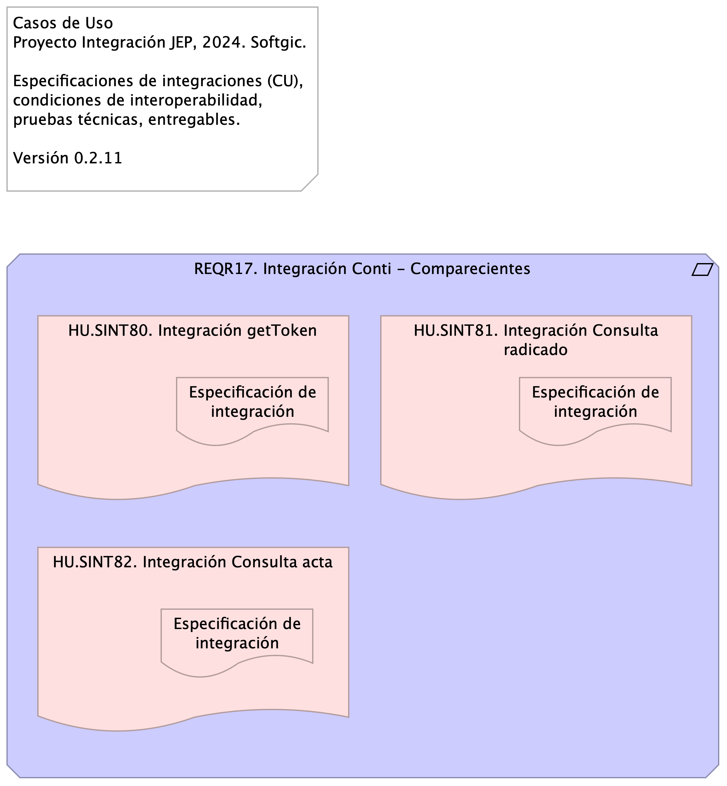

# Especificación CU Requerimiento REQR17

* [Introducción](#Introducción)
* [REQR17. Integración Conti - Comparecientes (Requirement)](#reqr17.-integración-conti---comparecientes-requirement)
  * [HU.SINT80. Integración getToken (Deliverable)](#hu.sint80.-integración-gettoken-deliverable)
    * [Especificación de integración (Deliverable)](#especificación-de-integración-deliverable)
  * [HU.SINT81. Integración Consulta radicado (Deliverable)](#hu.sint81.-integración-consulta-radicado-deliverable)
    * [Especificación de integración (Deliverable) 2](#especificación-de-integración-deliverable-2)
  * [HU.SINT82. Integración Consulta acta (Deliverable)](#hu.sint82.-integración-consulta-acta-deliverable)
    * [Especificación de integración (Deliverable) 3](#especificación-de-integración-deliverable-3)

## Introducción

{height=500px}

---
subtitle: Implementación Proyecto Evolución de Interoperabilidad JEP, Softgic
subject: Implementación Proyecto JEP
author: "Versión actual: 1.aa3922c - Compilación para entrega - Mon, 9 Dec 2024 16:51:49 +0000"
date: 2024-11-8
keywords: [Integración, Interoperabilidad, JEP, Softgic, Caso de uso]
header-right: include/jeplogo.jpg
lang: en
titlepage: true
titlepage-rule-color: 360049
geometry:
  - top=1.3in
  - bottom=1in
fignos-cleveref: True
fignos-plus-name: Fig.
fignos-caption-name: Imagen
tablenos-caption-name: Tabla
...

Documentación de los casos de uso de integración del proyecto JEP relacionados con los requerimientos. COndiciones de interoperabilidad, pruebas técnicas y entregables.

Fuente: Acta de requerimientos Integración Plani - Proceso Precontractual_V4.pdf

## REQR17. Integración Conti - Comparecientes

Atendiendo la necesidad de Justicia Digital, se requiere implementar la integración con el módjlos de comparecientes de Conti, como la exposición de las capacidades de Conti.

Fuente: serviciosOami (pdf).

### Índice de la documentación (casos de uso)

1. SINT80. Integrar getToken
1. SINT81. Integrar Consulta radicado
1. SINT82. Integrar Consulta acta

Los casos de uso se detallan en anexo más adelante.

### HU.SINT80. Integración getToken

#### Especificación de integración

Integrar el servicio que retorna token de autenticación para los demás servicios, getToken de Conti y devolver resultado al módulo de comparecientes.

#### Elementos
Elegir y describir los elementos de la actual integración.

* [x] App consumidora (A)
* [x] Mensaje
* [ ] Canal
* [ ] Ruteo
* [ ] Traducción
* [x] App proveedora (B)
* [ ] Monitoreo

Aplicación consumidora A: Comparecientes. Aplicación proveedora B: Conti

Mensaje solicitud: (ver estándar de nombramiento) Ingreso a Conti

* Tipo: TXT | SOAP | XML | JSN | YML | BASE64
* Contenido: Token de seguridad para la autorización de la operación en el módulo de comparecientes.

Mensaje respuesta: Rpta. Token de autorización

* Tipo: TXT | SOAP | XML | JSN | YML | BASE64
* Contenido: Estado de solicitud de ingreso a Conti

Mensaje excepción: Rpta. Token no válido

* Tipo: TXT | SOAP | XML | JSN | YML | BASE64
* Contenido: Código de respuesta: HTTP 500 | TXT | Numeración (entero)

#### Diseño
Message Construct | Message Routing | Message Transformation | Messaging Endpoints | Messaging Channels | …

La aplicación consumidora y proveedora compartirán capacidades mediante un mensaje de autorización (Message Construct).

#### Puntos de Entrada (endpoints) Aplicación Proveedora

* Url: dominio/mercurio/apiRest/consulta/getToken 
* Method: POST
* Content-Type: application/json

#### Matriz de interoperabilidad
Detalle del intercambio entre sistemas de información o aplicaciones. 

App Plani requiere compartir Información [I], Funcionalidad [F], Seguridad o Servicios [S] con la App Plani.

|                     | Conti | Comparecientes | Legali | Otros |
|---------------------|-------|----------------|--------|-------|
| Conti  (A)          | X     | Seguridad      |        |       |
| Comparecientes  (B) |       | X              |        |       |
| Legali              |       |                | X      |       |
| Otros Sistemas      |       |                |        | X     |

Table: Matriz de interoperabilidad del CU getToken

#### Pruebas Realizables
Por cada caso de prueba de integración describir el resultado del intercambio entre sistemas de información o aplicaciones según la Matriz de interoperabilidad.

* PRUB1. Token: la aplicación consumidora solicita un token de autorización.
* PRUB2. Falla Token: la aplicación proveedora Conti no provee el token de autorización.

#### Anexo Técnico
Manual de especificación de los servicios web. ServiciosOami.pdf

### HU.SINT81. Integración Consulta radicado

#### Especificación de integración

Integrar el servicio REST que retorna información asociada a los radicados que almacena Conti, consulta_radicado de Conti y devolver resultado al módulo de comparecientes.

El servicio 

#### Elementos
Elegir y describir los elementos de la actual integración.

* [x] App consumidora (A)
* [x] Mensaje
* [ ] Canal
* [ ] Ruteo
* [ ] Traducción
* [x] App proveedora (B)
* [ ] Monitoreo

Aplicación consumidora A: Comparecientes. Aplicación proveedora B: Conti

Mensaje solicitud: (ver estándar de nombramiento) Ingreso a Conti

* Tipo: TXT | SOAP | XML | JSN | YML | BASE64
* Contenido: Token de seguridad para la autorización de la operación en el módulo de comparecientes.

Mensaje respuesta: Rpta. Token de autorización

* Tipo: TXT | SOAP | XML | JSN | YML | BASE64
* Contenido: Estado de solicitud de ingreso a Conti

Mensaje excepción: Rpta. Token no válido

* Tipo: TXT | SOAP | XML | JSN | YML | BASE64
* Contenido: Código de respuesta: HTTP 500 | TXT | Numeración (entero)

#### Diseño
Message Construct | Message Routing | Message Transformation | Messaging Endpoints | Messaging Channels | …

La aplicación consumidora y proveedora compartirán capacidades mediante un mensaje de autorización (Message Construct).

#### Puntos de Entrada (endpoints) Aplicación Proveedora

* Url: dominio/mercurio/apiRest/consulta/contenidoradicado
* Method: POST
* Content-Type: application/json
* Authorization: Bearer Token <Token>

#### Matriz de interoperabilidad
Detalle del intercambio entre sistemas de información o aplicaciones. 

App Plani requiere compartir Información [I], Funcionalidad [F], Seguridad o Servicios [S] con la App Plani.

|                     | Conti | Comparecientes | Legali | Otros |
|---------------------|-------|----------------|--------|-------|
| Conti  (A)          | X     | Seguridad      |        |       |
| Comparecientes  (B) |       | X              |        |       |
| Legali              |       |                | X      |       |
| Otros Sistemas      |       |                |        | X     |

Table: Matriz de interoperabilidad del CU getToken

#### Pruebas Realizables
Por cada caso de prueba de integración describir el resultado del intercambio entre sistemas de información o aplicaciones según la Matriz de interoperabilidad.

* PRUB1. Token: la aplicación consumidora solicita un token de autorización.
* PRUB2. Falla Token: la aplicación proveedora Conti no provee el token de autorización.

#### Anexo Técnico
Manual de especificación de los servicios web. ServiciosOami.pdf

### HU.SINT82. Integración Consulta acta

#### Especificación de integración

Integrar el servicio que retorna información asociada a las actas que almacena Conti, consulta Acta de Conti y devolver resultado al módulo de comparecientes.

El servicio 

#### Elementos
Elegir y describir los elementos de la actual integración.

* [x] App consumidora (A)
* [x] Mensaje
* [ ] Canal
* [ ] Ruteo
* [ ] Traducción
* [x] App proveedora (B)
* [ ] Monitoreo

Aplicación consumidora A: Comparecientes. Aplicación proveedora B: Conti

Mensaje solicitud: (ver estándar de nombramiento) Ingreso a Conti

* Tipo: TXT | SOAP | XML | JSN | YML | BASE64
* Contenido: Token de seguridad para la autorización de la operación en el módulo de comparecientes.

Mensaje respuesta: Rpta. Token de autorización

* Tipo: TXT | SOAP | XML | JSN | YML | BASE64
* Contenido: Estado de solicitud de ingreso a Conti

Mensaje excepción: Rpta. Token no válido

* Tipo: TXT | SOAP | XML | JSN | YML | BASE64
* Contenido: Código de respuesta: HTTP 500 | TXT | Numeración (entero)

#### Diseño
Message Construct | Message Routing | Message Transformation | Messaging Endpoints | Messaging Channels | …

La aplicación consumidora y proveedora compartirán capacidades mediante un mensaje de autorización (Message Construct).

#### Puntos de Entrada (endpoints) de Aplicación Proveedora

* Url: dominio/mercurio/apiRest/consulta/acta
* Method: POST
* Content-Type: application/json
* Authorization: Bearer Token <Token>

#### Matriz de interoperabilidad
Detalle del intercambio entre sistemas de información o aplicaciones. 

App Plani requiere compartir Información [I], Funcionalidad [F], Seguridad o Servicios [S] con la App Plani.

|                     | Conti | Comparecientes | Legali | Otros |
|---------------------|-------|----------------|--------|-------|
| Conti  (A)          | X     | Seguridad      |        |       |
| Comparecientes  (B) |       | X              |        |       |
| Legali              |       |                | X      |       |
| Otros Sistemas      |       |                |        | X     |

Table: Matriz de interoperabilidad del CU getToken

#### Pruebas Realizables
Por cada caso de prueba de integración describir el resultado del intercambio entre sistemas de información o aplicaciones según la Matriz de interoperabilidad.

* PRUB1. Consulta acta: la aplicación consumidora solicita y recibe el acta solicitada.
* PRUB2. Acta no existe: la aplicación proveedora Conti no provee el acta solicitada.

#### Anexo Técnico
Manual de especificación de los servicios web. ServiciosOami.pdf

[^1]: Generated: Mon Dec 09 2024 10:57:43 GMT-0500 (COT)

