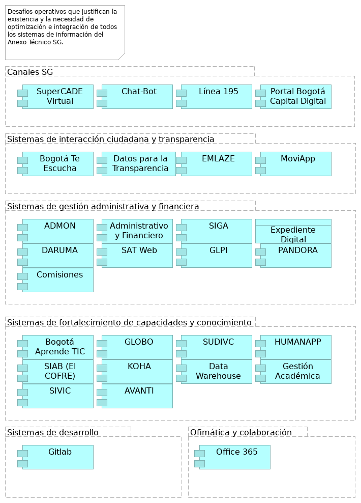
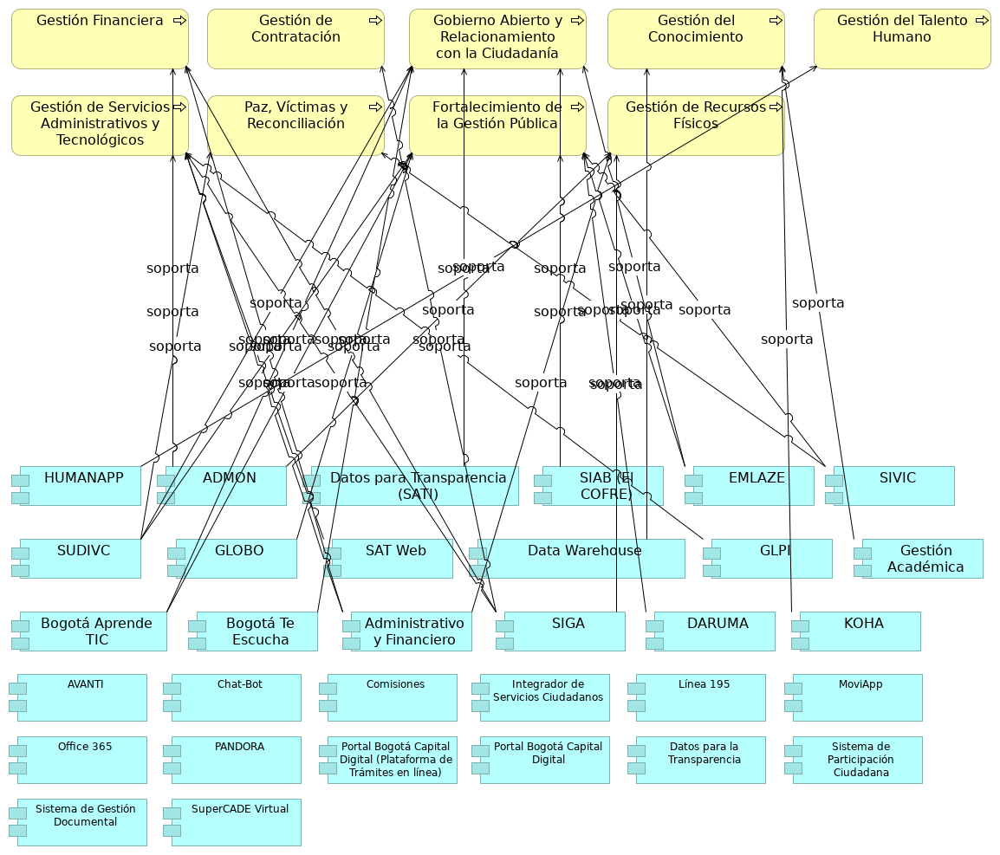

\newpage

# Documentación de Aplicaciones Negocio

## SI del Análisis de Entorno SG

> Desafíos operativos y estratégicos que justifican la necesidad de optimización e integración de sistemas de información SG (Análisis de Entorno, PETI 25-27, Anexo Técnico SG).  

 

La consultoría de Arquitectura Empresarial busca fortalecer la alineación de estrategias, procesos y tecnologías, así como impulsar la transformación digital y una gestión pública más eficiente. Esta iniciativa se enmarca en la necesidad de mejorar la satisfacción de los grupos de interés internos y externos.

Las relaciones entre los sistemas de información mencionados en el Anexo Técnico y el contexto del Análisis de Entorno (Resumen Ejecutivo FASE I.pdf) son las siguientes:

* Sistemas de gestión administrativa y financiera (ADMON, Administrativo y Financiero, SIGA, SAT Web, GLPI):
    - Estos sistemas son cruciales para la "Gestión financiera", "Gestión de servicios administrativos y tecnológicos" y "Gestión de recursos físicos".
    - Relación con objetivos: El "Resumen Ejecutivo FASE I.pdf" aborda la necesidad de una gestión pública más eficiente y transparente, la optimización de recursos y la rendición de cuentas. Estos sistemas son habilitadores directos de dichas metas.
    - Relación con problemas: El documento también señala desafíos en el "Entorno Económico" como el déficit fiscal y la necesidad de eficiencia en la inversión pública. Los sistemas administrativos y financieros son fundamentales para una planificación financiera adecuada y una gestión fiscal sostenible.
    - Relación con oportunidades: La recomendación de "simplificación administrativa y coordinación intersectorial" implica la mejora de estos sistemas para reducir duplicidades y estandarizar prácticas, lo que contribuye a una "arquitectura institucional más coherente y eficiente".

* Sistemas de interacción ciudadana y transparencia (Bogotá Te Escucha, Datos para la Transparencia (SATI), EMLAZE):
    - Estos sistemas soportan directamente el proceso de "Gobierno abierto y relacionamiento con la ciudadanía".
    - Objetivos: El "Resumen Ejecutivo FASE I.pdf" destaca el objetivo estratégico "Bogotá confía en su gobierno", que busca ofrecer "servicios amables, ágiles y oportunos". Bogotá Te Escucha es el sistema distrital clave para la gestión de peticiones ciudadanas y la evaluación de la calidad de las respuestas.
    - Problemas: Se reconoce que, si bien hay avances en la atención institucional, persisten desafíos en la "eficiencia operativa, tiempos de respuesta y digitalización de servicios". Estos sistemas son vitales para abordar estas brechas mediante la digitalización de servicios públicos y la automatización de trámites.
    - Oportunidad: "Datos para la Transparencia (SATI)" es clave para la política de "Transparencia, acceso a la información pública y lucha contra la corrupción". La estandarización de procesos y sistemas de información a través de estos sistemas fortalece la confianza ciudadana.

* Sistemas de fortalecimiento de capacidades y conocimiento (Bogotá Aprende TIC, DARUMA, GLOBO, SUDIVC, HUMANAPP, SIAB (El COFRE), KOHA, SIVIC, Data Warehouse AVANTI, Gestión Académica):

#### Relación con Objetivos

- Bogotá Aprende TIC y Gestión Académica abordan la necesidad de "alfabetización digital" y la escasez de talento humano especializado en tecnologías emergentes, como se menciona en el "Entorno Tecnológico".
- DARUMA es el aplicativo donde se gestionan las fichas técnicas de productos y servicios y los riesgos estratégicos. Esto se alinea con la necesidad de una "Gestión del riesgo" efectiva y el "Fortalecimiento de la Gestión Pública" para la toma de decisiones basada en evidencia.
- HUMANAPP es fundamental para la "Gestión del talento humano". El "Resumen Ejecutivo FASE I.pdf" subraya la importancia de la "profesionalización del servicio público" y el "fortalecimiento de capacidades" de los servidores públicos.
- SIAB (El COFRE), KOHA, Data Warehouse AVANTI son cruciales para la "Gestión del conocimiento" y la "Gestión documental y soporte archivístico". El documento enfatiza el "fortalecimiento de las capacidades de generación, análisis y uso estratégico de información" y la necesidad de "sistemas integrados de datos" para la toma de decisiones basada en evidencia. Data Warehouse AVANTI, en particular, facilita el análisis descriptivo, predictivo y prospectivo de los resultados de la gestión.
- SUDIVC y SIVIC apoyan los procesos de "Paz, víctimas y reconciliación" y "Fortalecimiento de la Gestión Pública", abordando las "profundas desigualdades que afectan de manera desproporcionada a poblaciones vulnerables" y contribuyendo a que Bogotá sea un "territorio de paz y reconciliación".

* Sistemas de desarrollo y colaboración (GitLab):

#### Relación con Oportunidades

- GitLab, siendo una plataforma de desarrollo y colaboración, está vinculada con la "Gestión de alianzas e internacionalización de Bogotá".
- El "Resumen Ejecutivo FASE I.pdf" menciona la consolidación de Bogotá como una ciudad con "vocación internacional, atrayendo a profesionales, diplomáticos, académicos y organizaciones" y la necesidad de "fortalecer la arquitectura Internacional del Distrito". GitLab puede ser una herramienta para facilitar la colaboración en proyectos y la gestión de información en el marco de estas alianzas.
- También se alinea con la necesidad de "integración entre plataformas digitales institucionales" y la adopción de nuevas tecnologías para la "transformación digital".

{#fig:id-097745511d984e7eaf02b5ad5a93e7a8 width= height=}

### Elementos del Modelo

| Nombre  | Tipo | Documentación |
|---------|------|---------------|
| Canales SG | Grouping |  |
| Portal Bogotá Capital Digital | Application Component | Portal Integrador de trámites y servicios ofrecidos a la ciudadanía.
 |
| Sistemas de interacción ciudadana y transparencia | Grouping |  |
| MoviApp | Application Component | Sesión levantamiento no. 2.
 |
| Sistemas de gestión administrativa y financiera | Grouping |  |
| Expediente Digital | Data Object | Objeto de datos en la capa de aplicación que representa un expediente electrónico. |
| PANDORA | Application Component | Implementación de temas precontractual y planeación.
 |
| Comisiones | Application Component | Sesión levantamiento no. 1.
 |
| Sistemas de fortalecimiento de capacidades y conocimiento | Grouping |  |
| SIAB (El COFRE) | Application Component | Sistema de Información del Archivo de Bogotá SIAB. Permite automatizar los procesos archivísticos y técnicos que realiza el Archivo, tales como llevar un registro de los Ingresos Documentales (antes área de acopio), para la descripción y catalogación de la documentación, propios del proceso de Gestión de la Función Archivística y del Patrimonio Documental, para su custodia y conservación permanente.
 |
| AVANTI | Application Component | Apoya la Gestión del conocimiento.
 |
| Sistemas de desarrollo | Grouping |  |
| Ofimática y colaboración | Grouping |  |

Table: Elementos de la vista. {#tbl:tblelement-06.2n2.SIdelAnalisisdeEntorno-id}

 

---
lang: en
titlepage: true
titlepage-rule-color: 360049
todo: aun no está lista
...

## Aplicaciones y Procesos SG

> 

 

{#fig:id-7812cd6a3a0d4d5783b00f16f2c5826b width= height=}

### SIAB (El COFRE)
Sistema de Información del Archivo de Bogotá SIAB. Permite automatizar los procesos archivísticos y técnicos que realiza el Archivo, tales como llevar un registro de los Ingresos Documentales (antes área de acopio), para la descripción y catalogación de la documentación, propios del proceso de Gestión de la Función Archivística y del Patrimonio Documental, para su custodia y conservación permanente.

### AVANTI
Apoya la Gestión del conocimiento.

### Comisiones
Sesión levantamiento no. 1.

### Integrador de Servicios Ciudadanos
Plataforma unificada para acceder a diversos servicios y trámites ciudadanos.

### MoviApp
Sesión levantamiento no. 2.

### PANDORA
Implementación de temas precontractual y planeación.

### Plataforma de Trámites en Línea
Componente de aplicación que permite la realización de trámites digitales.

### Portal Bogotá Capital Digital
Portal Integrador de trámites y servicios ofrecidos a la ciudadanía.

### Portal de datos para la transparencia
Plataforma que facilita el acceso público a datos e información gubernamental.

### Sistema de Participación Ciudadana
Componente de aplicación para facilitar la interacción y el feedback de los ciudadanos.

### Sistema de Gestión Documental
Componente de aplicación para la gestión electrónica de documentos.

---
lang: en
titlepage: true
titlepage-rule-color: 360049
todo: aun no está lista
...

