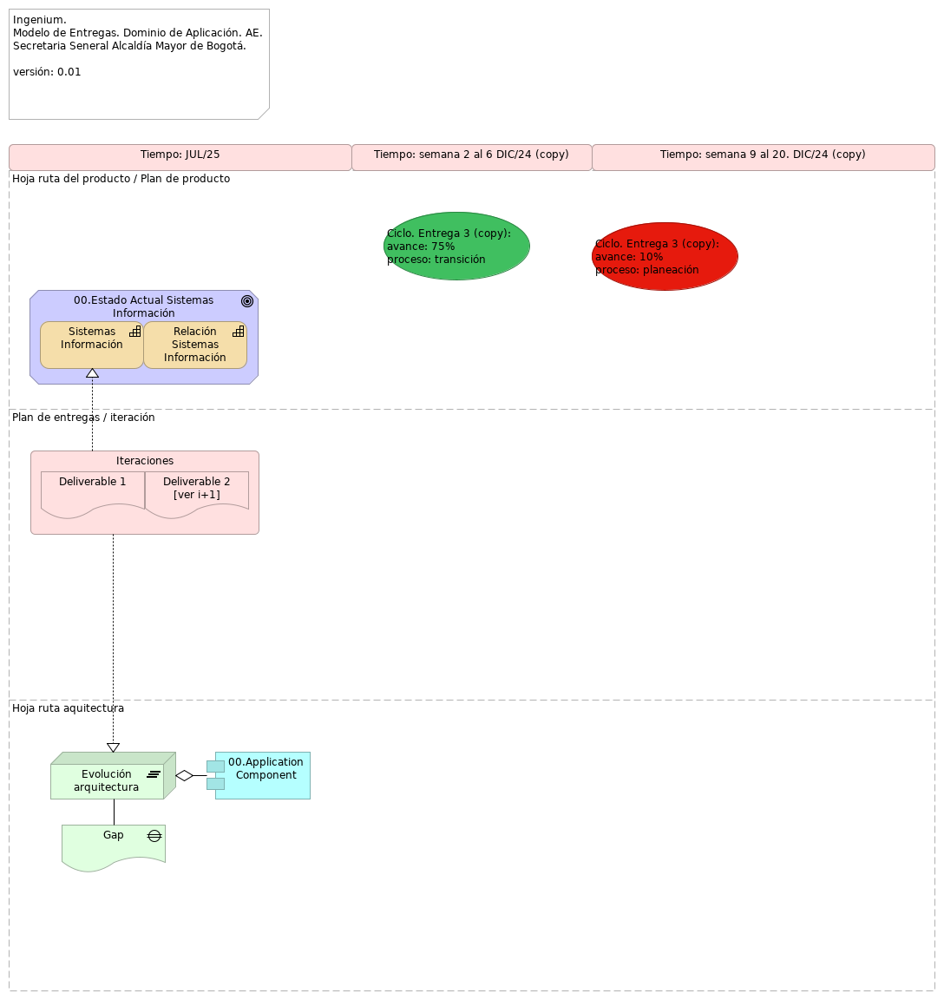

\newpage

# Información del Documento

Esta es la doc del grupo.

## Versión del Documento

> 

 

---
title: Propuesta de Servicios Secretaria de la Alcaldía de Bogotá
subtitle: Evaluación y Hoja de Ruta de la Arquitectura del Canal Bancario Whatsapp
subject: Proyecto de Evaluación y Hoja de Ruta Arquitectura
author: SoftProductiva.com
date: 2025-01-20
keywords: [Arquitectura, Evaluación, Diseño, Hoja de ruta, Transición]
geometry:
  - top=1.3in
  - bottom=1in
  - left=1in
  - right=1in
fignos-cleveref: True
fignos-plus-name: Fig.
fignos-caption-name: Imagen
tablenos-caption-name: Tabla
titlepage-background: include/background2.pdf
titlepage-logo: include/logo.png
logo-width: 60mm
listings-no-page-break: true
...

Versión actual 1.5052e67 - Compilación para entrega: accion-actualizacionContd (4b9a95d) - Sun, 20 Jul 2025 16:25:24 +0000 

## Control de Cambios
Historia de cambios del documento.

1.3299b8a - Compilación para entrega: accion-actualizacionContd (242a172) - Sat, 19 Jul 2025 14:36:02 +0000

1.a7d6c8a - Compilación para entrega: accion-actualizacionContd (909ff9b) - Sat, 19 Jul 2025 13:18:30 +0000

1.824e468 - Compilación para entrega: accion-actualizacionContd (909ff9b) - Sat, 19 Jul 2025 13:10:41 +0000

1.269eabf - Compilación para entrega: accion-actualizacionContd (909ff9b) - Fri, 18 Jul 2025 22:38:34 +0000

### Realizado Por
(creador)

### Revisado Por
(revisor), Arquitectura de Aplicaciones

---
lang: en
titlepage: true
titlepage-rule-color: 360049

...

\newpage

# Servicios de Ingeniería Arquitectura de Aplicaciones Secretaria de la Alcaldía de Bogotá

## 03.ENTRG.1n. Modelo de Entregas

> Ingenium.  Modelo de Entregas. Dominio de Aplicación. AE. Secretaria Seneral Alcaldía Mayor de Bogotá.   

 

{#fig:id-b7aa07be1bf34794b7ab18f800fd4d63 width=5in height=}

### Elementos del Modelo

| Nombre  | Tipo | Documentación |
|---------|------|---------------|
| Hoja ruta del producto / Plan de producto | Grouping |  |
| Ciclo. Entrega 3 | Value | Versión 2.1. Solución integración JEP. |
| Ciclo. Entrega 3 | Value | Versión 1.1. Solución integración JEP. |
| Plan de entregas / iteración | Grouping |  |
| Deliverable 1 | Deliverable | Definición de la Arquitectura de Referencia de la Entidad (situación actual del dominio aplicaciones, referencia cero). |
| Deliverable 2 [ver i+1] | Deliverable | (...) que contenga el modelo de alto nivel, en el cual se visualicen sistemas de información existentes y su interrelación. |
| Hoja ruta arquitectura | Grouping |  |

Table: Elementos de la vista. {#tbl:tblelement-03.ENTRG.1n.ModelodeEntregas-id}

 

---
lang: en
titlepage: true
titlepage-rule-color: 360049
todo: aun no está lista
...

