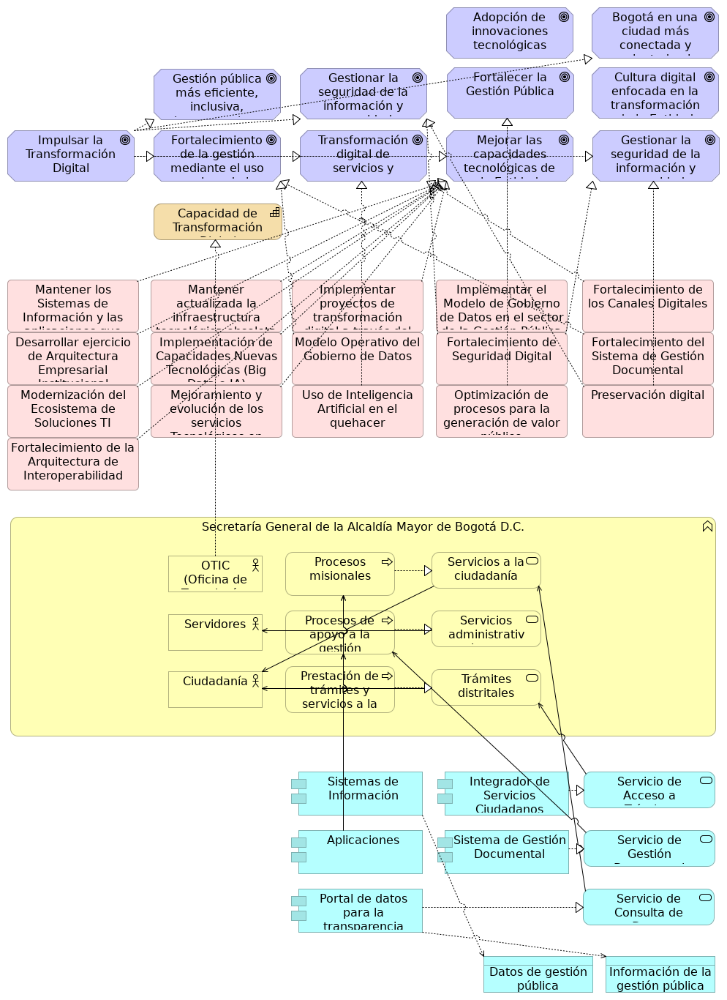
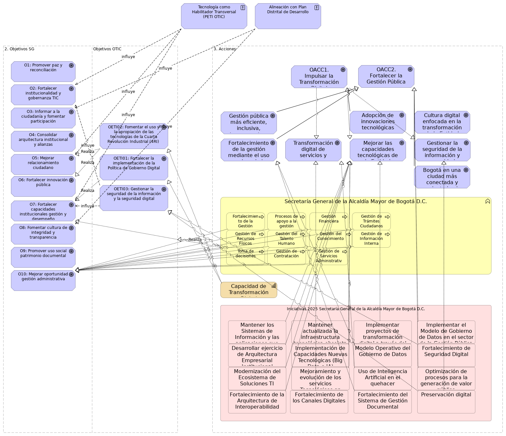
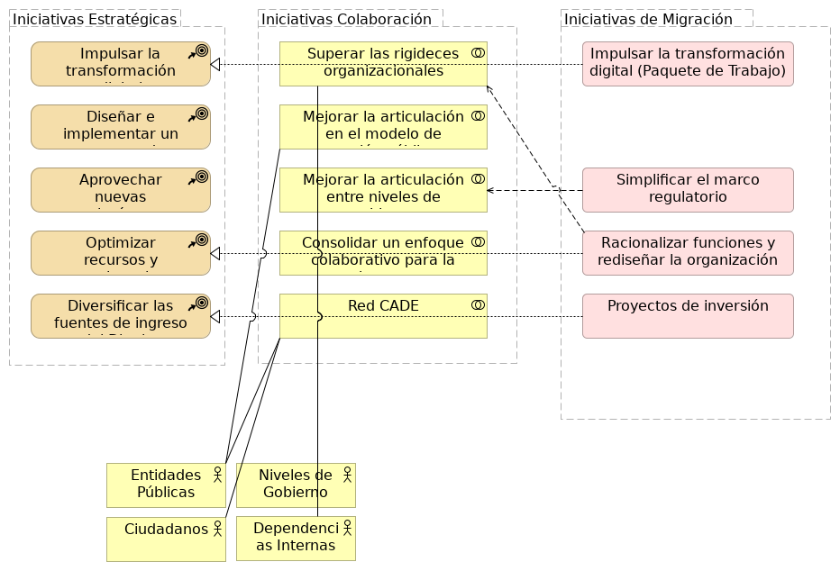
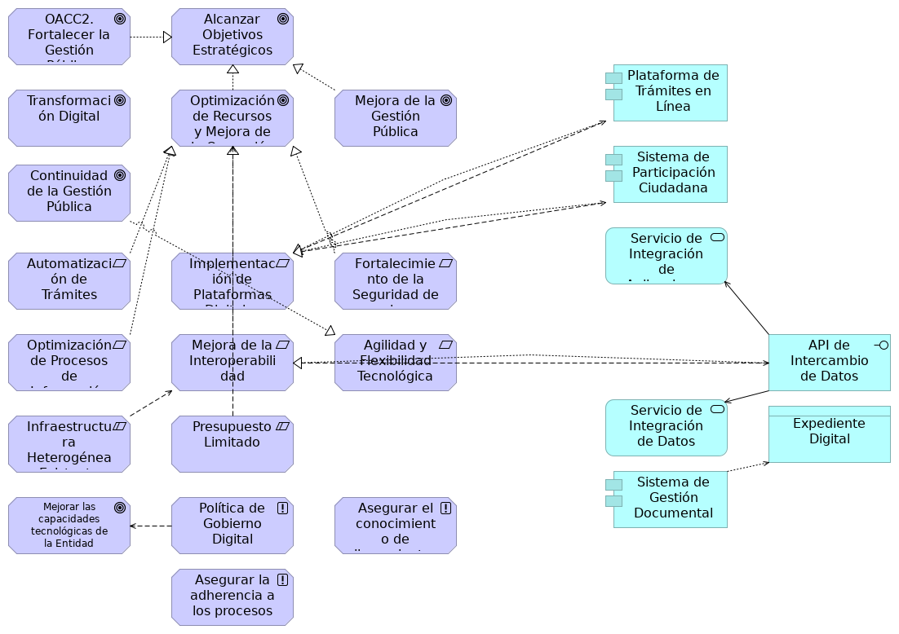
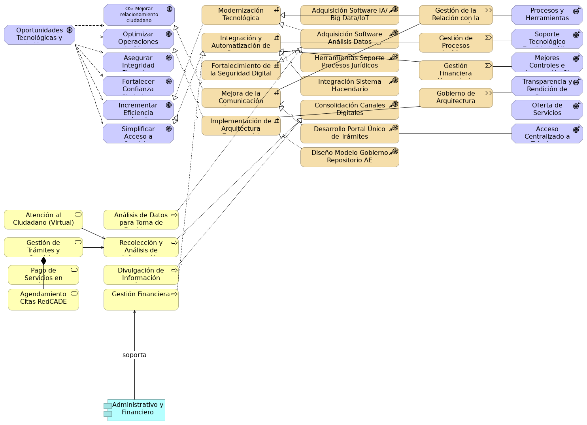

## Entregables Fase I de la Visión AE de SG

> 

 

{#fig:id-0993b3b264144f84abe5c7031666fede width= height=}

### Visión

### Contexto de Arquitectura de Sistemas de Información SG
Desde el dominio de aplicaciones y sistemas de información de la Secretaría General, llamada en adelante “la arquitectura de sistemas de Información de SG”, buscamos adelantar las especificaciones de las arquitecturas objetivo de los sistemas de información de Secretaria de la Alcaldía de Bogotá que soporten la arquitectura de negocio y datos, en línea y dentro del alcance de la visión establecida en el primer entregable de este ejercicio de arquitectura empresarial de SG (AESG).

En particular, la arquitectura de sistemas de información de SG se plantea, dentro del alcance de la visión del ejercicio:

* Definir la arquitectura de las aplicaciones (SI) necesarias para soportar los procesos de negocio de SG.
* Identificar las funciones de negocio que deben ser soportadas por las aplicaciones de SG.
* Establecer la interacción y el flujo de información entre las diferentes aplicaciones de SG.
* Considerar aspectos sistémicos como la escalabilidad, el rendimiento, la mantenibilidad y la seguridad de las aplicaciones de SG.
* Listar los capacidades de negocio (servicios de aplicación) relacionadas con las arquitecturas de aplicaciones de SG.

De esta manera, la arquitectura de sistemas de SG contribuye a la consecución de la visión de este ejercicio de arquitectura empresarial SG (AESG); y en lo específico, contribuye a los fines de la arquitectura de negocio y tecnológica de SG, a delinear oportunidades y soluciones, y a soportar la planeación de la migración. Todo lo anterior dentro del alcance consignado en este ejercicio.

#### Alcance
El presente ejercicio de la arquitectura dominio de aplicaciones toma como alcance horizontal las áreas o unidades siguientes de la SG (_fuente: sesiones de levantamiento, entrevistas, y cuestionarios compartidos en el mes de julio del 2025, junto con la recopilación estructurada de las fuentes de información y organigramas_):

Unidades de negocio del alcance del dominio:

* Secretaría Privada
    * Oficina Consejería Distrital de Comunicación. César Augusto Castro Rodríguez
    * Oficina Consejería Distrital de Tecnologías de la Información y las Comunicaciones -TIC. Diana Celis Mora
* Despacho del Secretario General. Miguel Andrés Silva Moyano
    * Oficina de Tecnologías de la Información y las Comunicaciones. Arleth Patricia Saurith Contreras
    * Subsecretaría Distrital de Fortalecimiento Institucional. Alejandra Rodas Gaiter
        * Dirección Distrital de Desarrollo Institucional. Sebastian Estrada Jaramillo
            * Subdirección Técnica de Desarrollo Institucional. Diego Canesco Arenas
    * Subsecretaría de Servicio a la Ciudadanía . Adriana Vargas Tamayo
        * Dirección del Sistema Distrital de Servicio a la Ciudadanía. Enrique Cusba García
    * Subsecretaría Corporativa. Henry Villamarín Serrano
    * Subsecreataría de Servicios Ciudadanos (…)
    * Subsecreataría de Inversión y FF (…)
    * Subsecreataría de Operaciones
    * Subsecreataría de Relaciones Internacionales (…)

En cuanto al alcance vertical, las aplicaciones de software que están consignadas en este ejercicio son las siguientes (_fuente: sesiones de levantamiento, entrevistas, y cuestionarios compartidos en el mes de julio del 2025, junto con la recopilación estructurada de las fuentes de información_):

* ADMON: Se relaciona con la gestión financiera, gestión de servicios administrativos y tecnológicos, y gestión de recursos físicos45.
* Administrativo y Financiero: Soporta la gestión financiera, gestión de servicios administrativos y tecnológicos, y gestión de recursos físicos
* Bogotá Te Escucha: Es fundamental para el proceso de Gobierno abierto y relacionamiento con la ciudadanía5. También se menciona como el Sistema Distrital para la Gestión de Peticiones Ciudadanas, a través del cual se evalúa la calidad de las respuestas emitidas a la ciudadanía
* Bogotá Aprende TIC: Apoya los procesos de Gobierno abierto y relacionamiento con la ciudadanía, y Fortalecimiento de la Gestión Pública
* DARUMA: Se utiliza en el proceso de Fortalecimiento de la Gestión Pública5. También es el aplicativo donde se encuentran definidas las fichas técnicas de productos y servicios de la Secretaría General8 y se gestionan los riesgos estratégicos
* SIGA: Interviene en la gestión de contratación, gestión financiera, gestión de servicios administrativos y tecnológicos, y gestión de recursos físicos
* SAT Web: Relacionado con la gestión de servicios administrativos y tecnológicos
* GLOBO: Utilizado en el proceso de Fortalecimiento de la Gestión Pública
* Datos para la Transparencia (SATI): Soporta el proceso de Gobierno abierto y relacionamiento con la ciudadanía
* SUDIVC: Se aplica en los procesos de Gobierno abierto y relacionamiento con la ciudadanía, Paz, víctimas y reconciliación, y Fortalecimiento de la Gestión Pública
* HUMANAPP: Apoya la gestión del talento humano
* SIAB (El COFRE): Utilizado en los procesos de Gobierno abierto y relacionamiento con la ciudadanía, y Fortalecimiento de la Gestión Pública
* KOHA: Relacionado con la Gestión del conocimiento
* SIVIC: Interviene en los procesos de Paz, víctimas y reconciliación, y Fortalecimiento de la Gestión Pública
* Data Warehouse AVANTI: Apoya la Gestión del conocimiento
* Gestión Académica: Relacionado con la Gestión del conocimiento
* EMLAZE: Utilizado en los procesos de Gobierno abierto y relacionamiento con la ciudadanía, y Fortalecimiento de la Gestión Pública
* GLPI: Soporta la gestión de servicios administrativos y tecnológicos
* GitLab: Se relaciona con la Gestión de alianzas e internacionalización de Bogotá

### Matriz de Sistemas de Información vs Procesos de Negocio
Las matrices del dominio de aplicaciones de software y sistemas de información (SI) de SG son herramientas para el relacionamiento con otros dominios del ejercicio de arquitectura empresarial de SG. Con esto conseguimos soportar la toma decisiones de lo que debe ser compartido de los SI dentro de la Secretaría, y entre sus aplicaciones de software. Las matrices de este ejercicio sirven además para comunicar el grado de relacionamiento de los elementos.

En resumen,

* Las matrices son cruciales para especificar cómo debe relacionarse la información entre los sistemas y otros dominios
* proporcionan información crítica para los proyectos que involucren a los sistemas de SG.
* Contribuye a la determinación de brechas (gaps) en las necesidades de compartir información (o funciones de los sistemas) ente los elementos de la matriz. 
* La matriz ayuda a definir el nivel de detalle de lo que se comparte.
* Se deben establecer medidas similares para la interoperabilidad de servicios/negocios y la infraestructura (tecnología física).
* Sintetizan la información de las arquitecturas, y son simples para compartir documentos.

Las matrices de este dominio (procesos e interoperabilidad) actúan como una hoja de ruta para la conectividad y el intercambio de información; inician desde una perspectiva de negocio de alto nivel y van hasta una especificación técnica detallada del la interacción con los sistemas. Sirven como herramienta de comunicación para los demás dominios de la arquitectura empresarial de SG, y contribuyen a que las interacciones relevantes entre servicios, canales, y procesos estén definidas y sean compatibles.

### Catálogo de Sistemas de Información
En el contexto de TOGAF, El Catálogo de sistemas de información es un inventario detallado y documentado que actúa como ficha técnica de los sistemas de información o aplicaciones de software de SG. 

Es un producto entregable clave de la fase de Arquitectura de Aplicaciones dentro de la Fase 3 de este ejercicio de arquitectura empresarial (AE). Forma parte del Marco de Referencia del Contenido Arquitectónico de TOGAF y del Marco de Arquitectura de Referencia del MinTIC (MAE 3.0, Colombia).

La construcción del catálogo de aplicaciones implican a las sesiones de levantamiento, entrevistas, y cuestionarios compartidos en el mes de julio, junto con la recopilación estructurada de las fuentes de información sobre cada sistema.

#### Contenido Mínimo del Catálogo

* ID de Aplicación. Código de identificación de la aplicación de software.
* Nombre de la Aplicación. Nombre de identificación de la aplicación de software.
* Descripción. Funcionamiento básico de la aplicación de software.
* Estado: [En producción, en desmantelamiento, en implementación, Inactiva]
* Categoría: [Sistema de apoyo al negocio (misional), herramienta de gestión, Ofimática, Seguridad] 
* Proceso(s) de Negocio Clave(s)
* Capacidad: Capacidades de nivel 2 relacionadas con la aplicación de software.
* Tipo de aplicación: Web, Móvil, Cliente Servidor 
* Método de despliegue: on-premises, cloud SAAS, cloud PAAS, cloud IAAS 
* Tecnología. Aspectos técnicos de la aplicación de software.
* Versión actual de la tecnología
* Responsable técnico en la entidad
* Responsable funcional en la entidad
* Fabricante
* Proveedor de soporte externo
* Fecha de vigencia de soporte externo
* Nombre de servidor. Nombre de red del entorno o nodo contenedor de la aplicación de software. 
* Criticidad de negocio

El Catálogo de aplicaciones de SG procura beneficios estratégicos y operativos:

* Unifica la documentación y la comunicación: Es un artefacto clave para documentar, comprender y comunicar el panorama actual y futuro de las aplicaciones.
* Base para la toma de decisiones: Sirve como base para la toma de decisiones en la gestión y gobierno de las capacidades de los sistemas de SG, y del portafolio y ciclo de vida de las aplicaciones.
* Facilita la actualización continua: Permite la actualización continua de las características y atributos relevantes de los sistemas de información.

### Necesidades SI de SG
La construcción de lista de necesidades, preocupaciones y oportunidades implican a las sesiones de levantamiento, entrevistas, y cuestionarios compartidos en el mes de julio, junto con la recopilación estructurada de las fuentes de información sobre cada sistema.

#### Necesidades de Transformación Digital y Tecnológica
La transformación digital (objetivo estratégico de SG)  es un motor fundamental para alinear las estrategias, procesos y tecnologías de la Secretaría General. Esta transformación busca:

* Impulsar la transformación digital para alinear estrategias, procesos y tecnologías, que resulte en el aumento de eficiencia de la gestión pública.
* Cerrar las brechas en la Política de Gobierno Digital, de la cual la Arquitectura Empresarial es un habilitador clave.
* Modernizar la infraestructura tecnológica que resulte del análisis de obsolescencia para asegurar su continuidad y disponibilidad.
* Integrar plataformas y ecosistemas digitales y superar la falta de interoperabilidad.
* Aumentar la automatización de los trámites digitales.
* Estandarizar la gestión y gobernanza de datos públicos.
* Mejorar el soporte que los SI dan a la toma de decisiones basada en evidencia.
* Generar análisis predictivos y prospectivos de resultados de gestión, que son insumos para la toma de decisiones.
* Contar con disponibilidad de personal adecuado para actualizar plataformas tecnológicas y gestionar las cargas de trabajo.
* Aprovechar nuevas tecnologías como la Inteligencia Artificial, la minería de datos, el procesamiento del lenguaje, para mejorar los procesos y la relación con la ciudadanía.

* Abordar los altos costos de la tecnología que limitan la implementación de sistemas avanzados. (??)
* Fortalecer la ciberseguridad y seguridad de la información para proteger la integridad, disponibilidad y confidencialidad de los datos y prevenir ataques.

#### Necesidades Específicas del Dominio de Aplicaciones de software
Esta tipo de necesidades refiere al comportamiento de las aplicaciones que apoyan la misionalidad, a su estructura, y su relación con los objetos de datos que utilizan.

Para los Componentes de Aplicación (Application Component) y Servicios de Aplicación (Application Service) de SG:

* Adquirir software especializado en análisis de datos: implica la necesidad de incorporar de nuevos componentes de aplicación (Application Component).
* Integrar plataformas y ecosistemas digitales :requiere reforzar la relación entre componentes de aplicación y la exposición de servicios de aplicación (Application Service), y clicar los lineamientos del Marco de Referencia de AE, versión 3.0 al momento, del MinTIC.
* Mejorar la capacidad de las herramientas tecnológicas para el soporte a la toma de decisiones y la gestión: requiere la mejora de las Funcionalidad (Application Function) y Componentes de Aplicación actuales asociadas a esta capacidad.

### Preocupaciones SI de SG
Con base en el estudio de las sesiones de levantamiento, entrevistas, y cuestionarios compartidos en el mes de julio, junto con la recopilación estructurada de las fuentes de información sobre cada sistema, identificamos las siguientes preocupaciones (y debilidades) de SG relacionadas con el dominio de sistemas de información, dentro del alcance de este ejercicio.

Las preocupaciones tecnológicas respecto de los sistemas de información de SG mencionadas en estas fuentes señalan:

* Deficiente apropiación del conocimiento en procesos de tecnologías de la información, lo que genera demora en la solución de los servicios de tecnologías de la información.
* Equipos tecnológicos en proceso de mitigar la obsolescencia, que generan dificultad en la ejecución de las actividades que desarrolla la entidad.
* Fallas recurrentes en el funcionamiento de los sistemas de información y plataformas tecnológicas de la entidad, que afectan la continuidad del servicio y generan retrasos y reprocesos en la ejecución de las actividades.
* Insuficiencia en la capacidad de las herramientas tecnológicas de la entidad que pueden obstaculizar el avance de los iniciativas en marcha de la SG.
* Debilidad en la capacidad de extraer información dinámica que sirva como insumo para la toma de decisiones basado en evidencia.
* Se realizan análisis de datos descriptivos aislados, pero no predictivos y prospectivos de los resultados de la gestión de la entidad, lo que dificulta la toma de decisiones basada en evidencia.
* Falta de personal para actualizar las plataformas tecnológicas, lo que genera retrasos en la operación de la entidad.
* Deficiente conectividad y falta de interoperabilidad de las plataformas tecnológicas.
* Cambios en las plataformas tecnológicas que no interactúan con las anteriores, lo cual expone a la SG a posibles pérdidas de información y reprocesos.
* Apostar más en la mejora continua de la inestabilidad de la conectividad, indisponibilidad de servidores de información y vulnerabilidad en la seguridad informática; lo contrario puede comprometer la operatividad, la integridad de los datos críticos de la entidad y el cumplimiento de las metas.
* Potencial y rápida obsolescencia tecnológica que implica la necesidad de renovación de los equipos y dificulta la prestación de los servicios de la entidad.
* Los altos costos de la tecnología pueden limitar la capacidad de la entidad para implementar y mantener sistemas avanzados y eficientes.

### Oportunidades SI de SG
La construcción de lista de oportunidades mencionadas implica el estudio de las sesiones de levantamiento, entrevistas, y cuestionarios compartidos en el mes de julio, junto con la recopilación estructurada de las fuentes de información al respecto de cada sistema de SG.

Las oportunidades tecnológicas y de mejora de sistemas de información mencionadas indicadas en estas fuentes se centran en:

* Modernización de la infraestructura y sistemas tecnológicos
    * Las nuevas tecnologías, especialmente la Inteligencia Artificial (IA), ofrecen la oportunidad de mejorar los procesos y herramientas de relacionamiento con la ciudadanía. La Secretaría General ya ha empezado a incorporar tecnologías como IA, Big Data, pero debe seguir ampliando ese despliegue, así como incorporar otras, como el Internet de las Cosas (IoT), o la minería de datos en la planificación urbana y la prestación de servicios.
    * Una oportunidad es la adquisición y puesta en producción de software especializado en análisis de datos para la toma de decisiones que ya poseen otras entidades.

* Integración y automatización de procesos
    * Se identifican oportunidades para contar con herramientas que evalúen el soporte tecnológico personalizado, flexible y configurable para las operaciones de los procesos jurídicos.
    * Se buscan mejores controles e integración de sistemas distritales con los canales de la Secretaría General.
    * También se necesitan mejores controles e integración de los sistemas de gestión como los sistemas GLOBO (de gestión internacional), el sistema de proyectos GLPI.

* Mejora de la comunicación pública a través de medios digitales
    * Se busca la consolidación de herramientas, canales e información para fortalecer la oferta y celeridad de servicios y la participación ciudadana. Esto incluye el seguimiento a canales de atención virtual como SuperCADE Virtual, chat, chat-Bot y (video) llamadas de la línea 195.
    * Se busca optimizar los procesos de recolección, análisis y divulgación de la información mediante la implementación de sistemas de información que incluyan la automatización de la recolección de datos y el uso de herramientas analíticas.
    * Es destacado que el Distrito unifica en el portal Bogotá su oferta de trámites y servicios, como el realizar pagos en línea (no tributarios) y agendamiento de citas en la RedCADE desde casa; esfuerzo que debe continuar y extenderse a los  más de 1.400 trámites y servicios. Esto representa una mejora significativa en la accesibilidad y eficiencia de los servicios digitales para la ciudadanía.

* capacitación en nuevas tecnologías y 

* Implementación de la Arquitectura Empresarial como estrategia para impulsar la transformación digital y la eficiencia en la gestión pública de la SG
    * Se espera que la Arquitectura Empresarial fortalezca la transparencia, y aumente la eficiencia de la gestión pública y la rendición de cuentas al estandarizar procesos y sistemas de información. La AE busca realmente impactar el objetivo de aumentar la confianza de la ciudadanía en la Gestión Pública.
    * Es requerido que este ejercicio beneficie a la SG con la entrega de activos como hojas de ruta, catálogos y caracterización de los sistemas de información, matrices de interacción, entre otros.

---
lang: en
titlepage: true
titlepage-rule-color: 360049
todo: aun no está lista
...

\newpage

# Documentación del Dominio de Aplicaciones

## SI del Análisis de Entorno

> Desafíos operativos que justifican la existencia y la necesidad de optimización e integración de todos los sistemas de información del Anexo Técnico SG.  

 

El "Anexo Técnico ADENDA.pdf" detalla la consultoría para implementar la Arquitectura Empresarial, que busca fortalecer la alineación de estrategias, procesos y tecnologías, así como impulsar la transformación digital y una gestión pública más eficiente. Esta iniciativa se enmarca en la necesidad de mejorar la satisfacción de los grupos de interés internos y externos.

El "Resumen Ejecutivo FASE I.pdf" contextualiza estos esfuerzos al analizar el entorno de la gestión pública distrital, identificando brechas, tendencias y oportunidades a través de factores político-institucionales, económicos, sociales, tecnológicos, ecológicos y legales. 

Las relaciones entre los sistemas de información mencionados en el Anexo Técnico y el contexto del Análisis de Entorno (Resumen Ejecutivo FASE I.pdf) son las siguientes:

* Sistemas de gestión administrativa y financiera (ADMON, Administrativo y Financiero, SIGA, SAT Web, GLPI):
    - Estos sistemas son cruciales para la "Gestión financiera", "Gestión de servicios administrativos y tecnológicos" y "Gestión de recursos físicos".
    - Relación con objetivos: El "Resumen Ejecutivo FASE I.pdf" aborda la necesidad de una gestión pública más eficiente y transparente, la optimización de recursos y la rendición de cuentas. Estos sistemas son habilitadores directos de dichas metas.
    - Relación con problemas: El documento también señala desafíos en el "Entorno Económico" como el déficit fiscal y la necesidad de eficiencia en la inversión pública. Los sistemas administrativos y financieros son fundamentales para una planificación financiera adecuada y una gestión fiscal sostenible.
    - Relación con oportunidades: La recomendación de "simplificación administrativa y coordinación intersectorial" implica la mejora de estos sistemas para reducir duplicidades y estandarizar prácticas, lo que contribuye a una "arquitectura institucional más coherente y eficiente".

* Sistemas de interacción ciudadana y transparencia (Bogotá Te Escucha, Datos para la Transparencia (SATI), EMLAZE):
    - Estos sistemas soportan directamente el proceso de "Gobierno abierto y relacionamiento con la ciudadanía".
    - Objetivos: El "Resumen Ejecutivo FASE I.pdf" destaca el objetivo estratégico "Bogotá confía en su gobierno", que busca ofrecer "servicios amables, ágiles y oportunos". Bogotá Te Escucha es el sistema distrital clave para la gestión de peticiones ciudadanas y la evaluación de la calidad de las respuestas.
    - Problemas: Se reconoce que, si bien hay avances en la atención institucional, persisten desafíos en la "eficiencia operativa, tiempos de respuesta y digitalización de servicios". Estos sistemas son vitales para abordar estas brechas mediante la digitalización de servicios públicos y la automatización de trámites.
    - Oportunidad: "Datos para la Transparencia (SATI)" es clave para la política de "Transparencia, acceso a la información pública y lucha contra la corrupción". La estandarización de procesos y sistemas de información a través de estos sistemas fortalece la confianza ciudadana.

* Sistemas de fortalecimiento de capacidades y conocimiento (Bogotá Aprende TIC, DARUMA, GLOBO, SUDIVC, HUMANAPP, SIAB (El COFRE), KOHA, SIVIC, Data Warehouse AVANTI, Gestión Académica):

#### Relación con Objetivos

    - Bogotá Aprende TIC y Gestión Académica abordan la necesidad de "alfabetización digital" y la escasez de talento humano especializado en tecnologías emergentes, como se menciona en el "Entorno Tecnológico".
    - DARUMA es el aplicativo donde se gestionan las fichas técnicas de productos y servicios y los riesgos estratégicos. Esto se alinea con la necesidad de una "Gestión del riesgo" efectiva y el "Fortalecimiento de la Gestión Pública" para la toma de decisiones basada en evidencia.
    - HUMANAPP es fundamental para la "Gestión del talento humano". El "Resumen Ejecutivo FASE I.pdf" subraya la importancia de la "profesionalización del servicio público" y el "fortalecimiento de capacidades" de los servidores públicos.
    - SIAB (El COFRE), KOHA, Data Warehouse AVANTI son cruciales para la "Gestión del conocimiento" y la "Gestión documental y soporte archivístico". El documento enfatiza el "fortalecimiento de las capacidades de generación, análisis y uso estratégico de información" y la necesidad de "sistemas integrados de datos" para la toma de decisiones basada en evidencia. Data Warehouse AVANTI, en particular, facilita el análisis descriptivo, predictivo y prospectivo de los resultados de la gestión.
    - SUDIVC y SIVIC apoyan los procesos de "Paz, víctimas y reconciliación" y "Fortalecimiento de la Gestión Pública", abordando las "profundas desigualdades que afectan de manera desproporcionada a poblaciones vulnerables" y contribuyendo a que Bogotá sea un "territorio de paz y reconciliación".

* Sistemas de desarrollo y colaboración (GitLab):

#### Relación con Oportunidades

    - GitLab, siendo una plataforma de desarrollo y colaboración, está vinculada con la "Gestión de alianzas e internacionalización de Bogotá".
    - El "Resumen Ejecutivo FASE I.pdf" menciona la consolidación de Bogotá como una ciudad con "vocación internacional, atrayendo a profesionales, diplomáticos, académicos y organizaciones" y la necesidad de "fortalecer la arquitectura Internacional del Distrito". GitLab puede ser una herramienta para facilitar la colaboración en proyectos y la gestión de información en el marco de estas alianzas.
    - También se alinea con la necesidad de "integración entre plataformas digitales institucionales" y la adopción de nuevas tecnologías para la "transformación digital".

En síntesis, el "Resumen Ejecutivo FASE I.pdf" proporciona el marco estratégico y los desafíos operativos que justifican la existencia y la necesidad de optimización e integración de todos los sistemas de información mencionados en el "Anexo Técnico ADENDA.pdf". El ejercicio de Arquitectura Empresarial busca cerrar las brechas identificadas y avanzar hacia una gestión pública más eficiente, transparente, digital y centrada en el ciudadano, aprovechando al máximo sus sistemas y tecnologías.

{#fig:id-097745511d984e7eaf02b5ad5a93e7a8 width= height=}

### Canales SG

### Portal Bogotá Capital Digital
Portal Integrador de trámites y servicios ofrecidos a la ciudadanía.
### Sistemas de interacción ciudadana y transparencia

### MoviApp
Sesión levantamiento no. 2.
### Sistemas de gestión administrativa y financiera

### Expediente Digital
Objeto de datos en la capa de aplicación que representa un expediente electrónico.
### PANDORA
Implementación de temas precontractual y planeación.
### Comisiones
Sesión levantamiento no. 1.

### Sistemas de fortalecimiento de capacidades y conocimiento

### SIAB (El COFRE)
Sistema de Información del Archivo de Bogotá SIAB. Permite automatizar los procesos archivísticos y técnicos que realiza el Archivo, tales como llevar un registro de los Ingresos Documentales (antes área de acopio), para la descripción y catalogación de la documentación, propios del proceso de Gestión de la Función Archivística y del Patrimonio Documental, para su custodia y conservación permanente.
### AVANTI
Apoya la Gestión del conocimiento.

### Sistemas de desarrollo

### Ofimática y colaboración

---
lang: en
titlepage: true
titlepage-rule-color: 360049
todo: aun no está lista
...

## Objetivos e Iniciativas. PETI SG

> 

 

Diagrama que muestra la alineación estratégica, los actores de negocio y los principales componentes de aplicación relacionados con la Transformación Digital de la Alcaldía Mayor de Bogotá D.C. Se enfoca en la trazabilidad desde las metas estratégicas hasta los proyectos y los sistemas de información.

{#fig:id-710b67ee56954bd891264181bf9a408f width= height=}

### Adopción de innovaciones tecnológicas para apoyar áreas misionales clave
Objetivo de integrar nuevas tecnologías para mejorar funciones principales.
### Bogotá en una ciudad más conectada y orientada al bienestar de la ciudadanía
Visión a largo plazo para la ciudad impulsada por la digitalización.
### OETI03: Gestionar la seguridad de la información y la seguridad digital
Gestionar la seguridad de la información y la seguridad digital mediante la adopción de políticas, controles y campañas de concienciación que fomenten una cultura digital segura, así como la implementación de estrategias para asegurar la continuidad de los servicios de TIC.
### OACC2. Fortalecer la Gestión Pública
Objetivo de TI de alto nivel optimizar (mejorar la eficiencia y eficacia) los procesos y servicios de la administración pública.

### Cultura digital enfocada en la transformación de la Entidad
Meta de fomentar una mentalidad y habilidades digitales dentro de la organización.
### Gestión pública más eficiente, inclusiva, transparente y confiable
Resultado deseado de una administración pública mejorada para los ciudadanos.
### OACC1. Impulsar la Transformación Digital
Meta principal del PETI, buscando modernizar la entidad a través de tecnologías digitales. Contiene a la Política de Gobierno Digital.
### Fortalecimiento de la gestión mediante el uso y mejora de las tecnologías
Objetivo de mejorar la gestión pública mediante la aplicación de TI.
### Transformación digital de servicios y procesos administrativos
Meta de digitalizar y optimizar los servicios y procesos internos y externos.
### Mejorar las capacidades tecnológicas de la Entidad
Meta de TI para modernizar y potenciar la infraestructura y habilidades tecnológicas.
### Gestionar la seguridad de la información y seguridad digital (objetivo estratégico de TI)
Objetivo de TI para proteger los activos de información y garantizar la ciberseguridad.
### Capacidad de Transformación Digital
Habilidad de la entidad para adaptarse y evolucionar digitalmente.
### Mantener los Sistemas de Información y las aplicaciones que apalanquen los procesos misionales y de apoyo a la gestión
Actividad continua para asegurar la operatividad y soporte de los sistemas de información clave.
### Mantener actualizada la infraestructura tecnológica obsoleta
Proyecto recurrente para asegurar la modernización y sostenibilidad de la infraestructura de TI.
### Implementar proyectos de transformación digital a través del uso de Tecnologías de Cuarta Revolución Industrial (4RI)
Ejecución de iniciativas que adoptan tecnologías avanzadas para la transformación digital.
### Implementar el Modelo de Gobierno de Datos en el sector de la Gestión Pública
Proyecto para poner en práctica el marco de gobernanza de datos en el ámbito público.
### Fortalecimiento de los Canales Digitales
Iniciativa para mejorar la calidad y alcance de los canales de atención digitales.
### Desarrollar ejercicio de Arquitectura Empresarial Institucional
Proyecto para establecer y madurar la práctica de Arquitectura Empresarial en la entidad.
### Implementación de Capacidades Nuevas Tecnológicas (Big Data e IA)
Iniciativa para incorporar tecnologías emergentes de la Cuarta Revolución Industrial para optimizar procesos, impulsar la innovación y garantizar la transformación digital.
### Modelo Operativo del Gobierno de Datos
Proyecto para definir e implementar un marco de gobernanza de datos.
### Fortalecimiento de Seguridad Digital
Iniciativa para proteger la infraestructura y los datos de amenazas digitales.
### Fortalecimiento del Sistema de Gestión Documental
Iniciativa para el desarrollo e implementación de herramientas y procesos avanzados para optimizar la clasificación, almacenamiento, acceso y control de la documentación institucional.
### Modernización del Ecosistema de Soluciones TI
Proyecto para actualizar y optimizar el conjunto de soluciones tecnológicas.
### Mejoramiento y evolución de los servicios Tecnológicos en Nube
Iniciativa para optimizar y expandir el uso de servicios cloud.
### Uso de Inteligencia Artificial en el quehacer
Proyecto para integrar la IA en las operaciones diarias de la entidad.
### Optimización de procesos para la generación de valor público
Proyecto para revisar y mejorar los procesos internos con foco en el valor para el ciudadano.
### Preservación digital
Proyecto para asegurar la conservación y accesibilidad a largo plazo de los activos digitales.
### Fortalecimiento de la Arquitectura de Interoperabilidad
Iniciativa para mejorar la comunicación e integración entre sistemas y entidades.
### Secretaría General de la Alcaldía Mayor de Bogotá D.C.
Entidad principal de la administración distrital.
### Procesos misionales
Procesos clave que definen la razón de ser de la entidad.
### Servicios a la ciudadanía
Conjunto de servicios ofrecidos a los ciudadanos.
### OTIC (Oficina de Tecnologías de la Información y las Comunicaciones)
Área encargada de la gestión de TI y comunicaciones en la Secretaría General.
### Procesos de apoyo a la gestión
Procesos internos que facilitan la operación de la entidad.
### Servicios administrativos internos
Servicios de apoyo para el funcionamiento interno de la entidad.
### Servidores
Personal de la entidad que participa en los procesos de negocio.
### Prestación de trámites y servicios a la ciudadanía
Proceso central para la interacción con los ciudadanos.
### Trámites distritales
Trámites específicos que los ciudadanos pueden realizar.
### Ciudadanía
Actores externos que consumen los servicios de la Alcaldía.
### Sistemas de Información
Conjunto genérico de sistemas que soportan las operaciones de la entidad.
### Integrador de Servicios Ciudadanos
Plataforma unificada para acceder a diversos servicios y trámites ciudadanos.
### Servicio de Acceso a Trámites
Servicio que permite a los ciudadanos iniciar y gestionar trámites en línea.
### Aplicaciones
Software específico utilizado para diversas funciones de negocio.
### Sistema de Gestión Documental
Sistema para la administración y control de documentos digitales.
### Servicio de Gestión Documental
Servicio para la creación, almacenamiento y recuperación de documentos.
### Portal de datos para la transparencia
Plataforma que facilita el acceso público a datos e información gubernamental.
### Servicio de Consulta de Datos
Servicio provisto por el portal de datos para acceder a información pública.
### Datos de gestión pública
Información general utilizada en los procesos de la administración pública.
### Información de la gestión pública
Conjunto de datos e información relevante para la transparencia y la toma de decisiones.

---
lang: en
titlepage: true
titlepage-rule-color: 360049
todo: aun no está lista
...

## Objetivos Estratégicos SG-OTIC

> 

 

Alineación entre los objetivos estratégicos de la Secretaría General de la Alcaldía Mayor de Bogotá D.C. (SG) y los objetivos de la Oficina de Tecnologías de la Información y las Comunicaciones (OTIC). *Muestra cómo los esfuerzos de TI (objetivos accionables, personas y procesos e iniciativas) habilitan las metas institucionales de alto nivel*.

{#fig:id-b8b0ab13210747768416c9981a70a62a width= height=}

### Tecnología como Habilitador Transversal (PETI OTIC)
El PETI de la OTIC busca que la tecnología sea un habilitador transversal para una gestión pública más eficiente, inclusiva, transparente y confiable, optimizando los trámites y servicios ofrecidos a la ciudadanía. Para ello, la integración de las tecnologías debe estar alineada con el direccionamiento estratégico y la planeación institucional de la Entidad.
### Alineación con Plan Distrital de Desarrollo
El PETI está alineado con las políticas y lineamientos del Plan Distrital de Desarrollo “Bogotá camina segura 2024-2027”, especialmente con su Objetivo 5: "Bogotá confía en su gobierno", que busca promover la confianza en la administración distrital.
### 2. Objetivos SG

### O1: Promover paz y reconciliación
Promover la paz y la reconciliación en Bogotá a través de la integración local de las poblaciones afectadas por el conflicto armado, buscando la superación de sus condiciones de vulnerabilidad y la reconstrucción del tejido social en la ciudad.
### O2: Fortalecer institucionalidad y gobernanza TIC
Fortalecer la institucionalidad y gobernanza para impulsar y coordinar el uso de las Tecnologías de la Información y las Comunicaciones (TIC), con el fin de establecer un marco normativo, habilitar la infraestructura, promover el talento digital y crear procesos eficientes para la prestación de servicios ciudadanos y la transformación de la administración pública.
### O3: Informar a la ciudadanía y fomentar participación
Informar a la ciudadanía mediante campañas y estrategias de comunicación sobre temas de ciudad, para fomentar la participación ciudadana y la transparencia de la gestión pública.
### O4: Consolidar arquitectura institucional y alianzas
Desarrollar y consolidar la arquitectura institucional, los instrumentos de política pública y las alianzas estratégicas necesarias para posicionar a Bogotá como una ciudad globalmente accesible y abierta al mundo.
### O5: Mejorar relacionamiento ciudadano
Mejorar el relacionamiento de la ciudadanía con el gobierno distrital a través del fortalecimiento de la oferta institucional, la modernización de los canales de atención y la cualificación del talento humano, contribuyendo al aumento de la confianza y satisfacción ciudadana.
### O6: Fortalecer innovación pública
Fortalecer los procesos de innovación pública en las entidades distritales, facilitando habilitadores, desarrollando capacidades en intraemprendimiento, promoviendo el trabajo colaborativo y la articulación entre actores públicos y privados.
### O7: Fortalecer capacidades institucionales gestión y desempeño
Fortalecer las capacidades institucionales para la implementación de las políticas de gestión y desempeño, con el objetivo de generar valor público, contribuir a la solución de los retos de la ciudad y promover la participación ciudadana.
### O8: Fomentar cultura de integridad y transparencia
Fomentar una cultura de integridad, transparencia y ética pública en la Administración Distrital.
### O9: Promover uso social patrimonio documental
Promover la apropiación y uso social del patrimonio documental del Distrito Capital, mediante su protección, conservación, adecuada gestión y fácil acceso por parte de la ciudadanía.
### O10: Mejorar oportunidad gestión administrativa
Mejorar la oportunidad en la gestión administrativa, garantizando la adquisición de bienes y servicios que satisfagan las necesidades de la entidad y la ciudadanía, en el marco de la optimización de los recursos asignados.
### Objetivos OTIC

### OETI02: Fomentar el uso y la apropiación de las tecnologías de la Cuarta Revolución Industrial (4RI) 
Fomentar el uso y la apropiación de las tecnologías de la Cuarta Revolución Industrial (4RI) para impulsar la transformación digital en la Secretaría General, integrando tecnologías emergentes que optimicen los procesos, promuevan la innovación y mejoren la eficiencia en la gestión pública.
### OETI01: Fortalecer la implementación de la Política de Gobierno Digital
Fortalecer la implementación de la Política de Gobierno Digital para promover la transformación digital en la Secretaría General, y optimizar las capacidades tecnológicas, con el fin de garantizar una gestión pública eficiente, transparente y accesible para la ciudadanía.
### OETI03: Gestionar la seguridad de la información y la seguridad digital
Gestionar la seguridad de la información y la seguridad digital mediante la adopción de políticas, controles y campañas de concienciación que fomenten una cultura digital segura, así como la implementación de estrategias para asegurar la continuidad de los servicios de TIC.
### 3. Acciones

### OACC2. Fortalecer la Gestión Pública
Objetivo de TI de alto nivel optimizar (mejorar la eficiencia y eficacia) los procesos y servicios de la administración pública.

### OACC1. Impulsar la Transformación Digital
Meta principal del PETI, buscando modernizar la entidad a través de tecnologías digitales. Contiene a la Política de Gobierno Digital.
### Adopción de innovaciones tecnológicas para apoyar áreas misionales clave
Objetivo de integrar nuevas tecnologías para mejorar funciones principales.
### Cultura digital enfocada en la transformación de la Entidad
Meta de fomentar una mentalidad y habilidades digitales dentro de la organización.
### Gestión pública más eficiente, inclusiva, transparente y confiable
Resultado deseado de una administración pública mejorada para los ciudadanos.
### Fortalecimiento de la gestión mediante el uso y mejora de las tecnologías
Objetivo de mejorar la gestión pública mediante la aplicación de TI.
### Transformación digital de servicios y procesos administrativos
Meta de digitalizar y optimizar los servicios y procesos internos y externos.
### Mejorar las capacidades tecnológicas de la Entidad
Meta de TI para modernizar y potenciar la infraestructura y habilidades tecnológicas.
### Gestionar la seguridad de la información y seguridad digital (objetivo estratégico de TI)
Objetivo de TI para proteger los activos de información y garantizar la ciberseguridad.
### Bogotá en una ciudad más conectada y orientada al bienestar de la ciudadanía
Visión a largo plazo para la ciudad impulsada por la digitalización.
### Secretaría General de la Alcaldía Mayor de Bogotá D.C.
Entidad principal de la administración distrital.
### Procesos de apoyo a la gestión
Procesos internos que facilitan la operación de la entidad.
### Gestión de Trámites Ciudadanos
Proceso de atención y resolución de solicitudes y gestiones de los ciudadanos.
### Gestión de Información Interna
Proceso de recolección, procesamiento y distribución de información dentro de la entidad.
### Toma de decisiones
Proceso fundamental para la dirección estratégica y operativa de la entidad.
### Capacidad de Transformación Digital
Habilidad de la entidad para adaptarse y evolucionar digitalmente.
### Iniciativas 2025 Secretaría General de la Alcaldía Mayor de Bogotá D.C.
Iniciativas y proyectos en marcha de la entidad principal de la administración distrital, período 2025.
### Mantener los Sistemas de Información y las aplicaciones que apalanquen los procesos misionales y de apoyo a la gestión
Actividad continua para asegurar la operatividad y soporte de los sistemas de información clave.
### Mantener actualizada la infraestructura tecnológica obsoleta
Proyecto recurrente para asegurar la modernización y sostenibilidad de la infraestructura de TI.
### Implementar proyectos de transformación digital a través del uso de Tecnologías de Cuarta Revolución Industrial (4RI)
Ejecución de iniciativas que adoptan tecnologías avanzadas para la transformación digital.
### Implementar el Modelo de Gobierno de Datos en el sector de la Gestión Pública
Proyecto para poner en práctica el marco de gobernanza de datos en el ámbito público.
### Desarrollar ejercicio de Arquitectura Empresarial Institucional
Proyecto para establecer y madurar la práctica de Arquitectura Empresarial en la entidad.
### Implementación de Capacidades Nuevas Tecnológicas (Big Data e IA)
Iniciativa para incorporar tecnologías emergentes de la Cuarta Revolución Industrial para optimizar procesos, impulsar la innovación y garantizar la transformación digital.
### Modelo Operativo del Gobierno de Datos
Proyecto para definir e implementar un marco de gobernanza de datos.
### Fortalecimiento de Seguridad Digital
Iniciativa para proteger la infraestructura y los datos de amenazas digitales.
### Modernización del Ecosistema de Soluciones TI
Proyecto para actualizar y optimizar el conjunto de soluciones tecnológicas.
### Mejoramiento y evolución de los servicios Tecnológicos en Nube
Iniciativa para optimizar y expandir el uso de servicios cloud.
### Uso de Inteligencia Artificial en el quehacer
Proyecto para integrar la IA en las operaciones diarias de la entidad.
### Optimización de procesos para la generación de valor público
Proyecto para revisar y mejorar los procesos internos con foco en el valor para el ciudadano.
### Fortalecimiento de la Arquitectura de Interoperabilidad
Iniciativa para mejorar la comunicación e integración entre sistemas y entidades.
### Fortalecimiento de los Canales Digitales
Iniciativa para mejorar la calidad y alcance de los canales de atención digitales.
### Fortalecimiento del Sistema de Gestión Documental
Iniciativa para el desarrollo e implementación de herramientas y procesos avanzados para optimizar la clasificación, almacenamiento, acceso y control de la documentación institucional.
### Preservación digital
Proyecto para asegurar la conservación y accesibilidad a largo plazo de los activos digitales.

---
lang: en
titlepage: true
titlepage-rule-color: 360049
todo: aun no está lista
...

## Iniciativas

> 

 

El modelo de diagrama ArchiMate denominado "06.Estrategia. Iniciativas" se posiciona como un componente clave para visualizar y comunicar la transformación estratégica de la organización. Su propósito central es ilustrar cómo los objetivos de alto nivel se desglosan en planes de acción concretos o "iniciativas", conectando así la visión estratégica con la ejecución. Este tipo de diagrama es fundamental para alinear los esfuerzos y las inversiones empresariales, asegurando que cada proyecto y programa contribuya directamente a la consecución de las metas corporativas.

Un modelo de "Estrategia. Iniciativas" bien estructurado es un activo invaluable para la gestión del portafolio de proyectos, la toma de decisiones informadas sobre la asignación de recursos y la comunicación efectiva de la hoja de ruta estratégica a todos los niveles de la empresa, impulsando la coherencia y el éxito en la implementación.

{#fig:id-cc506af7ae2e4eadbe0ef317bcdce54d width= height=}

### Iniciativas Estratégicas

### Impulsar la transformación digital
Enfoque estratégico para la modernización de los procesos y servicios mediante tecnologías digitales.
### Diseñar e implementar un esquema de gobernanza de territorio inteligente
Define las directrices y estructuras para la gestión de un ecosistema urbano inteligente.
### Aprovechar nuevas tecnologías como la Inteligencia Artificial
Estrategia para integrar y explotar tecnologías emergentes en beneficio de la gestión pública.
### Optimizar recursos y mejorar la operación
Enfoque para maximizar la eficiencia en el uso de los recursos disponibles y mejorar el rendimiento operativo.
### Diversificar las fuentes de ingreso del Distrito
Estrategia para explorar y desarrollar nuevas vías de financiación para el Distrito.
### Iniciativas Colaboración

### Superar las rigideces organizacionales
Colaboración orientada a eliminar barreras estructurales que impiden la agilidad y eficiencia de la entidad.
### Mejorar la articulación en el modelo de gestión pública
Colaboración para integrar y coordinar mejor las diferentes áreas y procesos de la gestión pública.
### Mejorar la articulación entre niveles de gobierno
Colaboración enfocada en una mayor coordinación y cooperación entre los distintos niveles de la administración pública.
### Consolidar un enfoque colaborativo para la gobernanza metropolitana
Colaboración para establecer una visión y gestión unificada de los asuntos metropolitanos.
### Red CADE
Red de colaboración entre entidades para la prestación de servicios de atención presencial a ciudadanos.
### Iniciativas de Migración

### Impulsar la transformación digital (Paquete de Trabajo)
Conjunto de actividades para iniciar y desarrollar la transformación digital de la entidad.
### Simplificar el marco regulatorio
Paquete de trabajo enfocado en la revisión y simplificación de las normativas vigentes.
### Racionalizar funciones y rediseñar la organización
Paquete de trabajo para optimizar la estructura funcional y organizacional de la entidad.
### Proyectos de inversión
Paquete de trabajo general que engloba todas las iniciativas de inversión para mejoras.
### Entidades Públicas
Actores organizacionales que participan en las colaboraciones y ofrecen servicios.
### Niveles de Gobierno
Diferentes estamentos gubernamentales (nacional, distrital, local) que requieren articulación.
### Dependencias Internas
Unidades organizacionales internas de la Secretaría General o la Alcaldía Mayor.
### Ciudadanos
Beneficiarios finales de los servicios y actores involucrados en la interacción con la administración.

---
lang: en
titlepage: true
titlepage-rule-color: 360049
todo: aun no está lista
...

## Necesidades y Aplicaciones

> 

 

{#fig:id-73084877ba5b4f859a7aa197be93b750 width= height=}

### OACC2. Fortalecer la Gestión Pública
Objetivo de TI de alto nivel optimizar (mejorar la eficiencia y eficacia) los procesos y servicios de la administración pública.

### Alcanzar Objetivos Estratégicos
Meta general de la Secretaría General para cumplir con su misión y visión.
### Plataforma de Trámites en Línea
Componente de aplicación que permite la realización de trámites digitales.
### Transformación Digital
Objetivo clave relacionado con la modernización y digitalización de los servicios y operaciones.

La transformación digital es un motor fundamental para alinear las estrategias, procesos y tecnologías de la Secretaría General. Esta transformación busca:

* Cerrar las brechas en la Política de Gobierno Digital, de la cual la Arquitectura Empresarial es un habilitador clave.
* Modernizar la infraestructura tecnológica obsoleta para asegurar su continuidad y disponibilidad.
* Integrar plataformas y ecosistemas digitales y superar la falta de interoperabilidad.
* Automatizar trámites y estandarizar la gestión y gobernanza de datos públicos.
* Adquirir software especializado en análisis de datos para mejorar la toma de decisiones basada en evidencia.
* Generar análisis predictivos y prospectivos de resultados de gestión, que son insumos para la toma de decisiones.
* Aprovechar nuevas tecnologías como la Inteligencia Artificial para mejorar los procesos y la relación con la ciudadanía.
* Fortalecer la ciberseguridad y seguridad de la información para proteger la integridad, disponibilidad y confidencialidad de los datos y prevenir ataques.
* La disponibilidad de personal adecuado para actualizar plataformas tecnológicas es una necesidad identificada para este eje, y los altos costos de la tecnología representan una limitación.
### Optimización de Recursos y Mejora de la Operación
Objetivo de mejorar la eficiencia en el uso de los recursos y la calidad de las operaciones internas.
### Mejora de la Gestión Pública
Objetivo general de elevar la calidad y el impacto de la gestión gubernamental.
### Sistema de Participación Ciudadana
Componente de aplicación para facilitar la interacción y el feedback de los ciudadanos.
### Continuidad de la Gestión Pública
Objetivo de asegurar que los programas y proyectos perduren entre diferentes administraciones.
### Servicio de Integración de Aplicaciones
Servicio de aplicación para la unificación y el intercambio de funcionalidades.
### Automatización de Trámites
Necesidad de digitalizar y automatizar los procesos de interacción con los ciudadanos.
### Implementación de Plataformas Digitales
Requisito para desarrollar o adquirir sistemas para trámites y participación ciudadana.
### Fortalecimiento de la Seguridad de la Información
Necesidad de proteger los datos y sistemas contra amenazas y vulnerabilidades.
### Optimización de Procesos de Información
Requisito para mejorar la eficiencia y calidad en el manejo de la información.
### Mejora de la Interoperabilidad
Necesidad de asegurar la comunicación y el intercambio de datos entre diferentes sistemas.
### Agilidad y Flexibilidad Tecnológica
Requisito para que las soluciones tecnológicas puedan adaptarse rápidamente a nuevos cambios.
### API de Intercambio de Datos
Interfaz de aplicación para permitir la comunicación entre diferentes sistemas.
### Servicio de Integración de Datos
Servicio de aplicación para la unificación y el intercambio de información.
### Expediente Digital
Objeto de datos en la capa de aplicación que representa un expediente electrónico.
### Infraestructura Heterogénea Existente
Restricción derivada de la diversidad de sistemas y tecnologías ya implementadas.
### Presupuesto Limitado
Restricción financiera para la ejecución de iniciativas y proyectos.
### Sistema de Gestión Documental
Componente de aplicación para la gestión electrónica de documentos.
### Mejorar las capacidades tecnológicas de la Entidad
Meta de TI para modernizar y potenciar la infraestructura y habilidades tecnológicas.
### Política de Gobierno Digital
Principios que guiarán el diseño y la evolución de la arquitectura de solución. Son declaraciones de intención de la SG que deben ser cumplidas.
### Asegurar el conocimiento de lineamientos y directrices
Principios de gobernanza interna.
### Asegurar la adherencia a los procesos y procedimientos establecidos
Principios de gobernanza interna.

---
lang: en
titlepage: true
titlepage-rule-color: 360049
todo: aun no está lista
...

## Preocupaciones (debilidades)

> 

 

.png){#fig:id-8c74f3e0c66d4a509f2af637eae4a268 width= height=}

### Mejorar Eficiencia y Eficacia de la Gestión Pública
Meta estratégica para optimizar la gestión de la entidad..
### Demora en solución de servicios TI
Impacto de la deficiente apropiación del conocimiento en TI.
### Modernizar Infraestructura y Sistemas Tecnológicos
Requisito para actualizar los componentes tecnológicos de la entidad.
### Asegurar la Continuidad Operativa y la Seguridad de la Información
Meta estratégica para garantizar la operación ininterrumpida y la protección de datos.
### Dificultad en ejecución de actividades
Impacto de los equipos tecnológicos obsoletos.
### Mejorar Gestión de Datos para Análisis Predictivos
Requisito para implementar capacidades de análisis de datos avanzados.
### Facilitar la Toma de Decisiones Basada en Evidencia
Meta estratégica para mejorar los procesos de decisión mediante el uso de datos y análisis.
### Afecta continuidad del servicio
Impacto de fallas recurrentes en SI y plataformas.
### Fortalecer Ciberseguridad
Requisito para implementar medidas de protección contra amenazas cibernéticas.
### Deficiente Apropiación del Conocimiento en TI
Debilidad interna relacionada con la gestión y el uso del conocimiento en tecnologías de la información.
### Genera retrasos y reprocesos
Impacto de fallas recurrentes en SI y plataformas.
### Asegurar Capacitación y Personal Adecuado para Gestión Tecnológica
Requisito para garantizar el talento humano necesario para la gestión de TI.
### Equipos Tecnológicos Obsoletos
Debilidad de infraestructura que afecta la ejecución de actividades.
### Obstaculiza obtención y descarga de material probatorio
Impacto de la insuficiencia de herramientas tecnológicas para material probatorio.
### Lograr Integración de Sistemas y Datos
Requisito para eliminar silos de información y permitir el flujo de datos entre sistemas.
### Fallas Recurrentes en SI y Plataformas
Debilidad en la estabilidad y confiabilidad de los sistemas de información.
### Dificulta toma de decisiones
Impacto de la falta de software para extracción de información dinámica.
### Insuficiencia Herramientas Tecnológicas (material probatorio)
Debilidad en la capacidad de las herramientas para soportar procesos críticos.
### Dificulta toma de decisiones basada en evidencia
Impacto de los análisis descriptivos, no predictivos/prospectivos.
### Secretaría General Alcaldía Mayor de Bogotá D.C.
La entidad principal interesada en la mejora de la arquitectura tecnológica.
### Necesidad de Modernización y Eficiencia Pública
Factor impulsor que motiva la transformación y mejora tecnológica.
### Falta de Software para Extracción de Información Dinámica
Debilidad en la capacidad de análisis y reporte de información para la toma de decisiones.
### Riesgo de fuga de información
Impacto del uso de Apps de terceros sin integración.
### Funcionario Público
El usuario final y actor de negocio afectado por las debilidades tecnológicas.
### Regulaciones y Normativas
Factores externos que impulsan el cumplimiento y la adaptación tecnológica.
### Análisis Descriptivos (No Predictivos/Prospectivos)
Debilidad en la capacidad de la entidad para realizar análisis avanzados que apoyen la toma de decisiones basada en evidencia.
### Retrabajos en consolidación de información
Impacto del uso de Apps de terceros sin integración.
### Expectativas Ciudadanas de Servicios Eficientes
Factor externo relacionado con la demanda de servicios públicos ágiles y efectivos.
### Falta de Personal para Actualizar SI y Apps
Debilidad en la disponibilidad de recursos humanos para el mantenimiento y evolución de sistemas.
### Posibles pérdidas de información
Impacto de cambios en plataformas tecnológicas sin interacción.
### Uso de Apps de Terceros sin Integración
Debilidad en la arquitectura de integración, generando riesgos y reprocesos.
### Reprocesos
Impacto de cambios en plataformas tecnológicas sin interacción.
### Cambios en Plataformas Tecnológicas sin Interacción
Debilidad en la gestión del cambio tecnológico y la interoperabilidad.
### Compromete operatividad
Impacto de inestabilidad de conectividad e indisponibilidad de servidores.
### Inestabilidad Conectividad e Indisponibilidad Servidores
Debilidad en la infraestructura de red y servidores, afectando la continuidad operativa.
### Compromete integridad datos críticos
Impacto de inestabilidad de conectividad e indisponibilidad de servidores.
### Vulneración Acceso Cuentas Correo/Aplicativos
Debilidad en la seguridad de acceso, comprometiendo la confidencialidad de la información.
### Compromete cumplimiento de metas
Impacto de inestabilidad de conectividad e indisponibilidad de servidores.
### Obsolescencia Tecnológica (infraestructura)
Debilidad general de la infraestructura tecnológica que requiere renovación.
### Afecta reserva información procesos disciplinarios
Impacto de la vulneración de acceso a cuentas correo/aplicativos.
### Altos Costos de Tecnología
Debilidad financiera que limita la inversión en tecnología avanzada.
### Dificulta prestación de servicios
Impacto de la obsolescencia tecnológica de la infraestructura.
### Riesgos Asociados a Ciberataques e Ingeniería Social
Debilidad en la postura de seguridad frente a amenazas externas.
### Limita capacidad de implementar y mantener sistemas eficientes
Impacto de los altos costos de la tecnología.
### Pone en riesgo seguridad de la información
Impacto de riesgos asociados a ciberataques e ingeniería social.
### Afecta continuidad operativa
Impacto de riesgos asociados a ciberataques e ingeniería social.

---
lang: en
titlepage: true
titlepage-rule-color: 360049
todo: aun no está lista
...

## Oportunidades

> 

 

Esta vista general presenta las relaciones clave entre las oportunidades (drivers), las metas, las capacidades estratégicas, los cursos de acción, los flujos de valor y los resultados, ofreciendo una perspectiva integral de la transformación propuesta.
{#fig:id-e56009668c214a93bf68e32aa5f040ac width= height=}

### O5: Mejorar relacionamiento ciudadano
Mejorar el relacionamiento de la ciudadanía con el gobierno distrital a través del fortalecimiento de la oferta institucional, la modernización de los canales de atención y la cualificación del talento humano, contribuyendo al aumento de la confianza y satisfacción ciudadana.
### Modernización Tecnológica
Capacidad de incorporar nuevas tecnologías como IA, Big Data e IoT para mejorar procesos y herramientas.
### Adquisición Software IA/Big Data/IoT
Iniciativa para adquirir software especializado que soporte la modernización tecnológica.
### Gestión de la Relación con la Ciudadanía
Flujo de valor que abarca todas las interacciones y servicios ofrecidos a los ciudadanos.
### Procesos y Herramientas Mejorados
Resultado esperado de la modernización tecnológica y la implementación de IA.
### Oportunidades Tecnológicas y de Mejora
Impulsor principal derivado del análisis de las oportunidades para la transformación digital y la eficiencia en la gestión pública.
### Optimizar Operaciones Jurídicas
Meta de mejorar la eficiencia y el soporte tecnológico de los procesos jurídicos.
### Adquisición Software Análisis Datos
Iniciativa para adquirir software que permita el análisis de datos para la toma de decisiones.
### Soporte Tecnológico Flexible Jurídico
Resultado de contar con herramientas tecnológicas que se adapten a las operaciones jurídicas.
### Integración y Automatización de Procesos
Capacidad para unificar y optimizar flujos de trabajo mediante herramientas tecnológicas.
### Gestión de Procesos Jurídicos
Flujo de valor relacionado con la gestión y soporte de las operaciones jurídicas.
### Asegurar Integridad Financiera
Meta de fortalecer los controles y la integración con el sistema hacendario.
### Herramientas Soporte Procesos Jurídicos
Iniciativa para implementar herramientas tecnológicas para el soporte y evaluación de procesos jurídicos.
### Mejores Controles e Integración SI
Resultado de la integración de sistemas de información con el Sistema Hacendario.
### Fortalecimiento de la Seguridad Digital
Capacidad de proteger los activos digitales y la información sensible de la entidad.
### Gestión Financiera Hacendaria
Flujo de valor que involucra los sistemas y procesos financieros y hacendarios.
### Fortalecer Confianza Ciudadana
Meta de aumentar la confianza pública a través de la transparencia y seguridad digital.
### Integración Sistema Hacendario
Iniciativa para mejorar los controles e integración de los sistemas de información con el Sistema Hacendario.
### Transparencia y Rendición de Cuentas Aumentada
Resultado de la estandarización de procesos y sistemas de información gracias a la AE.
### Mejora de la Comunicación Pública Digital
Capacidad de interactuar y proveer información a los ciudadanos de forma efectiva a través de medios digitales.
### Gobierno de Arquitectura Empresarial
Flujo de valor que establece los lineamientos y procesos para la gobernanza de la arquitectura empresarial.
### Incrementar Eficiencia Gestión Pública
Meta de optimizar los procesos internos y la prestación de servicios gubernamentales.
### Consolidación Canales Digitales
Iniciativa para consolidar herramientas y canales digitales para fortalecer la oferta y celeridad de servicios.
### Oferta de Servicios Fortalecida
Resultado de la consolidación de canales e información para una mejor oferta de servicios.
### Implementación de Arquitectura Empresarial
Capacidad de establecer y gestionar la disciplina de arquitectura empresarial para guiar la transformación digital.
### Simplificar Acceso a Servicios
Meta de hacer más accesibles y eficientes los trámites y servicios digitales para la ciudadanía.
### Desarrollo Portal Único de Trámites
Iniciativa para unificar la oferta de trámites y servicios en un portal digital centralizado.
### Acceso Centralizado a Trámites y Servicios
Resultado de la unificación de trámites y servicios en un portal único.
### Diseño Modelo Gobierno Repositorio AE
Iniciativa para crear un modelo de gobernanza para el Repositorio de Arquitectura Empresarial.
### Atención al Ciudadano (Virtual)
Servicio de negocio para la atención a través de canales virtuales como SuperCADE Virtual, chat, chat-Bot y videollamadas.
### Análisis de Datos para Toma de Decisiones
Proceso de negocio que utiliza software especializado para el análisis de datos.
### Gestión de Trámites y Servicios
Servicio de negocio que permite el acceso y realización de trámites y servicios públicos.
### Recolección y Análisis de Información
Proceso de negocio enfocado en la automatización de la recolección y análisis de datos.
### Pago de Servicios en Línea
Sub-servicio de negocio que permite realizar pagos no tributarios en línea.
### Divulgación de Información Pública
Proceso de negocio para la difusión optimizada de información a través de sistemas digitales.
### Agendamiento Citas RedCADE
Sub-servicio de negocio que facilita la programación de citas en la RedCADE desde casa.

---
lang: en
titlepage: true
titlepage-rule-color: 360049
todo: aun no está lista
...

