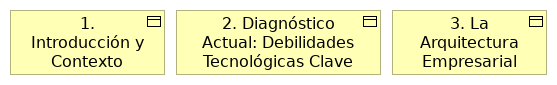

# Entregables Fase I de la Visión AE de SG
* [Visión](#visión)
	* [Necesidades SI de SG](#necesidades-si-de-sg)
	* [Preocupaciones SI de SG](#preocupaciones-si-de-sg)
	* [Contexto de Arquitectura de Sistemas de Información SG](#contexto-de-arquitectura-de-sistemas-de-información-sg)
	* [Oportunidades SI de SG](#oportunidades-si-de-sg)
	* [Vistas y Artefactos del Dominio](#vistas-y-artefactos-del-dominio)
		* [Matriz de Sistemas de Información vs Procesos de Negocio](#matriz-de-sistemas-de-información-vs-procesos-de-negocio)
		* [Catálogo de Sistemas de Información](#catálogo-de-sistemas-de-información)

\newpage

# Visión

## Situación Actual Sistemas Información SG (view)

> 

 

La Fase Tres (3) de la arquitectura empresarial (AE) de SG se divide en dos partes principales: Arquitectura de Datos y Arquitectura de Aplicaciones.

#### Objetivo de la Arquitectura de Aplicaciones:

El objetivo principal de la Arquitectura de Aplicaciones es desarrollar las arquitecturas de sistemas de información objetivo (tanto de datos como de aplicaciones) que soporten la arquitectura de negocio (desarrollada en la Fase B) y que implementen la visión de arquitectura inicial (establecida en la Fase A).

En términos más específicos, la arquitectura de aplicaciones busca:

* Definir la arquitectura de las aplicaciones (software) necesarias para soportar los procesos de negocio.
* Identificar las funciones de negocio que deben ser soportadas por las aplicaciones.
* Establecer la interacción y el flujo de información entre las diferentes aplicaciones.
* Considerar aspectos como la escalabilidad, el rendimiento, la mantenibilidad y la seguridad de las aplicaciones.
* Listar los capacidades de negocio (servicios de aplicación) relacionadas con las arquitecturas de aplicaciones de SG.

#### Relación con las demás fases del proyecto
La Arquitectura de Aplicaciones no opera de forma aislada; está intrínsecamente conectada con las fases anteriores y posteriores de la arquitectura empresarial de Secretaria de la Alcaldía de Bogotá:

* Relación con la Fase A (Visión de la Arquitectura): La Fase C toma como entrada principal la Visión de la Arquitectura, que establece el alcance, los objetivos de alto nivel, los principios de la arquitectura y la visión del negocio. La Arquitectura de Sistemas de Información debe alinearse y contribuir a la consecución de esta visión.
* Relación con la Fase B (Arquitectura de Negocio): La Arquitectura de Negocio (procesos de negocio, funciones, organización, etc.) es el motor principal para la Fase C. La Arquitectura de Sistemas de Información se construye para soportar y habilitar los requisitos definidos en la Arquitectura de Negocio. Por ejemplo, los procesos de negocio definidos en la Fase B informarán las necesidades de datos y las funcionalidades de las aplicaciones en la Fase C.
* Relación con la Fase D (Arquitectura Tecnológica): La Fase C proporciona los requisitos para la Fase D. La Arquitectura de Sistemas de Información (datos y aplicaciones) determina la tecnología subyacente (hardware, software de infraestructura, middleware, redes) que se necesitará para soportar las aplicaciones y gestionar los datos. La Fase D, por lo tanto, desarrollará la Arquitectura Tecnológica basándose en las necesidades identificadas en la Fase C.
* Relación con la Fase E (Oportunidades y Soluciones) y Fase F (Planificación de la Migración): Las arquitecturas de datos y aplicaciones desarrolladas en la Fase C son insumos críticos para identificar oportunidades de implementación (Fase E) y para desarrollar el plan de migración (Fase F) de las arquitecturas actuales a las arquitecturas objetivo.
* Relación con la Gestión de Requisitos (Requirements Management): La Gestión de Requisitos es una capacidad continua que atraviesa todas las fases del ADM. Los requisitos de los sistemas de información, capturados y gestionados, son fundamentales para guiar el desarrollo de las arquitecturas en la Fase C y para asegurar que la arquitectura final cumpla con las necesidades del negocio.

#### Requisitos Necesarios para su Realización (Entradas Clave):
Para llevar a cabo la Fase C de manera efectiva, una empresa debe contar con ciertos requisitos y entradas esenciales, que provienen principalmente de las fases previas del proceso de AE:

* Requisitos de Negocio: Una comprensión clara y detallada de los requisitos de negocio, procesos de negocio, funciones y estructuras organizacionales definidos en la Fase B. Esto incluye, por ejemplo, el Catálogo de Requisitos (como se menciona en el documento "TOGAF Catalogs Matrices and Diagrams.pdf", página 60), que "captura las cosas que la empresa necesita hacer para cumplir sus objetivos".
* Visión de la Arquitectura: La "Visión de la Arquitectura" (Architectural Vision) y los "Principios de la Arquitectura" establecidos en la Fase A, que guiarán las decisiones de diseño en la Fase C.
* Arquitectura de Negocio de Línea Base y Objetivo: Los modelos de Arquitectura de Negocio actual y deseada (definidos en la Fase B), que servirán como punto de partida y destino para la Arquitectura de Sistemas de Información.
* Metamodelo de Contenidos de la Arquitectura: Una comprensión y aplicación del metamodelo de contenidos de TOGAF (referenciado en "TOGAF 9.2 - Content Metamodel.pdf"), que proporciona un marco estructurado para describir los artefactos de la arquitectura.
* Principios de Arquitectura de Sistemas de Información: Principios específicos que guiarán el diseño de los datos y las aplicaciones, asegurando la coherencia y la alineación con los objetivos empresariales.
* Capacidad de Arquitectura Empresarial: La infraestructura y los recursos necesarios para realizar actividades de arquitectura, incluyendo herramientas de modelado (como ArchiMate, Draw.io, compatible con TOGAF) y personal con las habilidades adecuadas.
* Planes de Iteración y Nivel de Detalle: El alcance y el nivel de detalle requerido para la arquitectura de sistemas de información, que a menudo se define en la Fase de Visión y se refina a medida que avanza el proceso de AE. Esto puede incluir un enfoque iterativo para el desarrollo de la arquitectura, según lo discutido en "ADM Guidelines & Techniques.pdf" (Capítulo 19: Applying Iteration to the ADM).

La arquitectura de aplicaciones es un pilar fundamental en la transformación empresarial, traduciendo las necesidades de negocio en soluciones tangibles de datos y aplicaciones, y preparando el terreno para la selección de la tecnología subyacente.

{#fig:id-ae380c2e676e4dc0bbeaa6ac1a2407a6 width= height=}

### Elementos del Modelo

| Nombre  | Tipo | Documentación |
|---------|------|---------------|
| 1. Introducción y Contexto Estratégico | Business Object | * La Secretaría General de la Alcaldía Mayor de Bogotá D.C. busca optimizar su gestión institucional y cumplir sus objetivos estratégicos en un entorno dinámico.
* La transformación digital es un pilar fundamental para el desarrollo territorial, alineada con el Plan Nacional de Desarrollo 2022–2026 y el Plan Distrital de Desarrollo “Bogotá Camina Segura 2024-2027”.
* El objetivo del ejercicio de Arquitectura Empresarial es fortalecer la alineación de sus estrategias, procesos y tecnologías, impulsar la transformación digital y promover una gestión pública más eficiente y transparente. |
| 2. Diagnóstico Actual: Debilidades Tecnológicas Clave de la Secretaría General | Business Object | Basado en el análisis de las matrices DOFA (Matriz de Evaluación de Factores Internos - MEFI y Matriz de Evaluación de Factores Externos - MEFE) [5, 6], se han identificado las siguientes debilidades tecnológicas:

* Sistemas de Información y Datos:
    * Fallas recurrentes en el funcionamiento de los sistemas de información y plataformas tecnológicas, que afectan la continuidad del servicio y generan retrasos y reprocesos [7].
    * Falta de un software que permita extraer información dinámica para la toma de decisiones [9].
    * Se realizan análisis descriptivos, pero no predictivos y prospectivos de los resultados de la gestión, dificultando la toma de decisiones basada en evidencia [10].
    * Cambios en las plataformas tecnológicas que no interactúan con las anteriores, generando posibles pérdidas de información y reprocesos [11].

* Infraestructura Tecnológica:
    * Equipos tecnológicos obsoletos que dificultan la ejecución de las actividades [12].
    * Deficiente conectividad y falta de interoperabilidad de las plataformas tecnológicas [13].
    * Inestabilidad de la conectividad e indisponibilidad de servidores de información, comprometiendo la operatividad y el cumplimiento de metas [14].
    * Obsolescencia tecnológica generalizada que implica la necesidad de renovación de equipos y dificulta la prestación de servicios [15].
    * Los altos costos de la tecnología pueden limitar la capacidad para implementar y mantener sistemas avanzados [15].

* Seguridad Informática:
    * Vulnerabilidad en la seguridad informática, que puede comprometer la integridad de los datos críticos y la continuidad operativa [14].
    * Vulneración de la inviolabilidad de acceso a cuentas de correo institucionales y aplicativos, afectando la reserva de la información [14].
    * Materialización de riesgos asociados a ataques cibernéticos, ingeniería social y suplantación de identidad, poniendo en riesgo la seguridad de la información y los documentos (pérdida de confidencialidad, integridad y disponibilidad) [16].

* Gestión del Conocimiento y Capacidades Humanas:
    * Deficiente apropiación del conocimiento en procesos de tecnologías de la información, generando demora en la solución de servicios [17].
    * Falta de personal para actualizar las plataformas tecnológicas, lo que genera retrasos en la operación [13]. |
| 3. La Arquitectura Empresarial (AE) como Solución Estratégica | Business Object | La implementación de un ejercicio de Arquitectura Empresarial es clave para abordar estas debilidades [4].

* Propósito y Alcance de la AE:
    * Comprender la misión, objetivos y metas estratégicas, y definir el camino para materializar la visión mediante la alineación de estrategias, procesos, talento humano, cultura, información, sistemas de información, tecnologías y seguridad [18].
    * Incluye un diagnóstico del estado actual (línea base), la definición de la arquitectura objetivo (línea destino o meta), el análisis de su brecha y la elaboración de una hoja de ruta [18, 19].
    * La AE es una práctica estratégica que impulsa las transformaciones necesarias para fortalecer la gestión de las entidades y alcanzar sus objetivos [20].

* Dominios Clave que aborda la AE:
    * Arquitectura Institucional: Modelo de capacidades, modelo operativo y catálogo de servicios institucionales [21].
    * Arquitectura de Información: Definición de flujos y arquitectura de información, intercambio de información entre entidades y modelo de información institucional, incluyendo la aplicación de Inteligencia Artificial [22, 23].
    * Arquitectura de Sistemas de Información: Definición de arquitecturas de referencia para soluciones (SOA), arquitecturas de solución para proyectos de SI y caracterización de sistemas de información existentes [24, 25].
    * Arquitectura de Tecnología: Catálogo de elementos de infraestructura, plataforma de interoperabilidad, continuidad y disponibilidad de infraestructura, y arquitecturas de referencia tecnológica [26-28].
    * Arquitectura de Seguridad: Catálogo de servicios de seguridad de la información y ciberseguridad, análisis de impacto del negocio, arquitectura de seguridad alineada e integrada, y diseño de controles de seguridad informática para la gestión de riesgos [28-30]. |

Table: Elementos de la vista. {#tbl:tblelement-06.2n4.Aplicaciones.SituacionActualSG-id}

 

---
lang: en
titlepage: true
titlepage-rule-color: 360049
todo: aun no está lista
...

undefined## Necesidades SI de SG

La construcción de lista de necesidades, preocupaciones y oportunidades implican a las sesiones de levantamiento, entrevistas, y cuestionarios compartidos en el mes de julio, junto con la recopilación estructurada de las fuentes de información sobre cada sistema.

#### Necesidades de Transformación Digital y Tecnológica
La transformación digital (objetivo estratégico de SG)  es un motor fundamental para alinear las estrategias, procesos y tecnologías de la Secretaría General. Esta transformación busca:

* Impulsar la transformación digital para alinear estrategias, procesos y tecnologías, que resulte en el aumento de eficiencia de la gestión pública.
* Cerrar las brechas en la Política de Gobierno Digital, de la cual la Arquitectura Empresarial es un habilitador clave.
* Modernizar la infraestructura tecnológica que resulte del análisis de obsolescencia para asegurar su continuidad y disponibilidad.
* Integrar plataformas y ecosistemas digitales y superar la falta de interoperabilidad.
* Aumentar la automatización de los trámites digitales.
* Estandarizar la gestión y gobernanza de datos públicos.
* Mejorar el soporte que los SI dan a la toma de decisiones basada en evidencia.
* Generar análisis predictivos y prospectivos de resultados de gestión, que son insumos para la toma de decisiones.
* Contar con disponibilidad de personal adecuado para actualizar plataformas tecnológicas y gestionar las cargas de trabajo.
* Aprovechar nuevas tecnologías como la Inteligencia Artificial, la minería de datos, el procesamiento del lenguaje, para mejorar los procesos y la relación con la ciudadanía.

* Abordar los altos costos de la tecnología que limitan la implementación de sistemas avanzados. (??)
* Fortalecer la ciberseguridad y seguridad de la información para proteger la integridad, disponibilidad y confidencialidad de los datos y prevenir ataques.

#### Necesidades Específicas del Dominio de Aplicaciones de software
Esta tipo de necesidades refiere al comportamiento de las aplicaciones que apoyan la misionalidad, a su estructura, y su relación con los objetos de datos que utilizan.

Para los Componentes de Aplicación (Application Component) y Servicios de Aplicación (Application Service) de SG:

* Adquirir software especializado en análisis de datos: implica la necesidad de incorporar de nuevos componentes de aplicación (Application Component).
* Integrar plataformas y ecosistemas digitales :requiere reforzar la relación entre componentes de aplicación y la exposición de servicios de aplicación (Application Service), y clicar los lineamientos del Marco de Referencia de AE, versión 3.0 al momento, del MinTIC.
* Mejorar la capacidad de las herramientas tecnológicas para el soporte a la toma de decisiones y la gestión: requiere la mejora de las Funcionalidad (Application Function) y Componentes de Aplicación actuales asociadas a esta capacidad.
undefined## Preocupaciones SI de SG

Con base en el estudio de las sesiones de levantamiento, entrevistas, y cuestionarios compartidos en el mes de julio, junto con la recopilación estructurada de las fuentes de información sobre cada sistema, identificamos las siguientes preocupaciones (y debilidades) de SG relacionadas con el dominio de sistemas de información, dentro del alcance de este ejercicio.

Las preocupaciones tecnológicas respecto de los sistemas de información de SG mencionadas en estas fuentes señalan:

* Deficiente apropiación del conocimiento en procesos de tecnologías de la información, lo que genera demora en la solución de los servicios de tecnologías de la información.
* Equipos tecnológicos en proceso de mitigar la obsolescencia, que generan dificultad en la ejecución de las actividades que desarrolla la entidad.
* Fallas recurrentes en el funcionamiento de los sistemas de información y plataformas tecnológicas de la entidad, que afectan la continuidad del servicio y generan retrasos y reprocesos en la ejecución de las actividades.
* Insuficiencia en la capacidad de las herramientas tecnológicas de la entidad que pueden obstaculizar el avance de los iniciativas en marcha de la SG.
* Debilidad en la capacidad de extraer información dinámica que sirva como insumo para la toma de decisiones basado en evidencia.
* Se realizan análisis de datos descriptivos aislados, pero no predictivos y prospectivos de los resultados de la gestión de la entidad, lo que dificulta la toma de decisiones basada en evidencia.
* Falta de personal para actualizar las plataformas tecnológicas, lo que genera retrasos en la operación de la entidad.
* Deficiente conectividad y falta de interoperabilidad de las plataformas tecnológicas.
* Cambios en las plataformas tecnológicas que no interactúan con las anteriores, lo cual expone a la SG a posibles pérdidas de información y reprocesos.
* Apostar más en la mejora continua de la inestabilidad de la conectividad, indisponibilidad de servidores de información y vulnerabilidad en la seguridad informática; lo contrario puede comprometer la operatividad, la integridad de los datos críticos de la entidad y el cumplimiento de las metas.
* Potencial y rápida obsolescencia tecnológica que implica la necesidad de renovación de los equipos y dificulta la prestación de los servicios de la entidad.
* Los altos costos de la tecnología pueden limitar la capacidad de la entidad para implementar y mantener sistemas avanzados y eficientes.
undefined## Contexto de Arquitectura de Sistemas de Información SG

Desde el dominio de aplicaciones y sistemas de información de la Secretaría General, llamada en adelante “la arquitectura de sistemas de Información de SG”, buscamos adelantar las especificaciones de las arquitecturas objetivo de los sistemas de información de Secretaria de la Alcaldía de Bogotá que soporten la arquitectura de negocio y datos, en línea y dentro del alcance de la visión establecida en el primer entregable de este ejercicio de arquitectura empresarial de SG (AESG).

En particular, la arquitectura de sistemas de información de SG se plantea, dentro del alcance de la visión del ejercicio:

* Definir la arquitectura de las aplicaciones (SI) necesarias para soportar los procesos de negocio de SG.
* Identificar las funciones de negocio que deben ser soportadas por las aplicaciones de SG.
* Establecer la interacción y el flujo de información entre las diferentes aplicaciones de SG.
* Considerar aspectos sistémicos como la escalabilidad, el rendimiento, la mantenibilidad y la seguridad de las aplicaciones de SG.
* Listar los capacidades de negocio (servicios de aplicación) relacionadas con las arquitecturas de aplicaciones de SG.

De esta manera, la arquitectura de sistemas de SG contribuye a la consecución de la visión de este ejercicio de arquitectura empresarial SG (AESG); y en lo específico, contribuye a los fines de la arquitectura de negocio y tecnológica de SG, a delinear oportunidades y soluciones, y a soportar la planeación de la migración. Todo lo anterior dentro del alcance consignado en este ejercicio.

#### Alcance
El presente ejercicio de la arquitectura dominio de aplicaciones toma como alcance horizontal las áreas o unidades siguientes de la SG (_fuente: sesiones de levantamiento, entrevistas, y cuestionarios compartidos en el mes de julio del 2025, junto con la recopilación estructurada de las fuentes de información y organigramas_):

Unidades de negocio del alcance del dominio:

* Secretaría Privada
    * Oficina Consejería Distrital de Comunicación. César Augusto Castro Rodríguez
    * Oficina Consejería Distrital de Tecnologías de la Información y las Comunicaciones -TIC. Diana Celis Mora
* Despacho del Secretario General. Miguel Andrés Silva Moyano
    * Oficina de Tecnologías de la Información y las Comunicaciones. Arleth Patricia Saurith Contreras
    * Subsecretaría Distrital de Fortalecimiento Institucional. Alejandra Rodas Gaiter
        * Dirección Distrital de Desarrollo Institucional. Sebastian Estrada Jaramillo
            * Subdirección Técnica de Desarrollo Institucional. Diego Canesco Arenas
    * Subsecretaría de Servicio a la Ciudadanía . Adriana Vargas Tamayo
        * Dirección del Sistema Distrital de Servicio a la Ciudadanía. Enrique Cusba García
    * Subsecretaría Corporativa. Henry Villamarín Serrano
    * Subsecreataría de Servicios Ciudadanos (…)
    * Subsecreataría de Inversión y FF (…)
    * Subsecreataría de Operaciones
    * Subsecreataría de Relaciones Internacionales (…)

En cuanto al alcance vertical, las aplicaciones de software que están consignadas en este ejercicio son las siguientes (_fuente: sesiones de levantamiento, entrevistas, y cuestionarios compartidos en el mes de julio del 2025, junto con la recopilación estructurada de las fuentes de información_):

* Administrativo y Financiero: Soporta la gestión financiera, gestión de servicios administrativos y tecnológicos, y gestión de recursos físicos
* Bogotá Te Escucha: Es fundamental para el proceso de Gobierno abierto y relacionamiento con la ciudadanía5. También se menciona como el Sistema Distrital para la Gestión de Peticiones Ciudadanas, a través del cual se evalúa la calidad de las respuestas emitidas a la ciudadanía
* Bogotá Aprende TIC: Apoya los procesos de Gobierno abierto y relacionamiento con la ciudadanía, y Fortalecimiento de la Gestión Pública
* DARUMA: Se utiliza en el proceso de Fortalecimiento de la Gestión Pública5. También es el aplicativo donde se encuentran definidas las fichas técnicas de productos y servicios de la Secretaría General8 y se gestionan los riesgos estratégicos
* SIGA: Interviene en la gestión de contratación, gestión financiera, gestión de servicios administrativos y tecnológicos, y gestión de recursos físicos
* SAT Web: Relacionado con la gestión de servicios administrativos y tecnológicos
* GLOBO: Utilizado en el proceso de Fortalecimiento de la Gestión Pública
* Datos para la Transparencia (SATI): Soporta el proceso de Gobierno abierto y relacionamiento con la ciudadanía
* SUDIVC: Se aplica en los procesos de Gobierno abierto y relacionamiento con la ciudadanía, Paz, víctimas y reconciliación, y Fortalecimiento de la Gestión Pública
* HUMANAPP: Apoya la gestión del talento humano
* SIAB (El COFRE): Utilizado en los procesos de Gobierno abierto y relacionamiento con la ciudadanía, y Fortalecimiento de la Gestión Pública
* KOHA: Relacionado con la Gestión del conocimiento
* SIVIC: Interviene en los procesos de Paz, víctimas y reconciliación, y Fortalecimiento de la Gestión Pública
* Data Warehouse AVANTI: Apoya la Gestión del conocimiento
* Gestión Académica: Relacionado con la Gestión del conocimiento
* EMLAZE: Utilizado en los procesos de Gobierno abierto y relacionamiento con la ciudadanía, y Fortalecimiento de la Gestión Pública
* GLPI: Soporta la gestión de servicios administrativos y tecnológicos
* GitLab: Se relaciona con la Gestión de alianzas e internacionalización de Bogotá
undefined## Oportunidades SI de SG

La construcción de lista de oportunidades mencionadas implica el estudio de las sesiones de levantamiento, entrevistas, y cuestionarios compartidos en el mes de julio, junto con la recopilación estructurada de las fuentes de información al respecto de cada sistema de SG.

Las oportunidades tecnológicas y de mejora de sistemas de información mencionadas indicadas en estas fuentes se centran en:

* Modernización de la infraestructura y sistemas tecnológicos
    * Las nuevas tecnologías, especialmente la Inteligencia Artificial (IA), ofrecen la oportunidad de mejorar los procesos y herramientas de relacionamiento con la ciudadanía. La Secretaría General ya ha empezado a incorporar tecnologías como IA, Big Data, pero debe seguir ampliando ese despliegue, así como incorporar otras, como el Internet de las Cosas (IoT), o la minería de datos en la planificación urbana y la prestación de servicios.
    * Una oportunidad es la adquisición y puesta en producción de software especializado en análisis de datos para la toma de decisiones que ya poseen otras entidades.

* Integración y automatización de procesos
    * Se identifican oportunidades para contar con herramientas que evalúen el soporte tecnológico personalizado, flexible y configurable para las operaciones de los procesos jurídicos.
    * Se buscan mejores controles e integración de sistemas distritales con los canales de la Secretaría General.
    * También se necesitan mejores controles e integración de los sistemas de gestión como los sistemas GLOBO (de gestión internacional), el sistema de proyectos GLPI.

* Mejora de la comunicación pública a través de medios digitales
    * Se busca la consolidación de herramientas, canales e información para fortalecer la oferta y celeridad de servicios y la participación ciudadana. Esto incluye el seguimiento a canales de atención virtual como SuperCADE Virtual, chat, chat-Bot y (video) llamadas de la línea 195.
    * Se busca optimizar los procesos de recolección, análisis y divulgación de la información mediante la implementación de sistemas de información que incluyan la automatización de la recolección de datos y el uso de herramientas analíticas.
    * Es destacado que el Distrito unifica en el portal Bogotá su oferta de trámites y servicios, como el realizar pagos en línea (no tributarios) y agendamiento de citas en la RedCADE desde casa; esfuerzo que debe continuar y extenderse a los  más de 1.400 trámites y servicios. Esto representa una mejora significativa en la accesibilidad y eficiencia de los servicios digitales para la ciudadanía.

* capacitación en nuevas tecnologías y 

* Implementación de la Arquitectura Empresarial como estrategia para impulsar la transformación digital y la eficiencia en la gestión pública de la SG
    * Se espera que la Arquitectura Empresarial fortalezca la transparencia, y aumente la eficiencia de la gestión pública y la rendición de cuentas al estandarizar procesos y sistemas de información. La AE busca realmente impactar el objetivo de aumentar la confianza de la ciudadanía en la Gestión Pública.
    * Es requerido que este ejercicio beneficie a la SG con la entrega de activos como hojas de ruta, catálogos y caracterización de los sistemas de información, matrices de interacción, entre otros.
undefined## Vistas y Artefactos del Dominio

A continuación, se presentan las vistas y artefactos del dominio de sistemas de información consignados en el alcance del proyecto.
undefined### Matriz de Sistemas de Información vs Procesos de Negocio

Las matrices del dominio de aplicaciones de software y sistemas de información (SI) de SG son herramientas para el relacionamiento con otros dominios del ejercicio de arquitectura empresarial de SG. Con esto conseguimos soportar la toma decisiones de lo que debe ser compartido de los SI dentro de la Secretaría, y entre sus aplicaciones de software. Las matrices de este ejercicio sirven además para comunicar el grado de relacionamiento de los elementos.

En resumen,

* Las matrices son cruciales para especificar cómo debe relacionarse la información entre los sistemas y otros dominios
* proporcionan información crítica para los proyectos que involucren a los sistemas de SG.
* Contribuye a la determinación de brechas (gaps) en las necesidades de compartir información (o funciones de los sistemas) ente los elementos de la matriz. 
* La matriz ayuda a definir el nivel de detalle de lo que se comparte.
* Se deben establecer medidas similares para la interoperabilidad de servicios/negocios y la infraestructura (tecnología física).
* Sintetizan la información de las arquitecturas, y son simples para compartir documentos.

Las matrices de este dominio (procesos e interoperabilidad) actúan como una hoja de ruta para la conectividad y el intercambio de información; inician desde una perspectiva de negocio de alto nivel y van hasta una especificación técnica detallada del la interacción con los sistemas. Sirven como herramienta de comunicación para los demás dominios de la arquitectura empresarial de SG, y contribuyen a que las interacciones relevantes entre servicios, canales, y procesos estén definidas y sean compatibles.
undefined### Catálogo de Sistemas de Información

En el contexto de TOGAF, El Catálogo de sistemas de información es un inventario detallado y documentado que actúa como ficha técnica de los sistemas de información o aplicaciones de software de SG. 

Es un producto entregable clave de la fase de Arquitectura de Aplicaciones dentro de la Fase 3 de este ejercicio de arquitectura empresarial (AE). Forma parte del Marco de Referencia del Contenido Arquitectónico de TOGAF y del Marco de Arquitectura de Referencia del MinTIC (MAE 3.0, Colombia).

La construcción del catálogo de aplicaciones implican a las sesiones de levantamiento, entrevistas, y cuestionarios compartidos en el mes de julio, junto con la recopilación estructurada de las fuentes de información sobre cada sistema.

#### Contenido Mínimo del Catálogo

* ID de Aplicación. Código de identificación de la aplicación de software.
* Nombre de la Aplicación. Nombre de identificación de la aplicación de software.
* Descripción. Funcionamiento básico de la aplicación de software.
* Estado: [En producción, en desmantelamiento, en implementación, Inactiva]
* Categoría: [Sistema de apoyo al negocio (misional), herramienta de gestión, Ofimática, Seguridad] 
* Proceso(s) de Negocio Clave(s)
* Capacidad: Capacidades de nivel 2 relacionadas con la aplicación de software.
* Tipo de aplicación: Web, Móvil, Cliente Servidor 
* Método de despliegue: on-premises, cloud SAAS, cloud PAAS, cloud IAAS 
* Tecnología. Aspectos técnicos de la aplicación de software.
* Versión actual de la tecnología
* Responsable técnico en la entidad
* Responsable funcional en la entidad
* Fabricante
* Proveedor de soporte externo
* Fecha de vigencia de soporte externo
* Nombre de servidor. Nombre de red del entorno o nodo contenedor de la aplicación de software. 
* Criticidad de negocio

El Catálogo de aplicaciones de SG procura beneficios estratégicos y operativos:

* Unifica la documentación y la comunicación: Es un artefacto clave para documentar, comprender y comunicar el panorama actual y futuro de las aplicaciones.
* Base para la toma de decisiones: Sirve como base para la toma de decisiones en la gestión y gobierno de las capacidades de los sistemas de SG, y del portafolio y ciclo de vida de las aplicaciones.
* Facilita la actualización continua: Permite la actualización continua de las características y atributos relevantes de los sistemas de información.

